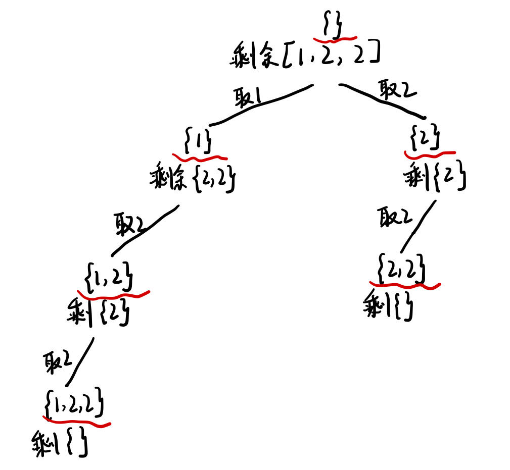

# 关于回溯

回溯是递归的副产品，只要有递归，就会有回溯。

回溯法就是暴力搜索，只不过用递归来控制for循环嵌套的数量。

Backtracking is a form of recursion.
The usual scenario is that you are faced with a number of options, and you must choose one of these. After you make your choice you will get a new set of options; just what set of options you get depends on what choice you made. This procedure is repeated over and over until you reach a final state. If you made a good sequence of choices, your final state is a goal state; if you didn't, it isn't.

# 组合问题

## [LC 77：Combinations](https://leetcode.com/problems/combinations/)

### sol 1：根据搜索起点画出二叉树

### 回溯算法模板

```java
void backtracking(参数) {
    if (终止条件) {
        存放结果;
        return;
    }

    for (选择：本层集合中元素（树中节点孩子的数量就是集合的大小）) {
        处理节点;
        backtracking(路径，选择列表); // 递归
        回溯，撤销处理结果
    }
}
```


可以看到每个节点做的事都是相同的，从[....]中选出x个数，只是搜索起点不同，如第一层从1开始搜索，第二层分别是从2，3，4开始搜索，所以需要一个变量startIndex，来表示在区间[startIndex, n]中选出若干个数的组合。

完整代码如下：

重点说明：将curPath加入到最终结果时，应当是 `res.add(new ArrayList<>(curPath))`，而不是 `res.add(curPath)`,因为前者传输进去的是curPath的地址信息，后面再修改curPath时，res中对应的部分也会随之改变，而后者传输的是curPath的一个副本。

回溯处理：比如当前得到一个组合[1,2]，要想得到[1,3]，首先需要先将2从curPath中删除，然后再添加3。

代码如下：


```java
class Solution {
    List<List<Integer>> res = new ArrayList<>();
    List<Integer> curPath = new ArrayList<>();
  
    public List<List<Integer>> combine(int n, int k) {
        backtracking(n, k, 1);
        return res;   
    }
  
    public void backtracking(int n, int k, int startIndex) {
        //递归终止条件：当前路径中满k个元素时，找到一个符合条件的组合
        //将其添加到最终结果res中，并且终止递归，即return
        if (curPath.size() == k) {
            res.add(new ArrayList<>(curPath));
            return;
        }
        //遍历所有可能的搜索起点
        for (int i = startIndex; i <= n; i += 1) {
            //递归之前：向当前路径添加搜索起点对应的数
            curPath.add(i);
            //递归：即到了二叉树的下面一层搜索，搜索起点要加1
            backtracking(n, k, i+1);
            //递归之后：回溯，即撤销当前节点的处理，返回到二叉树的上面一层
            curPath.remove(curPath.size()-1);
        }  
    }
}
```

### sol 2：剪枝优化


代码如下：

剪枝优化以后，运算速度快多了

```java
class Solution {
    List<List<Integer>> res = new ArrayList<>();
    List<Integer> curPath = new ArrayList<>();
  
    public List<List<Integer>> combine(int n, int k) {
        backtracking(n, k, 1);
        return res;   
    }
  
    public void backtracking(int n, int k, int startIndex) {
        //优化也可以卸载这里 
        //if (startIndex > n-(k-curPath.size())+1) return;

        if (curPath.size() == k) {
            res.add(new ArrayList<>(curPath));
            return;
        }
        //就只是修改了这里i的范围，不再是i<= n，其他都一样
        for (int i = startIndex; i <= n-(k-curPath.size())+1; i += 1) {
            curPath.add(i);
            backtracking(n, k, i+1);
            curPath.remove(curPath.size()-1);
        }  
    }
}
```

## [LC 216: Combination Sum III](https://leetcode.com/problems/combination-sum-iii/)

这道题其他地方套模板都没啥问题，就是没有想到dfs中还要设置一个 `curSum`的变量。

完整代码如下：


空间复杂度：O(K)。curPath 列表的空间代价是 O(k)，递归栈空间的代价是 O(K)，故空间复杂度为 O(K).

```java
class Solution {
    List<List<Integer>> res = new ArrayList<>();
    List<Integer> path = new ArrayList<>();
    public List<List<Integer>> combinationSum3(int k, int n) {
        dfs(k, n, 1, 0);
        return res;   
    }
  
    private void dfs(int k, int targetSum, int startIndex, int curSum) {
        if (curSum > targetSum || path.size() > k) {
            return;
        }
        if (path.size() == k && curSum == targetSum) {
            res.add(new ArrayList<>(path));
            return;
        }
  
        for (int i = startIndex; i <= 9-(k-path.size()) + 1; i += 1) {
            path.add(i);
            curSum += i;
            dfs(k, targetSum, i+1, curSum);
            path.remove(path.size()-1);
            curSum -= i;
        }
    }
}
```

## [LC 17: Letter Combinations of a Phone Number](https://leetcode.com/problems/letter-combinations-of-a-phone-number/)

### sol 1: 回溯法

图解：


思路：看图解就能发现其实跟lc77很像。需要解决以下问题：

1、digits中的数字如何映射到字母

这里我用的是数组来完成映射，即letterMap

2、回溯

第一步：确定回溯函数的参数。这里需要一个index，来记录当前遍历到digits的第几个数字了，对应到树中，就是树的层数（深度）。

第二步：确定终止条件。当遍历到digits的最后一个数字时，即 `index == digits.length()`,则停止递归并收集结果。

第三步：确定单层遍历逻辑。首先将digits中下标为index的字符转换成数字digit，在letterMap中找到digit对应的字母串，遍历字母串，接着寻找下一层的字母（递归）。

完整代码如下：

复杂度分析：

时间复杂度；O(3^M*4^N)。M表示digits中对应三个字母的digit（除了7和9以外的）的个数，N表示digits中对应四个字母的digit（7和9）的个数。M+N就是digits的长度。其实就是一共有多少种组合。

空间复杂度：O(M+N)。M+N就是digits的长度。The extra space we use relative to input size is the space occupied by the recursion call stack. It will only go as deep as the number of digits in the input since whenever we reach that depth, we backtrack.

```java
class Solution {
    List<String> res = new ArrayList<>();
    StringBuilder path = new StringBuilder();
    String[] letterMap = {"", "","abc", "def", "ghi", "jkl", "mno", "pqrs", "tuv", "wxyz"};
    public List<String> letterCombinations(String digits) {
        if (digits.length() == 0) {
            return res;
        }
        dfs(digits, 0);
        return res;
  
    }
  
    public void dfs(String digits, int index) {
        if (index == digits.length()) {
            res.add(path.toString());
            return;
        }
        int digit = digits.charAt(index) - '0';
        String letters = letterMap[digit];
        for (int i = 0; i < letters.length(); i += 1) {
            path.append(letters.charAt(i));
            dfs(digits, index+1);//递归
            path.deleteCharAt(path.length()-1);//回溯
        }
    }
}
```

## [LC 39：Combination Sum](https://leetcode.com/problems/combination-sum/)

这题与之前的组合问题不同在于，数字可以反复使用，数字个数没有限制。

### sol 1: 回溯解法1（neetcode版）

图解：


neetcode思路是分包括某个数字和不包括某个数字来讨论

完整代码如下：

```java
class Solution {
    List<List<Integer>> res = new ArrayList<>();
    List<Integer> path = new ArrayList<>();
    public List<List<Integer>> combinationSum(int[] candidates, int target) {
        dfs(candidates, target, 0, 0);
        return res;  
    }
  
    public void dfs(int[] candidates, int target, int index, int curSum) {
        if (curSum == target) {
            res.add(new ArrayList<>(path));
            return;
        }
        if (index >= candidates.length || curSum > target) {
            return;
        }
        //with candidates[index]
        path.add(candidates[index]);
        dfs(candidates, target, index, curSum+candidates[index]);//递归
        //without candidates[index]
        path.remove(path.size()-1);//回溯
        dfs(candidates, target, index+1, curSum);
    }
}
```

### sol 2: 回溯解法2（套回溯模板）

这里完全套回溯算法公式，跟sol 1的不同在于单层遍历逻辑，

图解：


思路：我觉得可以理解为，在第一层（即取第一个数时）可分三种情况：从[2,3,5]中取，从[3,5]中取，从[5]中取；到了第二层（即取第二个数时）同理，依次类推。

```java
class Solution {
    List<List<Integer>> res = new ArrayList<>();
    List<Integer> path = new ArrayList<>();
    public List<List<Integer>> combinationSum(int[] candidates, int target) {
        dfs(candidates, target, 0, 0);
        return res;  
    }
  
    public void dfs(int[] candidates, int target, int index, int curSum) {
        if (curSum == target) {
            res.add(new ArrayList<>(path));
            return;
        }
        if (index >= candidates.length || curSum > target) {
            return;
        }
  
        for (int i = index; i < candidates.length; i += 1) {
            path.add(candidates[i]);
            dfs(candidates, target, i, curSum+candidates[i]);
            path.remove(path.size()-1);
        }
    }
}
```

## [LC 40：Combination Sum II](https://leetcode.com/problems/combination-sum-ii/)

思路：这道题与lc39的区别在于：

1、本题candidates中的每个数字在每个组合中只能使用一次；

2、本题candidates中有重复数字，而lc39中无重复元素；

和lc39相同之处在于，都要求解集不能包含重复的组合。

难点在于：这道题candidates中有重复数字，但是要求最终解集中不能包含重复数字。

举例说明：

```
candidates = [10,1,2,7,6,1,5], target = 8
```

先排序：[1,1,2,5,6,7,10]，如果只是套回溯模板不去重的话，就会出现两个[1,2,5]和[1,7]，分别是用第一个和第二个1作为一个组合的首个元素，最终形成的结果；但是[1,1,6]是符合要求的结果，即每一个组合中可出现重复元素。

所以要求横向遍历时要去重，纵向遍历时不用去重。

图解：


### sol 1: 我的方法

去重方法想是想到了，就是一开始写错了，看了代码随想录才反应过来，不是i > 0，而是i > startIndex。

代码如下：

Let **N** be the size of the input array.

* Time Complexity: **O(2^N)**

  * In the worst case, our algorithm will *exhaust* all possible combinations from the input array. Again, in the worst case, let us assume that each number is unique. The number of combination for an array of size **N** would be **2^N**, *i.e.* each number is either included or excluded in a combination.
  * it takes O(N) to sort the array.
* Space Complexity: **O(N)**
* We use the variable `path` to keep track of the current combination we build, which requires **O(N)** space.
* In addition, we apply recursion in the algorithm, which will incur additional memory consumption in the function call stack. In the worst case, the stack will pile up to **O(N)** space.

```java
class Solution {
    List<List<Integer>> res = new ArrayList<>();
    List<Integer> path = new ArrayList<>();
    public List<List<Integer>> combinationSum2(int[] candidates, int target) {
        Arrays.sort(candidates);
        dfs(candidates, target, 0, 0);
        return res;  
    }
  
    private void dfs(int[] candidates, int target, int startIndex, int curSum) {
        if (curSum == target) {
            res.add(new ArrayList<>(path));
            return;
        }
  
        for (int i = startIndex; i < candidates.length&&curSum+candidates[i] <=target; i += 1) {
            //这一步就是横向遍历的去重操作（我刚开始写成i > 0了）
            if (i > startIndex && candidates[i-1] == candidates[i]) {
                continue;
            } 
            path.add(candidates[i]);
            dfs(candidates, target, i+1, curSum+candidates[i]);
            path.remove(path.size()-1);
        } 
    }
}
```

### sol 2: 使用标记数组去重

用一个数组flag来跟踪当前是在同一层，还是在同一组合

如果出现重复元素，即candidates[i-1] == candidates[i]：

(1) 如果flag[i-1] = false，说明在同层，那么元素candidates[i]需要跳过；

(2) 如果flag[i-1] = true，说明在同一组合，那么元素candidates[i]不用跳过。

完整代码如下：

```java
class Solution {
    List<List<Integer>> res = new ArrayList<>();
    List<Integer> path = new ArrayList<>();
  
    public List<List<Integer>> combinationSum2(int[] candidates, int target) {
        Arrays.sort(candidates);
        boolean[] flag = new boolean[candidates.length];
        dfs(candidates, target, 0, 0, flag);
        return res;  
    }
  
    private void dfs(int[] candidates, int target, int startIndex, int curSum, boolean[] flag) {
        if (curSum == target) {
            res.add(new ArrayList<>(path));
            return;
        }
  
        for (int i = startIndex; i < candidates.length&&curSum+candidates[i] <=target; i += 1) {
            if (i > startIndex && candidates[i-1] == candidates[i] && !flag[i-1]) {
                continue;
            } 
            flag[i] = true;
            path.add(candidates[i]);
            dfs(candidates, target, i+1, curSum+candidates[i], flag);
            flag[i] = false;
            path.remove(path.size()-1);
        } 
    }
}
```

# 切割问题

## [LC 131：Palindrome Partitioning](https://leetcode.com/problems/palindrome-partitioning/)

思路：

1、如何将切割问题转化成组合问题？

图解：


2、如何截取子串？

 这里用到了 `substring(beginIndex, endIndex)`。

**注意**，这里是左闭右开区间，即包括 `beginIndex`,不包括 `endIndex`。

3、如何判断是否是回文字符串?

这里用了双指针法。

完整代码如下：

```java
class Solution {
    List<List<String>> res = new ArrayList<>();
    Deque<String> path = new LinkedList<>();
    public List<List<String>> partition(String s) {
        dfs(s, 0);
        return res;   
    }
  
    private void dfs(String s, int startIndex) {
        if (startIndex >= s.length()) {
            res.add(new ArrayList<>(path));
            return;
        }   
  
        for (int i = startIndex; i < s.length(); i += 1) {
            if (isPalindrome(s, startIndex, i)) {
                String str = s.substring(startIndex, i+1);
                path.add(str);   
            } else {
                continue;
            }
            dfs(s, i+1);
            path.removeLast();
        }
    }
  
    private boolean isPalindrome(String s, int start, int end) {
        while (start <= end) {
            if (s.charAt(start) != s.charAt(end)) {
                return false;
            }
            start += 1;
            end -= 1;
        }
        return true;
    }
}
```

## [LC 93：Restore IP Addresses](https://leetcode.com/problems/restore-ip-addresses/)

图解：即如何将本题转化成组合问题


思路：递归函数中除了startIndex，还需要一个变量number来记录sb中ip地址的段数，也就是图解中的层数。

完整代码如下：

关于 `sb.delete(startIndex+number, i+number+2) 说明：`

```java
class Solution {
    List<String> res = new ArrayList<>();
    StringBuilder sb = new StringBuilder();
    public List<String> restoreIpAddresses(String s) {
        //题目中给出s.length的范围是[1,20]，所以超过12直接返回res
        if (s.length() > 12) {
            return res;
        }
        dfs(s, 0, 0);
        return res; 
    }
    //startIndex表示每层开始取数的起点位置，number记录层数，即sb中ip段数
    private void dfs(String s, int startIndex, int number) {
        //终止条件：ip段数达到四段且取数起点位置到达s的长度，则收集结果并返回
        if (number == 4 && startIndex == s.length()) {
            res.add(sb.toString());
            return;
        }
        //剪枝优化：递归终止的两个条件必须同时满足，任何一个提前满足则不符合要求，返回即可
        if (number == 4 || startIndex == s.length()) {
            return;
        }
        //剪枝优化：ip段的长度最大为3，并且ip段处于[0,255]区间
        for (int i = startIndex; i < s.length() && i < startIndex + 3 && Integer.parseInt(s.substring(startIndex, i+1)) <= 255; i += 1) {
            String str = s.substring(startIndex, i+1);
            //每段IP需满足的要求：ip段长度大于1时，开头数字不得为‘0’，否则continue
            if (i+1-startIndex > 1 && s.charAt(startIndex) - '0' == 0) {
                continue;
            } 
            sb.append(str);
            //当sb中ip段数量小于3时，才需要加点，当sb中已经有三段ip时，说明当前加的是第四段
            //第四段不需要加点
            if (number < 3) {
                sb.append(".");
            }
            dfs(s, i+1, number+1);
  
            sb.delete(startIndex+number, i+number+2);
        }   
    }
}


```

# 子集问题

组合问题和分割问题都是收集树的**叶子节点**，而子集问题是找树的**所有节点**！

## [LC 78：Subsets](https://leetcode.com/problems/subsets/)

图解：


思路：

1、子集的集合是无序的，即子集{1,2}和子集{2，1}是一样的。因为是无序的，所以取过的元素不会重复取，因此就需要设置变量startIndex，for循环是从startIndex开始，而不是0；

2、递归终止条件：由图解可知，当剩余集合为空时，递归终止，等价于startIndex >= nums.length时，即无剩余元素可取。

这里递归终止条件可省略，因为单层递归的for循环中已经设置了 `startIndex < nums.length`。

3、单层搜索：不需要剪枝，因为子集要遍历整棵树。

完整代码如下：


```java
class Solution {
    List<List<Integer>> res = new ArrayList<>();
    LinkedList<Integer> path = new LinkedList<>();
    public List<List<Integer>> subsets(int[] nums) {
        dfs(nums, 0);
        return res;
    }
  
    private void dfs(int[] nums, int startIndex) {
        res.add(new ArrayList<>(path)); 
        for (int i = startIndex; i < nums.length; i += 1) {
            path.add(nums[i]);
            dfs(nums, i+1);
            path.removeLast();
        }
    }
}
```

## [LC 90：Subsets II](https://leetcode.com/problems/subsets-ii/)

这道题和lc78的不同在于，nums中的元素有重复的，但因为子集本身是无序的，所以就涉及到要去重。

去重操作跟lc40是一样的，即横向遍历要去重，纵向递归不需要去重：

去重关键点：1、要先将nums进行排序；2、横向去重时是(i > startIndex)而不是(i > 0)。

图解：



完整代码如下：


```java
class Solution {
    List<List<Integer>> res = new ArrayList<>();
    LinkedList<Integer> path = new LinkedList<>();
    public List<List<Integer>> subsetsWithDup(int[] nums) {
        Arrays.sort(nums);
        dfs(nums, 0);
        return res;   
    }
  
    private void dfs(int[] nums, int startIndex) {
        res.add(new ArrayList<>(path));
  
        for (int i = startIndex; i < nums.length; i += 1) {
            if (i != startIndex && nums[i-1] == nums[i]) {
                continue;
            }
            path.add(nums[i]);
            dfs(nums, i+1);
            path.removeLast();
        }
    }
}
```

## [LC 491：Increasing Subsequences](https://leetcode.com/problems/increasing-subsequences/)

本题求自增子序列，不能对原数组进行排序，所以不能使用lc40和lc90的去重逻辑。

这道题的去重逻辑是，同一层中，取过的相同元素不再取了。所以需要一个map来记录本层已经取过的元素

图解：


完整代码如下：


```java
class Solution {
    List<List<Integer>> res = new ArrayList<>();
    LinkedList<Integer> path = new LinkedList<>();
    public List<List<Integer>> findSubsequences(int[] nums) {
        dfs(nums, 0);
        return res;   
    }
  
    private void dfs(int[] nums, int startIndex) {
        if (path.size() > 1) {
            res.add(new ArrayList<>(path));
            //这里不需要return，因为要收集所有节点上的结果
        }
        //创建map记录本层使用过的数字
        //注意：这里相当于每层遍历的时候都会创建一个空的map，所以对该map不需要回溯操作
        Set<Integer> used = new HashSet<>();
        for (int i = startIndex; i < nums.length; i += 1) {
            //剪枝操作：同层不能重复使用相同元素；所取元素不小于当前path最后一个元素
            if (!path.isEmpty()&&nums[i] < path.getLast() ||
               used.contains(nums[i])) > 0) {
                continue;
            }
            //本层已经使用过的元素记录在这里
            used.add(nums[i]);
            path.add(nums[i]);
            dfs(nums, i+1);
            path.removeLast();
        }
    }
}
```

# 排列问题

## [LC 46：Permutations](https://leetcode.com/problems/permutations/)

思路重点：

1、排列是**有序**的，即[1,2]和[2,1]是两个不同的排列，元素1在[1,2]中使用了一次，在[2,1]中又使用了一次，所以**不需要设置变量startIndex**。

2、需要设置一个数组used，来记录已经使用过的元素

3、递归终止条件是到达叶子节点，所以只收集叶子节点的结果，**需要return**。

图解：


代码如下：


```java
class Solution {
    List<List<Integer>> res = new ArrayList<>();
    LinkedList<Integer> path = new LinkedList<>();
    boolean[] used;
    public List<List<Integer>> permute(int[] nums) {
        used = new boolean[nums.length];
        dfs(nums);
        return res;   
    }
  
    private void dfs(int[] nums) {
        int n = nums.length;
        if (path.size() == n) {
            res.add(new ArrayList<>(path));
            //这里只需要收集叶子节点的结果，所以需要return
            return;
        }
  
        for (int i = 0; i < n; i += 1) {
            if (used[i]) {
                continue;
            }
            used[i] = true;
            path.add(nums[i]);
            dfs(nums);
            path.removeLast();
            used[i] = false;  
        }
    }
}
```

## [LC 47: Permutations II](https://leetcode.com/problems/permutations-ii/)

这道题与lc46的不同在于：nums中有重复元素，而lc46中的nums所有元素是唯一的；

所以就涉及到去重。

**重点！！！**只要需要去重，就需要先对数组进行**排序**！！！

我的思路是这样的：先按照lc46的思路来找出所有排列，发现会有许多重复的排列，原因就是在同一树层使用了重复元素。

所以需要在同一树层去重，同一树枝不需要去重。这个去重思路和lc40很像，但是还要再加一个条件：

（1）当used[i] != true时，说明是在同一层之间进行判断，需要去重

（2）当used[i] == true时，说明是在同一树枝上进行判断，不需要去重

我的图解：


代码随想录的图解：


完整代码如下：

```java
class Solution {
    List<List<Integer>> res = new ArrayList<>();
    LinkedList<Integer> path = new LinkedList<>();
    boolean[] used;//记录纵向

  
    public List<List<Integer>> permuteUnique(int[] nums) {
        Arrays.sort(nums);
        used = new boolean[nums.length];
        dfs(nums);
        return res;  
    }
  
    private void dfs(int[] nums) {
        int n = nums.length;
        if (path.size() == n) {
            res.add(new ArrayList<>(path));
            return;
        }
  
        for (int i = 0; i < n; i += 1) {
            //横向遍历去重
            if (i > 0 && used[i-1] == false && nums[i-1] == nums[i]) {
                continue;
            }
            if (used[i]) {
                continue;
            }
            used[i] = true;
            path.add(nums[i]);
            dfs(nums);
            path.removeLast();
            used[i] = false;
        }
    }
}
```

# 其他问题

## [LC 332：Reconstruct Itinerary](https://leetcode.com/problems/reconstruct-itinerary/)

思路重点：将tickets转化成这样一个map：map `<departure, map<arrival, count>>`

举例说明：

```
tickets = [["JFK","SFO"],["JFK","ATL"],["SFO","ATL"]
```

那么得到的最终map是：{"JFK":{"SFO": 1, "ATL": 1}, "SFO": {"ATL: 1"}} 。可以看到，同一个departure airport可能对应多个arrival airport，而count的作用在于**标记**，即如果count > 0，说明当前这张票还未使用，如果count < 0，说明这张票已经使用过了。

笔记：

1、HashMap是无序的，而TreeMap默认升序

2、为什么本题递归函数返回bool类型，而不是void？

当需要从二叉树的根节点到叶子节点搜索到一条符合条件的路径时，那么递归函数需要返回值，可以用bool类型表示。

图解：


完整代码如下：

```java
class Solution {
    List<String> res = new ArrayList<>();
    Map<String, TreeMap<String, Integer>> map = new HashMap<>();
    public List<String> findItinerary(List<List<String>> tickets) {
        for (List<String> ticket: tickets) {
            String from = ticket.get(0);
            String to = ticket.get(1);
            map.putIfAbsent(from, new TreeMap<>());
            TreeMap<String, Integer> treeMap = map.get(from);
            treeMap.put(to, treeMap.getOrDefault(to,0)+1);
        }
        res.add("JFK");
        backtracking(tickets.size());
        return res;   
    }

    private boolean backtracking(int ticketNum) {
        if (res.size() == ticketNum + 1) {
            return true;
        }
        String departure = res.get(res.size()-1);
        TreeMap<String, Integer> arrivals = map.get(departure);
        if (arrivals == null || arrivals.size() == 0) {
            return false;
        }
        for (String arrival: arrivals.keySet()) {
            //票已经被用了
            if (arrivals.get(arrival) == 0) {
                continue;
            }
            res.add(arrival);
            arrivals.put(arrival, arrivals.get(arrival)-1);
            if (backtracking(ticketNum)) {
                return true;
            }
            res.remove(res.size()-1);
            arrivals.put(arrival, arrivals.get(arrival)+1);
        }
        return false;
    }
}
```

# 数独问题

## [LC 51：N-Queens](https://leetcode.com/problems/n-queens/)

思路：


1、递归函数参数：设置变量row，来记录当前遍历到棋盘的第几层了

2、递归终止条件：当遍历完最后一层，即row == n时，将得到一个符合条件的棋盘，将棋盘转换成List `<String>,然后添加到res中。`

3、单层搜索逻辑：

递归深度就是row控制棋盘的行，每一层里for循环的col控制棋盘的列，一行一列，确定了放置皇后的位置。

每次都是要从新的一行的起始位置开始搜，所以都是从0开始。

4、需要验证棋盘的某一格是否符合防止皇后的条件，代码中写了isValid()来检验。

完整代码如下：

```java
class Solution {
    List<List<String>> res = new ArrayList<>();
    public List<List<String>> solveNQueens(int n) {
        char[][] chessboard = new char[n][n];
        for (char[] c: chessboard) {
            Arrays.fill(c, '.');
        }
        dfs(n, 0, chessboard);
        return res;   
    }
  
    public void dfs(int n, int row, char[][] chessboard) {
        if (row == n) {
            res.add(convertToList(chessboard));
            return;
        }
  
        for (int col = 0; col < n; col += 1) {
            if (isValid(row, col, n, chessboard)) {
                chessboard[row][col] = 'Q';
                dfs(n, row+1, chessboard);
                chessboard[row][col] = '.';
            } 
        }   
    }
    //将chessboard转化成添加到res中的List<String>
    public List<String> convertToList(char[][] chessboard) {
        List<String> res = new ArrayList<>();
  
        for (char[] c: chessboard) {
            res.add(String.copyValueOf(c));
        }
        return res;   
    }
    //检验chessboard[row][col]能否放皇后
    public boolean isValid(int row, int col, int n, char[][] chessboard) {
        //检查同一列上是否有皇后
        for (int i = 0; i < n; i += 1) {
            if (chessboard[i][col] == 'Q') {
                return false;
            }
        }
        //检查45度对角线上是否有皇后
        for (int i = row - 1, j = col - 1; i >= 0 && j >= 0; i--, j--) {
            if (chessboard[i][j] == 'Q') {
                return false;
            }
        }
        //检查135度对角线上是否有皇后
        for (int i = row - 1, j = col + 1; i >= 0 && j < n; i--, j++) {
            if (chessboard[i][j] == 'Q') {
                return false;
            }
        }
        return true;
    }
}
```

## [LC 37：Sudoku Solver](https://leetcode.com/problems/sudoku-solver/)

图解：


思路重点：

1、递归函数需要返回值bool类型：因为需要从根节点到叶子节点找到唯一一条符合要求的路径，所以需要返回bool值

2、不需要终止条件：因为当棋盘填满了，自然就会返回true，则递归终止。

3、单层递归：两个for循环嵌套，即一个for循环遍历棋盘的行，一个遍历棋盘的列，一行一列确定下来之后，递归遍历该位置放1-9这9个数字的可能性

4、递归函数中return语句放置的位置也需要注意

完整代码如下：


```java
class Solution {
    public void solveSudoku(char[][] board) {
        dfs(board);  
    }
  
    private boolean dfs(char[][] board) {
        for (int row = 0; row < 9; row += 1) {
            for (int col = 0; col < 9; col += 1) {
                if (board[row][col] != '.') {
                    continue;
                }
                for (char k = '1'; k <= '9'; k += 1) {//注意:这里char类型数字可以按数字来操作
                    if (isValid(row, col, k, board)) {
                        board[row][col] = k;
                        if (dfs(board)) {
                            return true;
                        }
                        board[row][col] = '.';
                    }
                }
                return false;//9个数字都试完了也不行，则返回false
            }
        }
        return true;//每个方格都遍历完了，也没有返回false，说明找到了符合条件的路径，则返回true
    }
  
    private boolean isValid(int row, int col, char value, char[][] board) {
        //检查行
        for (int i = 0; i < 9; i += 1) {
            if (board[row][i] == value) {
                return false;
            }
        }
        //检查列
        for (int j = 0; j < 9; j += 1) {
            if (board[j][col] == value) {
                return false;
            }
        }
        //检查3×3的方格
        int startRow = (row/3)*3;//这里计算方格遍历的起始点的方法要留意
        int startCol = (col/3)*3;
        for (int i = startRow; i < startRow+3; i += 1) {
            for (int j = startCol; j < startCol+3; j += 1) {
                if (board[i][j] == value) {
                    return false;
                }
            }
        }
        return true;
    }
}
```


# LC 22：Generate Parentheses

图解：


代码如下：

```java
class Solution {
    List<String> res = new ArrayList<>();
    public List<String> generateParenthesis(int n) {
        if (n == 0) return res;
        backtrack("", n, n);
        return res; 
    }

    private void backtrack(String curStr, int left, int right) {
        if (left == 0 && right == 0) {
            res.add(curStr);
            return;
        }
        if (left > right) {
            return;
        }
        if (left > 0) {
            backtrack(curStr+"(", left-1, right);
        }
        if (right > 0) {
            backtrack(curStr+")", left, right-1);
        }
    }
}
```


ddd
