# [LC 455：Assign Cookies](https://leetcode.com/problems/assign-cookies/)

局部最优：大饼干优先给胃口大的，小饼干优先给胃口小的

这道题思路比较简单

完整代码如下：

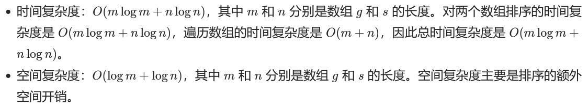

```java
class Solution {
    public int findContentChildren(int[] g, int[] s) {
        int res = 0;
        Arrays.sort(g);
        Arrays.sort(s);
        int p1 = 0;
        int p2 = 0;
  
        while (p1 < g.length && p2 < s.length) {
            if (g[p1] <= s[p2]) {
                res += 1;
                p1++;
                p2++;
            } else {
                p2++;
            }
        }
        return res;  
    }
}
```

# [LC 376：Wiggle Subsequence](https://leetcode.com/problems/wiggle-subsequence/)

## sol 1: 贪心

图解:

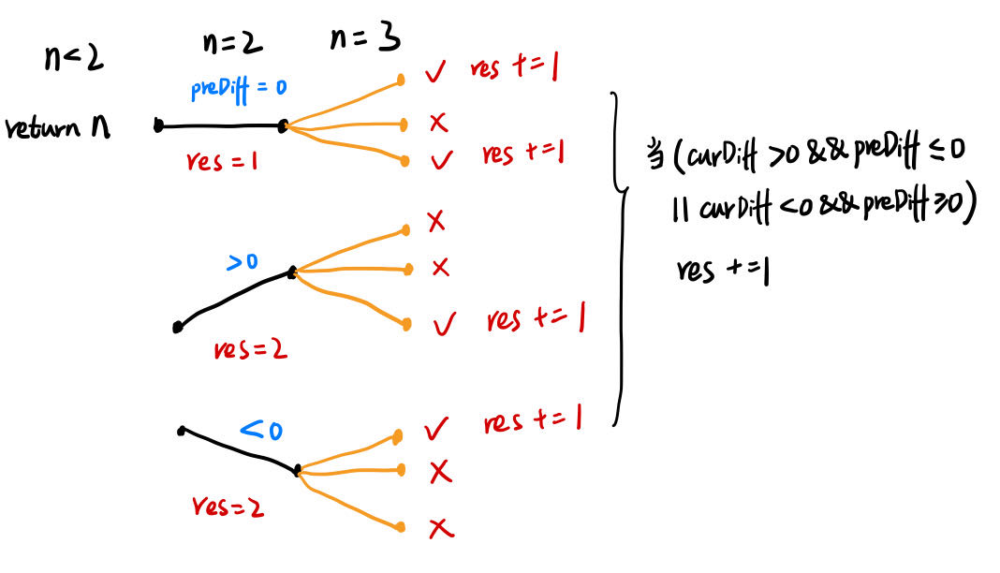

完整代码如下：

时间复杂度：O（N）

空间复杂度：O(1)

```java
class Solution {
    public int wiggleMaxLength(int[] nums) {
        int n = nums.length;
        if (n < 2) {
            return n;
        }
        int preDiff = nums[1] - nums[0];
        int res = preDiff != 0 ? 2:1;
        for (int i = 2; i < n; i += 1) {
            int curDiff = nums[i] - nums[i-1];
            if ((preDiff >= 0 && curDiff < 0) || (preDiff <= 0 && curDiff > 0)) {
                res += 1;
                preDiff = curDiff;
            }
        }
        return res;   
    }
}
```

## sol 2：动态规划(略)

# [LC 53: Maximum Subarray](https://leetcode.com/problems/maximum-subarray/)

## sol 1: 贪心

局部最优：当前“连续和”为负数的时候立刻放弃，从下一个元素重新计算“连续和”，因为负数加上下一个元素 “连续和”只会越来越小。

全局最优：选取最大“连续和”

 **局部最优的情况下，并记录最大的“连续和”，可以推出全局最优**

完整代码如下：

时间复杂度：O（N）

空间复杂度：O（1）

```java
class Solution {
    public int maxSubArray(int[] nums) {
        int maxSum = -10000;
        int curSum = 0;
  
        for (int i = 0; i < nums.length; i += 1) {
            if (curSum < 0) {//如果当前和为负，则负数清零，重新开始计算
                curSum = 0;
            } 
            curSum += nums[i];
            maxSum = Math.max(maxSum, curSum);
        }
        return maxSum;   
    }
}
```

## sol 2: 动态规划

dp五步：

1、dp[i]表示以nums[i]为结尾的所有连续子数组中元素和的最大值。

2、递推公式

情况1：如果nums[i] > 0, 则把nums[i]直接接在dp[i-1]所表示的那个数组的后面，即dp[i] = dp[i-1] + nums[i],

情况2： 如果nums[i] <=0, 加上nums[i]以后值不会变大，所以从nums[i]开始从头开始计算当前连续子序列和，即dp[i] = nums[i]。

由此可得，dp[i] = Math.max(dp[i-1] + nums[i], nums[i])

3、初始化

dp[0] = nums[0]

4、遍历顺序：从前向后

5、实例推导

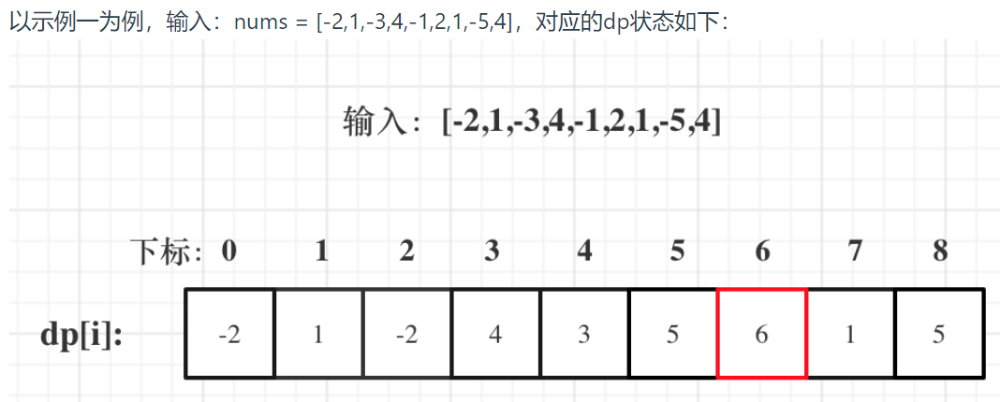

完整代码如下：

```java
class Solution {
    public int maxSubArray(int[] nums) {
        int n = nums.length;
        int[] dp = new int[n];
        dp[0] = nums[0];
        int res = nums[0];
  
        for (int i = 1; i < n; i += 1) {
            dp[i] = Math.max(dp[i-1]+nums[i], nums[i]);
            res = Math.max(res, dp[i]);
        }
        return res;
    }
}
```

# [LC 122：Best Time to Buy and Sell Stock II](https://leetcode.com/problems/best-time-to-buy-and-sell-stock-ii/)

## sol 1：贪心

思路重点：利润可以分解到以每天为单位

举例说明：加入第0天买入，第3天卖出，则

那么利润为：prices[3] - prices[0]。

相当于(prices[3] - prices[2]) + (prices[2] - prices[1]) + (prices[1] - prices[0])。

即利润等同于：第0天买入，第1天卖出；第1天再买入，第2天再卖出；第2天再买入，第3天再卖出，然后将每天的利润加总。

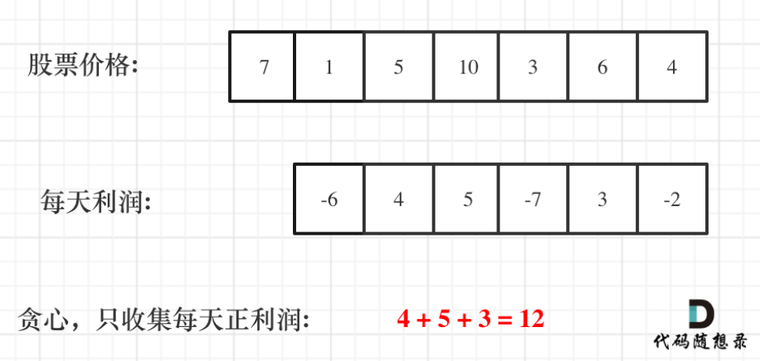

贪心的局部最优就是，只收集每天正利润，最终实现总利润最大。

完整代码如下：

时间复杂度：O（N）

空间复杂度：O（1）

```java
class Solution {
    public int maxProfit(int[] prices) {
        int res = 0;

        for (int i = 1; i < prices.length; i += 1) {
            int diff = prices[i] - prices[i-1];
            if (diff > 0) {
                res += diff;
            }
        }
        return res;
    }
}
```

## sol 2：动态规划

这道题与lc121的区别在于，这道题中股票可以买卖多次。

dp五部

1、

* dp[i][0] 表示第i天**持有**股票所得现金。
* dp[i][1] 表示第i天**不持有**股票所得最多现金

2、递推公式

第i天**持有**股票可以从两种状态转移过来，

1、第i-1天持有股票且在第i天没有卖出，则持有股票所得现金 = dp[i-1][0];

2、第i-1天不持有股票且在第i天买入，则持有股票所得现金 = dp[i-1][1]-prices[i]。(这里就是跟lc121不同的地方)

由此可得，dp[i][0] = Math.max(dp[i-1][0]，dp[i-1][1]-prices[i])

第i天**不持有**股票可以从两种状态转移过来，

1、第i-1天不持有股票且在第i天没有买入，则持有股票所得现金 = dp[i-1][1]；

2、第i-1天持有股票且在第i天卖出，则持有股票所得现金 = dp[i-1][0] + prices[i]。

由此可得，dp[i][1] = Math.max(dp[i-1][1], dp[i-1][0] + prices[i])

3、初始化

dp[0][0] = -prices[0]

dp[0][1] = 0

4、遍历顺序：从左往右

完整代码如下：

时间复杂度&空间复杂度：O(n)

```java
class Solution {
    public int maxProfit(int[] prices) {
        int n = prices.length;
        int[][] dp = new int[n][2];
        dp[0][0] = -prices[0];
        dp[0][1] = 0;
  
        for (int i = 1; i < n; i += 1) {
            dp[i][0] = Math.max(dp[i-1][0], dp[i-1][1]-prices[i]);
            dp[i][1] = Math.max(dp[i-1][1], dp[i-1][0] + prices[i]);
        }
        return dp[n-1][1];//卖出股票收益高于持有股票，因此取[1]
    }
}
```

# [LC 55: Jump Game](https://leetcode.com/problems/jump-game/)

思路：我一开始也是纠结于每次应该跳几步，然后就想成回溯问题了。

实际上可以把这道题转化为跳跃覆盖范围可不可以覆盖到终点。

**贪心算法局部最优解：每次取最大跳跃步数（取最大覆盖范围），整体最优解：最后得到整体最大覆盖范围，看是否能到终点** 。

图解：

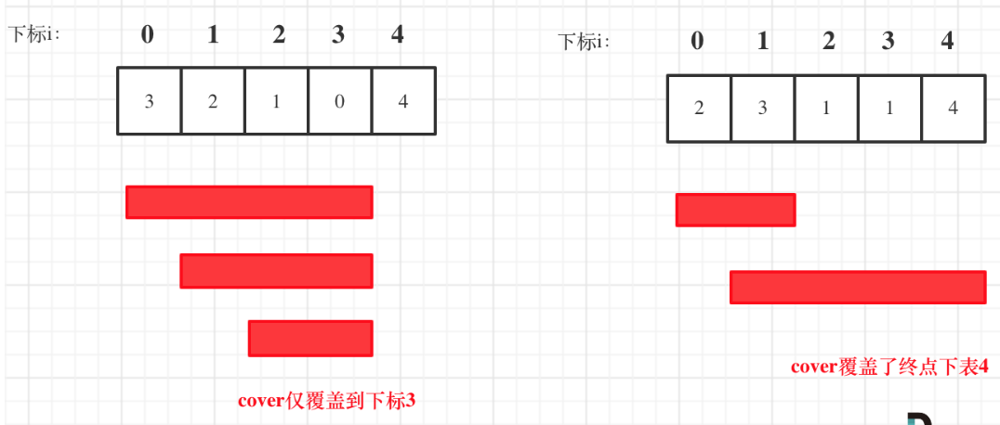

```java
class Solution {
    public boolean canJump(int[] nums) {
        if (nums.length == 1) {
            return true;
        }
  
        int coverRange = 0;
        for (int i = 0; i <= coverRange; i += 1) {
            coverRange = Math.max(coverRange, i + nums[i]);
            if (coverRange >= nums.length - 1) {
                return true;
            }
        }
        return false;
    }
}
```

# [LC 45：Jump Game II](https://leetcode.com/problems/jump-game-ii/)

还是用贪心的思路：

局部最优：每一步尽可能走的远一点，如果还没到终点，就再走一步。整体最优：每一步尽可能多走，从而实现最小步数到达终点。

## sol 1: 反向查找出发位置

先设置position在终点位置，然后遍历数组，寻找覆盖范围能到达position的，如果有多个，则选择下标最小的i（也就是一步能跳最多的）；然后将position设置到i的位置，再遍历数组，寻找可以到达position的，以此类推，直到到达数组的起始位置。

完整代码如下：

时间复杂度：O(n^2)，其中 n 是数组长度。有两层嵌套循环，在最坏的情况下，例如数组中的所有元素都是 1，position 需要遍历数组中的每个位置，对于 position 的每个值都有一次循环。

空间复杂度：O(1)。

```java
class Solution {
    public int jump(int[] nums) {
        if (nums.length == 1) {
            return 0;
        }
  
        int res = 0;
        int position = nums.length - 1;
        while (position > 0) {
            for (int i = 0; i < position; i += 1) {
                //表示下标为i的位置可以跳到position处
                if (i+nums[i] >= position) {
                    position = i;
                    res += 1;
                    //退出for循环
                    break;
                }
            }
        }
        return res;  
    }
}
```

## sol 2: 正向查找

思路：

举例说明：对于数组[2，3，1，2，4，2，3]，从下标0出发，遍历到下标为2（因为对于nums[0]来说，其覆盖范围就是到下标2），遍历过程中更新nextEnd，即下一步最远路径，遍历到下标2时，更新curEnd = nextEnd，也就是下标为4的地方，一次类推。

注意：不遍历数组的最后一个元素，如果遍历了最后一个元素，当end刚好在最后一个元素时，就会增加一次不必要的跳跃，所以不访问最后一个元素。

图解：这个图解还是很清晰的

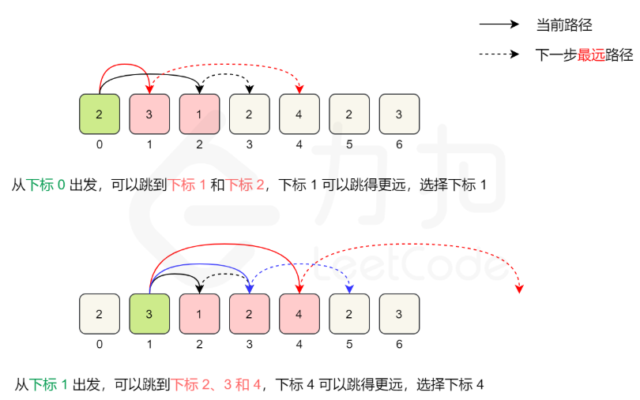

完整代码如下：

时间复杂度：O(N)

空间复杂度：O(1)

```java
class Solution {
    public int jump(int[] nums) {
        int res = 0;
        int curEnd = 0;//表示当前所在位置能跳到的最远位置的下标
        int nextEnd = 0;
        //注意：不遍历数组的最后一个元素
        for (int i = 0; i <= curEnd && curEnd < nums.length - 1; i += 1) {
            nextEnd = Math.max(nextEnd, i+nums[i]);
            if (i == curEnd) {
                curEnd = nextEnd;
                res += 1;
            }  
        }
        return res;   
    }
}
```

## sol 3: dp

代码如下：

```java
class Solution {
    public int jump(int[] nums) {
        //dp[i]表示到达下标为i的点的最小步数
        int n = nums.length;
        int[] dp = new int[n];
        Arrays.fill(dp, Integer.MAX_VALUE);
        dp[0] = 0;

        for (int i = 0; i < n-1; i += 1) {
            for (int j = 0; j <= nums[i]&& i+j < n; j += 1) {
                dp[i+j] = Math.min(dp[i+j], dp[i]+1);
            }
        }
        return dp[n-1];
    }
}
```

# [LC 1005：Maximize Sum Of Array After K Negations](https://leetcode.com/problems/maximize-sum-of-array-after-k-negations/)

思路：

1、将数组进行排序（这一步之前没想到）

2、遍历数组，将负数全部转为正数，且k--

3、对k进行分类讨论：

    （1）k = 0，直接返回答案

    （2）k > 0且为偶数，直接返回答案

    （3）k > 0且为奇数，找到此时的数组中绝对值最小的数，转为负数

完整代码如下：

```java
class Solution {
    public int largestSumAfterKNegations(int[] nums, int k) {
        Arrays.sort(nums);
        int sum = 0;
        int idk = 101;
        for (int i = 0; i < nums.length; i += 1) {
            if (nums[i] < 0 && k > 0) {
                nums[i] = -1*nums[i];
                k -= 1;
            }
            idk = Math.min(idk, nums[i]);
            sum += nums[i];
        }
  
        if (k%2 == 1) {
            //这一步易错：容易漏掉乘以2
            sum -= 2*idk;
        }
        return sum;   
    }
}
```

# [LC 134：Gas Station](https://leetcode.com/problems/gas-station/)

思路：

要想能走完一圈

**全局达标**：总油量 >= 总消耗，也就是totalSum = ((gas[0]-cost[0]) + (gas[1]-cost[1])+...+(gas[n]-cost[n])) >= 0

**局部达标**：加入起点为start，对于任意i, 0 <=  i< gas.length，curSum = ((gas[0]-cost[0]) + (gas[1]-cost[1])+...+(gas[i]-cost[i])) >= 0

如果到达i时，curSum <0，那么说明[start,i]都不能选做起点，因为选择start+1的位置作为起点，到达i点时，得到的curSum只会更小，同样会小于0，以此类推。

完整代码如下：

* 时间复杂度：$O(n)$
* 空间复杂度：$O(1)$

```java
class Solution {
    public int canCompleteCircuit(int[] gas, int[] cost) {
        int curSum = 0;
        int totalSum = 0;
        int start = 0;
  
        for (int i = start; i < gas.length; i += 1) {
            curSum += gas[i] - cost[i];
            totalSum += gas[i] - cost[i];
            if (curSum < 0) {
                start = i + 1;
                curSum = 0;
            }
        }
        if (totalSum < 0) {
            return -1;
        } else {
            return start;
        }   
    }
}
```

# [LC 135：Candy](https://leetcode.com/problems/candy/)

## sol 1：遍历数组（自己的思路）

思路就是遍历数组，唯一需要注意的就是 `ratings[i-1] > ratings[i]`的情况，这个时候需要修改candies[i-1]，随之而来的就是需要再返回去check `candies[i-2]`, `candies[i-3]`。。。是否也需要修改。

* 一次是从左到右遍历，只比较右边孩子评分比左边大的情况。
* 一次是从右到左遍历，只比较左边孩子评分比右边大的情况。

例如用例：[1, 2, 87, 87, 87, 2, 1]

```java
class Solution {
    public int candy(int[] ratings) {
        int n = ratings.length;
        int[] candy = new int[n];
        candy[0] = 1;
        //第一次遍历：从左往右
        for (int i = 1; i < n; i += 1) {
            if (ratings[i] > ratings[i-1]) {
                candy[i] = candy[i-1] + 1;
            } else {
                candy[i] = 1;
            }
        }
        //第二次遍历：从右往左
        for (int j = n-2; j >= 0; j -= 1) {
            if (ratings[j] > ratings[j+1] && candy[j] <= candy[j+1]) {
                candy[j] = candy[j+1] + 1;
            }
        }

        int res = 0;
        for (int num: candy) {
            res += num;
        }
        return res;   
    }
}
```

## sol 2: 代码随想录的代码

思路是一样的，但是感觉随想录的思路更清晰一点，代码也更简洁。因为我刚开始只想到从左往右遍历，后来不能通过用例测试才想到有种情况要从右往左。

完整代码如下：

```java
class Solution {
    public int candy(int[] ratings) {
        int n = ratings.length;
        int[] candies = new int[n];
        candies[0] = 1;
        //从左往右遍历
        for (int i = 1; i < n; i += 1) {
            candies[i] = (ratings[i] > ratings[i-1]) ? candies[i-1]+1 : 1;
        }
        //从右往左遍历
        for (int i = n-2; i >= 0; i -= 1) {
            if (ratings[i] > ratings[i+1]) {
                //如果candies[i] > candies[i+1],则candies[i]不变
                //如果candies[i] == candies[i+1],则candies[i] = candies[i+1] + 1
                //candies[i]不可能小于candies[i+1]
                candies[i] = Math.max(candies[i], candies[i+1]+1); 
            } 
        }
        int res = 0;
        for (int num: candies) {
            res += num;
        }
        return res;   
    }
}
```

# [LC 860：Lemonade Change](https://leetcode.com/problems/lemonade-change/)

思路：

情况1：账单为5，不用找零；

情况2：账单为10，增加一个10，减少一个5；

情况3：账单为20，增加一个20（两种选择：减少一个10和一个5，或者减少三个5）

我的代码没有AC，无法通过用例39。

看了代码随想录发现这道题居然也用到了贪心思想，就是当要找零15元时，如果有10元的bill，优先找给顾客1个0元和1个5元，如果没有再找零3个5元。

按照这个修改以后，我的代码就可以AC了。

以下是修改后的我的代码：

```java
class Solution {
    public boolean lemonadeChange(int[] bills) {
        Map<Integer, Integer> map = new HashMap<>();
  
        for (int i = 0; i < bills.length; i += 1) {
            map.put(bills[i], map.getOrDefault(bills[i], 0)+1);
            int change = bills[i] - 5;
            if (change == 0) {
                continue;
            }
 
            if (change == 5) {
                if (map.getOrDefault(change,0) > 0) {
                    map.put(5, map.getOrDefault(5, 0)-1);
                } else {
                    return false;
                }
            } else if (change == 15) {
                if (map.getOrDefault(5,0) >= 1 && map.getOrDefault(10,0) >= 1) {
                    map.put(5, map.getOrDefault(5,0)-1);
                    map.put(10, map.getOrDefault(10,0)-1);
                } else if (map.getOrDefault(5,0) >= 3) {
                    map.put(5, map.getOrDefault(5,0)-3);  
                } else {
                    return false;
                }
            }   
        }
        return true;   
    }
}
```

以下是代码随想录的代码，显然更加简洁清晰：

```java
class Solution {
    public boolean lemonadeChange(int[] bills) {
        int five = 0;
        int ten = 0;
  
        for (int i = 0; i < bills.length; i += 1) {
            if (bills[i] == 5) {
                five += 1;
            } else if (bills[i] == 10) {
                five -= 1;
                ten += 1;
            } else if (bills[i] == 20) {
                if (ten > 0) {
                    ten -= 1;
                    five -= 1;
                } else {
                    five -= 3;
                }
            }
            if (five < 0 || ten < 0) {
                return false;
            }
        }
        return true; 
    }
}
```

# [LC 406: Queue Reconstruction by Height](https://leetcode.com/problems/queue-reconstruction-by-height/)

思路：这道题跟lc135有点相似，也是有两个维度，每次只能确定一个维度，再考虑另一个维度。

先按h从大到小排，当h相等时，k小的排在前面，然后再按照k从小到大排。

完整代码如下：

注意两点：1、注意如何按指定的规则来对数组进行排列

2、最后将链表转化成数组的代码要注意学习掌握

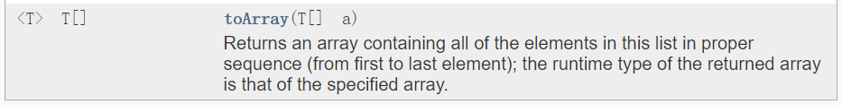

1/20/2023 update-更详细的解释：[看这篇官方题解](https://leetcode.com/problems/queue-reconstruction-by-height/solutions/344621/queue-reconstruction-by-height/)

代码如下：

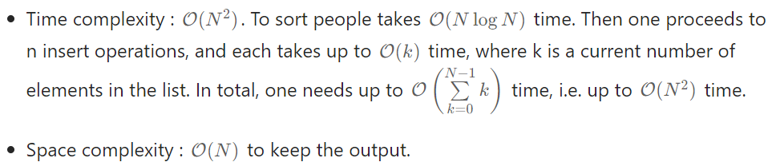

```java
class Solution {
    public int[][] reconstructQueue(int[][] people) {
        Arrays.sort(people, (a, b) -> {
            if (a[0] == b[0]) return a[1] - b[1];
            return b[0] - a[0];
        });
  
        LinkedList<int[]> que = new LinkedList<>();
  
        for (int[] p: people) {
            que.add(p[1], p);
        }
  
        return que.toArray(new int[people.length][]);
    }
}
```

# [LC 452：Minimum Number of Arrows to Burst Balloons](https://leetcode.com/problems/minimum-number-of-arrows-to-burst-balloons/)

先按每个气球的**终止**坐标从小到大排列，射出去的箭一定是在所有重叠气球右边界最小的地方。

完整代码如下：

* 时间复杂度 : O(NlogN)  排序需要 O(NlogN) 的复杂度
* 空间复杂度 : O(logN) java所使用的内置函数用的是快速排序需要 logN 的空间

```java
class Solution {
    public int findMinArrowShots(int[][] points) {
        //sort by x_end
        //使用Integer内置比较方法，不会溢出
        Arrays.sort(points, (a, b) -> Integer.compare(a[1], b[1]));

        int count = 1;
        int xStart, xEnd, firstEnd = points[0][1];
        for (int[] p: points) {
            xStart = p[0];
            xEnd = p[1];

            if (firstEnd < xStart) {
                count += 1;
                firstEnd = xEnd;
            }
        }
        return count;
    }
}
```

# [LC 435：Non-overlapping Intervals](https://leetcode.com/problems/non-overlapping-intervals/)

贪心算法的代码都很简洁，但是思路很难想。

思路：

1、如何排序和遍历？

（1）按照区间右边界升序排列。这时需要从左往右遍历，因为右边界越小越好，这样给下一个（右边）区间留出的空间更大，重叠的可能性也更小。（图解是按照这一种思路）

（2）按照区间左边界升序排列。这时需要从右往左遍历，因为左边界越大越好，这样给下一个（左边）区间留出的空间更大，重叠的可能性也更小。

2、设置变量edge来记录分割点的位置，即图解中区间1的右边界和区间4的右边界。

3、用一个分割点来标记一个非重复区间。

图解：

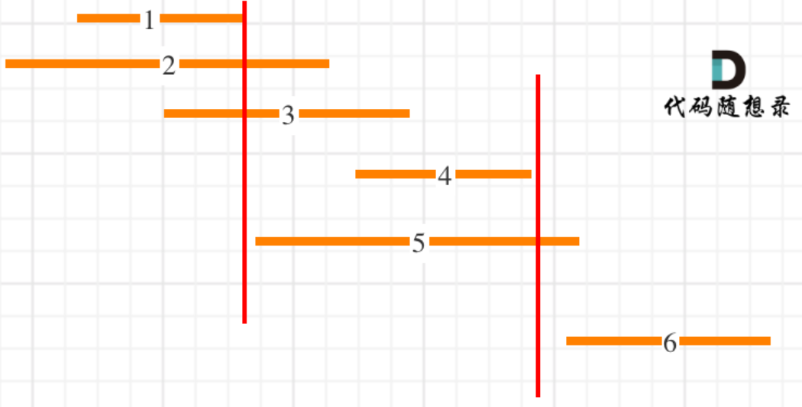

完整代码如下：

时间复杂度：O(NlogN) for sorting.

空间复杂度：O(1).

```java
class Solution {
    public int eraseOverlapIntervals(int[][] intervals) {
        //按区间的终止坐标从小到大排序
        Arrays.sort(intervals, (a, b)-> {
            return a[1] - b[1];
        });
        int count = 0;
        int firstEnd = intervals[0][1];
        for (int i = 1; i < intervals.length; i += 1) {
            if (intervals[i][0] < firstEnd) {
                count += 1;
            } else {
                firstEnd = intervals[i][1];
            }
        }
        return count;
    }
}
```

# [LC 763：Partition Labels](https://leetcode.com/problems/partition-labels/)

思路：贪心算法

重点：同一个字母只能出现在同一个片段，**那么一个字母首次出现的下标位置和最后一次出现的下标位置必须在同一个片段**。

局部最优：寻找每个片段可能的最小结束位置下标。

全局最优：片段数量最多

完整代码如下：

```java
class Solution {
    public List<Integer> partitionLabels(String s) {
        int[] map = new int[26];
        //先找到每个字母最后一次出现的位置下标
        for (int i = 0; i < s.length(); i += 1) {
            map[s.charAt(i) - 'a'] = i;
        }
  
        List<Integer> res = new LinkedList<>();
        //start和end代表一个片段起始位置和终止位置的下标
        int start = 0, end = 0;
        //从左往右遍历字符串
        for (int i = 0; i < s.length(); i += 1) {
            //需要更新当前片段的“符合要求的”最小结束位置下标
            end = Math.max(end, map[s.charAt(i)-'a']);
            //当到达当前片段的“符合要求的”最小结束位置下标时，得到一个符合要求的片段
            //将其长度添加到res中，同时更新片段的起点位置
            if (i == end) {
                res.add(end-start+1);
                start = i + 1;
            }
        }
        return res; 
    }
}
```

# [LC 56：Merge Intervals](https://leetcode.com/problems/merge-intervals/)

思路：把原来python代码改成了java。

先按照区间**左边界升序排列**，将排序后的第一个区间加入到res中，然后开始遍历数组。如果遍历到的区间 i 与res最后一个区间 j 重叠（只可能是跟最后一个区间重叠，因为已经排序过了，区间 i 的左边界最多等于 j 的左边界，不可能超过）。

完整代码如下：

时间复杂度 ： O(NlogN) 排序需要O(NlogN)
空间复杂度 ： O(logN)  java 的内置排序是快速排序 需要 O(logN)空间

```java
class Solution {
    public int[][] merge(int[][] intervals) {
        LinkedList<int[]> res = new LinkedList<>(); 
  
        Arrays.sort(intervals, (a, b)-> {
            return a[0] - b[0];
        });
        //这一步是重点
        res.add(intervals[0]);
  
        for (int i = 1; i < intervals.length; i += 1) {
            int[] last = res.getLast();
            if (last[1] < intervals[i][0]) {
                res.add(intervals[i]);
            } else {
                int start = Math.min(last[0], intervals[i][0]);
                int end = Math.max(last[1], intervals[i][1]);
                int[] newInterval = new int[]{start, end};
                res.removeLast();
                res.addLast(newInterval);
            }   
        }
        return res.toArray(new int[res.size()][]); 
    }
}
```


# [LC 738：Monotone Increasing Digits](https://leetcode.com/problems/monotone-increasing-digits/)

思路：

ex:

input : n = 33315, output: 22299

input: n = 34152, output: 33999

input: n = 333, output: 333

input: n = 123, ouput: 123

可以发现，需要找到input中digit decreasing的位置，例如 33315中, num[2] > num[3], 则num[3]，num[4],....一直到最后一个digit全部都应当赋值9。而num[2]，num[1]。。。都需要减一。

重点：应该从右往左遍历还是从左往右遍历？

随想录认为应该从右往左，因为如果从左往右的话，还需要修改已经遍历过的digit。

完整代码如下：

注意：关于String.join()

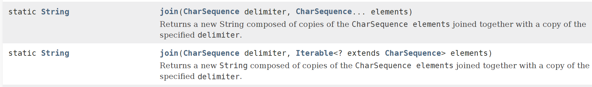

```java
class Solution {
    public int monotoneIncreasingDigits(int n) {
        //将一个数字的每个digit转化成string存储在数组中：值得借鉴！
        String[] string = (n+"").split("");
        int target = string.length;
  
        for (int i = string.length - 1; i > 0; i -= 1) {
            if (Integer.parseInt(string[i-1]) > Integer.parseInt(string[i])) {
                string[i-1] = (Integer.parseInt(string[i-1]) - 1)+ "";
                target = i;
            }
        }
        for (int i = target; i < string.length; i += 1) {
            string[i] = "9";
        }
        return Integer.parseInt(String.join("",string));  
    }
}
```


# [LC 714: Best Time to Buy and Sell Stock with Transaction Fee](https://leetcode.com/problems/best-time-to-buy-and-sell-stock-with-transaction-fee/)

## sol 1：贪心算法

这道题让我首先想到了lc122，不同在于这道题要收手续费。

完整代码如下：

```java

class Solution {
    public int maxProfit(int[] prices, int fee) {
        int buy = prices[0] + fee;
        int sum = 0;
  
        for (int p: prices) {
            if (p + fee < buy) {
                buy = p + fee;//更新最低买入价
            } else if (p > buy) {//表明以当前p的价格卖出的话利润为正
                sum += p - buy;//假设当天以p的价格卖出取得正的利润
                //但是当天卖出不一定是最优，因为可能之后某一天的利润更高，
                //提供一个反悔操作：假设在以p的价格卖出当天，能够再以p买入一股且不收手续费
                //假如后一天价格q>p，那么在q点卖出收获正利润q-p。
                //总利润为(q-p)+p-buy = q-buy,等同于在q点卖出
                buy = p; 
            }
        }
        return sum;
    }
}
```


## sol 2: 动态规划

完整代码如下：

时间复杂度和空间复杂度均为O(N)

```java
class Solution {
    public int maxProfit(int[] prices, int fee) {
        //dp[i][0]表示第i天持有股票所获最多金额
        //dp[i][1]表示第i天不持有股票所获最多金额
        //递推公式：
        //dp[i][0] = Math.max(dp[i-1][0], dp[i-1][1]-prices[i]-fee)
        //dp[i][1] = Math.max(dp[i-1][1], dp[i-1][0]+prices[i])
        //初始化：
        //dp[0][0] = -prices[0]-fee
        //dp[0][1] = 0
  
        int n = prices.length;
        int[][] dp = new int[n][2];
  
        dp[0][0] = -prices[0]-fee;
        dp[0][1] = 0;
  
  
        for (int i = 1; i < n; i += 1) {
            dp[i][0] = Math.max(dp[i-1][0], dp[i-1][1]-prices[i]-fee);
            dp[i][1] = Math.max(dp[i-1][1], dp[i-1][0]+prices[i]);
        }
        return dp[n-1][1]; 
    }
}
```


# [LC 968 Binary Tree Cameras](https://leetcode.com/problems/binary-tree-cameras/)

## sol 1：贪心算法

思路：

1、贪心算法体现在，局部最优：叶子节点不安装摄像头，而让叶子节点的父节点安装摄像头（如果叶子节点安装摄像头的话，下层无需要覆盖的节点，这样很浪费），全局最优：使用摄像头数量最少。

2、如何遍历二叉树：使用后序遍历，即左右中的顺序，即可实现回溯过程中从下到上的顺序，即先遍历叶子节点。

3、如果考虑根节点（即中间节点）

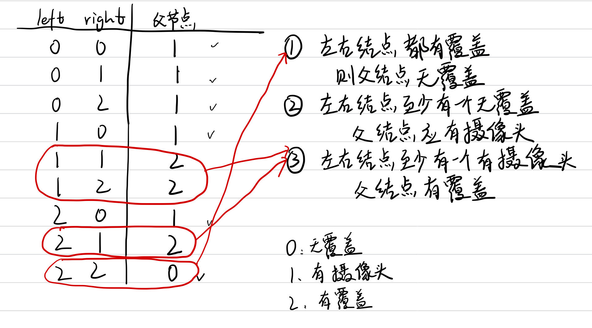

4、如何考虑空节点？

如果将空节点视为无覆盖，那么叶子节点就需要安装摄像头，显然不行；如果将空节点视为有摄像头，那么叶子节点就是已覆盖，叶子节点的父节点就不需要按摄像头了，这也不行；所以应当将空节点视为已覆盖。

完整代码如下：

复杂度分析（无参考答案）

就是一个后序遍历，所有节点遍历一次，所以我觉得时间复杂度和空间复杂度均为O(N)

```java
class Solution {
    int res = 0;
    public int minCameraCover(TreeNode root) {
        return dfs(root) == 0 ? res+1:res;
    }
  
    private int dfs(TreeNode root) {
        //递归终止条件：遇到空节点
        if (root == null) {
            return 2;
        }
  
        int left = dfs(root.left);
        int right = dfs(root.right);
        //情况一：左右子节点都有覆盖，则父节点标记为无覆盖
        if (left == 2 && right == 2) {
            return 0;
        //情况二：左右节点至少有一个无覆盖，则父节点应当按摄像头
        } else if (left == 0 || right == 0) {
            res += 1;
            return 1;
        //情况三：左右节点至少有一个有摄像头，则父节点标记为有覆盖
        } else {
            return 2;
        }
    }
}
```

ddd
