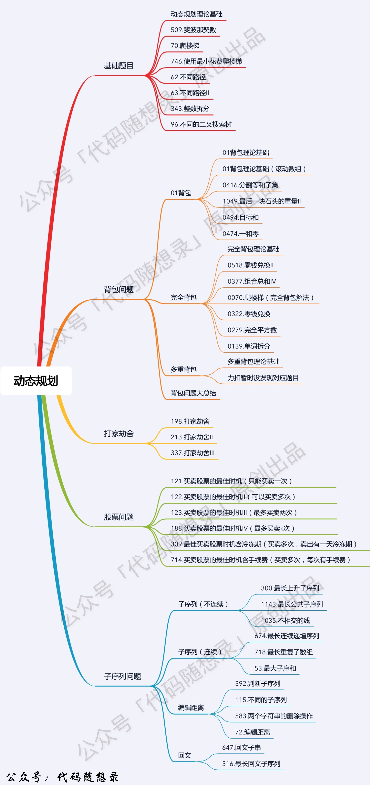
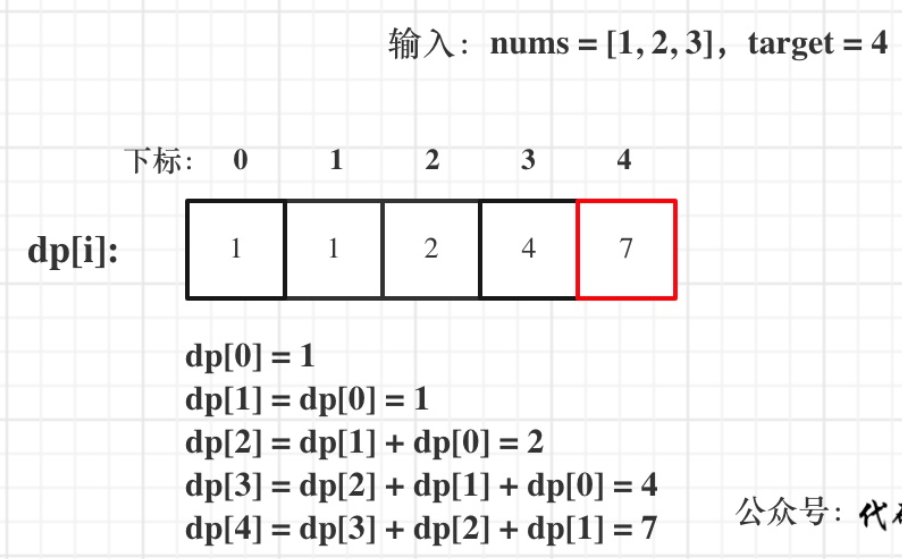

# 4动态规划理论基础



# [LC 509：Fibonacci Number](https://leetcode.com/problems/fibonacci-number/)

动态规划思路：

1、dp[i]表示第i个fibonacci数的数值

2、递推公式：dp[i] = dp[i-1] + dp[i-2]

3、dp数组初始化：dp[0] = 0, dp[1] = 1

4、遍历顺序：从递归公式dp[i] = dp[i - 1] + dp[i - 2];中可以看出，dp[i]是依赖 dp[i - 1] 和 dp[i - 2]，那么遍历的顺序一定是从前到后遍历的

5、举例推导dp数组

按照这个递推公式dp[i] = dp[i - 1] + dp[i - 2]，我们来推导一下，当N为10的时候，dp数组应该是如下的数列：0 1 1 2 3 5 8 13 21 34 55

完整代码如下：

时间复杂度O(N)

空间复杂度O(N)

```java
class Solution {
    public int fib(int n) {
        if (n <= 1) {
            return n;
        }
  
        int[] dp = new int[n+1];
        dp[0] = 0;
        dp[1] = 1;
  
        for (int i = 2; i <= n; i += 1) {
            dp[i] = dp[i-2] + dp[i-1];
        }
        return dp[n]; 
    }
}
```

# [LC 70: Climbing Stairs](https://leetcode.com/problems/climbing-stairs/)

完整代码如下：

```java
class Solution {
    public int climbStairs(int n) {
        //1、dp[i]表示爬i级台阶有多少种不同的方法
        //2、递推公式：dp[i] = dp[i-2] + dp[i-1]
        //3、初始化：dp[1] = 1; dp[2] = 2
        //4、遍历顺序：从左往右
        //5、举例推导：当n = 5时，dp数组为：1,2,3,5,8
        //1+1+1+1+1 = 5
        //2+1+1+1 = 5
        //1+2+1+1 = 5
        //1+1+2+1 = 5
        //1+1+1+2 = 5
        //2+2+1 = 5
        //2+1+2 = 5
        //1+2+2 = 5
        if (n <= 2) {
            return n;
        }
        int[] dp = new int[n+1];//注意:这里dp[0]不存在，数组要存储dp[1],dp[2]...dp[n]，所以数组长度为n+1
        dp[1] = 1;
        dp[2] = 2;
        for (int i = 3; i <= n; i += 1) {
            dp[i] = dp[i-1] + dp[i-2];
        }
        return dp[n];  
    }
}
```

# [LC 746：Min Cost Climbing Stairs](https://leetcode.com/problems/min-cost-climbing-stairs/)

完整代码如下：

```java
class Solution {
    public int minCostClimbingStairs(int[] cost) {
        //1、dp[i]表示到达下标为i的台阶所需要花费的最小金额
        //2、dp[i] = Math.min(dp[i-2]+cost[i-2], dp[i-1]+cost[i-1])
        //3、dp[1] = cost[0], dp[2] = Math.min(cost[0], cost[1])
        //4、遍历顺序：从左往右
        //5、举例推导:已验证

        int n = cost.length;
        int[] dp = new int[n+1];
        dp[1] = 0;
        dp[2] = Math.min(cost[0], cost[1]);
  
        for (int i = 3; i <= n; i += 1) {//i-1 < n,所以i < n+1
            dp[i] = Math.min(dp[i-2]+cost[i-2], dp[i-1]+cost[i-1]);
        }
        return dp[n];//注意：应当返回dp[n]而不是dp[n+1] 
    }
}
```

# [LC 62：Unique Paths](https://leetcode.com/problems/unique-paths/)

完整代码如下：

```java
class Solution {
    public int uniquePaths(int m, int n) {
        //1、dp[i][j]表示走到第i行第j列的位置总共有多少中不同的走法
        //2、dp[i][j] = dp[i][j-1] + dp[i-1][j]
        //   if i == 0 or j == 0, dp[i][j] = 1
        //3、dp[0][1] = 1, dp[1][0] = 1
        //4、遍历顺序：从左往右
        //5、举例推导
        int[][] dp = new int[m][n];
        for (int i = 0; i < m; i += 1) {
            for (int j = 0; j < n; j += 1) {
                if (i == 0 || j == 0) {
                    dp[i][j] = 1;
                } else {
                    dp[i][j] = dp[i][j-1] + dp[i-1][j];
                }
            }
        }
        return dp[m-1][n-1];
    }
}
```

# [LC 63：Unique Paths II](https://leetcode.com/problems/unique-paths-ii/)

思路：这题刚开始是按lc62来的，只是增加了当obstacleGrid[i][j] == 1时，dp[i][j] = 0.

结果发现有用例不通过，然后又改进了i=0行和j=0列上有障碍的特殊情况。

完整代码如下：

```java
class Solution {
    public int uniquePathsWithObstacles(int[][] obstacleGrid) {
        //dp[0][0] = 1
        int m = obstacleGrid.length;
        int n = obstacleGrid[0].length;
        int[][] dp = new int[m][n];
  
        for (int i = 0; i < m; i += 1) {
            if (obstacleGrid[i][0] == 1) {
                for (int j = i ; j < m; j += 1) {
                    dp[j][0] = 0;
                }
                break;
            } else {
                dp[i][0] = 1;
            }
        }
  
        for (int i = 0; i < n; i += 1) {
            if (obstacleGrid[0][i] == 1) {
                for (int j = i ; j < n; j += 1) {
                    dp[0][j] = 0;
                }
                break;
            } else {
                dp[0][i] = 1;
            }
        }

        for (int i = 1; i < m; i += 1) {
            for (int j = 1; j < n; j += 1) {
                if (obstacleGrid[i][j] == 1) {
                    dp[i][j] = 0;
                } else {
                    dp[i][j] = dp[i-1][j] + dp[i][j-1];
                }
            }
        }
        return dp[m-1][n-1];   
    }
}
```

# [LC 343: Integer Break](https://leetcode.com/problems/integer-break/)

## sol 1：动态规划

思路：

1、dp[i]表示拆分数字i，得到的最大乘积

2、状态转移方程：


说明：遍历j时，其实j <= i/2即可。举例说明：i = 7，则有（2，5），（3，4），（4，3），（5，2）。可以看到当j > 3以后都是重复的

3、这道题的难点我觉得就是在这个转移方程，比较难想到。

完整代码如下：


```java
class Solution {
    public int integerBreak(int n) {
        int[] dp = new int[n + 1];
        for (int i = 2; i <= n; i++) {
            int curMax = 0;
            for (int j = 1; j <= i/2; j++) {
                curMax = Math.max(curMax, Math.max(j * (i - j), j * dp[i - j]));
            }
            dp[i] = curMax;
        }
        return dp[n];
    }
}
```

## sol 2: 数学

思路：


代码如下：

时间复杂度和空间复杂度均为O(1)

```java
class Solution {
    public int integerBreak(int n) {
        if (n <= 3) {
            return n-1;
        }
        int quotient = n/3;
        int remainder = n%3;
        if (remainder == 0) {
            return (int) Math.pow(3, quotient);
        } else if (remainder == 1) {
            return (int) Math.pow(3, quotient-1)*4;
        } 
        return (int) Math.pow(3, quotient)*2;
  
    }
}
```

# 背包问题

# [LC 416：Partition Equal Subset Sum](https://leetcode.com/problems/partition-equal-subset-sum/)

思路：这道题可以转化为0-1背包问题

假设数组中所有元素之和为sum

1、背包的最大容积为sum/2，令target = sum/2;

2、数组中的每个元素为一件物品，例如nums[i]，表示第i件物品的价值为nums[i]，重量也为nums[i];即nums[i] = weight[i] = value[i]

3、要找到是否存在一种方法使得背包所装物品**刚好达到**背包最大容积;

## **二维dp：**

1、dp[i][j]表示从下标为0到i的物品中任意选取，放进最大容积为j的背包，所得获得的最大价值。

2、dp[i][j]可以拆分为两种情况：放第i件物品和不放第i件物品

放第i件物品：则能达到的最大价值为dp[i-1][j-weight[i]] + weight[i]

不放第i件物品：则能达到的最大价值为dp[i-1][j]

注意：当weight[i] > j时，就只有“不放第i件物品”这一种情况

3、初始化

dp[0][0] = true，表示从下标为0的数字中选取，使其最大价值为0，则不选任何物品放入背包即可，所以为true；

对于i = 0这一层(即二维数组的第一行)，只有dp[0][nums[0]] = true;

4、外层for循环遍历物品，内层for循环遍历背包重量

（初始化相当于填完了二维数组的第一行，双层循环的遍历顺序是：从第二层到最后一层；从左到右。

完整代码如下：

m表示target的值，n表示数组nums的长度

时间复杂度：O(M*N)

空间复杂度：O(M*N)

```java
class Solution {
    public boolean canPartition(int[] nums) {
        int sum = 0;
        for (int num: nums) {
            sum += num;
        }
        //特例判断
        if (sum%2 == 1) {
            return false;
        }
        int target = sum/2;
        boolean[][] dp = new boolean[nums.length][target+1];//初始化时二维数组自动填充了false
  
        //初始化第一层
        if (nums[0] <= target) {
            dp[0][nums[0]] = true;
        }  
  
        for (int i = 1; i < nums.length; i += 1) {
            for (int j = 0; j < target+1; j += 1) {
                if (nums[i] > j) {
                    dp[i][j] = dp[i-1][j];
                } else {
                    dp[i][j] = dp[i-1][j] || dp[i-1][j-nums[i]];
                }   
            }  
        }
        return dp[nums.length-1][target];   
    }
}
```

## **一维dp：**

完整代码如下：

m表示target的值，n表示数组nums的长度

时间复杂度：O(M*N)

空间复杂度：O(M)

```java
class Solution {
    public boolean canPartition(int[] nums) {
        int sum = 0;
        for (int num: nums) {
            sum += num;
        }
        if (sum%2 == 1) {
            return false;
        } 
        int target = sum/2;
        boolean[] dp = new boolean[target+1];
        dp[0] = true;

        for (int i = 1; i < nums.length; i += 1) {
            //这里遍历顺序改为倒序
            for (int j = target; j >= nums[i]; j -= 1) {
                dp[j] = dp[j] || dp[j-nums[i]];
            }
        }
        return dp[target];  
    }
}
```

# [LC 1049: Last Stone Weight II](https://leetcode.com/problems/last-stone-weight-ii/)

## sol 1：一维dp

重点：转化成将一堆石头分成两堆，使其重量差最小，这样就变成了一道0-1背包问题。

代码就是套lc416的模板，几乎一模一样。所以重点在于如何转化成背包问题。

完整代码如下：

时间复杂度：O(n⋅sum)。其中 n 是数组 stones 的长度，sum 为 stones 所有元素之和。

空间复杂度：O(sum)。

```java
class Solution {
    public int lastStoneWeightII(int[] stones) {
        //可转化为，将一堆石头分成两堆，使其重量差最小
        //dp[j]表示往容量为j的背包里装石头，最大可达到的重量
        //dp[j] = Math.max(dp[j], dp[j-stones[i]]+stones[i])
        //dp[0] = 0; 对于j >= stones[0],dp[j] = stones[0]
        int sum = 0;
        for (int stone: stones) {
            sum += stone;
        }
        int target = sum/2;
        int[] dp = new int[target+1];
        dp[0] = 0;
        for (int i = 0; i < target + 1; i += 1) {
            if (i >= stones[0]) {
                dp[i] = stones[0];
            }
        }

        for (int i = 1; i < stones.length; i += 1) {
            for (int j = target; j >= stones[i]; j -= 1) {
                dp[j] = Math.max(dp[j], dp[j-stones[i]]+stones[i]);
            }
        }
        //(sum-dp[target])一定大于或等于dp[target]，
        //因为sum/2向下取整
        return sum - 2*dp[target];
    }
}
```

# [LC 494：Target Sum](https://leetcode.com/problems/target-sum/)

思路：数组中的每一个元素前面的符号可能是“+”也可能是“-”，如果把所有符号为加的元素放在一起，这些元素和记为x，所有符号为减的元素放在一起，这些元素和则为sum-x，这里的sum是数组中所有元素加总的和，那么这个expression的最后结果就等于x-（sum-x）。

特殊情况：所有元素的符号均为正，则sum-x = 0，x = sum；若全部为负，则刚好等于（-sum）。

重点：因此题目要求可以转化为寻找满足 x - (sum-x) = target 的式子的个数，从这个式子可以得到 x = (sum+target)/2，所以就是要寻找满足这个式子的x。

**注意**：如果x = (sum+target)/2这个式子不能整除，则说明不存在满足条件的x，直接返回0。

dp五部：

1、dp[i]表示元素加总之和为i的式子个数

2、不包括nums[i]的式子中，达到元素之和为j的式子有dp[j]个；包括nums[i]的式子中，达到元素之和为j的式子则有dp[j-nums[i]]个。

综上所述：达到元素之和为j的式子的个数 = dp[j] + dp[j-nums[i]]

3、初始化：dp[0] = 1,即容量为0的背包，有一种方法就是装0件物品。

**注意**：target可能为负，极端情况是所有元素前面的符号均为负才能达到target，此时符号为正的元素和就为0（没有元素的符号为正），即sum = -target （target + sum = 0)

完整代码如下：


```java
class Solution {
    public int findTargetSumWays(int[] nums, int target) {
        //dp[i]表示达到容积为i，有多少种放法。
        int sum = 0;
        for (int num: nums) {
            sum += num;
        }
        //特例
        if (target > sum || target < - sum) {return 0;}
        if ((sum-target)%2 == 1) {return 0;}

        target = (sum - target)/2;
  
        int[] dp = new int[target+1];
        dp[0] = 1;

        for (int i = 0; i < nums.length; i += 1) {
            for (int j = target; j >= nums[i]; j -= 1) {
                dp[j] = dp[j] + dp[j-nums[i]];
            }
        }
        return dp[target];  
    }
}
```

# [LC 474：Ones and Zeroes](https://leetcode.com/problems/ones-and-zeroes/)

这道题和之前的dp题最大的不同：

1、dp[i][j]的定义：i和j表示的是背包的两个维度，所以都与物品无关。

2、双层for循环采用倒序遍历。这主要是因为i和j两个维度都与背包有关，所以要用倒序遍历。

完整代码如下：


```java
class Solution {
    public int findMaxForm(String[] strs, int m, int n) {
        //dp[i][j]表示一个最多有i个0和j个1的背包里，最多可以装的物品数量
        //dp[i][j] = max(dp[i][j], dp[i-zeroNum][j-oneNum]+1)
        //dp[0][0] = 0
        //应当从右往左，从下往上遍历，因为这里是遍历的背包容量,更新dp时要用到原来的值。
        //画图可以帮助理解
        int[][] dp = new int[m+1][n+1];

        for (String str: strs) {
            int oneNum = 0;
            int zeroNum = 0;
            //统计物品str中0和1的个数
            for (char ch: str.toCharArray()) {
                if (ch == '0') {
                    zeroNum += 1;
                } else {
                    oneNum += 1;
                }
            }
            //从最大容量的背包开始遍历，看物品str可以放进哪些背包
            //倒序遍历说明：dp[i-zeroNum][j-oneNum]是还没有放进物品str时的值，
            //如果正序遍历的话，在更新dp[i][j]之前已经更新了dp[i-zeroNum][j-oneNum]
            //那么更新dp[i][j]时所用的dp[i-zeroNum][j-oneNum]就是已经包括物品str的了
            for (int i = m; i >= zeroNum; i -= 1) {
                for (int j = n; j >= oneNum; j -= 1) {
                    dp[i][j] = Math.max(dp[i][j], dp[i-zeroNum][j-oneNum]+1);
                }
            }
        }
        return dp[m][n];
    }
}
```

# 完全背包问题

# [LC 518：Coin Change II](https://leetcode.com/problems/coin-change-ii/)

思路：

1、这道题可以转化为完全背包问题，即每种面值的硬币视作一种物品且数量不限，每种硬币的面值代表每种物品的重量，背包最大重量容积为amount。

2、这道题dp[j]并不是表示最大承重为j的背包，最多能装的重量，而是装满最大承重为j的背包，共有多少中装法。所以这道题是一道组合问题（即顺序无关）。

3、难点：遍历顺序。

**如果求组合数就是外层for循环遍历物品，内层for遍历背包** 。

**如果求排列数就是外层for遍历背包，内层for循环遍历物品** 。

这道题是求组合数，所以选择第一种遍历顺序。

可以和LC70对照着看，lc70是排列问题。

dp五部：

1、dp[j]表示凑成总金额j的货币组合数。

2、递推公式：dp[j] （考虑coins[i]的组合总和） 就是所有的dp[j - coins[i]]（不考虑coins[i]）相加。

所以递推公式：dp[j] += dp[j - coins[i]];

3、初始化：dp[0] = 1

4、略

5、举例推导


完整代码如下：

```java
class Solution {
    public int change(int amount, int[] coins) {
  
        int[] dp = new int[amount+1];
        dp[0] = 1;
        for (int i = 0; i < coins.length; i += 1) {
            for (int j = coins[i]; j <= amount; j += 1) {
                dp[j] += dp[j-coins[i]];
            }
        }
        return dp[amount];   
    }
}
```

# [LC377：Combination Sum IV](https://leetcode.com/problems/combination-sum-iv/)

思路：这道题也是一道完全背包问题，与lc518不同的是这道题是排列问题，即顺序有关。

根据lc518的笔记，**如果求排列数就是外层for遍历背包，内层for循环遍历物品** 。

所以这道题和lc518唯一的区别就在于双层for循环的内外顺序。

dp五部：

1、dp[i]表示元素和为i的排列个数。

2、递推公式：跟lc377一样

求装满背包有几种方法，递推公式一般都是dp[i] += dp[i - nums[j]];

3、初始化：根据递推公式，当nums[j]刚好等于i时，可得dp[i] = dp[0]，而我们可以知道，在这种情况下dp[i] = 1，所以dp[0] = 1。

4、遍历顺序：前面已经提到

5、实例推导

内层循环就是考虑，最后一个数字分别等于nums[0]、nums[1],...nums[i],....




完整代码如下：

```java
class Solution {
    public int combinationSum4(int[] nums, int target) {
        int[] dp = new int[target+1];
        dp[0] = 1;
        //外层遍历背包最大承重
        for (int i = 0; i <= target; i += 1) {
            //内层遍历物品
            for (int j = 0; j < nums.length; j += 1) {
                if (i >= nums[j]) {
                    dp[i] += dp[i-nums[j]];
                } 
            }
        }
        return dp[target]; 
    }
}
```

# [LC 322：Coin Change](https://leetcode.com/problems/coin-change/)

思路：

1、这是一道完全背包问题

2、不同点和注意点：这道题存在没办法凑出amount的情况，此时返回-1。

所以这道题在初始化dp数组时，首先全部填充了 `Integer.MAX_VALUE`，而不是默认的0。

当 `dp[j-coins[i]] == Integer.MAX_VALUE`时，说明考虑 `coins[i]`时不能凑出 `amount`，此时dp[j] 不更新（即还是原来不考虑 `coins[i]`时的值）,只有当 `dp[j-coins[i]] != Integer.MAX_VALUE`时，才需要更新 `dp[j]`。

完整代码如下：

```java
class Solution {
    public int coinChange(int[] coins, int amount) {
        //1、首先这是一个组合问题。但是本题当做排列问题来做其实也不影响最终结果，
        //因为最终求的是达到amount的组合最小长度，而不是求本身有多少个组合或者排列。
        //dp[j]表示达到硬币面值总和为j的最少硬币数量。
        //2、dp[j] = min(dp[j], dp[j-coins[i]]+1)
        //3、dp[0] = 0
        //4、遍历顺序：外层遍历物品，内层遍历金额，或者反过来其实也行
        int max = Integer.MAX_VALUE;
        int[] dp = new int[amount+1];
        //初始化dp数组为最大值
        for (int i = 0; i < amount+1; i += 1) {
            dp[i] = max;
        }
  
        dp[0] = 0;
        for (int i = 0; i < coins.length; i += 1) {
            for (int j = coins[i]; j <= amount; j += 1) {
                if (dp[j-coins[i]] != max) {
                    dp[j] = Math.min(dp[j], dp[j-coins[i]]+1);
                }
            }
        }
        return dp[amount] == max? -1: dp[amount]; 
    }
}
```

另外一种写法：

外层循环背包，内层循环物品

图解：


```java
class Solution {
    public int coinChange(int[] coins, int amount) {
        //dp[i]表示凑够金额i所需硬币的最小数量
        int[] dp = new int[amount+1];
        Arrays.fill(dp, 10001);
        dp[0] = 0;
       //外层循环背包
        for (int i = 1; i <= amount; i += 1) {
            //内层循环物品
            for (int j = 0; j < coins.length; j += 1) {
                if ((coins[j]<= i)) {
                    dp[i] = Math.min(dp[i], dp[i-coins[j]]+1);
                }
            }
        }
        return dp[amount] == 10001? -1: dp[amount];   
    }
}
```

# [LC 279：Perfect Squares](https://leetcode.com/problems/perfect-squares/)

这篇[题解](https://leetcode.cn/problems/perfect-squares/solution/xiang-xi-tong-su-de-si-lu-fen-xi-duo-jie-fa-by--51/)讲了四种解法，可以参考。

## sol 1：dp

这道题和lc322的代码几乎一模一样。只不过硬币面值变成了1^2，2^2，3^2，4^2。。。一直到n的平方根。

重点：这道题不需要将所有dp[i]初始化为Integer.MAX_VALUE，因为对于一个数i，当全部为1（即1^2）时，长度最大，即长度最大值为i。

图解详见[这篇题解](https://leetcode.cn/problems/perfect-squares/solution/hua-jie-suan-fa-279-wan-quan-ping-fang-shu-by-guan/)

完整代码如下：


```java
class Solution {
    public int numSquares(int n) {
        //1、dp[j]表示元素和为j的组合中的最小长度
        //2、dp[j] = min(dp[j], dp[j-i^2]+1) (j < j的平方根)
        //3、dp[0] = 0
        //4、按照组合问题的遍历顺序
        int[] dp = new int[n+1];
  
        dp[0] = 0;
        //类比lc322,这里的硬币就是面值就是1^2，2^2，3^2，4^2。。。一直到n的平方根
        //从0遍历到n
        for (int i = 1; i <= n; i += 1) {
            dp[i] = i;//最坏情况是全部是1，例如 4 = 1+1+1+1
            for (int j = 1; i-j*j >= 0; j += 1) {
                dp[i] = Math.min(dp[i], dp[i-j*j]+1);
            }
        }
        return dp[n];  
    }
}
```

## sol 2：DFS

先看暴力解法：

```
n = 12
先把 n 减去一个平方数，然后求剩下的数分解成平方数和所需的最小个数

把 n 减去 1, 然后求出 11 分解成平方数和所需的最小个数,记做 n1
那么当前方案总共需要 n1 + 1 个平方数

把 n 减去 4, 然后求出 8 分解成平方数和所需的最小个数,记做 n2
那么当前方案总共需要 n2 + 1 个平方数

把 n 减去 9, 然后求出 3 分解成平方数和所需的最小个数,记做 n3
那么当前方案总共需要 n3 + 1 个平方数

下一个平方数是 16, 大于 12, 不能再分了。

接下来我们只需要从 (n1 + 1), (n2 + 1), (n3 + 1) 三种方案中选择最小的个数, 
此时就是 12 分解成平方数和所需的最小个数了

至于求 11、8、3 分解成最小平方数和所需的最小个数继续用上边的方法去求

直到如果求 0 分解成最小平方数的和的个数, 返回 0 即可


```

完整代码如下：

其实就是dfs+哈希表来实现暴力解。

```java
class Solution {
    //建立一个哈希表，<n,达到n的平方数和的最小个数>
    //记录递归过程中的结果，避免重复计算
    Map<Integer, Integer> map = new HashMap<>();
    public int numSquares(int n) {
        return dfs(n);
    }
  
    //求达到n的平方数和的最小个数
    public int dfs(int n) {
        if (map.containsKey(n)) {
            return map.get(n);
        }
        int count = n;
        for (int i = 1; i*i <= n; i += 1) {
            count = Math.min(count, dfs(n-i*i)+1);
        }
        //将结果记录在哈希表中
        map.put(n, count);
        return count;
    }
}
```

## sol 3：BFS


完整代码如下：

```java
class Solution {
    public int numSquares(int n) {
        Queue<Integer> q = new LinkedList<>();
        HashSet<Integer> visited = new HashSet<>();
        int level = 0;
        q.add(n);
  
        while (!q.isEmpty()) {
            int size = q.size();
            level += 1;

            for (int i = 0; i < size; i += 1) {
                //当前节点
                int cur = q.poll();
                //依次减1,4,9,16...生成下一层的节点
                for (int j = 1; cur-j*j >= 0; j += 1) {
                    int next = cur-j*j;//这里是下一层的数
                    if (next == 0) {//说明得到最终结果
                        return level;
                    }
                    if (!visited.contains(next)) {//如果这个数在当前层没出现过，就加入队列
                        q.offer(next);
                        visited.add(next);
                    }
                } 
            }
        }
        //如果运行到这一步的话说明没有平方数可以凑出n
        //这步不能少，少了的话会报错
        return -1;
    }
}
```

# [LC 139：Word Break](https://leetcode.com/problems/word-break/)

dp五部：

1、dp[j]表示长度为i的s的子字符串，可以分割成wordDict中的一个或多个单词。
 2、如果dp[j]为true，且s.substring(j, i)在字典里，则dp[i] = true
      //dp[0] = true: 当j = i = 0时，如果s.substring(0)在字典里，那么dp[i] = true,倒退得出dp[j] = true，即dp[0] = true

3、遍历顺序：外层遍历s，内层遍历字典中的单词

**关于break语句：**

break语句总是跳出自己所在的那一层循环。如果要想跳出多层循环，可以在最外层循环前面加标号label：，然后break label。continue语句同理。

reflection：这道题主要卡在了递推公式，应该是按字典里的每一个单词为单位来考虑，而我考虑成了每增加一个s中的字母。因为这里的物品时字典里的单词。

完整代码如下：

```java
class Solution {
    public boolean wordBreak(String s, List<String> wordDict) {
  
        boolean[] dp = new boolean[s.length()+1];
        dp[0] = true;
  
        //注意:这里i表示的是s的子串的长度，不是子串末尾下标
        for (int i = 1; i <= s.length(); i += 1) {
            for (String word: wordDict) {
                int len = word.length();
                if (i >= len && dp[i-len] && word.equals(s.substring(i-len, i))) {
                    dp[i] = true;
                    break;//这里break只是跳出内层for循环
                }
            }
        }
        return dp[s.length()];
    }
}
```

# 打家劫舍

# [LC 198：House Robber](https://leetcode.com/problems/house-robber/)

dp五部：

1、dp[i]表示考虑0-i间房子时，最多可以打劫到的金额。

**注意点**：考虑第i间不等于一定要打劫第i间，可以想成原来有i-1间房子可选，现在增加了第i间可选，到底打不打劫还看怎样金额最大。这个点也是我刚开始思考这道题的误区，总是在想，如果考虑第i间的话，如果打劫第i间，那么可以是打劫完i-2，然后打劫i，也可以是打劫完i-3，然后打劫i，但实际上打劫i-3，不打劫i-2这种情况已经包含在dp[i-2]里了，以此类推。

2、递推公式：

dp[i] = max(dp[i-1], dp[i-2] + nums[i])

3、初始化

根据递推公式可知，递推公式的基础是dp[0]和dp[1]

根据dp的定义可得，dp[0] = nums[0]，而dp[1] = max(nums[0], nums[1])

4、遍历顺序：从前向后

5、举例推导


完整代码如下：

```java
class Solution {
    public int rob(int[] nums) {
        if (nums.length == 1) {
            return nums[0];
        }
        int[] dp = new int[nums.length];
  
        dp[0] = nums[0];
        dp[1] = Math.max(nums[0], nums[1]);
  
        for (int i = 2; i < nums.length; i += 1) {
            dp[i] = Math.max(dp[i-1], dp[i-2] + nums[i]);
        }
        return dp[nums.length-1]; 
    }
}
```

# [LC 213: House Robber II](https://leetcode.com/problems/house-robber-ii/)

思路：这道题跟lc198代码几乎一样，唯一不同的就是，要分两种情况：有第一间房和没有第一间房。

1、如果有第一间房，那么最后一件房就没有，那么nums变成了nums[:-1]

2、如果没有第一间房，那么最后一间房就可以有，那么nums变成了nums[1:]

取两种情况的最大值即可。

完整代码如下：

```java
class Solution {
    public int rob(int[] nums) {
        int n = nums.length;
        if (n == 1) return nums[0];
        if (n == 2) return Math.max(nums[0], nums[1]);
        int max1 = robHelper(nums, 0, n-2);
        int max2 = robHelper(nums, 1, n-1);
        return Math.max(max1, max2);  
    }

    public int robHelper(int[] nums, int start, int end) {
        int[] dp = new int[end-start+1];
        dp[0] = nums[start];
        dp[1] = Math.max(nums[start], nums[start+1]);

        for (int i = start+2; i <= end; i += 1) {
            dp[i-start] = Math.max(dp[i-start-1], dp[i-start-2]+nums[i]);
        }
        return dp[end-start];
    }
}
```

# [LC 337：House Robber III](https://leetcode.com/problems/house-robber-iii/)

## sol 1：dp + 递归

递归三步：

1、递归函数的参数和返回值

返回一个长度为2的数组dp，dp[0]表示不偷该节点所能获得的最大金额，dp[1]表示偷该节点所能获得的最大金额。

2、终止条件

遇到空节点时，不管偷不偷都是零，所以直接返回。这也是dp数组的初始化

3、遍历顺序：后序遍历。因为需要根据左右节点递归结果，来判断是否偷当前节点。

注意点：我一开始的想法是用中序遍历，计算每一层元素和，加入到数组中，然后再按lc198来写，结果遇到[2, 1, 3, null, 4]用例不能通过，才发现这个思路不行。

4、单层递归逻辑

（1）如果偷当前节点，那么左右孩子就不能偷，那么最终结果是：左孩子不偷+右孩子不偷+当前节点偷

（2）如果不偷当前节点，那么最后结果是max(左节点偷， 左节点不偷) + max（右节点偷， 右节点不偷）

5、实例推导


完整代码如下：

时间复杂度和空间复杂度：O(N)

```java
class Solution {
    public int rob(TreeNode root) {
        int[] dp = robDfs(root);
        return Math.max(dp[0], dp[1]);   
    }
    public int[] robDfs(TreeNode root) {
        int[] res = new int[2];
        if (root == null) {
            return res;
        }
  
        int[] left = robDfs(root.left);
        int[] right = robDfs(root.right);
  
        res[0] = Math.max(left[0], left[1]) + Math.max(right[0], right[1]);
        res[1] = root.val + left[0] + right[0];
  
        return res; 
    }
}
```

# 股票问题

# [LC 121：Best Time to Buy and Sell Stock](https://leetcode.com/problems/best-time-to-buy-and-sell-stock/)

## sol 1: 贪心

思路：假设在第i天卖出，那么要想实现利润最大，就需要找到在[0,i-1]区间内最低的价格。

完整代码如下：

* 时间复杂度：$O(n)$
* 空间复杂度：$O(1)$

```java
class Solution {
    public int maxProfit(int[] prices) {
        int low = Integer.MAX_VALUE;
        int res = 0;
        for (int i = 0; i < prices.length; i += 1) {
            low = Math.min(low, prices[i]);
            res = Math.max(res, prices[i]-low);
        }
        return res;
    }
}
```

## sol 2: 动态规划

dp五部：

1、dp[i][0]表示第i天持有股票，所得最大金额，dp[i][1]表示第i天不持有股票所得最大金额。

2、递推公式

第i天**持有**股票可以从两种状态转移过来，1、第i-1天持有股票且第i天没有卖出，则第i天持有金额为 `dp[i-1][0]`；2、第i天买入股票，则第i天持有金额为 -prices[i]。

所以可得，`dp[i][0] = max(dp[i-1][0], -prices[i])`

第i天**不持有**股票可以从两种状态转移过来，1、第i-1天持有股票且第i天卖出，则第i天持有金额为 `dp[i-1][0]+prices[i]`；2、第i-1天不持有股票且第i天没有买入，则第i天持有金额为 `dp[i-1][1]`。

所以可得， `dp[i][1] = max(dp[i-1][0]+prices[i], dp[i-1][1])`

注意：“持有”不等同于“买入”，这也是我刚开始想的时候出现的误区，状态转移想成了买入或卖出，而不是持有或不持有。

3、初始化

dp[0][0] = -prices[0]

dp[0][1] = 0

4、遍历顺序：从递推公式可以看出dp[i]都是有dp[i - 1]推导出来的，那么一定是从前向后遍历。

5、实例推导

完整代码如下：

```java
class Solution {
    public int maxProfit(int[] prices) {
        int[][] dp = new int[prices.length][2];
        dp[0][0] = -prices[0];
        dp[0][1] = 0;
  
        for (int i = 1; i < prices.length; i += 1) {
            dp[i][0] = Math.max(dp[i-1][0], -prices[i]);
            dp[i][1] = Math.max(dp[i-1][0]+prices[i],dp[i-1][1]);
        }
        return dp[prices.length-1][1];
    }
}
```

# [LC 123: Best Time to Buy and Sell Stock III](https://leetcode.com/problems/best-time-to-buy-and-sell-stock-iii/)

## sol 1：dp方法一

dp五部：

共有五种状态：（难点1）

0-不操作

1-第一次持有

2-第一次不持有

3-第二次持有

4-第二次不持有

1、dp[i][j]表示第i天，状态为j，所剩最大金额。

2、递推公式 （难点2）

第i天不操作的话，则第i天所剩最大金额为

**dp[i][0] = dp[i-1][0]**

第i天第一次持有的话，要么i-1天第一次持有且第i天不操作，或者第i天买入

**dp[i][1] = max(dp[i-1][1], dp[i-1][0]-prices[i])**

第i天第一次不持有的话，那么第i-1天要么是第一次不持有且第i天不操作，要么是第i天卖出

**dp[i][2] = max(dp[i-1][2], dp[i-1][1]+prices[i])**

第i天第二次持有的话，要么是第i-1天第一次不持有且第i天买入，或者第i-1天第二次持有延续到第i天

**dp[i][3] = max(dp[i-1][2]-prices[i], dp[i-1][3])**

第i天第二次不持有的话，第i-1天第二次持有且第i天卖出，或者第i-1天第二次不持有并延续到第i天

**dp[i][4] = max(dp[i-1][3]+prices[i], dp[i-1][4])**

3、初始化（难点3）

dp[0][0] = 0

dp[0][1] = -prices[0]

注意：这里实际上第0天只可能是不操作或第一次买入，其他状态都不可能，所以这里我把其它状态都设置成Integer.MIN_VALUE,从而使得这种状态永远都不可能选到。但是这样搞，实例推导的时候发现不行，会出现max(min, min)的情况。

所以这里参考随想录的思路：卖出的操作一定是收获利润，整个股票买卖最差情况也就是没有盈利即全程无操作现金为0，从递推公式中可以看出每次是取最大值，那么既然是收获利润如果比0还小了就没有必要收获这个利润了。

所以dp[0][2] = 0;

dp[0][3] = -prices[0];

dp[0][4] = 0;

4、遍历顺序：从左往右

5、实例推导


完整代码如下：

```java
class Solution {
    public int maxProfit(int[] prices) {
        int n = prices.length;
  
        int[][] dp = new int[n][5];
        dp[0][0] = 0;
        dp[0][1] = -prices[0];
        dp[0][2] = 0;
        dp[0][3] = -prices[0];
        dp[0][4] = 0;
  
        for (int i = 1; i < n; i += 1) {
            dp[i][0] = dp[i-1][0];
            dp[i][1] = Math.max(dp[i-1][1], dp[i-1][0]-prices[i]);
            dp[i][2] = Math.max(dp[i-1][2], dp[i-1][1]+prices[i]);
            dp[i][3] = Math.max(dp[i-1][2]-prices[i], dp[i-1][3]);
            dp[i][4] = Math.max(dp[i-1][3]+prices[i], dp[i-1][4]);
        }
        return dp[n-1][4];
    }
}
```

## sol 2: dp方法二

dp五部：

1、一天结束时的状态可从两个维度来区分：1、持有或不持有；2、已卖出的次数（0，1，2）

状态转移数组dp定义为dp[天数][当前是否持股][卖出的次数]

dp[i][j][k]表示第i天的状态所能获得的最大金额

2、有六种状态，递推公式：

不持股且未卖出过：

dp[i][0][0] = 0

不持股且卖出过一次：可能今天卖出的，也可能以前卖出的

dp[i][0][1] = Math.max(dp[i-1][1][0]+prices[i], dp[i-1][0][1])

不持股且卖出过两次：可能今天卖出的，也可能以前卖出的

dp[i][0][2] = Math.max(dp[i-1][1][1]+prices[i], dp[i-1][0][2])

持股且未卖出过: 可能是今天买入的，也可能是以前买入的

dp[i][1][0] = Math.max(dp[i-1][0][0]-prices[i], dp[i-1][1][0])

持股且卖出过一次：可能是今天买入的，也可能是以前买入的

dp[i][1][1] = Math.max(dp[i-1][0][1]-prices[i], dp[i-1][1][1])

持股且卖出过两次：这种情况不存在，因为最多卖出两次

dp[i][1][2] = 0

3、初始化

dp[0][0][0] = 0

dp[0][0][1] = 0

dp[0][0][2] = 0

dp[0][1][0] = -prices[i]

dp[0][1][1] = -prices[i]

dp[0][1][2] = -prices[i]

reflection:这道题里，我把所有不可能的状态都设置为0。

因为正如随想录所说，利润最小值只可能是0，所以不用去考虑设置成MIN_VALUE，且不存在无解的情况（即最后返回值是-1）。

完整代码如下：

```java
class Solution {
    public int maxProfit(int[] prices) {
        int n = prices.length;
        int[][][] dp = new int[n][2][3];
  
        dp[0][0][0] = 0;
        dp[0][0][1] = 0;
        dp[0][0][2] = 0;
        dp[0][1][0] = -prices[0];
        dp[0][1][1] = -prices[0];
        dp[0][1][2] = -prices[0];
  
        for (int i = 1; i < n; i += 1) {
            dp[i][0][0] = 0;
            dp[i][0][1] = Math.max(dp[i-1][1][0]+prices[i], dp[i-1][0][1]);
            dp[i][0][2] = Math.max(dp[i-1][1][1]+prices[i], dp[i-1][0][2]);
            dp[i][1][0] = Math.max(dp[i-1][0][0]-prices[i], dp[i-1][1][0]);
            dp[i][1][1] = Math.max(dp[i-1][0][1]-prices[i], dp[i-1][1][1]);
            dp[i][1][2] = 0;
        }
        return dp[n-1][0][2];
    }
}
```

# [LC 188: Best Time to Buy and Sell Stock IV](https://leetcode.com/problems/best-time-to-buy-and-sell-stock-iv/)

这道题和lc123的区别在于，可以买卖的次数为k，而不是2。解题思路与lc123的sol 1一样

dp五部：

1、dp[i][j]表示第i天处于第j种（总共有2k + 1种状态）状态下所获得的最大金额。

2、共有2k+1种状态，递推公式：

0-不操作

dp[i][0] = dp[i-1][0]

1-第1次持有

dp[i][1] = Math.max(dp[i-1][1], dp[i-1][0] - prices[i])

2-第1次不持有

dp[i][2] = Math.max(dp[i-1][2], dp[i-1][1] + prices[i])

3-第2次持有

dp[i][3] = Math.max(dp[i-1][3], dp[i-1][2] - prices[i])

4-第2次不持有

dp[i][4] = Math.max(dp[i-1][4], dp[i-1][3] + prices[i])

......

(2k-1)-第k次持有

dp[i][2k-1] = Math.max(dp[i-1][2k-1], dp[i-1][2k-2] - prices[i])

2k - 第k次不持有

dp[i][2k] = Math.max(dp[i-1][2k], dp[i-1][2k-1] + prices[i])

3、初始化

dp[0][0] = 0

dp[0][1] = - prices[0]

dp[0][2] = 0

dp[0][3] = - prices[0]

dp[0][4] = 0

...

dp[0][2k-1] = - prices[0]

dp[0][2k] = 0

完整代码如下：

```java
class Solution {
    public int maxProfit(int k, int[] prices) {
        int n = prices.length;
        int[][] dp = new int[n][2*k+1];
  
        //初始化
        for (int i = 1; i <= k; i += 1) {
            dp[0][2*i-1] = -prices[0];
        }
  
        for (int i = 1; i < n; i += 1) {
            for (int j = 1; j <= k; j += 1) {
                dp[i][0] = dp[i-1][0];
                dp[i][2*j-1] = Math.max(dp[i-1][2*j-1], dp[i-1][2*j-2] - prices[i]);
                dp[i][2*j] = Math.max(dp[i-1][2*j], dp[i-1][2*j-1] + prices[i]);
            }  
        }
        return dp[n-1][2*k];
    }
}
```

# [LC 309：Best Time to Buy and Sell Stock with Cooldown](https://leetcode.com/problems/best-time-to-buy-and-sell-stock-with-cooldown/)

dp五步：

1、dp[i][j]表示第i天第j种状态下，所获得的最大金额


0-买入状态

1-卖出状态

2-当天卖出

3-冷冻期

2、递推公式

0-买入状态：

情况1：前一天是买入状态：dp[i][0] = dp[i-1][0]

情况2：前一天是卖出状态：dp[i][0] = dp[i-1][1] - prices[i]

情况3：前一天是冷冻期：dp[i][0] = dp[i-1][3] - prices[i]

由此可得：**dp[i][0] = Math.max(dp[i-1][0], Math.max(dp[i-1][1], dp[i-1][3]) - prices[i])**

1-卖出状态：

情况1：前一天是冷冻期：dp[i][1] = dp[i-1][3]

情况2：前一天是卖出状态：dp[i][1] = dp[i-1][1]

由此可得：**dp[i][1] = Math.max(dp[i-1][3], dp[i-1][1])**

2-当天卖出：前一天一定是买入状态

dp[i][2] = **dp[i-1][0] + prices[i]**

3-冷冻期：前一天一定是当天卖出

dp[i][3] = **dp[i-1][2]**

3、初始化

dp[0][0] = -prices[0]

dp[0][1] = 0, 刚开始还未交易时，持有金额为0

dp[0][2] = 0，可以看做第0天当天买入，当天卖出。另，持有的金额不可能是负数

dp[0][3] = dp[0][2] = 0

4、遍历顺序：从左往右

5、实例推导


完整代码如下：

```java
class Solution {
    public int maxProfit(int[] prices) {
        //0-买入状态，1-卖出状态，2-卖出当天，3-冷冻期
        int n = prices.length;
        int[][] dp = new int[n][4];

        dp[0][0] = -prices[0];

        for (int i = 1; i < n; i += 1) {
            dp[i][0] = Math.max(dp[i-1][0], Math.max(dp[i-1][1]-prices[i], dp[i-1][3]-prices[i]));
            dp[i][1] = Math.max(dp[i-1][1], dp[i-1][3]);
            dp[i][2] = dp[i-1][0] + prices[i];
            dp[i][3] = dp[i-1][2];
        }
        return Math.max(dp[n-1][1], Math.max(dp[n-1][2], dp[n-1][3]));  
    }
}
```

# 子序列问题

# [LC 300：Longest Increasing Subsequence](https://leetcode.com/problems/longest-increasing-subsequence/)

## sol 1: dp

dp五步：

1、dp[i]表示以nums[i]结尾最长上升子序列的长度。

2、递推公式

位置i的最长升序子序列 = 以j为结尾（j从0取到i-1）各个位置的最长升序子序列 + 1 的最大值。

所以：if (nums[i] > nums[j]) dp[i] = max(dp[i], dp[j] + 1);

3、初始化

dp[0] = 1

4、遍历顺序：根据递推公式可知，应该从前向后

完整代码如下：

时间复杂度：O(N^2)

空间复杂度：O(N)

```java
class Solution {
    public int lengthOfLIS(int[] nums) {
        int[] dp = new int[nums.length];
        Arrays.fill(dp, 1);
  
        for (int i = 0; i < nums.length; i += 1) {
            for (int j = 0; j < i; j += 1) {
                if (nums[j] < nums[i]) {
                    dp[i] = Math.max(dp[i], dp[j]+1);
                }
            }
        }
        int res = 0;
        for (int i = 0; i < nums.length; i += 1) {
            res = Math.max(res, dp[i]);
        }
        return res; 
    }
}
```

## sol 2： 贪心 + 二分查找

重新定义dp数组含义：

tail[i]表示所以长度为i的严格上升子序列中结尾数字的**最小**数（贪心：同样长度的子序列，当然是结尾数字越小越好，这样后面的数字才更可能大于当前长度的序列的结尾数字）。例如数组【1，2，5，4】.长度为3的严格上升子序列有[1,2,5]和[1,2,4]，结尾最小数字是4，所以tail[2] = 4.

代码如下：

时间复杂度：O(NlogN)。遍历数组使用了 O(N)，二分查找法使用了 O(log⁡N)。

空间复杂度：O(N)

```java
class Solution {
    public int lengthOfLIS(int[] nums) {
        int n = nums.length;
        int[] tail = new int[n];
        tail[0] = nums[0];
        int index = 0;

        for (int i = 1; i < n; i += 1) {
            if (nums[i] > tail[index]) {
                tail[++index] = nums[i];
            } else {
                //在区间tail[0:index]中找到第一个大于nums[i]的数并替换
                int left = 0;
                int right = index;
                while (left < right) {
                    int mid = left + (right-left)/2;
                    if (tail[mid] < nums[i]) {
                        left = mid + 1;
                    } else {
                        right = mid;
                    }
                }
                tail[left] = nums[i];
            }
        }
        return index + 1;
    }
}
```

# [LC 674：Longest Continuous Increasing Subsequence](https://leetcode.com/problems/longest-continuous-increasing-subsequence/)

## sol 1: dp

时间复杂度和空间复杂度均为O(N)

```java
class Solution {
    public int findLengthOfLCIS(int[] nums) {
        //dp[i]表示以nums[i]结尾的最长严格递增subarray
        int n = nums.length;
        int[] dp =  new int[n];
        Arrays.fill(dp, 1);

        int res = 1;
        for (int i = 1; i < n; i += 1) {
            if (nums[i] > nums[i-1]) {
                //dp[i] = Math.max(dp[i], dp[i-1]+1);
                dp[i] = dp[i-1] + 1;
                res = Math.max(res, dp[i]);
            }
        }
        return res;  
    }
}
```

## sol 2: dp

完整代码如下：

* 时间复杂度：O(n)
* 空间复杂度：O(1)

```java
class Solution {
    public int findLengthOfLCIS(int[] nums) {
        int count = 1;
        int res = 1;
  
        for (int i = 0; i < nums.length-1; i += 1) {
            if (nums[i]<nums[i+1]) {
                count++;
            } else {
                count = 1;
            }
            res = Math.max(res, count);//更新res
        }
        return res; 
    }
}
```

# [LC 718：Maximum Length of Repeated Subarray](https://leetcode.com/problems/maximum-length-of-repeated-subarray/)

## sol 1：dp二维

dp五步：

1、dp[i][j]表示A的前i项和B的前j项的最长重复子数组的长度。

2、递推公式

当A[i-1] = B[j-1]时，dp[i][j] = dp[i-1][j-1] + 1

注意：从递推公式可以看出，遍历i和j都需要从1开始

3、初始化

当i=j=1时， 根据递推公式有dp[1][1] = dp[0][0] + 1，如果A[0] = B[0],那么dp[1][1] = 1,倒推得出**dp[0][0] = 0**

当i = 1时，dp[1][j] = dp[0][j-1] + 1, 如果A[0] = B[0], 那么dp[1][j] = 1,倒推得出dp[0][j-1] = 0，所以**dp[0][j] = 0**，同理可得**dp[i][0] = 0**

4、确定遍历顺序：

外层for循环遍历A，内层for循环遍历B。（反过来也行）

遍历过程中记录下dp[i][j]最大值

5、实例推导


完整代码如下：

时间复杂度：O(N×M)，m、n分别是两个数组的长度

空间复杂度： O(N×M)

```java
class Solution {
    public int findLength(int[] nums1, int[] nums2) {
        int len1 = nums1.length;
        int len2 = nums2.length;
        int[][] dp = new int[len1+1][len2+1];
  
        int res = 0;
        for (int i = 1; i < len1+1; i += 1) {
            for (int j = 1; j < len2+1; j += 1) {
                if (nums1[i-1] == nums2[j-1]) {
                    dp[i][j] = dp[i-1][j-1] + 1;
                res = Math.max(res, dp[i][j]);
                }
            }
        }
        return res;
    }
}
```

## sol 2：dp一维(优化空间复杂度)

将遍历数组B的顺序改为从后向前即可。

完整代码如下：

时间复杂度：O(N×M)，m、n分别是两个数组的长度

空间复杂度： O(M)

```java
class Solution {
    public int findLength(int[] nums1, int[] nums2) {
        int len1 = nums1.length;
        int len2 = nums2.length;
        int[] dp = new int[len2+1];
  
        int res = 0;
        for (int i = 1; i < len1+1; i += 1) {
            for (int j = len2; j > 0; j -= 1) {
                if (nums1[i-1] == nums2[j-1]) {
                    dp[j] = dp[j-1] + 1;
                } else {//注意：这里不相等的时候要赋值为0，因为dp[i]表示的是一定要以A[i]/B[i]结尾
                    dp[j] = 0;
                }
                res = Math.max(res, dp[j]);
            }
        }
        return res;
    }
}
```

# [LC 1143：Longest Common Subsequence](https://leetcode.com/problems/longest-common-subsequence/)

## sol 1：dp二维

dp五步：

1、dp[i][j]表示，字符串A[0:i]和字符串B[0:j]的最长公共子字符串的长度。

2、递推公式：

如果A[i] = B[j], 则dp[i][j] = dp[i-1][j-1] + 1，如果不相等，则dp[i][j] = dp[i-1][j-1]

3、初始化

当i = 1时，如果A[1] = B[j]，dp[1][j] = dp[0][j-1] + 1

写到这里我就发现有点没思路了，因为不能得出dp[1][j]，取决于A[0]和A[1]。明白为什么lc718里随想录要设置成[0:i-1]而不是[0:i]了。

所以从这里开始修改重写：

dp五步：

1、dp[i][j]表示，字符串A[0:i-1]和字符串B[0:j-1]的最长公共子字符串的长度。

2、递推公式：

如果A[i-1] = B[j-1], 则dp[i][j] = dp[i-1][j-1] + 1，如果不相等，则**dp[i][j] = dp[i-1][j-1]**

如果A[i-1] 和 B[j-1] 不相等，则字符串A[0:i-1]和字符串B[0:j-2]的最长公共子字符串，和字符串A[0:i-2]和字符串B[0:j-1]的最长公共子字符串，两者取最大。

举例：ace和bc,最后一位不相等，但最长公共子序列的长度为1

则**dp[i][j] = max(dp[i - 1][j], dp[i][j - 1])**;

疑问：所以当A[i-1] 和 B[j-1] 不相等的时候，到底应该是dp[i][j] = dp[i-1][j-1]还是dp[i][j] = max(dp[i - 1][j], dp[i][j - 1])？看实例推导会发现，随想录是对的，即二者取最大。

3、初始化

dp[i][0]表示，字符串[0:i-1]和空串的最长公共子序列，肯定也是空串，所以dp[i][0] = 0

同理dp[0][j] = 0

4、遍历顺序


所以，应当从上到下，从前向后遍历这个矩阵。

5、实例推导


完整代码如下：

```java
class Solution {
    public int longestCommonSubsequence(String text1, String text2) {
        int len1 = text1.length();
        int len2 = text2.length();
        int[][] dp = new int[len1+1][len2+1];
  
        for (int i = 1; i <= len1; i += 1) {
            for (int j = 1; j <= len2; j += 1) {
                if (text1.charAt(i-1) == text2.charAt(j-1)) {
                    dp[i][j] = dp[i-1][j-1] + 1;
                } else {
                    dp[i][j] = Math.max(dp[i-1][j], dp[i][j-1]);
                }
            }
        }
        return dp[len1][len2];
    }
}
```

## **sol 2: dp一维**

完整代码如下：

```java
class Solution {
    public int longestCommonSubsequence(String text1, String text2) {
        int len1 = text1.length();
        int len2 = text2.length();
        int[] dp = new int[len2+1];
  
        for (int i = 1; i <= len1; i += 1) {
            //pre相当于dp[i-1][j-1]
            int pre = dp[0];
            for (int j = 1; j <= len2; j += 1) {
                //用于给pre赋值，即当i = i-1的时候的dp[j]，即上一层遍历的dp[j]
                int cur = dp[j];
                if (text1.charAt(i-1) == text2.charAt(j-1)) {
                    dp[j] = pre + 1;
                } else {
                    //dp[j]相当于dp[i-1][j]，即上一层遍历完以后的dp[j]
                    //dp[j-1]相当于dp[i][j-1]，即本层已经遍历过的dp[j-1]
                    dp[j] = Math.max(dp[j], dp[j-1]);
                }
                //更新dp[i-1][j-1]
                pre = cur;
            }
        }
        return dp[len2];
    }
}
```

# [LC 1035: Uncrossed Lines](https://leetcode.com/problems/uncrossed-lines/)

这道题实际上就是求两个字符串的最长公共子序列的长度！所以跟lc1143是一模一样的！


完整代码如下：

```java
class Solution {
    public int maxUncrossedLines(int[] nums1, int[] nums2) {
        int m = nums1.length;
        int n = nums2.length;
  
        int[][] dp = new int[m+1][n+1];
  
        for (int i = 1; i < m+1; i += 1) {
            for (int j = 1; j < n+1; j += 1) {
                if (nums1[i-1] == nums2[j-1]) {
                    dp[i][j] = dp[i-1][j-1] + 1;
                } else {
                    dp[i][j] = Math.max(dp[i-1][j], dp[i][j-1]);
                }
            }
        }
        return dp[m][n];
    }
}
```

# [LC 392：Is Subsequence](https://leetcode.com/problems/is-subsequence/)

## sol 1：双指针法

代码如下：

时间复杂度：O(N1+N2)

空间复杂度：O(1)

```java
class Solution {
    public boolean isSubsequence(String s, String t) {
        int sLen = s.length();
        int tLen = t.length();
        if (sLen > tLen) {
            return false;
        }
        int p1 = 0;
        int p2 = 0;
        while (p1 < sLen && p2 < tLen) {
            if (s.charAt(p1) == t.charAt(p2)) {
                p1 += 1;
                p2 += 1;
            } else {
                p2 += 1;
            }
        }
        return p1 == sLen;
    }
}
```

## sol 2: dp

完整代码如下：

* 时间复杂度：O(n × m)
* 空间复杂度：O(n × m)

```java
class Solution {
    public boolean isSubsequence(String s, String t) {
        //dp[i][j]表示字符串s[0:i-1]和字符串t[0:j-1]，两者相同子序列的长度
        //这里之所以不是什么最大长度是因为，字符串s[0:i-1]中的每个字符都必须匹配上
        int sLen = s.length();
        int tLen = t.length();
  
        int[][] dp = new int[sLen+1][tLen+1];
  
        for (int i = 1; i <= sLen; i += 1) {
            for (int j = 1; j <=tLen; j += 1) {
                if (s.charAt(i-1) == t.charAt(j-1)) {
                    dp[i][j] = dp[i-1][j-1] + 1;
                } else {
                    //这里是和lc1035的代码唯一不同的地方
                    //当s[i-1] != t[j-1]时，接下来要看s[i-1]是否等于t[j-2](对应dp[i][j-1])
                    dp[i][j] = dp[i][j-1];
                }
            }
        }
        return dp[sLen][tLen] == sLen;
    }
}
```

# [LC 115：Distinct Subsequences](https://leetcode.com/problems/distinct-subsequences/)

[好的题解看这里](https://leetcode.cn/problems/distinct-subsequences/solution/shou-hua-tu-jie-xiang-jie-liang-chong-ji-4r2y/)，还讲了递归和dp的区别

dp五步：

1、dp[i][j]表示字符串s[0:i-1]中，出现过多少个字符串t[0:j-1]，前 i 个字符的 s 子串中，出现前 j 个字符的 t 子串的次数。

2、递推公式


1/ 如果s[i-1] == t[j-1],分两种情况：

（1）用s[i-1]去匹配t[j-1]，那么dp[i][j] = dp[i-1][j-1]

（2）不用s[i-1]去匹配t[j-1]，那么就等于要看s[0：i-2]中有多少个t[0:j-1]子串，所以

dp[i][j] = dp[i-1][j]

所以**dp[i][j] = dp[i-1][j-1] + dp[i-1][j]**

2/ 如果s[i-1] ！= t[j-1]，那么不能用s[i-1]去匹配t[j-1]，就只能

看s[0：i-2]中有多少个t[0:j-1]子串，所以

**dp[i][j] = dp[i-1][j]**

3、初始化

dp[i][0]表示字符串s（可以删除元素）的前i个元素中有多少个空串，显然dp[i][0] = 1

dp[0][j]表示空串中有多少个字符串t(t不能删除元素),显然dp[0][j] = 0

4、遍历顺序：从前向后，从上到下遍历


5、实例推导


完整代码如下：

```java
class Solution {
    public int numDistinct(String s, String t) {
        int sLen = s.length();
        int tLen = t.length();
  
        int[][] dp = new int[sLen+1][tLen+1];
  
        //初始化
        for (int i = 0; i < sLen+1; i += 1) {
            dp[i][0] = 1;
        }
  
        for (int i = 1; i < sLen+1; i += 1) {
            for (int j = 1; j < tLen+1; j += 1) {
                if (s.charAt(i-1) == t.charAt(j-1)) {
                    dp[i][j] = dp[i-1][j-1] + dp[i-1][j];
                } else {
                    dp[i][j] = dp[i-1][j];
                }
            }
        }
        return dp[sLen][tLen];
    }
}
```

# [LC 583: Delete Operation for Two Strings](https://leetcode.com/problems/delete-operation-for-two-strings/)

两个字符串的删除操作。

这道题的本质其实就是求两个字符串的最长公共子串的长度。


完整代码如下：

```java
class Solution {
    public int minDistance(String word1, String word2) {
        int len1 = word1.length();
        int len2 = word2.length();
  
        int[][] dp = new int[len1+1][len2+1];
  
        for (int i = 1; i <=len1; i += 1) {
            for (int j = 1; j <= len2; j += 1) {
                if (word1.charAt(i-1) == word2.charAt(j-1)) {
                    dp[i][j] = dp[i-1][j-1] + 1;
                } else {
                    dp[i][j] = Math.max(dp[i][j-1], dp[i-1][j]);
                }
            }
        }
        return len1+len2-2*dp[len1][len2];
    }
}
```

# [LC 72：Edit Distance](https://leetcode.com/problems/edit-distance/)

dp五步：

1、dp[i][j]表示将word1前i个字符转换成word2的前j个字符所需要的最少操作次数。

2、递推公式：

情况一：

如果word1[i-1] == word2[j-1],则不用操作，即**dp[i][j] = dp[i-1][j-1]**

情况二：

如果word1[i-1] ！= word2[j-1]，此时有三种选择：

以一个例子来说明：假设word1 = "horse"，word2 = "ros"，在求dp[5][3]时，此时word1[4] != word2[2]

（1）添加。将word1的前5个字符转换成word2的前2个字符，然后word1再添加一个“s"。

则 dp[i][j] = dp[i][j-1] + 1

（2）删除。将word1的前4个字符转换成word2的前3个字符，然后删除字母“e”。

则 dp[i][j] = dp[i-1][j] + 1

（3）替换。将word1的前4个字符转换成word2的前2个字符，然后将字母“e”替换成“s”。

则 dp[i][j] = dp[i-1][j-1] + 1

综上所述，**dp[i][j] = Math.min(dp[i][j-1], dp[i-1][j], dp[i-1][j-1]) + 1**

3、初始化

当i = 0时，表明word1为空串，word1转换成word2的最少操作次数就是插入

当j = 0时，表明word2为空串，word1转换成word2的最少操作次数就是删除

如图：


4、遍历顺序：从递推公式可以看出，从前向后，从上向下遍历

5、实例推导


完整代码如下：

```java
class Solution {
    public int minDistance(String word1, String word2) {
        int len1 = word1.length();
        int len2 = word2.length();
  
        int[][] dp = new int[len1+1][len2+1];
  
        //初始化
        for (int i = 0; i < len1+1; i += 1) {
            dp[i][0] = i;
        }
        for (int j = 0; j < len2+1; j += 1) {
            dp[0][j] = j;
        }
  
        for (int i = 1; i <= len1; i += 1) {
            for (int j = 1; j <= len2; j += 1) {
                if (word1.charAt(i-1) == word2.charAt(j-1)) {
                    dp[i][j] = dp[i-1][j-1];
                } else {
                    dp[i][j] = Math.min(dp[i][j-1],Math.min(dp[i-1][j], dp[i-1][j-1])) + 1;
                }
            }
        }
        return dp[len1][len2];
    }
}
```

# [LC 647： Palindromic Substrings](https://leetcode.com/problems/palindromic-substrings/)

## sol 1: dp

dp五步：

1、dp[i][j]表示s[i:j]是否是回文字符串

2、递推公式

（1）如果i = j（即j-i = 0），即只有一个字符，此时同样满足s[i] == s[j]，那一定是回文字符串

（2）如果j-i = 1，即有两个字符，此时如果s[i] == s[j]，那么是回文字符串

（3）如果j-i >= 2, 即有三个及以上字符，此时必须满足s[i] == s[j]，并且s[i-1:j-1]是回文字符串

综上所述，当满足s[i] == s[j] &&(j-i < 2 || dp[i+1][j-1])时，dp[i][j] = true

3、初始化

dp[0][0] = true，其实这里可以不用单独初始化，遍历的时候就有了

4、遍历顺序：这道题需要从左往右，从下往上遍历


5、实例推导

完整代码如下：

* 时间复杂度：O(n^2)
* 空间复杂度：O(n^2）

```java
class Solution {
    public int countSubstrings(String s) {
        int n = s.length();
        boolean[][] dp = new boolean[n][n];
        int res = 0;
        //注意遍历顺序
        for (int i = n-1; i >= 0; i-= 1) {
            for (int j = i; j < n; j += 1) {
                if (s.charAt(i) == s.charAt(j) &&(j-i < 2 || dp[i+1][j-1])) {
                    dp[i][j] = true;
                    res += 1;
                }
            }
        }
        return res; 
    }
}
```

## sol 2：中心扩展法

思路：

举例说明：

对于字符串“ababa”，首先选择正中间的字符“a“为中心点，然后向两边扩散。首先”a“本身是一个回文字符串，第一次扩散得到”bab“，因为s.charAt(left) == s.charAt(right), 所以又得到一个新的回文字符串；第二次扩散得到“ababa”，同样地，因为s.charAt(left) == s.charAt(right), 所以又得到一个新的回文字符串。

到此为止，我们只讨论了中心点为一个字符的情况，我们会发现这种情况下，永远都搜不到子字符串“abab”，更无从判断是否为回文字符串。

所以，我们还需要讨论中心点为两个字符的情况，对于字符串“ababa”，则存在4种情况，中心点分别是ab,ba,ab,ba。

中心点为一个字符的总共有s.len种情况，中心点为两个字符的总共有（s.len-1)种情况。

完整代码如下：

* 时间复杂度：O(n^2)
* 空间复杂度：O(1）

```java
class Solution {
    public int countSubstrings(String s) {
        int n = s.length();
        if (n <= 1) return n;

        int res = 0;

        for (int i = 0; i < n; i += 1) {
            int count = 1;
            int left = i-1, right = i+1;
            while (left >= 0 && right < n && s.charAt(left) == s.charAt(right)) {
                count++;
                left--;
                right++;
            }
            res += count;
        }

        for (int j = 0; j < n-1; j += 1) {
            if (s.charAt(j) == s.charAt(j+1)) {
                int count = 1;
                int left = j-1, right = j+2;
                while (left >= 0 && right < n && s.charAt(left) == s.charAt(right)) {
                    count += 1;
                    left--;
                    right++;
                }
                res += count;
            }
        }
        return res;  
    }
}
```


# [LC 516：Longest Palindromic Subsequence](https://leetcode.com/problems/longest-palindromic-subsequence/)

dp五步：

1、dp[i][j]表示字符串s在[i:j]区间内的最长回文子序列的长度。

2、递推公式

如果s[i] == s[j]，那么**dp[i][j] = dp[i+1][j-1] + 2**

如果s[i] != s[j]，那么**dp[i][j] = Math.max(dp[i+1][j], dp[i][j-1])**

这里解释说明一下：当不相等时，说明它俩**不可能同时**出现在 `s[i..j]` 的最长回文子序列中，那么把它俩**分别**加入 `s[i+1..j-1]` 中，看看哪个子串产生的回文子序列更长即可。

3、初始化

首先只有一个字符时，即i = j，显然最长回文子序列长度为1，所以当i = j时，dp[i][j] = 1

因为i肯定是小于等于j的，所以对于i > j的情况，根本不存在所谓的子序列，所以初始化为0

如下是初始化后的二维数组：


4、遍历顺序：根据递推公式可知，要想求dp[i][j]，必须保证dp[i+1][j-1]、dp[i][j-1]、dp[i+1][j]这三个已经被计算出来了，所以需要从下到上，从左到右遍历。


5、实例推导：


完整代码如下：

```java
class Solution {
    public int longestPalindromeSubseq(String s) {
        int n = s.length();
        int[][] dp = new int[n][n];
  
        for (int i = n-1; i >= 0; i -= 1) {
            for (int j = i; j < n; j += 1) {
                if (i == j) {
                    dp[i][j] = 1;
                } else if (s.charAt(i) == s.charAt(j)) {
                    dp[i][j] = dp[i+1][j-1] + 2;
                } else if (s.charAt(i) != s.charAt(j)) {
                    dp[i][j] = Math.max(dp[i+1][j], dp[i][j-1]);
                }
            }
        }
        return dp[0][n-1]; 
    }
}
```

# LC 931: Minimum Falling Path Sum

代码如下：

把dp设置成n+2的是为了避免判断越界的情况。

时间和空间复杂度均为O(N^2)。

```java
class Solution {
    public int minFallingPathSum(int[][] matrix) {
        //1、dp[i][j]表示到达(i,j)的最小路径和
        //2、dp[i][j] = Math.min(dp[i][j],dp[i-1][j-1],dp[i-1][j],dp[i-1][j+1]);
        //3、初始化:dp[0][j] = matrix[0][j],其他初始化为Integer.MAX_VALUE
        //4、遍历顺序：从上到下，从左到右
        int n = matrix.length;
        int[][] dp = new int[n+2][n+2];
        for (int i = 0; i < n+2; i += 1) {
            Arrays.fill(dp[i], Integer.MAX_VALUE);
        }
        for (int i = 1; i <= n; i += 1) dp[1][i] = matrix[0][i-1];
  
        for (int i = 2; i <= n; i += 1) {
            for (int j = 1; j <= n; j += 1) {
                dp[i][j] = Math.min(dp[i][j], min(dp[i-1][j-1],dp[i-1][j],dp[i-1][j+1])+matrix[i-1][j-1]);
            }
        }
        int res = Integer.MAX_VALUE;
        for (int num: dp[n]) {
            res = Math.min(res, num);
        }
        return res;
    }
    private int min(int a, int b, int c) {
        return Math.min(a, Math.min(b,c));
    }
}
```

ddd
