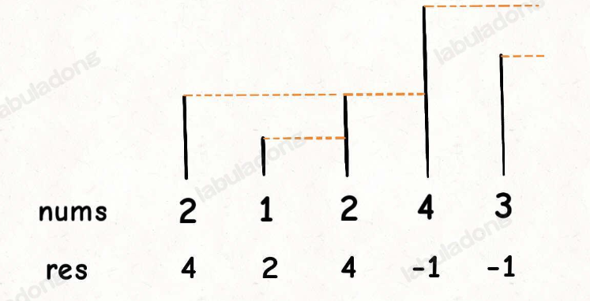
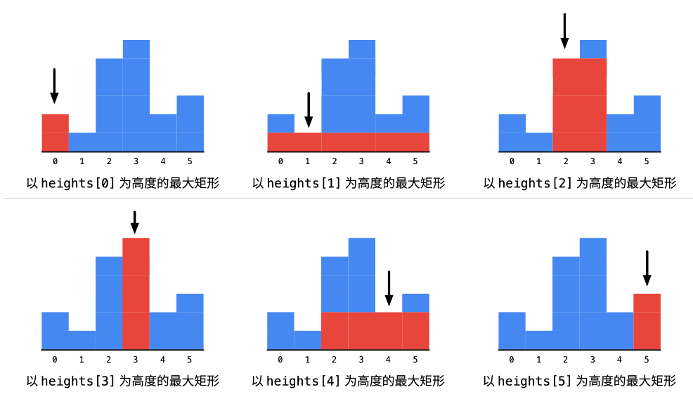

# 单调栈

# 单调栈模板：

题目：输入一个数组，返回一个新的数组，保存的是索引对应的元素的下一个更大元素，没有则返回-1。

例如：nums = [2,1,2,4,3]，返回数组 = [4,2,4,-1,-1]

暴力解法是双层for循环，时间复杂度为O(n^2)



代码如下：

时间复杂度：所有元素都入栈一次，出栈一次，所以为O(N)。

```java
int[] nextGreatElement(int[] nums) {
    int n = nums.length;
    int res = new int[n];
    Deque<Integer> stack = new ArrayDeque<>();
    //倒序遍历
    for (int i = n-1; i >= 0; i -= 1) {
        //此时stack中如果有元素，那么存储的都是在nums[i]后面的元素
        //如果比nums[i]小或等于，则直接出栈
        if (!stack.isEmpty() && stack.peek() <= nums[i]) {
            stack.pop();
        }
        //如果栈空了，说明nums[i]后面没有比它大的数，则返回-1
        //如果栈非空，那么栈顶元素就是后面【第一个】比nums[i]大的元素
        //因为是倒序遍历，且后进先出。
        res[i] = stack.isEmpty() ? -1 : stack.peek();
        stack.push(nums[i]);
    }
    return res;
}
```


A monotonic stack is a stack whose elements are monotonically decreasing or increasing.

If we need to **pop smaller elements** from the stack before pushing a new element, the stack is **decreasing** from bottom to top.

Otherwise, it is **increasing** from bottom to top.

对于一个一维数组，如果想要找到任一元素左边或右边第一个比自己大或小的元素，通常需要用到单调栈。

单调栈通常存放的是元素的下标。

单调栈的本质是用空间换时间，因为在遍历的过程中需要用一个栈来记录右边第一个比当前元素高的元素，优点是只需要遍历一次。

# [LC 739：Daily Temperatures](https://leetcode.com/problems/daily-temperatures/)

这道题实际就是要找到每个元素右边第一个比自己大的元素的下标。

需要一个从栈顶到栈底单调递增的栈。

完整代码如下：

这道题brute force solution就是双层for循环，时间复杂度为O(n^2)

* 时间复杂度：O(n)
* 空间复杂度：O(n)

```java
class Solution {
    public int[] dailyTemperatures(int[] temperatures) {
        int n = temperatures.length;
        //存放最终结果
        int[] res = new int[n];
        //栈内存放元素索引，而不是元素本身
        Deque<Integer> stack = new ArrayDeque<>();
        for (int i = n-1; i >= 0; i -= 1) {
            int num = temperatures[i];
            while (!stack.isEmpty() && temperatures[stack.peek()] <= num) {
                stack.pop();
            }
            //得到索引间距
            res[i] = stack.isEmpty() ? 0: stack.peek()-i;
            stack.push(i);//将索引入栈
        }
        return res;   
    }
}
```


# [LC 496: Next Greater Element I](https://leetcode.com/problems/next-greater-element-i/)

完整代码如下：

```java
class Solution {
    public int[] nextGreaterElement(int[] nums1, int[] nums2) {
        int n1 = nums1.length;
        int n2 = nums2.length;
  
        //初始化存放最终结果的数组
        int[] res = new int[n1];
        Arrays.fill(res, -1);
  
        //预处理数组nums1，即构建哈希表
        Map<Integer, Integer> map = new HashMap<>();
        for (int i = 0; i < n1; i += 1) {
            map.put(nums1[i], i);
        }
  
        Deque<Integer> stack = new LinkedList<>();
        for (int i = 0; i < n2; i += 1) {
            if (stack.isEmpty() || nums2[stack.peek()] >= nums2[i]) {
                stack.push(i);
            } else {
                while (!stack.isEmpty() && nums2[stack.peek()] < nums2[i]) {
                    int target = stack.pop();
                    //收集结果
                    if (map.containsKey(nums2[target])) {
                        res[map.get(nums2[target])] = nums2[i];
                    }
                }
                stack.push(i);
            } 
        }
        return res;
    }
}
```


解法二：

套用labuladong的模板：

```java
class Solution {
    public int[] nextGreaterElement(int[] nums1, int[] nums2) {
        //map映射：元素x -> 元素x对应的下一个更大元素
        Map<Integer, Integer> map = new HashMap<>();
        Deque<Integer> stack = new ArrayDeque<>();
        for (int i = nums2.length-1; i >= 0; i -= 1) {
            while (!stack.isEmpty() && stack.peek() <= nums2[i]) {
                stack.pop();
            }
            int greater = stack.isEmpty() ? -1 : stack.peek();
            map.put(nums2[i], greater);
            stack.push(nums2[i]);
        }
        int[] res = new int[nums1.length];
        for (int i = 0; i < nums1.length; i += 1) {
            res[i] = map.get(nums1[i]);
        }
        return res;   
    }
}
```


# [LC 503: Next Greater Element II](https://leetcode.com/problems/next-greater-element-ii/)

## sol 1: 单调栈

这道题让我想到了lc456。

思路：用单调栈。栈内保存遍历到的数组nums中的元素的下标，从栈底到栈顶的下标对应的nums中的值**单调不增**。

遍历到下标为i的元素时，将当前单调栈中所有在nums中对应的值小于nums[i]的下标弹出，这些下标对应的“next greater element”即为num[i]，因为如果有更靠前的更大元素，这些被弹出的下标早就已经被弹出。单调栈中剩下的就是尚未更新的下标（即还没找到next greater element的）。

细节：

1. 数组nums需要被遍历两次，所以需要对下标i取余数。
2. 因为站内剩下的是还没有找到对应next greater element的下标，可能会有下标一直留在栈内，所以要预先设置答案-1。

完整代码如下：

时间复杂度: O(n)，其中 n 是序列的长度。我们需要遍历该数组中每个元素最多 2 次，每个元素出栈与入栈的总次数也不超过 4 次。

空间复杂度: O(n)，其中 n 是序列的长度。空间复杂度主要取决于栈的大小，栈的大小至多为 2n−1。

```java
class Solution {
    public int[] nextGreaterElements(int[] nums) {
        int n = nums.length;
        int[] res = new int[n];
        Arrays.fill(res, -1);
        Deque<Integer> stack = new ArrayDeque<>();
        for (int i = 0; i < 2*n - 1; i += 1) {
            while (!stack.isEmpty() && nums[i%n] > nums[stack.peek()]) {
                res[stack.pop()] = nums[i%n];
            }
            stack.push(i%n);
        }
        return res;  
    }
}
```


解法2：套用labuladong的模板：


```java
class Solution {
    public int[] nextGreaterElements(int[] nums) {
        int n = nums.length;
        int[] res = new int[n];

        Deque<Integer> stack = new ArrayDeque<>();
        for (int i = 2*n-1; i >= 0; i -= 1) {
            while (!stack.isEmpty() && stack.peek() <= nums[i%n]) {
                stack.pop();
            }
            res[i%n] = stack.isEmpty() ? -1 : stack.peek();
            stack.push(nums[i%n]);
        }
        return res;  
    }
}
```


# [LC 42：Trapping Rain Water](https://leetcode.com/problems/trapping-rain-water/)

## sol 1: 按列求（超时）

思路：遍历每一列。当前列的高度为cur，找到cur左边最高的高度left，右边最高的高度right，

求出左右列中相对较矮的高度记为min，即min = min(height[left], height[right)

只有当min > cur时，当前列上才能有积水。

完整代码如下：

**无法通过最后两个测试用例，超时。**

时间复杂度：O(n²），遍历每一列需要 nn，找出左边最高和右边最高的墙加起来刚好又是一个 n，所以是 n²。

空间复杂度：O(1）。

```java
class Solution {
    public int trap(int[] height) {
        int sum = 0;
        //最左最右两端的列一定不会有积水
        //所以遍历[1:n-2]
        for (int i = 1; i < height.length - 1; i += 1) {
            //找到当前列左边最高的高度
            int left = 0;
            for (int j = i-1; j >= 0; j -= 1) {
                if (height[j] > left) {
                    left = height[j];
                }
            }
            //找到当前列右边最高的高度
            int right = 0;
            for (int j = i+1; j < height.length; j += 1) {
                if (height[j] > right) {
                    right = height[j];
                }
            }
            //找出左右高度中较小的高度
            int min = Math.min(left, right);
            if (min > height[i]) {
                sum += (min-height[i]);
            }
        }
        return sum;
    }
}
```

## sol 2：dp（空间换时间）

sol1的问题在于，每遍历到一列，都要重新求一遍左边最高和右边最高。可以优化一下。

dp思路：

max_left[i]表示第i列左边最高高度

max_right[i]表示第i列右边最高高度

完整代码如下：

时间复杂度：**O**(**n**)。

空间复杂度：**O**(**n**)，用来保存每一列左边最高的墙和右边最高的墙。

```java
class Solution {
    public int trap(int[] height) {
        int n = height.length;
        int sum = 0;
        int[] max_left = new int[n];
        int[] max_right = new int[n];
  
        //得到每一列的左边最高高度
        for (int i = 1; i < n; i += 1) {
            max_left[i] = Math.max(max_left[i-1], height[i-1]);
        }
        //得到每一列的右边最高高度
        for (int i = n-2; i >= 0; i -= 1) {
            max_right[i] = Math.max(max_right[i+1], height[i+1]);
        }
        //最左最右两端的列一定不会有积水
        //所以遍历[1:n-2]
        for (int i = 1; i < height.length - 1; i += 1) {
            //找出左右高度中较小的高度
            int min = Math.min(max_left[i], max_right[i]);
            if (min > height[i]) {
                sum += (min-height[i]);
            }
        }
        return sum;
    }
}
```

## sol 3：双指针法（优化动态规划的空间）

思路：假设有两个指针i和j，分别指向数组的头和尾。

iLeftMax表示i列左边（包括i列）最高高度

iRightMax表示i列右边（包括i列）最高高度

jLeftMax表示j列左边（包括j列）最高高度

jRightMax表示i列右边（包括j列）最高高度

因为i < j，所以有：

iLeftMax <= jLeftMax

iRightMax >= jRightMax

所以当**iLeftMax > jRightMax**时，必然有jLeftMax >= iLeftMax > jRightMax,

即**jLeftMax > jRightMax**，所以对于j列，左右最高高度中相对较小的就是jRightMax（即前文提到过的min）

当**iLeftMax <= jRightMax**时，必然有iRightMax >= jRightMax >= iLeftMax,

即**iRightMax >= iLeftMax**，所以对于i列，左右最高高度中相对较小的就是iLeftMax（即前文提到过的min）

可以看到，实际上只用到了iLeftMax和jRightMax这两个变量，所以只需要维护这两变量即可

完整代码如下：

时间复杂度：O(n)，其中 nn 是数组 \textit{height}height 的长度。两个指针的移动总次数不超过 nn。

空间复杂度：O(1)。只需要使用常数的额外空间。

```java
class Solution {
    public int trap(int[] height) {
        int n = height.length;
        int sum = 0;
  
        //定义两个指针，分别指向数组的头和尾
        int i = 0, j = n - 1;
        //定义两个变量，分别维护i列左边最高高度和j列右边最高高度。
        int iLeftMax = 0, jRightMax = 0;
  
        while (i < j) {
            iLeftMax = Math.max(iLeftMax, height[i]);
            jRightMax = Math.max(jRightMax, height[j]);
            if (iLeftMax > jRightMax) {
                sum += jRightMax - height[j];//不需要判断（jRightMax - height[j]）正负，看求jRightMax公式的定义
                j -= 1;  
            } else {
                sum += iLeftMax - height[i];
                i += 1; 
            }
        }
        return sum;
    }
}
```

# [LC 84: Largest Rectangle in Histogram](https://leetcode.com/problems/largest-rectangle-in-histogram/)

## sol 1: 暴力解法（超时）

思路：遍历每一列，找到以当前列为高度的长方形中，宽度最大的。看图



要分别找到左边界和右边界。

完整代码如下：

* 时间复杂度：O(N^2)**，这里 N**是输入数组的长度。
* 空间复杂度：O(1)。

```java
class Solution {
    public int largestRectangleArea(int[] heights) {
        int n = heights.length;
        int res = 0;
  
        for (int i = 0; i < n; i += 1) {
            //找到左边界
            int left = i;
            int curHeight = heights[i];
            while (left > 0 && heights[left-1] >= curHeight) {
                left -= 1; 
            }
      
            //找到右边界
            int right = i;
            while (right < n-1 && heights[right+1] >= curHeight) {
                right += 1;
            }
      
            int width = right - left + 1;
            res = Math.max(res, width*curHeight);
        }
        return res;  
    }
}
```

## sol 2: 用栈（用空间换时间）

这道题的基本思路就是：遍历所有高度，以当前高度为基准，寻找最大的宽度，即找到当前高度的**左边**第一个小于当前高度的下标left，找到当前高度的**右边**第一个小于当前高度的下标right，那么最大宽度即为right - left - 1。

运用单调栈：当前遍历到的i对应的高度 < 栈顶元素对应的高度，那么栈顶元素出栈，对应的高度即为“当前高度”，当前遍历到的i就是“当前高度”要找的right，此时的栈顶元素对应的高度就是“当前高度”要找的left。

所以这是一个从栈顶到栈地**单调不减**的单调栈。

为了避免出现空栈的情况，就需要在原数组首尾各加一个零。

完整代码如下：

* 时间复杂度：**O**(**N**)，输入数组里的每一个元素入栈一次，出栈一次。
* 空间复杂度：**O**(**N**)，栈的空间最多为 **N**。

```java
class Solution {
    public int largestRectangleArea(int[] heights) {
        int n = heights.length;
        //原数组首尾各加一个零
        int[] newHeights = new int[n+2];
        newHeights[0] = 0;
        System.arraycopy(heights, 0, newHeights, 1, n);
        newHeights[n+1] = 0;
    
        heights = newHeights;
        n = n + 2;
    
        int res = 0;
    
        Deque<Integer> stack = new ArrayDeque<>();
        stack.push(0);
    
        for (int i = 1; i < n; i += 1) {
            while (heights[i] < heights[stack.peek()]) {
                int curHeight = heights[stack.pop()];
                int curWidth = i - stack.peek() - 1;
                res = Math.max(res, curHeight*curWidth);  
            }
            stack.push(i);
        }
        return res;  
    }
}
```

ddd
