# 链表

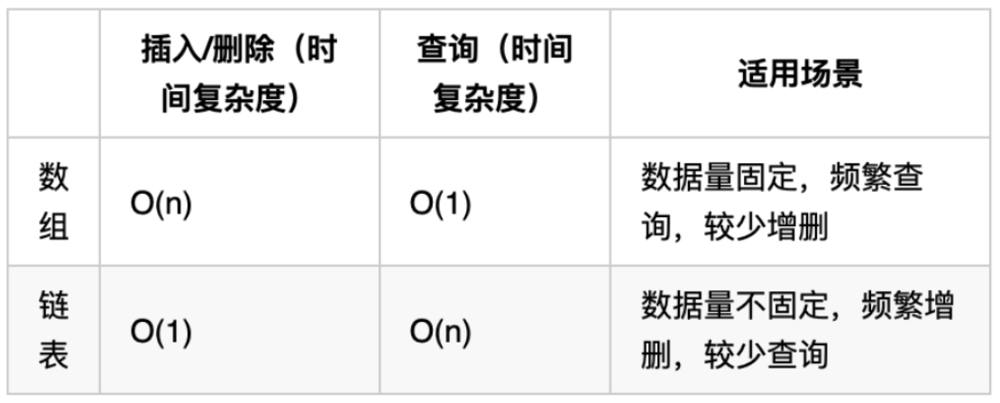

手写链表

```java
publid class ListNode {
	int val;
	ListNode next;

	//节点构造函数（无参数）
	public ListNode() {
	}

	//节点构造函数（一个参数）
	public ListNode(int val) {
		this.val = val;
	}

    //节点构造函数（两个参数）
	public ListNode(int val, ListNode next) {
		this.val = val;
		this.next = next;
	}
}
```

# 删除

# [LC 203: Remove Linked List Elements](https://leetcode.com/problems/remove-linked-list-elements/)

完整代码如下：

时间复杂度：O(N)

空间复杂度：O(1)

```java
class Solution {
    public ListNode removeElements(ListNode head, int val) {
        ListNode dummy = new ListNode();
        dummy.next = head;
        ListNode p = dummy;
  
        while (p.next != null) {
            if (p.next.val == val) {
                p.next = p.next.next;
            } else {
                p = p.next;
            }
        }
        return dummy.next; 
    }
}
```

# [LC 19: Remove Nth Node From End of List](https://leetcode.com/problems/remove-nth-node-from-end-of-list/)

## sol 1: 先计算链表长度

完整代码如下：

```java
class Solution {
    public ListNode removeNthFromEnd(ListNode head, int n) {
        //要移除的可能是头节点，所以需要设置虚拟头节点
        ListNode dummy = new ListNode();
        dummy.next = head;
        int length = getLength(head);
        ListNode p = dummy;
        for (int i = 0; i < length-n; i += 1) {
            p = p.next;
        }
        p.next = p.next.next;
        return dummy.next;   
    }

    //返回以head为头节点的链表的长度
    private int getLength(ListNode head) {
        if (head == null) return 0;
        ListNode p = head;
        int res = 0;
        while (p != null) {
            p = p.next;
            res++;
        }
        return res;
    }
}
```

## sol 2: 双指针

代码如下：

时间复杂度：O(N)。N表示链表的长度。

空间复杂度：O(1)。

```java
class Solution {
    public ListNode removeNthFromEnd(ListNode head, int n) {
        //要移除的可能是头节点，所以需要设置虚拟头节点
        ListNode dummy = new ListNode();
        dummy.next = head;
        //先找到倒数第（n+1）个节点
        ListNode x = findLastK(dummy, n+1);
        x.next = x.next.next;
        return dummy.next;   
    }

    //返回以head为头节点的链表中的倒数第k个节点
    private ListNode findLastK(ListNode head, int k) {
        ListNode p1 = head;
        for (int i = 0; i < k; i += 1) {
            p1 = p1.next;
        }
        ListNode p2 = head;
        while (p1 != null) {
            p1 = p1.next;
            p2 = p2.next;
        }
        return p2;
    }
}
```

# LC 82:Remove Duplicates from Sorted List II

## sol 1: 递归

递归函数定义：删除以head头节点的链表中的重复节点，并返回head

代码如下：

* 时间复杂度：**O**(**N**)，每个节点访问了一次。
* 空间复杂度：**O**(**N**)，递归调用的时候会用到了系统的栈。

```java
class Solution {
    public ListNode deleteDuplicates(ListNode head) {
        //base case
        if (head == null || head.next == null) return head;

        if (head.val != head.next.val) {
            head.next = deleteDuplicates(head.next);
            return head;
        } else {
            ListNode p = head;
            while (p != null && p.val == head.val) {
                p = p.next;
            }
            return deleteDuplicates(p);
        } 
    }
}
```

## sol 2：迭代

代码如下：

* 时间复杂度：**O**(**N**)，对链表每个节点遍历了一次；
* 空间复杂度：**O**(**1**)，只使用了常量的空间。

```java
class Solution {
    public ListNode deleteDuplicates(ListNode head) {
        if (head == null || head.next == null) return head;
        ListNode dummy = new ListNode(-1, head);
        ListNode pre = dummy, cur = head;
        while (cur != null) {
            //退出循环时，cur指向重复节点的最后一个
            while (cur.next != null && cur.val == cur.next.val) {
                cur = cur.next;
            }
            //pre和cur之间没有重复节点，则pre指针朝前移动
            if (pre.next == cur) {
                pre = pre.next;
            //pre->next指向cur的下一个位置（相当于跳过了当前的重复元素）
            //但是pre不移动，仍然指向已经遍历的链表结尾
            } else {
                pre.next = cur.next;
            }
            cur = cur.next;
        } 
        return dummy.next; 
    }
}
```

# [LC 707: Design Linked List](https://leetcode.com/problems/design-linked-list/)

单链表：

完整代码如下：

```java
class MyLinkedList {
    class ListNode {
        int val;
        ListNode next;
        ListNode() {};
        ListNode(int val) {
            this.val = val;
        }
    }
  
    int size;
    ListNode sentinel;

    public MyLinkedList() {
        size = 0;
        sentinel = new ListNode(0);
  
    }
  
    public int get(int index) {
        if (index < 0 || index >= size) {
            return -1;
        }
        ListNode p = sentinel;
        for (int i = 0; i <= index; i += 1) {
            p = p.next;
        }
        return p.val; 
    }
  
    public void addAtHead(int val) {
        addAtIndex(0, val);
    }
  
    public void addAtTail(int val) {
        addAtIndex(size, val);
    }
  
    public void addAtIndex(int index, int val) {
        if (index > size) {
            return;
        }
        if (index < 0) {
            index = 0;
        }
  
        size += 1;
  
        ListNode p = sentinel;
        for (int i = 0; i < index; i += 1) {
            p = p.next;
        }
        ListNode newNode = new ListNode(val);
        newNode.next = p.next;
        p.next = newNode;
    }
  
    //这个写的时候容易出错，比如要单独考虑index == 0
    public void deleteAtIndex(int index) {
        if (index < 0 || index >= size) {
            return;
        }
  
        size -= 1;
  
        if (index == 0) {
            sentinel = sentinel.next;
            return;
        }
        ListNode p = sentinel;
        for (int i = 0; i < index; i += 1) {
            p = p.next;
        }
        p.next = p.next.next; 
    }
}
```


双链表：

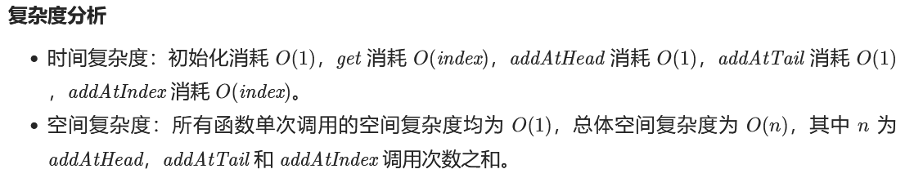

```java
class MyLinkedList {
    class Node {
        int val;
        Node prev;
        Node next;

        public Node() {};
        public Node(int val) {
            this.val = val;
        }
    }

    private Node head;
    private Node tail;
    private int size;

    public MyLinkedList() {
        head = new Node();
        tail = new Node();
        head.next = tail;
        tail.prev = head;
        size = 0;  
    }
  
    public int get(int index) {
        if (index < 0 || index >= size) return -1;
        Node p = head;
        for (int i = 0; i < index+1; i += 1) {
            p = p.next;
        }
        return p.val;
    }
  
    public void addAtHead(int val) {
        Node newNode = new Node(val);
        newNode.next = head.next;
        newNode.prev = head;
        head.next.prev = newNode;
        head.next = newNode;
        size++;
    }
  
    public void addAtTail(int val) {
        Node newNode = new Node(val);
        newNode.next = tail;
        newNode.prev = tail.prev;
        tail.prev.next = newNode;
        tail.prev = newNode;
        size++;
    }
  
    public void addAtIndex(int index, int val) {
        if (index > size) return;
        if (index <= 0) {
            addAtHead(val);
        } else if (index == size) {
            addAtTail(val);
        } else {
            Node node = head.next;
            for (int i = 0; i < index; i += 1) {
                node = node.next;
            }
            Node newNode = new Node(val);
            newNode.next = node;
            newNode.prev = node.prev;
            node.prev.next = newNode;
            node.prev = newNode;
            size++;
        }  
    }
  
    public void deleteAtIndex(int index) {
        if (index >= size) return;
        Node node = head;
        for (int i = 0; i < index+1; i += 1) {
            node = node.next;
        }
        node.prev.next = node.next;
        node.next.prev = node.prev;
        size--;
    }
}
```


# 翻转

# [LC 206: Reverse Linked List](https://leetcode.com/problems/reverse-linked-list/)

## sol 1: 迭代

图解：

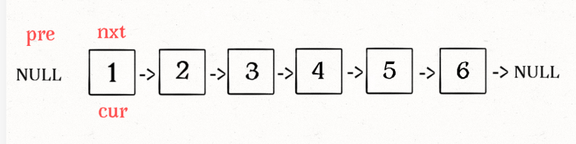

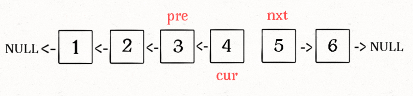

完整代码如下：

* 时间复杂度：**O**(**n**)，其中 **n** 是链表的长度。需要遍历链表一次。
* 空间复杂度：**O**(**1**)。

```java
class Solution {
    public ListNode reverseList(ListNode head) {
        if (head == null || head.next == null) {
            return head;
        }
  
        ListNode pre = null;
        ListNode cur = head;
  
        while (cur != null) {
            ListNode temp = cur.next;
            cur.next = pre;
            pre = cur;
            cur = temp;
        }
        return pre;  
    }
}
```

## sol 2：递归

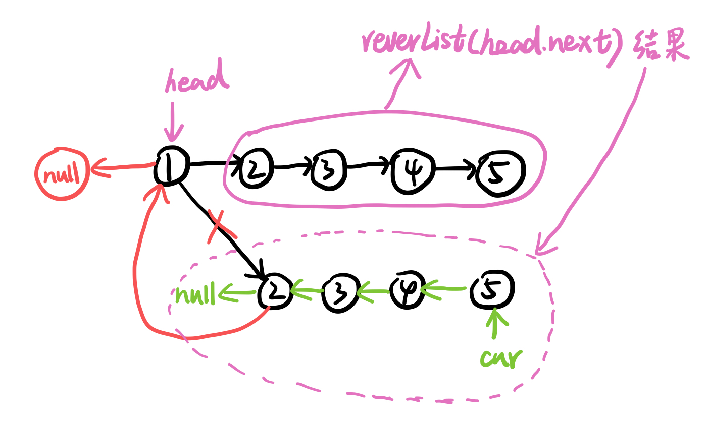

代码如下：

时间复杂度：O(n)，其中 n 是链表的长度。需要对链表的每个节点进行反转操作。

空间复杂度：O(n)，其中 n 是链表的长度。空间复杂度主要取决于递归调用的栈空间，最多为 n 层。

```java
class Solution {
    public ListNode reverseList(ListNode head) {
        if (head == null || head.next == null) return head;

        ListNode cur = reverseList(head.next);
        head.next.next = head;
        head.next = null;
        return cur;  
    }
}
```

# LC 92：Reverse Linked List II

## sol 1：头插法

图解：

pre: **永远**指向待反转区域（图中灰色方框部分）的前一个节点

cur：**永远**指向待反转区域的第一个节点（即left指向的节点）

pre和cur指向的节点始终是不变的

temp：永远指向left的后一个节点

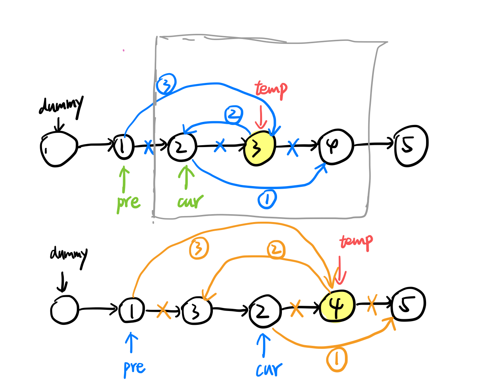

代码如下：

* 时间复杂度：**O**(**N**)，其中 **N** 是链表总节点数。最多只遍历了链表一次，就完成了反转。
* 空间复杂度：**O**(**1**)。只使用到常数个变量

```java
class Solution {
    public ListNode reverseBetween(ListNode head, int left, int right) {
        ListNode dummy = new ListNode(0, head);
        ListNode pre = dummy, cur = head;
        for (int i = 0; i < left-1; i += 1) {
            pre = pre.next;
            cur = cur.next;
        }
        for (int j = 0; j < right-left; j += 1) {
            ListNode temp = cur.next;
            cur.next = temp.next;
            temp.next = pre.next;
            pre.next = temp;
        }
        return dummy.next;  
    }
}
```

# LC 25：Reverse Nodes in k-Group

## sol 1：递归

思路：

1、子问题：翻转前k个节点，对第k+1个节点进行递归。

2、base case：如果链表长度不足k个，直接返回链表头节点。

关于翻转前k个节点，可以理解为翻转节点a和b（不包括b）之间的节点

图解：

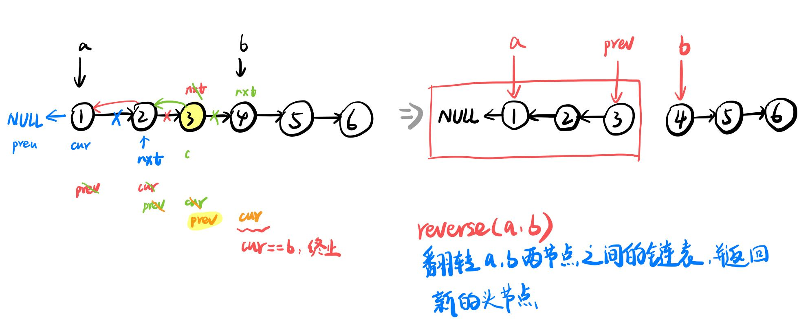

代码如下：

自己分析：

时间复杂度：O(N)。其中N是链表的长度。

空间复杂度：O(N)。递归栈

```java
class Solution {
    public ListNode reverseKGroup(ListNode head, int k) {
        if (head == null) return null;
        ListNode a = head, b = head;
        for (int i = 0; i < k; i += 1) {
            //base case:当链表长度不足k个时，无需翻转
            if (b == null) return a;
            b = b.next;
        }
        //先翻转前k个节点
        ListNode newHead = reverse(a, b);
        a.next = reverseKGroup(b, k);
        return newHead;
    }
    //翻转节点a和b（不包括）之间的链表，并返回新的头节点
    private ListNode reverse(ListNode a, ListNode b) {
        ListNode pre = null, cur = a;
        while (cur != b) {
            ListNode temp = cur.next;
            cur.next = pre;
            pre = cur;
            cur = temp;
        }
        return pre;
    }
}
```

## sol 2：迭代

follow-up：要求solve the problem in `O(1)` extra memory space

图解：

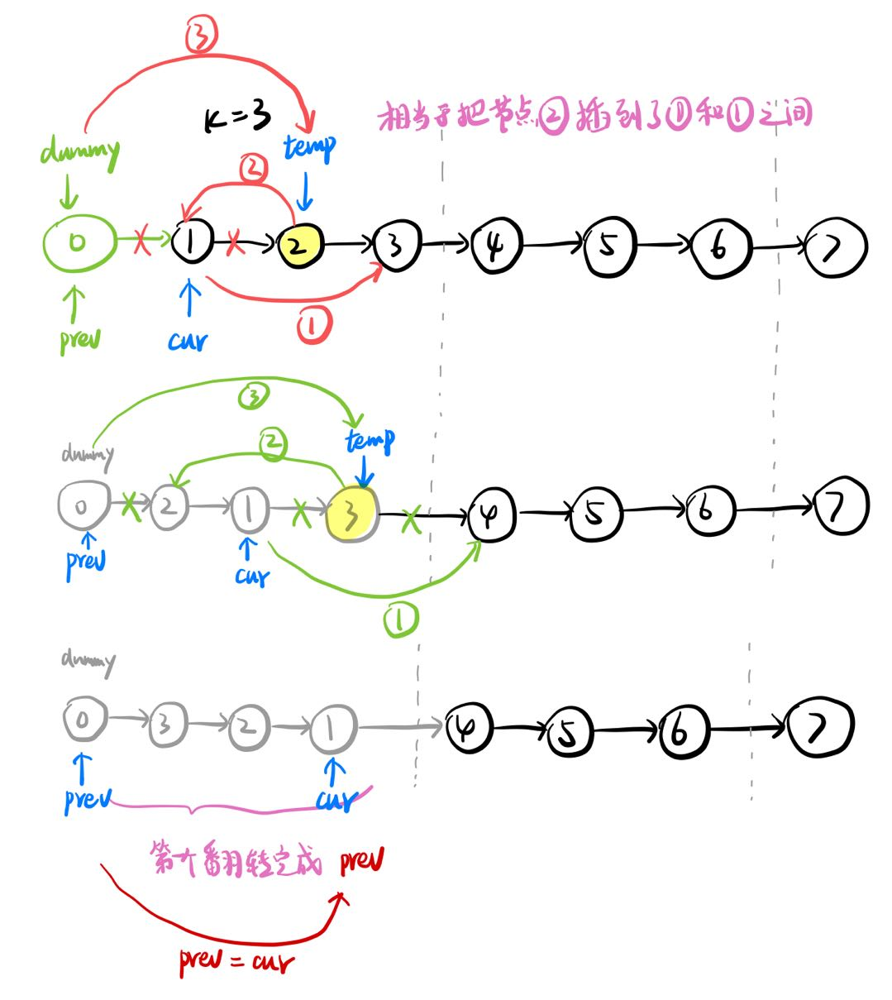

代码如下：

```java
class Solution {
    public ListNode reverseKGroup(ListNode head, int k) {
        ListNode dummy = new ListNode(-1, head);
        ListNode pre = dummy;
        while (true) {
            //设置指针p从pre走k步，看剩余节点是否有k个，没有则直接返回
            ListNode p = pre;
            for (int i = 0; i < k; i += 1) {
                p = p.next;
                if (p == null) {
                    return dummy.next;
                }
            }
            //头插法翻转链表
            ListNode cur = pre.next;
            for (int j = 0; j < k-1; j += 1) {
                ListNode temp = cur.next;
                cur.next = temp.next;
                temp.next = pre.next;
                pre.next = temp;
            }
            pre = cur;
        } 
    }
}
```

# LC 2：Add Two Numbers

## sol 1：模拟

这道题画图时最好举一个两条链表长度不同的。

这题就属于，看代码觉得挺简单，自己想就写不出来

代码如下：

时间复杂度：O(max⁡(m,n))，其中 m 和 n 分别为两个链表的长度。我们要遍历两个链表的全部位置，而处理每个位置只需要 O(1) 的时间。

空间复杂度：O(1)。注意返回值不计入空间复杂度。

```java
class Solution {
    public ListNode addTwoNumbers(ListNode l1, ListNode l2) {
        ListNode p1 = l1, p2 = l2;
        ListNode dummy = new ListNode();
        ListNode p = dummy;
        int carry = 0;
        while (p1 != null || p2 != null || carry != 0) {
            if (p1 != null) {
                carry += p1.val;
                p1 = p1.next;
            }
            if (p2 != null) {
                carry += p2.val;
                p2 = p2.next;
            }
            int digit = carry%10;
            carry = carry/10;
            p.next = new ListNode(digit, null);
            p = p.next;
        }
        return dummy.next;   
    }
}
```

# LC 445：Add Two Numbers II

## sol 1：用栈

代码如下：

时间复杂度：O(max⁡(m,n))，其中 m 和 n 分别为两个链表的长度。我们需要遍历两个链表的全部位置，而处理每个位置只需要 O(1)的时间。

空间复杂度：O(m+n)，其中 m 和 n 分别为两个链表的长度。空间复杂度主要取决于我们把链表内容放入栈中所用的空间。

```java
class Solution {
    public ListNode addTwoNumbers(ListNode l1, ListNode l2) {
        //先把链表装进栈
        Deque<ListNode> s1 = new ArrayDeque<>();
        Deque<ListNode> s2 = new ArrayDeque<>();
        ListNode p1 = l1, p2 = l2;
        while (p1 != null) {
            s1.push(p1);
            p1 = p1.next;
        }
        while (p2 != null) {
            s2.push(p2);
            p2 = p2.next;
        }
        int sum = 0;
        ListNode res = null;
        while (sum != 0 || !s1.isEmpty() || !s2.isEmpty()) {
            if (!s1.isEmpty()) {
                sum += s1.pop().val;
            }
            if (!s2.isEmpty()) {
                sum += s2.pop().val;
            }
            ListNode newNode = new ListNode(sum%10);
            sum = sum/10;
            newNode.next = res;
            res = newNode;
        }
        return res;
    }
}


```

# LC 143：Reorder List

思路：

快慢指针找到后半部分，并翻转

合并前半部分和后半部分链表

代码如下：

```java
class Solution {
    public void reorderList(ListNode head) {
        //快慢指针找到中点
        ListNode slow = head, fast = head;
        while (fast != null && fast.next != null) {
            slow = slow.next;
            fast = fast.next.next;
        }
        //翻转后半部分
        ListNode second = slow.next;
        slow.next = null;
        ListNode pre = null;

        while (second != null) {
            ListNode temp = second.next;
            second.next = pre;
            pre = second;
            second = temp;
        }
        //merge两条链表
        ListNode p1 = head, p2 = pre;
        while (p2 != null) {
            ListNode temp1 = p1.next, temp2 = p2.next;
            p1.next = p2;
            p2.next = temp1;
            p1 = temp1;
            p2 = temp2;
        }   
    }
}
```

# [LC 24: Swap Nodes in Pairs](https://leetcode.com/problems/swap-nodes-in-pairs/)

思路：

1、设置一个虚拟头结点

2、设置两个指针prev和head

初始时prev = dummy，head就是题目中给的head

3、要把head.next放到prev和head之间，分三步完成（看图）

关键是第二步的实现：`head.next.next = head`

4、更新指针位置

5、注意while循环终止条件，需要考虑结点个数的奇偶性，奇偶性不同，终止条件不同。

看图：

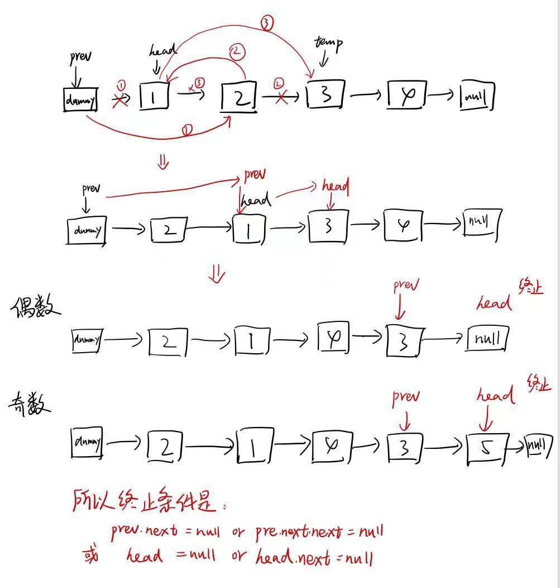

完整代码如下：

* 时间复杂度：O(n)
* 空间复杂度：O(1)

```java
class Solution {
    public ListNode swapPairs(ListNode head) {
        ListNode dummy = new ListNode();
        dummy.next = head;
        ListNode prev = dummy;
        //循环终止条件要考虑链表长度的奇偶性
        while (head != null && head.next != null) {
            ListNode temp = head.next.next;
            prev.next = head.next;//第一步
            prev.next.next = head;//第二步
            head.next = temp;//第三步
            //更新指针pre和head
            prev = head;
            head = head.next;
        }
        return dummy.next;
    }
}
```

# * 找到链表的【倒数】第K个节点

常规做法：先遍历一遍链表，找到链表的长度为n，然后重新从head节点出发，遍历到底(n-k+1)个节点，即为所求。

遍历一遍的做法：

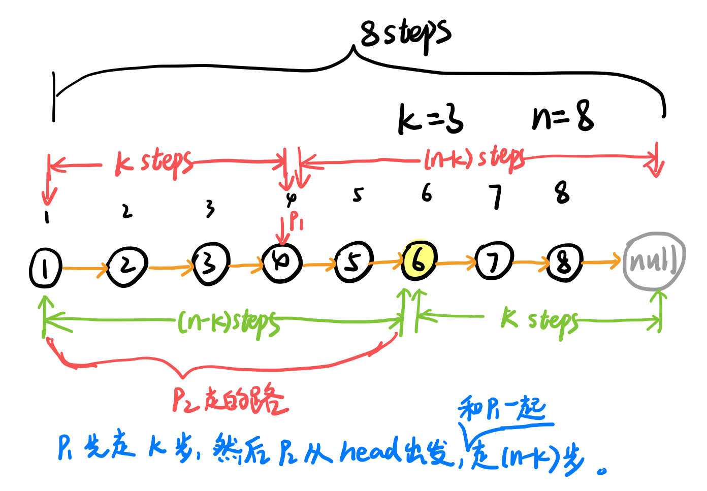

代码如下：

```java
// 返回链表的倒数第 k 个节点
ListNode findFromEnd(ListNode head, int k) {
    ListNode p1 = head;
    // p1 先走 k 步
    for (int i = 0; i < k; i++) {
        p1 = p1.next;
    }
    ListNode p2 = head;
    // p1 和 p2 同时走 n - k 步
    while (p1 != null) {
        p2 = p2.next;
        p1 = p1.next;
    }
    // p2 现在指向第 n - k + 1 个节点，即倒数第 k 个节点
    return p2;
}

```

# [LC 160: Intersection of Two Linked Lists](https://leetcode.com/problems/intersection-of-two-linked-lists/)

思路：

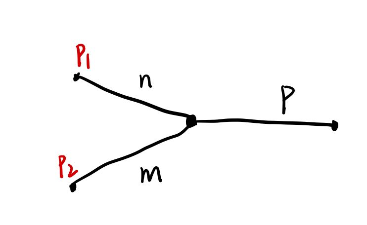

指针 `p1`前进路线：`n → p → m`

指针 `p2`前进路线：`m → p → n`

因为 `n + p + m = m + p + n`,所以如果相交，则最后 `p1`、`p2`在相交点相遇，如果不相交，`p1 = p2 = null`.

完整代码如下：

空间复杂度为 `O(1)`，时间复杂度为 `O(N)`。

```java
public class Solution {
    public ListNode getIntersectionNode(ListNode headA, ListNode headB) {
        ListNode p1 = headA;
        ListNode p2 = headB;
  
        while (p1 != p2) {
            if (p1 == null) {
                p1 = headB;
            } else {
                p1 = p1.next;
            }
  
            if (p2 == null) {
                p2 = headA;
            } else {
                p2 = p2.next;
            }
        }
        return p1;
    }
}
```

12/21/22 update:

如下这么写居然超时：

```java
public class Solution {
    public ListNode getIntersectionNode(ListNode headA, ListNode headB) {
        ListNode p1 = headA;
        ListNode p2 = headB;
        while (p1 != p2) {
            p1 = p1.next;
            p2 = p2.next;
            if (p1 == null) {
                p1 = headB;
            }
            if (p2 == null) {
                p2 = headA;
            }
        }
        return p1;
    }
}
```

# *判断链表是否成环

# LC 141：Linked List Cycle

快慢指针法，如果快指针和慢指针能够相遇，说明成环。

```java
boolean hasCycle(ListNode head) {
    // 快慢指针初始化指向 head
    ListNode slow = head, fast = head;
    // 快指针走到末尾时停止
    while (fast != null && fast.next != null) {
        // 慢指针走一步，快指针走两步
        slow = slow.next;
        fast = fast.next.next;
        // 快慢指针相遇，说明含有环
        if (slow == fast) {
            return true;
        }
    }
    // 不包含环
    return false;
}

```

# [LC 142: Linked List Cycle II](https://leetcode.com/problems/linked-list-cycle-ii/)

思路：

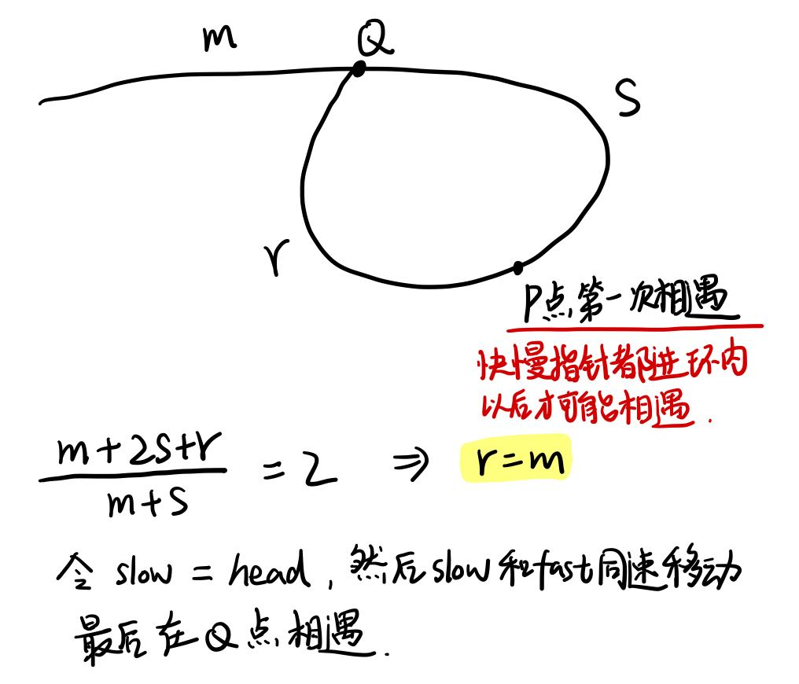

完整代码如下：

```java
public class Solution {
    public ListNode detectCycle(ListNode head) {
        ListNode slow = head;
        ListNode fast = head;
        //情况一：有circle，那么快慢指针一定会相遇，此时fast == slow。
        //情况二：没有circle，那么当fast == null or fast.next == null时退出循环。
        while (fast != null && fast.next != null) {
            slow = slow.next;
            fast = fast.next.next;
            if (slow == fast) {
                break;
            }
        }
  
        //如果退出循环时fast == null or fast.next == null，说明是第一种情况
        //说明无circle，则返回null
        if (fast == null || fast.next == null) {
            return null;
        }
  
        //如果代码执行到这里，说明有circle，此时fast == slow，快慢指针在环内相遇
        //将慢指针reset为head，两个指针开始同速移动，最后会在targetNode相遇
        slow = head;
        while (slow != fast) {
            slow = slow.next;
            fast = fast.next;
        }
        return slow;   
    }
}
```

# 多路归并问题

# [LC 23：Merge k Sorted Lists](https://leetcode.com/problems/merge-k-sorted-lists/description/)

## sol 1：用优先队列（小根堆）

图解：

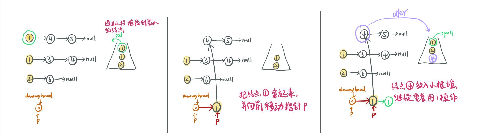

完整代码如下：

时间复杂度：O(nlogk)。根堆中元素个数不超过k个，所以插入和删除的时间复杂度为O(logK)。n表示所有链表的节点总数。

空间复杂度：O(k)。使用了优先队列。

```java
class Solution {
    public ListNode mergeKLists(ListNode[] lists) {
        if (lists.length == 0) {
            return null;
        }

        //小根堆
        PriorityQueue<ListNode> pq = new PriorityQueue<>((node1, node2)-> {
            return node1.val - node2.val;
        });
        //初始化：将k个链表放进堆里
        for (ListNode node: lists) {
            if (node != null) {//注意：堆中只存放非空节点
                pq.offer(node);
            }
        }
        //设置最终合并后的链表的头结点
        ListNode dummyHead = new ListNode(0);
        //移动的指针
        ListNode p = dummyHead;

        while (!pq.isEmpty()) {
            ListNode minNode = pq.poll();
            p.next = minNode;
            p = p.next;
            if (minNode.next != null) {
                pq.offer(minNode.next);
            }
        }
        return dummyHead.next;  
    }
}
```

# LC 21：Merge Two Sorted Lists

## sol 1：迭代

代码如下：

时间复杂度：O(N+M)。M和N是两个链表的长度。

空间复杂度：O(1)。

```java
class Solution {
    public ListNode mergeTwoLists(ListNode list1, ListNode list2) {
        ListNode dummy = new ListNode();
        ListNode tail = dummy;
        ListNode p1 = list1;
        ListNode p2 = list2;
        while (p1 != null || p2 != null) {
            if (p1 == null) {
                tail.next = p2;
                break;
            } else if (p2 == null) {
                tail.next = p1;
                break;
            } else if (p1.val > p2.val) {
                tail.next = p2;
                p2 = p2.next;
                tail = tail.next;
            } else {
                tail.next = p1;
                p1 = p1.next;
                tail = tail.next;
            }
        }
        return dummy.next; 
    }
}
```

## sol 2：递归

代码如下：

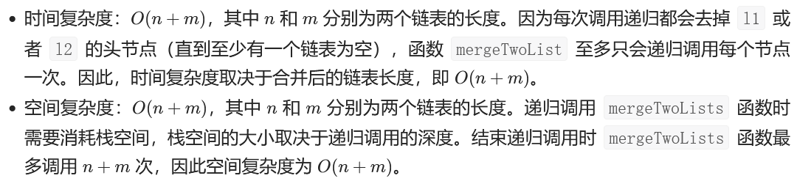

```java
class Solution {
    public ListNode mergeTwoLists(ListNode list1, ListNode list2) {
        if (list1 == null) {
            return list2;
        } else if (list2 == null) {
            return list1;
        } else if (list1.val > list2.val) {
            list2.next = mergeTwoLists(list2.next, list1);
            return list2;
        } else {
            list1.next = mergeTwoLists(list1.next, list2);
            return list1;
        } 
    }
}
```

# LC 86：Partition List

代码如下：

时间复杂度：O(N)。每个节点遍历一次。

空间复杂度：O(1)。

```java
class Solution {
    public ListNode partition(ListNode head, int x) {
        //存放小于x的节点的链表 的虚拟头节点
        ListNode dummy1 = new ListNode();
        //存放大于等于x的节点的链表 的虚拟头节点
        ListNode dummy2 = new ListNode();
        ListNode tail1 = dummy1;
        ListNode tail2 = dummy2;
        ListNode p = head;
        while (p != null) {
            if (p.val >= x) {
                tail2.next = p;
                tail2 = tail2.next;
            } else {
                tail1.next = p;
                tail1 = tail1.next;
            }
            p = p.next;
        }
        tail2.next = null;//这步很重要，不然可能形成环
        tail1.next = dummy2.next;
        return dummy1.next;
    }
}
```

# *找到链表的【中点】

## 找法1：

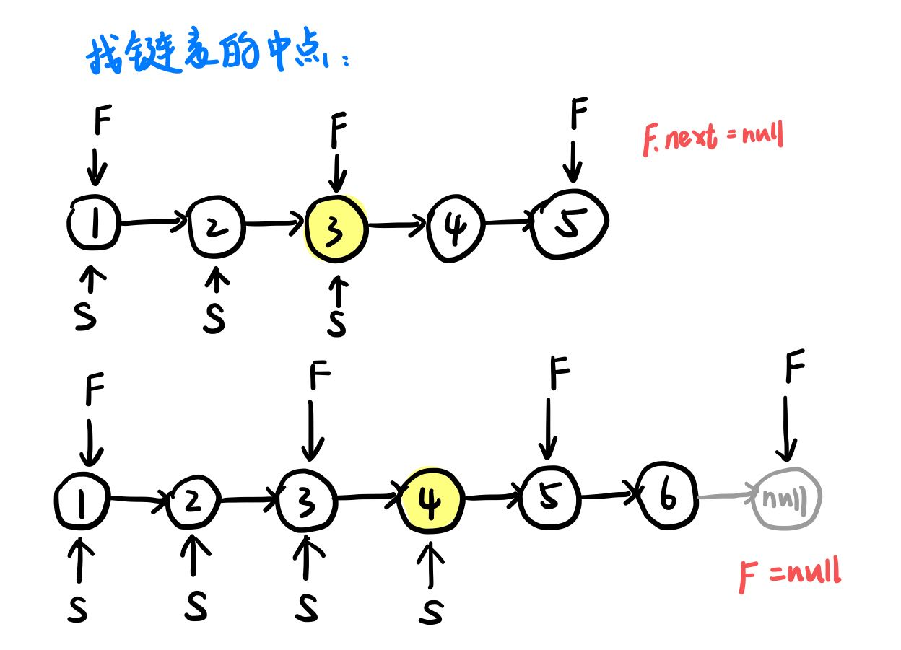

## 找法2：

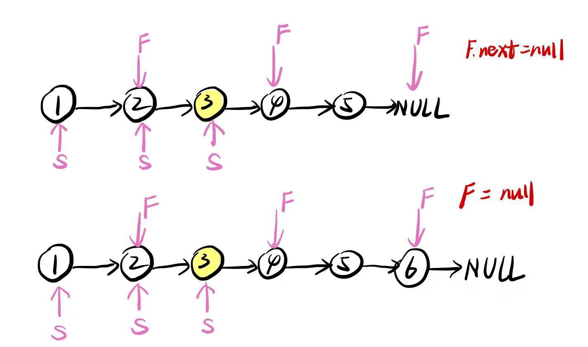

# LC876：Middle of the Linked List

代码如下：

```java
class Solution {
    public ListNode middleNode(ListNode head) {
        if (head == null) return null;
        ListNode s = head;
        ListNode f = head;
        while (f != null && f.next != null) {
            s = s.next;
            f = f.next.next;
        }
        return s;
    }
}
```

# LC 234 ：Palindrome Linked List

## sol 1：递归：双指针

链表也可以有前序遍历和后序遍历

后序遍历的结果就是链表的翻转

```java
void traverse(ListNode head) {
    // 前序遍历代码
    traverse(head.next);
    // 后序遍历代码
}
```

判断一个字符串是否是回文字符串的常规做法就是，左右指针向中间收缩，判断left.val是否等于right.val。

利用链表的后序遍历，在后序遍历位置，可以获得right.val,再设置一个left指针，于是在后序遍历位置比较left.val和right.val即可。

代码如下：

```java
class Solution {
    ListNode left;
    public boolean isPalindrome(ListNode head) {
        left = head;
        return traverse(head);
    }

    private boolean traverse(ListNode right) {
        if (right == null) return true;
        boolean res = traverse(right.next);
        //后序遍历位置，right就代表当前节点
        res = res && left.val == right.val;
        left = left.next;
        return res;
    }
}
```

## sol 2: 迭代

follow-up：do it in `O(n)` time and `O(1)` space

图解：

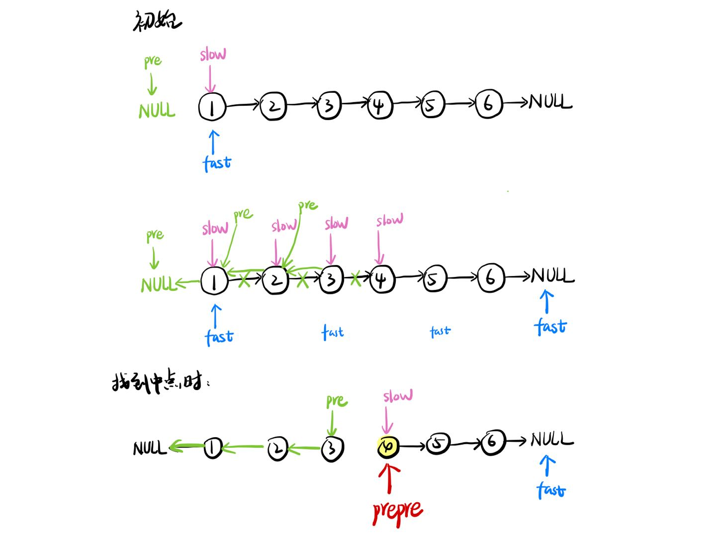

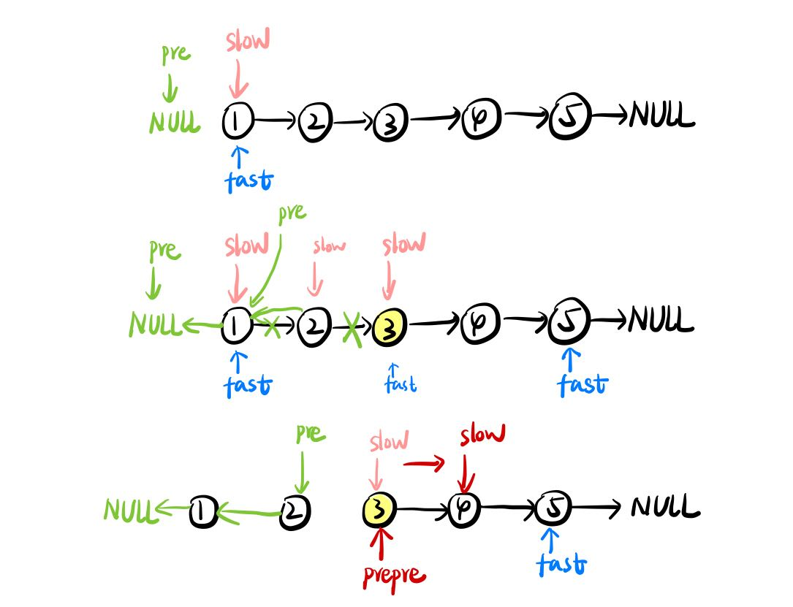

代码如下：

```java
class Solution {
    public boolean isPalindrome(ListNode head) {
        ListNode slow = head, fast = head, pre = null;
        while (fast != null && fast.next != null) {
            fast = fast.next.next;
            //翻转前半部分链表(头插法)
            ListNode temp = slow.next;
            slow.next = pre;
            pre = slow;
            slow = temp;
        }
        //将前半部分链表翻转回去的时候需要用到
        ListNode prepre = slow;
        //如果链表长度为奇数，还要再移动一步
        if (fast != null) {
            slow = slow.next;
        }
        //开始边判断是否是回文，边将前半部分链表再翻转回去
        boolean isPalindrome = true;
        while (pre != null) {
            //判断是否是回文链表
            if (pre.val != slow.val) {
                isPalindrome = false;
            }

            slow = slow.next;

            //翻转链表
            ListNode temp = pre.next;
            pre.next = prepre;
            prepre = pre;
            pre = temp;
        }
        return isPalindrome;   
    }
}
```

# LC 328：Odd Even Linked List

代码如下：

时间复杂度：O(N)

空间复杂度：O(1)

```java
class Solution {
    public ListNode oddEvenList(ListNode head) {
        ListNode dummy1 = new ListNode();
        ListNode dummy2 = new ListNode();
        ListNode tail1 = dummy1, tail2 = dummy2;
        ListNode p = head;
        int index = 1;
        while (p != null) {
            if (index%2 == 1) {
                tail1.next = p;
                tail1 = tail1.next;
            } else {
                tail2.next = p;
                tail2 = tail2.next;
            }
            index++;
            p = p.next;
        }
        if (tail2.next != null) {
            tail2.next = null;
        }
        tail1.next = dummy2.next;
        return dummy1.next;  
    }
}
```

# [LC 138：Copy List with Random Pointer](https://leetcode.com/problems/copy-list-with-random-pointer/description/)

思路：

最重要的思路就是要用到hash map。大致思路我是想到了的，但是在用hash map的时候，不知道要如何一一对应，最开始想的是node.val: node.copy，但是又想那node.val不具有唯一性，所以就被卡住了。

实际上就是**node.original: node.copy**即可。

两个while loop：第一个用于建立hash map；第二个用于补充next pointer和random pointer。

完整代码如下：

```java
class Solution {
    public Node copyRandomList(Node head) {
        Map<Node, Node> originalToCopy = new HashMap<>();
        originalToCopy.put(null, null);
        Node p = head;
        while (p != null) {
            Node copy = new Node(p.val);
            originalToCopy.put(p, copy);
            p = p.next;
        }

        p = head;
        while (p != null) {
            Node copy = originalToCopy.get(p);
            copy.next = originalToCopy.get(p.next);
            copy.random = originalToCopy.get(p.random);
            p = p.next;
        } 
        return originalToCopy.get(head);  
    }
}
```

# LC 716：Max Stack

## sol1：双向链表+红黑树

代码如下：

```java
class MaxStack {
    DLList ddl;
    TreeMap<Integer, List<Node>> map;

    public MaxStack() {
        ddl = new DLList();
        map = new TreeMap<>();  
    }
  
    public void push(int x) {
        Node newNode = new Node(x);
        ddl.addTop(newNode);

        map.putIfAbsent(x, new ArrayList<>());
        map.get(x).add(newNode);
  
    }
  
    public int pop() {
        int topVal = top();
        ddl.deleteTop();
        List<Node> nodes = map.get(topVal);
        nodes.remove(nodes.size()-1);
        if (nodes.size() == 0) {
            map.remove(topVal);
        }

        return topVal;
    }
  
    public int top() {
        return ddl.tail.prev.val;  
    }
  
    public int peekMax() {
        return map.lastKey();  
    }
  
    public int popMax() {
        int maxVal = peekMax();
  
        List<Node> nodes = map.get(maxVal);
        Node node = nodes.get(nodes.size()-1);
        nodes.remove(nodes.size()-1);
        if (nodes.size() == 0) {
            map.remove(maxVal);
        }
        ddl.delete(node);

        return maxVal;  
    }
}


class DLList {
    Node head;
    Node tail;

    public DLList() {
        head = new Node(0);
        tail = new Node(0);

        head.next = tail;
        tail.prev = head;
    }

    public void addTop(Node node) {
        node.next = tail;
        tail.prev.next = node;
        node.prev = tail.prev;
        tail.prev = node;
    }

    public void deleteTop() {
        tail.prev = tail.prev.prev;
        tail.prev.next = tail;
    }

    public void delete(Node node) {
        node.next.prev = node.prev;
        node.prev.next = node.next;
    }
}


class Node {
    int val;
    Node next;
    Node prev;

    public Node(int val) {
        this.val = val;
    }
}
```

# LC 61:**Rotate List**

代码如下：

* 时间复杂度：**O**(**n**)，最坏情况下，我们需要遍历该链表两次。
* 空间复杂度：**O**(**1**)，我们只需要常数的空间存储若干变量。

```java
class Solution {
    public ListNode rotateRight(ListNode head, int k) {
        if (head == null) return null;
        ListNode p = head;
        //找出链表的长度，p最后指向链表尾部
        int len = 1;
        while (p.next != null) {
            p = p.next;
            len++;
        }
        k = k%len;
        //先把链表首尾连起来成环
        p.next = head;
        for (int i = 0; i < len-k; i += 1) {
            p = p.next;
        }
        ListNode res = p.next;
        p.next = null;
        return res;  
    }
}
```

# LC 147: **Insertion Sort List**

## sol 1: 从前往后找插入点

代码如下：

* 时间复杂度：O(n^2)**，其中 n** 是链表的长度。
* 空间复杂度：O(1)。

```java
class Solution {
    public ListNode insertionSortList(ListNode head) {
        if (head == null || head.next == null) return head;
        ListNode dummy = new ListNode(-1, head);
        //target表示当前需要插入的node，tail为sorted list的末尾
        ListNode tail = head, target = head.next;
        while (target != null) {
            //case1:直接放在sorted list的末尾，不需要再插入
            if (target.val > tail.val) {
                tail = tail.next;
                target = target.next;
                continue;
            }
            //case 2：需要向前插入，从dummy开始寻找插入点的前一个node（即temp）
            ListNode temp = dummy;
            while (temp.next.val < target.val) {
                temp = temp.next;
            }
            //找到以后开始插入
            tail.next = target.next;
            target.next = temp.next;
            temp.next = target;
            target = tail.next;
        }
        return dummy.next;
    }
}
```

# LC 148：Sort List

follow-up: sort the linked list in `O(n logn)` time and `O(1)` memory (i.e. constant space)

## sol 1: 归并排序（递归法）从顶至底

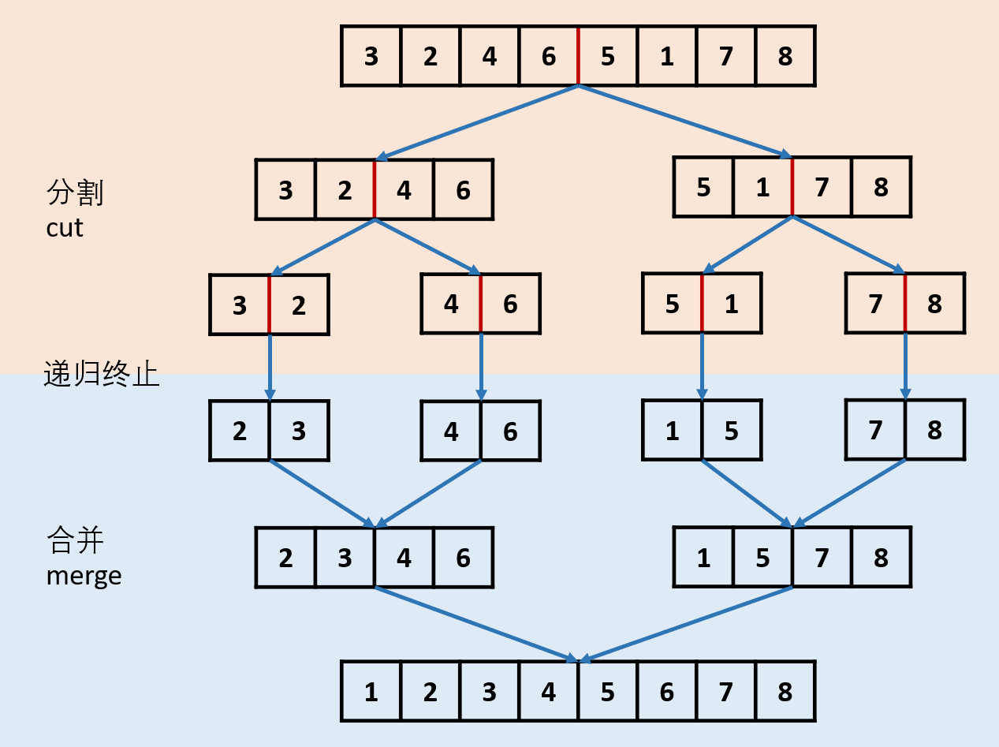

代码如下：

时间复杂度：O(nlog⁡n)，其中 n 是链表的长度。

空间复杂度：O(log⁡n)，其中 n 是链表的长度。空间复杂度主要取决于递归调用的栈空间。

```java
class Solution {
    public ListNode sortList(ListNode head) {
        if (head == null || head.next == null) return head;
        ListNode midNode = getMid(head);
        ListNode head1 = sortList(midNode.next);
        midNode.next = null;
        ListNode head2 = sortList(head);
        return merge(head1, head2);

  
    }
    //to get the middle point of the list
    private ListNode getMid(ListNode head) {
        ListNode slow = head, fast = head.next;
        while (fast != null && fast.next != null) {
            slow = slow.next;
            fast = fast.next.next;
        }
        return slow;
    }
    //to merge two lists in a sorted way.
    private ListNode merge(ListNode head1, ListNode head2) {
        ListNode dummy = new ListNode();
        ListNode tail = dummy;
        while (head1 != null || head2 != null) {
            if (head1 == null) {
                tail.next = head2;
                break;
            } else if (head2 == null) {
                tail.next = head1;
                break;
            } else if (head1.val > head2.val) {
                tail.next = head2;
                head2 = head2.next;
                tail = tail.next;
            } else {
                tail.next = head1;
                head1 = head1.next;
                tail = tail.next;
            }
        }
        return dummy.next;
    }
}
```

## sol 2: 归并排序（从底至顶直接合并）

有点不太好想。过程如下图所示

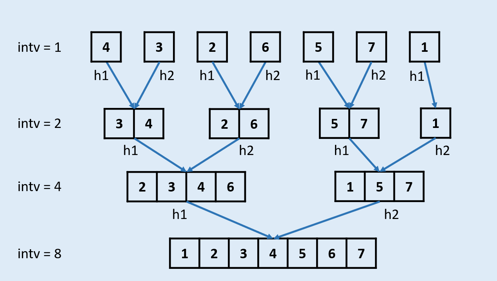

代码如下：

* 时间复杂度：O(nlog⁡n)，其中 n 是链表的长度。
* 空间复杂度：O(1)。

```java
class Solution {
    public ListNode sortList(ListNode head) {
        if (head == null) return head;
        //先找出链表的长度
        ListNode p = head;
        int len = 0;
        while (p != null) {
            p = p.next;
            len++;
        }
        ListNode dummy = new ListNode(0,head);
        //每次将链表等分成subLen的长度，在两两归并排序
        for (int subLen = 1; subLen < len; subLen *= 2) {
            ListNode pre = dummy, cur = dummy.next;
            while (cur != null) {
                //第一个长度为subLen的链表
                ListNode head1 = cur;
                for (int i = 0; i <subLen-1 && cur != null && cur.next != null; i += 1) {
                    cur = cur.next;
                }
                ListNode head2 = cur.next;//第二条链表
                cur.next = null;//第一条链表尾部断开
                cur = head2;
                for (int i = 0; i <subLen-1 && cur != null && cur.next != null; i += 1) {
                    cur = cur.next;
                }
                ListNode temp = null;
                if (cur != null) {
                    temp = cur.next;
                    cur.next = null;//第二条链表尾部断开
                }
                //合并两条链表
                ListNode merged = merge(head1, head2);
                pre.next = merged;
                while (pre.next != null) {//pre指针走到merged链表尾部
                    pre = pre.next;
                }
                cur = temp;//下一组的开始节点 
            }
        }
        return dummy.next;   
    }

    private ListNode merge(ListNode head1, ListNode head2) {
        ListNode dummy = new ListNode();
        ListNode tail = dummy;
        while (head1 != null || head2 != null) {
            if (head1 == null) {
                tail.next = head2;
                break;
            } else if (head2 == null) {
                tail.next = head1;
                break;
            } else if (head1.val > head2.val) {
                tail.next = head2;
                head2 = head2.next;
                tail = tail.next;
            } else {
                tail.next = head1;
                head1 = head1.next;
                tail = tail.next;
            }
        }
        return dummy.next;
    }
}
```

# LC 725：**Split Linked List in Parts**

代码如下：

```java
class Solution {
    public ListNode[] splitListToParts(ListNode head, int k) {
        ListNode[] res = new ListNode[k];
        if (head == null) return res;
        //先找到链表的长度
        int len = 0;
        ListNode p = head;
        while (p != null) {
            p = p.next;
            len++;
        }
        //分割好链表长度，存储在nums中
        int[] nums = new int[k];
        int a = len%k;
        int b = len/k;
        for (int i = 0; i < k; i += 1) {
            if (i < a) {
                nums[i] = b+1;
            } else {
                nums[i] = b;
            }
        }
        //分割链表
        p = head;
        for (int i = 0; i < k; i += 1) {
            if (p == null) {
                break;
            }
            res[i] = p;
            for (int j = 0; j < nums[i]-1; j += 1) {
                p = p.next;
            }
            ListNode temp = p.next;
            p.next = null;
            p = temp;
        }
        return res;  
    }
}
```

ddd
