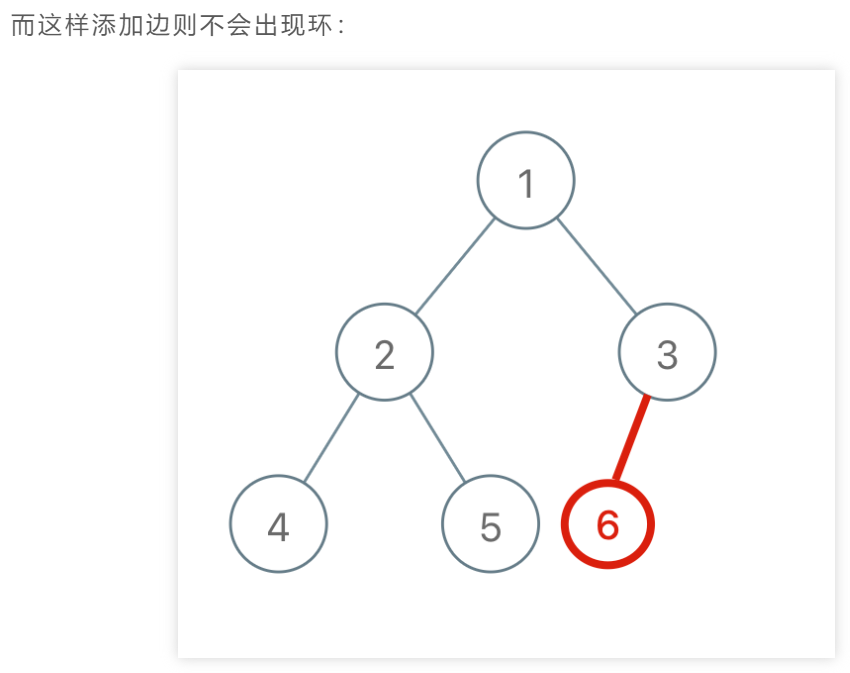
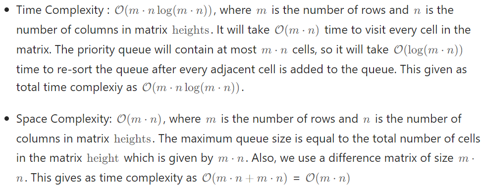
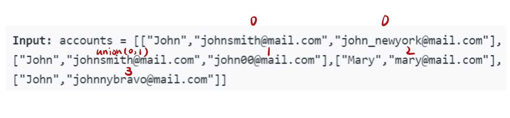
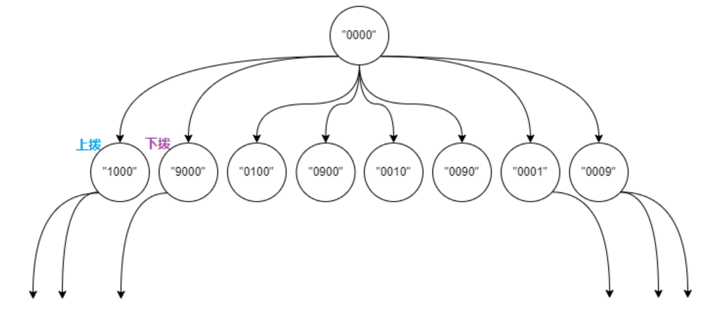
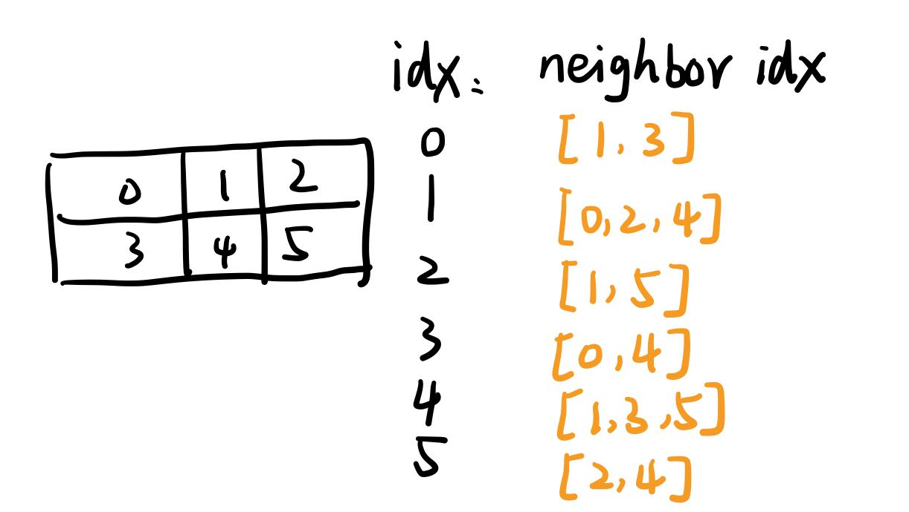

# 图论

# [LC 797: All Paths From Source to Target](https://leetcode.com/problems/all-paths-from-source-to-target/)

## 思路：图的遍历，DFS

因为题目中说明了给定的图为有向无环图，所以遍历过程中不会重复遍历同一节点，所以不需要visited来记录已经访问过的节点。

完整代码如下：

```java
class Solution {
    List<List<Integer>> res = new ArrayList<>();
    List<Integer> path = new ArrayList<>();
    int n;
    public List<List<Integer>> allPathsSourceTarget(int[][] graph) {
        n = graph.length;
        path.add(0);
        traverse(graph, 0);
        return res;
    }

    private void traverse(int[][] graph, int start) {
        if (start == n-1) {
            res.add(new ArrayList<>(path));
            return;
        }
        for (int next: graph[start]) {
            path.add(next);
            traverse(graph, next);
            path.remove(path.size()-1);
        }  
    }
}
```

## 关于DFS和backtracking的区别

单从代码上来说，回溯算法的「做选择」和「撤销选择」在 for 循环里面，而DFS是在for循环外面。

这里我就LC797这道题，来看一下两者的区别。

DFS：如图


backtracking：如图

显然如果将【做选择】和【撤销选择】放在for循环里面的话，最终收集的结果是不对的。


# [LC 207: Course Schedule](https://leetcode.com/problems/course-schedule/)

## 思路：环检测，图的遍历

1、可以将这个问题转化成【有向图】，然后检测图中是否有环，如果有，说明存在 [[1,0],[0,1]] 这种相互依赖的情况，则无法完成所有课程，返回false；反之返回true。

2、如何转化成图

首先是箭头方向问题，例如[1,0]表示要修完0课程，才能上1课程，即0课程被1课程所依赖，这里转化成图为：0→1。（其实也可以写成1→0，即1课程依赖于0课程）。

其次，要先把题目给的input转化成图的表示方式，即邻接表或邻接矩阵。

3、图的遍历：DFS

遍历过程中，要判断是否成环：在进入节点 `s` 的时候将 `onPath[s]` 标记为 true，离开时标记回 false，如果发现 `onPath[s]` 已经被标记，说明出现了环。

这里可以想象贪吃蛇的游戏，数组visited记录蛇已经经历过的节点，而数组onPath记录的是蛇身节点。当下一个被访问的节点已经在onPath中，说明撞到蛇身上了，说明有环。

## sol 1: DFS

## 如何创建一个类型元素为list的数组？

```java
List<Integer>[] graph = new LinkedList[n];
```

或者用哈希表来代替数组，哈希表的key就相当于数组的index，value就是数组中存储的list。

完整代码如下：


```java
class Solution {
    //记录遍历过的节点，防止走回头路
    boolean[] visited;
    //记录一次遍历递归堆栈中的节点
    boolean[] onPath;
    //记录图中是否有环
    boolean hasCycle = false;
  
    public boolean canFinish(int numCourses, int[][] prerequisites) {
        List<Integer>[] graph = buildGraph(numCourses, prerequisites);
        visited = new boolean[numCourses];
        onPath = new boolean[numCourses];
  
        //要想遍历图中所有节点，就要以每个节点为起点进行一次DFS遍历
        //因为并不是所有节点都相连
        for (int i = 0; i < numCourses; i += 1) {
            traverse(graph, i);
        }
        return !hasCycle;
    }
  
    //表示从图的s节点开始遍历，即节点s为开始节点
    void traverse(List<Integer>[] graph, int s) {
        if (onPath[s] == true) {
            hasCycle = true;
            return;
        }
  
        //如果节点s已经遍历过了，那就没必要再以s为节点进行一次dfs遍历，直接返回
        //如果发现可以成环，则没有必要再继续遍历，直接返回
        if (visited[s]) {
            return;
        }
  
        visited[s] = true;
        onPath[s] = true;
        for (int t: graph[s]) {
            traverse(graph, t);
        }
        onPath[s] = false;  
    }
    //将题目中给的input转化成邻接表
    List<Integer>[] buildGraph(int numCourses, int[][] prerequisites) {
        List<Integer>[] graph = new LinkedList[numCourses];
        for (int i = 0; i < numCourses; i += 1) {
            graph[i] = new LinkedList<>();
        }
  
        for (int[] edge: prerequisites) {
            int from = edge[1];
            int to = edge[0];
            graph[from].add(to);
        }
        return graph;
    }
}
```

## sol 2: BFS

核心思路：BFS算法借助indegree数组记录每个节点的入度

1、先构建邻接表

2、构建一个 `indegree` 数组记录每个节点的入度，即 `indegree[i]` 记录节点 `i` 的入度。

3、对 BFS 队列进行初始化，将入度为 0 的节点首先装入队列。

4、开始执行BFS循环，队列中的节点依次出队列，例如当前出队列节点为node，然后将与node相邻节点的入度均减1，同时将入度为0的节点加入队列。

5、如果最终所有节点都被遍历过，说明不存在环，反之存在。

完整代码如下：


```java
class Solution { 
    public boolean canFinish(int numCourses, int[][] prerequisites) {
        List<Integer>[] graph = buildGraph(numCourses, prerequisites);
        //构建入度数组
        int[] indegree = new int[numCourses];
        //在indegree中记录每个节点的入度
        for (int[] edge: prerequisites) {
            //int from = edge[1];
            int to = edge[0];
            indegree[to] += 1;
        }
  
        //初始化：将当前入度为0的节点加入队列
        Queue<Integer> q = new LinkedList<>();
        for (int i = 0; i < numCourses; i += 1) {
            if (indegree[i] == 0) {
                //如果节点i入度为0，即不依赖任何其他节点
                //则可以作为拓扑排序的起点，所以加入队列
                q.offer(i);
            }
        }
  
        //记录已经遍历过的节点个数
        int count = 0;
        while (!q.isEmpty()) {
            //弹出一个节点cur，将其相邻节点的入度全部减一
            int cur = q.poll();
            count += 1;
            for (int next: graph[cur]) {
                indegree[next] -= 1;
                //如果入度被减为0，则加入队列
                if (indegree[next] == 0) {
                    q.offer(next);
                }
            }
        }
        //在这种方式下，如果所有节点都被遍历过了，说明不成环
        return count == numCourses;
    }
  
    List<Integer>[] buildGraph(int numCourses, int[][] prerequisites) {
        List<Integer>[] graph = new LinkedList[numCourses];
        for (int i = 0; i < numCourses; i += 1) {
            graph[i] = new LinkedList<>();
        }
  
        for (int[] edge: prerequisites) {
            int from = edge[1];
            int to = edge[0];
            graph[from].add(to);
        }
        return graph;
    }
}
```

# [LC 210：Course Schedule II](https://leetcode.com/problems/course-schedule-ii/)

思路：拓扑排序，图的遍历

## 拓扑排序说明

**求出一种拓扑排序方法的最优时间复杂度为 O(n+m)，其中 n** 和 **m** 分别是有向图 **G** 的节点数和边数。


**直观地说就是，让你把一幅图「拉平」，而且这个「拉平」的图里面，所有箭头方向都是一致的** ，比如下图所有箭头都是朝右的。


1、一幅有向图如果存在环，则一定无法进行拓扑排序，因为无法实现所有箭头方向一致；相反地，如果一幅有向图无环，则一定可以进行拓扑排序。

2、最终的结果：是后序遍历结果翻转一次以后得到的结果。其实这也是由箭头的方向决定的。

## sol 1: DFS

完整代码如下：

其实可以看到，代码跟lc207非常像，只不过需要收集后序遍历结果。

```java
class Solution {
    //记录后续遍历结果
    List<Integer> postorder = new ArrayList<>();
    //记录已经遍历过的节点，防止走回头路
    boolean[] visited;
    //记录当前遍历路径上的节点
    boolean[]onPath;
    //记录是否成环
    boolean hasCycle = false;
    public int[] findOrder(int numCourses, int[][] prerequisites) {
        List<Integer>[] graph = buildGraph(numCourses, prerequisites);
        visited = new boolean[numCourses];
        onPath = new boolean[numCourses];
  
        for (int i = 0; i < numCourses; i += 1) {
            traverse(graph, i);
        }
        //如果有环则无法进行拓扑排序
        if (hasCycle) {
            return new int[]{};
        }
        //将后序遍历结果进行翻转，即得到拓扑排序结果
        Collections.reverse(postorder);
        //将list转换成array
        int[] res = new int[numCourses];
        for (int i = 0; i < numCourses; i += 1) {
            res[i] = postorder.get(i);
        }
        return res;
    }
    //对图进行遍历，同时更新[hasCycle]和[postorder]
    void traverse(List<Integer>[] graph, int s) {
        if (onPath[s]) {
            hasCycle = true;
        }
        if (visited[s] || hasCycle) {
            return;
        }
  
        visited[s] = true;
        onPath[s] = true;
        for (int t: graph[s]) {
            traverse(graph, t);
        }
        postorder.add(s);
        onPath[s] = false;
    }
    //转换成图的邻接表
    List<Integer>[] buildGraph(int numCourses, int[][] prerequisites) {
        List<Integer>[] graph = new LinkedList[numCourses];
        for (int i = 0; i < numCourses; i += 1) {
            graph[i] = new LinkedList<>();
        }
  
        for (int[] edge: prerequisites) {
            int from = edge[1];
            int to = edge[0];
            graph[from].add(to);
        }
        return graph;
    }
}
```

## sol 2: BFS

完整代码如下：

其实就是在lc207的BFS解法的代码稍加修改。

```java
class Solution {
    public int[] findOrder(int numCourses, int[][] prerequisites) {
        List<Integer>[] graph = buildGraph(numCourses, prerequisites);
        //构建入度数组
        int[] indegree = new int[numCourses];
        //在indegree中记录每个节点的入度
        for (int[] edge: prerequisites) {
            //int from = edge[1];
            int to = edge[0];
            indegree[to] += 1;
        }
  
        //初始化：将当前入度为0的节点加入队列
        Queue<Integer> q = new LinkedList<>();
        for (int i = 0; i < numCourses; i += 1) {
            if (indegree[i] == 0) {
                //如果节点i入度为0，即不依赖任何其他节点
                //则可以作为拓扑排序的起点，所以加入队列
                q.offer(i);
            }
        }
  
        //记录拓扑排序结果
        int[] res = new int[numCourses];
        //记录已经遍历过的节点个数
        int count = 0;
        //开始执行BFS算法
        while (!q.isEmpty()) {
            //弹出一个节点cur，将其相邻节点的入度全部减一
            int cur = q.poll();
            //节点的弹出顺序即为拓扑排序结果
            res[count] = cur;
            count += 1;
            for (int next: graph[cur]) {
                indegree[next] -= 1;
                //如果入度被减为0，则加入队列
                if (indegree[next] == 0) {
                    q.offer(next);
                }
            }
        }
        //如果成环，则不存在拓扑排序
        if (count != numCourses) {
            return new int[]{};
        }
  
        return res;
    }
  
    List<Integer>[] buildGraph(int numCourses, int[][] prerequisites) {
        List<Integer>[] graph = new LinkedList[numCourses];
        for (int i = 0; i < numCourses; i += 1) {
            graph[i] = new LinkedList<>();
        }
  
        for (int[] edge: prerequisites) {
            int from = edge[1];
            int to = edge[0];
            graph[from].add(to);
        }
        return graph;
    }
}
```

# [LC 785：Is Graph Bipartite?](https://leetcode.com/problems/is-graph-bipartite/)

## 思路：二分图判定，图的遍历

具体步骤：

1、基础思想还是图的遍历。

2、例如从节点s出发，遍历其邻居节点v

如果v未被访问过，则将v染色（与s不同的颜色），这里是用一个color数组来记录每个节点的颜色，用true和false分别代表两种不同的颜色。

如果v已经被访问过，则判断s和v节点的颜色是否相同，如果相同，则说明该图不是二分图，终止遍历

3、与图的遍历的不同点：将对节点是否已经被访问过的判断放在for循环中进行。注意，主函数中的for循环中，也要对起点s是否已经被遍历进行判断。

## sol 1：DFS

完整代码如下：


```java
class Solution {
    //用来记录是否是二分图
    private boolean ok = true;
    //用来记录每一个节点的颜色，例如false代表颜色1，true代表颜色2
    private boolean[] color;
    //用来记录已经遍历过的节点，防止走回头路
    private boolean[] visited;
    public boolean isBipartite(int[][] graph) {
        int n = graph.length;
        color = new boolean[n];
        visited = new boolean[n];
  
        for (int i = 0; i < n; i += 1) {
            if (!visited[i]) {//对起点节点是否已经遍历进行判断
                traverse(graph, i);  
            } 
        }
        return ok; 
    }
  
    void traverse(int[][] graph, int s) {
        //如果已经确定不是二分图，则不需要再遍历
        if (!ok) {
            return;
        }
        visited[s] = true;
        for (int v: graph[s]) {
            if (!visited[v]) {//如果s的相邻节点v没有被访问过
                color[v] = !color[s];//那么给节点v涂上和s不同的颜色
                traverse(graph, v);//以节点v为起点继续遍历
            } else {//如果v已经被访问过，则需要判断v和s的颜色是否相同
                if (color[s] == color[v]) {//若颜色相同，则此图不是二分图
                    ok = false;
                    return;
                }
            }
        } 
    }
}
```

## sol 2：BFS

和之前的图遍历BFS模板的最大区别在于，这里不需要indegree数组来记录节点的入度，因为这是一幅无向图。只要保证所有节点都遍历到了即可。

完整代码如下：


```java
class Solution {
    //用来记录是否是二分图
    private boolean ok = true;
    //用来记录每一个节点的颜色，例如false代表颜色1，true代表颜色2
    private boolean[] color;
    //用来记录已经遍历过的节点，防止走回头路
    private boolean[] visited;
  
    public boolean isBipartite(int[][] graph) {
        int n = graph.length;
        color = new boolean[n];
        visited = new boolean[n];
  
        for (int i = 0; i < n; i += 1) {
            if (!visited[i]) {
                bfs(graph, i);  
            } 
        }
        return ok; 
    }
  
    private void bfs(int[][] graph, int s) {
        Queue<Integer> q = new LinkedList<>();
        visited[s] = true;
        q.offer(s);
  
        while (!q.isEmpty() && ok) {
            int cur = q.poll();
            //从节点cur向邻居节点扩散
            for (int v: graph[cur]) {
                if (!visited[v]) {//如果cur的相邻节点v没有被访问过
                    color[v] = !color[cur];//那么给节点v涂上和cur不同的颜色
                    //标记节点v，并加入队列
                    visited[v] = true;
                    q.offer(v);
                } else {//如果v已经被访问过，则需要判断v和cur的颜色是否相同
                    if (color[cur] == color[v]) {//若颜色相同，则此图不是二分图
                        ok = false;
                        return;
                    }
                }
            }
        }  
    }
}
```

# [LC 886：Possible Bipartition](https://leetcode.com/problems/possible-bipartition/)

这道题其实就是二分图判定的具体运用。代码与lc785几乎一模一样

只有两处不同需要注意：

1、本题需要先构建邻接表

2、图中节点是从1开始编号的，即1，2，3，4，...，n

完整代码如下：

```java
class Solution {
    boolean ok = true;
    boolean[] color;
    boolean[] visited;
    public boolean possibleBipartition(int n, int[][] dislikes) {
        List<Integer>[] graph = buildGraph(n, dislikes);
        color = new boolean[n+1];
        visited = new boolean[n+1];
  
        for (int i = 1; i < n+1; i += 1) {
            if (!visited[i]) {
                traverse(graph, i);
            }
        }
        return ok;
    }
  
    void traverse(List<Integer>[] graph, int s) {
        visited[s] = true;
        for (int v: graph[s]) {
            if (!visited[v]) {
                color[v] = !color[s];
                traverse(graph, v);
            } else {
                if (color[s] == color[v]) {
                    ok = false;
                    return;
                } 
            }
        }
    }
    List<Integer>[] buildGraph(int n, int[][] dislikes) {
        //图中节点的编号为1,2,3,...n，即从0开始编号的
        List<Integer>[] graph = new LinkedList[n+1];
        for (int i = 1; i < n+1; i += 1) {
            graph[i] = new LinkedList<>();
        }
        for (int[] edge: dislikes) {
            int v = edge[0];
            int w = edge[1];
            //无向图相当于双向图
            graph[v].add(w);
            graph[w].add(v); 
        }
        return graph;
    }
}
```

# [LC 323： Number of Connected Components in an Undirected Graph](https://leetcode.com/problems/number-of-connected-components-in-an-undirected-graph/)

## 思路：Union-Find，连通分量

这道题其实就是求连通分量。根据给出的edge来连通各节点（函数union（）会update连通分量），然后返回连通分量即可。

先把整个union fund类写好，然后在主函数中直接用。

完整代码如下：

```java
class Solution {
    public int countComponents(int n, int[][] edges) {
        UF uf = new UF(n);
        for (int[] edge: edges) {
            uf.union(edge[0], edge[1]);
        }
        return uf.count();
    }
  
    class UF {
        //记录连通分量个数
        private int count;
        //记录每个节点的父节点
        private int[] parent;  
        public UF(int n) {
            this.count = n;
            parent = new int[n];
            for (int i = 0; i < n; i += 1) {
                parent[i] = i;
            }
        }
        //将节点p和q连通
        public void union(int p, int q) {
            int rootP = find(p);
            int rootQ = find(q);
            if (rootP == rootQ) {
                return;
            }
            parent[rootQ] = rootP;
            //两个连通分量合并成一个连通分量，所以count减一
            count -= 1;
        }
        //判断节点p和q是否连通
        public boolean connected(int p, int q) {
            int rootP = find(p);
            int rootQ = find(q);
            return rootP == rootQ;  
        }
        //寻找节点x的父节点
        public int find(int x) {
            if (parent[x] != x) {
                parent[x] = find(parent[x]);
            }
            return parent[x];
        }
  
        public int count() {
            return count;
        }
    }   
}
```

# [LC 990: Satisfiability of Equality Equations](https://leetcode.com/problems/satisfiability-of-equality-equations/)

## 思路：Union-Find

## 知识点：**二维坐标映射到一维的常用技巧**

假设有一个行数为m，列数为n的二维数组，则任意一个二维坐标 `(x, y)`可以转换成 `x*n + y`

核心思路：先处理相等关系的算式，让这些字母形成连通分量，然后再处理不相等的算式，看有没有破坏已形成的连通分量，如有则直接返回false，反之返回true。

完整代码如下：

```java
class Solution {
    public boolean equationsPossible(String[] equations) {
        //一共有26个英文字母
        UF uf = new UF(26);
        //先将相等的字母形成连通分量
        for (String s: equations) {
            if (s.charAt(1) == '=') {
                char x = s.charAt(0);
                char y = s.charAt(3);
                uf.union(x-'a', y-'a'); 
            }
        }
        //再来看不相等的字母，是否破坏已形成的相等关系的连通性
        for (String s: equations) {
            if (s.charAt(1) == '!') {
                char x = s.charAt(0);
                char y = s.charAt(3);
                if (uf.connected(x-'a', y-'a')) {
                    return false;
                }
            }
        }
        return true;  
    }
  
    class UF {
        private int count;
        private int[] parent;
  
        public UF(int n) {
            this.count = n;
            parent = new int[n];
            for (int i = 0; i < n; i += 1) {
                parent[i] = i;
            }
        }
        public void union(int p, int q) {
            int rootP = find(p);
            int rootQ = find(q);
            if (rootP == rootQ) {
                return;
            }
            parent[rootQ] = rootP;
            count -= 1;   
        }
        public boolean connected(int p, int q) {
            int rootP = find(p);
            int rootQ = find(q);
            return rootP == rootQ;
        }
        public int find(int x) {
            if (parent[x] != x) {
                parent[x] = find(parent[x]);
            }
            return parent[x];
        }
        public int count() {
            return count;
        }
    }
}
```

# [LC 261：Graph Valid Tree](https://leetcode.com/problems/graph-valid-tree/)

## 思路：Union-Find，以图判树，图的遍历

## 【图】和【树】的区别：

【图】的生成树：就是要找到一棵树，这棵树包含图中所有节点。换句话说，生成图就是包含图中所有节点的【无环连通子图】。

【最小生成树】：就是一幅图的所有生成树中，权重和最小的那棵生成树。

（补充：所以一般都是在**无向加权图**中计算最小生成树，图的边权重可以理解为距离，成本等）

12/30/22 update:


## sol 1: 并查集

本题思路：

思路：如果两个节点已经在同一个连通分量里，此时如果再将这两个节点连接（即添加一条边），那么就会形成环；反之如果原本不在同一个连通分量里，此时在这两个节点之间添加一条边，不会形成环。




完整代码如下：

```java
class Solution {
    public boolean validTree(int n, int[][] edges) {
        UF uf = new UF(n);
        //遍历所有边
        for (int[] edge: edges) {
            int x = edge[0];
            int y = edge[1];
            //如果一条边上的两个节点已经在同一连通分量里，则会形成环
            //说明无法得到一棵valid tree，返回false
            //条件2：no cycle.
            if (uf.connected(x, y)) {
                return false;
            }
            //如果一条边上的两个节点不在同一连通分量里，则不会产生环，
            //可以是树的一部分
            uf.union(x, y);
        }
        //条件1：fully connected.要保证最后只形成了一棵树，即只有一个连通分量
        return uf.count() == 1;  
    }
  
    class UF {
        private int count;
        private int[] parent;
  
        public UF(int n) {
            this.count = n;
            parent = new int[n];
            for (int i = 0; i < n; i += 1) {
                parent[i] = i;
            }
        }
        public void union(int p, int q) {
            int rootP = find(p);
            int rootQ = find(q);
            if (rootP == rootQ) {
                return;
            }
            parent[rootP] = rootQ;
            count -= 1;
        }
        public boolean connected(int p, int q) {
            int rootP = find(p);
            int rootQ = find(q);
            return rootP == rootQ;
        }
        private int find(int x) {
            if (parent[x] != x) {
                parent[x] = find(parent[x]);
            }
            return parent[x];
        }
        public int count() {
            return count;
        }
    }
}
```

## sol 2：检测是否成环+fully connected - iterative DFS

check fully connected ：visited.size() == n

check no cycle：检查【无向】图是否成环要注意一个细节，即trival cycles（A->B->A)不算做是成环，因为无向图本身等同于双向图，邻接表中会有A到B和B到A两条边，但实际上就是一条边。

### 检测无向图是否成环的方法：

设置一个map，例如(2, 0)表示是从0节点遍历到2节点的，这样记录的目的是确定每条边只遍历一次防止出现先遍历A->B，然后又遍历B->A，并将其视为成环的情况。

代码如下：


```java
class Solution {
    Set<Integer> visited = new HashSet<>();
    public boolean validTree(int n, int[][] edges) {
        //构建邻接表
        List<List<Integer>> graph = buildGraph(n, edges);
        //这个parent可以理解为存储了已经遍历过的edge
        Map<Integer, Integer> parent = new HashMap<>();
        //起始节点0节点没有parent，所以初始化设置为-1.
        parent.put(0, -1);
        Deque<Integer> stack = new ArrayDeque<>();
        stack.push(0);
        while (!stack.isEmpty()) {
            int curNode = stack.pop();
            for (int neighbor: graph.get(curNode)) {
                //说明curNode和neighbor之间的edge已经遍历过了
                if (parent.get(curNode) == neighbor) {
                    continue;
                }
                //check是否已经访问过这个neighbor节点，是则说明成环，返回false
                if (parent.containsKey(neighbor)) {
                    return false;
                }
                parent.put(neighbor, curNode);
                stack.push(neighbor);
            }
        }
        //检查是否遍历到了所有节点，即fully connected
        return parent.size() == n; 
    }

    //建邻接表
    List<List<Integer>> buildGraph(int n, int[][] edges) {
        List<List<Integer>> graph = new ArrayList<>();
        for (int i = 0; i < n; i += 1) {
            graph.add(new ArrayList<>());
        }
        for (int[] edge: edges) {
            int a = edge[0], b = edge[1];
            graph.get(a).add(b);
            graph.get(b).add(a);
        }
        return graph;
    }
}
```

## sol 3：检测是否有n-1条边+fully connected - recursive DFS


图是树必须同时满足：

1、有（n-1）条边

2、fully connected

代码如下：


```java
class Solution {
    Set<Integer> visited = new HashSet<>();
    public boolean validTree(int n, int[][] edges) {
        //要有(n-1)条边
        if (edges.length != n-1) return false;
        //构建邻接表
        List<List<Integer>> graph = buildGraph(n, edges);
        traverse(graph, 0);
        //所有节点都遍历到了，证明是fully connected
        return visited.size() == n;
  
    }

    void traverse(List<List<Integer>> graph, int start) {
        if (visited.contains(start)) return;
        visited.add(start);
        for (int next: graph.get(start)) {
            traverse(graph, next);
        }
    }
    //建邻接表
    List<List<Integer>> buildGraph(int n, int[][] edges) {
        List<List<Integer>> graph = new ArrayList<>();
        for (int i = 0; i < n; i += 1) {
            graph.add(new ArrayList<>());
        }
        for (int[] edge: edges) {
            int a = edge[0], b = edge[1];
            graph.get(a).add(b);
            graph.get(b).add(a);
        }
        return graph;
    }
}
```

# Kruskal最小生成树算法

所谓最小生成树，就是从图中找出若干边形成一个集合（这个集合称为mst），这个集合需要满足以下条件：

1、这些边组成的树包含图中的所有节点。

2、这些边组成的是一棵有效树（valid tree），即不存在环

3、这些边的权重之和最小。

其实第1、2点就是图的任意一幅生成树需要满足的条件（详见lc261），可通过Union-Find来实现。

而要满足第三点需要运用**贪心思想**：先把所有边按权重从小到大排序，从权重最小的边开始遍历，如果这条边和mst中的其他边不会形成环（就是看这条边上的两个节点是否已经在同一个连通分量里），那么将其加入mst集合；反之，这条边不是最小生成树的一部分，不加入mst集合。

### Kruskal算法复杂度分析：


# [LC 1135：Connecting Cities With Minimum Cost](https://leetcode.com/problems/connecting-cities-with-minimum-cost/)

思路：最小生成图，Kruskal算法

完整代码如下：

```java
class Solution {
    public int minimumCost(int n, int[][] connections) {
        //城市的编号为1,2,3，...,n
        UF uf = new UF(n+1);
        //用来记录最小的成本cost
        int mst = 0;
        //将图的所有边按权重从小到大进行排序
        Arrays.sort(connections, (a, b) -> (a[2] - b[2]));
        //遍历所有的边
        for (int[] connection: connections) {
            int x = connection[0];
            int y = connection[1];
            int cost = connection[2];
            if (uf.connected(x, y)) {
                continue;
            } 
            mst += cost;
            uf.union(x, y);
        }
        //注意，这里节点0未被使用，所以会占用一个额外的连通分量
        return uf.count() == 2 ? mst : -1;  
    }
  
    class UF {
        private int count;
        private int[] parent;
        public UF(int n) {
            this.count = n;
            parent = new int[n];
            for (int i = 0; i < n; i += 1) {
                parent[i] = i;
            }
        }
        public void union(int p, int q) {
            int rootP = find(p);
            int rootQ = find(q);
            if (rootP == rootQ) {
                return;
            }
            parent[rootP] = rootQ;
            count -= 1;
        }
        public boolean connected(int p, int q) {
            int rootP = find(p);
            int rootQ = find(q);
            return rootP == rootQ;
        }
        public int find(int x) {
            if (parent[x] != x) {
                parent[x] = find(parent[x]);
            }
            return parent[x];
        }
        public int count() {
            return count;
        }
    }
}
```

# [LC 1584: Min Cost to Connect All Points](https://leetcode.com/problems/min-cost-to-connect-all-points/)

## 思路：Kruskal最小生成树，Union-Find

这道题和lc1135的不同之处在于，题目给的是点，而不是边和对应权重。所以首先要将这些点生成**所有可能的**边和对应权重，然后再运用Kruskal算法来生成最小生成树。

注意：这道题的代码跟lc1135的不同之处在于，除了要先生成边以外，最后返回结果的时候不需要根据连通分量来判断是否是一棵valid tree，因为题目给定的是点，而不是边。最后一定生成的是最小生成树，所以直接返回mst即可。

完整代码如下：

```java
class Solution {
    public int minCostConnectPoints(int[][] points) {
        int n = points.length;
        //先生成所有边及每条边的权重
        //就是生成每个点到其他所有点的边
        List<int[]> edges = new ArrayList<>();
        for (int i = 0; i < n; i += 1) {
            for (int j = i+1; j < n; j += 1) {
                //即点i的横纵坐标
                int ix = points[i][0], iy = points[i][1];
                //点j的横纵坐标
                int jx = points[j][0], jy = points[j][1]; 
                //用i和j来表示这两个点，生成一条边
                edges.add(new int[]{i, j, Math.abs(ix-jx)+Math.abs(iy-jy)});
            } 
        }
        //将所有边按权重有小到大排序
        Collections.sort(edges, (a, b) -> {
            return a[2] - b[2];
        });
        //开始执行Kruskal算法
        int mst = 0;
        UF uf = new UF(n);
        for (int[] edge: edges) {
            int x = edge[0];
            int y = edge[1];
            int weight = edge[2];
            if (uf.connected(x, y)) {
                continue;
            }
            uf.union(x, y);
            mst += weight;
        }
        //题目给的参数是坐标，而不是边，而我们已经生成了所有可能的边
        //所以确保了最后生成的树一定是包含所有点的
        //所以不用再根据连通分量来判断是否是valid tree
        return mst;  
    }
    class UF {
        private int count;
        private int[] parent;
        public UF(int n) {
            this.count = n;
            parent = new int[n];
            for (int i = 0; i < n; i += 1) {
                parent[i] = i;
            }
        }
        public void union(int p, int q) {
            int rootP = find(p);
            int rootQ = find(q);
            if (rootP == rootQ) {
                return;
            }
            parent[rootP] = rootQ;
        }
        public boolean connected(int p, int q) {
            int rootP = find(p);
            int rootQ = find(q);
            return rootP == rootQ;
        }
        public int find(int x) {
            if (parent[x] != x) {
                parent[x] = find(parent[x]);
            }
            return parent[x];
        }
        public int count() {
            return count;
        }
    }
}


```

# 单源最短路径：DIJKSTRA算法

Dijkstra算法可以解决单源最短路问题， 即计算从k点（源点/起点）出发到所有其他点的最短距离。核心思路是贪心。

图解：

1、图为一个有向加权图，圆圈中为节点序号，箭头上为边权，右侧为所有点距离源点 `0` 的距离。


2、首先节点0是距离源点最近的点，距离为0，然后更新节点0周围的点距离源点0的距离。

即 `distTo[y] = Math.min(distTo[y], distTo[0] + graph[0][y])`


3、下一个点选择所有尚未确定最短路径（即尚未遍历，或者说尚未标记）的点中距离源点最近的点，显然这里是节点2，标记节点2，并同样地更新节点2周围的点。


4、尚未标记的点还剩节点1、3、4，其中距离源点距离最近的点为节点1，所以选择节点1，操作与上面相同。


# [LC 743：Network Delay Time](https://leetcode.com/problems/network-delay-time/)

## 思路：最短路径，Dijkstra算法，有向加权图

## sol 1：朴素Dijkstra算法（邻接矩阵）

完整代码如下：

* 时间复杂度：O(n^2)
* 空间复杂度：O(n^2)

关于INF = 0x3f3f3f3f:

将0x3f3f3f3f的十进制是1061109567，可以满足"无穷大加无穷大还是无穷大"的需求。因为在代码中，有 `distTo[target] + graph[target][y]`。

```java
class Solution {
    int INF = 0x3f3f3f3f;
    public int networkDelayTime(int[][] times, int n, int k) {
        boolean[] visited = new boolean[n+1];
        int[] dist = new int[n+1];
        Arrays.fill(dist, INF);
        int[][] graph = buildGraph(times, n);

        //dijkstra
        dist[k] = 0;
        //迭代n次，确保每个节点都访问到了
        for (int i = 1; i <= n; i += 1) {
            //找到当前dist数组中的最小值对应的index，即当前距离源点最近的节点target
            int target = -1;
            for (int j = 1; j <= n; j += 1) {
                if (!visited[j] && (target == -1 || dist[j] < dist[target])) {
                    target = j;
                }
            }
            //根据dist[target]更新所有其他点到源点的距离
            visited[target] = true;
            for (int v = 1; v <= n; v += 1) {
                dist[v] = Math.min(dist[v], dist[target]+graph[target][v]);
            }
        }
        //dist数组中找到最大值
        int res = 0;
        for (int i = 1; i <= n; i += 1) {
            if (dist[i] == INF) {
                return -1;
            }
            res = Math.max(res, dist[i]);
        }
        return res;
    }
    //构建邻接矩阵：graph[x][y] = w表示x到y的边权重为w
    private int[][] buildGraph(int[][] edges, int n) {
        int[][] graph = new int[n+1][n+1];
        for (int i = 0; i < n+1; i += 1) {
            Arrays.fill(graph[i], INF);
        }
        for (int[] edge: edges) {
            int from = edge[0], to = edge[1];
            graph[from][to] = edge[2];
        }
        return graph;
    }
}
```

## sol 2: 堆优化Dijkstra算法 优化（邻接表）

完整代码如下：


```java
class Solution {
    int INF = 0x3f3f3f3f;
    public int networkDelayTime(int[][] times, int n, int k) {
        boolean[] visited = new boolean[n+1];
        int[] dist = new int[n+1];
        Arrays.fill(dist, INF);
        List<int[]>[] graph = buildGraph(times, n);

        //dijkstra
        dist[k] = 0;
        Queue<Integer> pq = new PriorityQueue<>((a,b)-> (dist[a]-dist[b]));
        pq.offer(k);
        while (!pq.isEmpty()) {
            int cur = pq.poll();
            if (visited[cur]) {
                continue;
            }
            visited[cur] = true;
            for (int[] neighbor: graph[cur]) {
                int to = neighbor[0];
                int w = neighbor[1];
                dist[to] = Math.min(dist[to], dist[cur]+w);
                pq.offer(to);
            }
        }
 
        //dist数组中找到最大值
        int res = 0;
        for (int i = 1; i <= n; i += 1) {
            if (dist[i] == INF) {
                return -1;
            }
            res = Math.max(res, dist[i]);
        }
        return res;
    }
    //构建邻接表
    private List<int[]>[] buildGraph(int[][] edges, int n) {
        List<int[]>[] graph = new LinkedList[n+1];
        for (int i = 0; i < n+1; i += 1) {
            graph[i] = new LinkedList<>();

        }
        for (int[] edge: edges) {
            int from = edge[0], to = edge[1];
            graph[from].add(new int[]{to, edge[2]});
        }
        return graph;
    }
}
```

# [LC 1631: Path With Minimum Effort](https://leetcode.com/problems/path-with-minimum-effort/)

## 思路：有向加权图

## sol 1: Variations of Dijkstra's Algorithm

代码如下：



```java
class Solution {
    public int minimumEffortPath(int[][] heights) {
        int[][] directions = {{-1,0}, {1,0}, {0, 1}, {0, -1}};
        int m = heights.length;
        int n = heights[0].length;
        int[] effort = new int[m*n];
        Arrays.fill(effort, Integer.MAX_VALUE);
        effort[0] = 0;
        boolean[] visited = new boolean[m*n];

        Queue<int[]> pq = new PriorityQueue<>((a,b)->(a[2]-b[2]));
        pq.offer(new int[]{0,0,0});

        while (!pq.isEmpty()) {
            int[] cur = pq.poll();
            int x1 = cur[0], y1 = cur[1], effor1 = cur[2];
            int index = x1*n + y1;
            if (visited[index]) {
                continue;
            }
            visited[index] = true;
            for (int[] dir: directions) {
                int x2 = x1 + dir[0], y2 = y1 + dir[1];
                if (x2 >= 0 && x2 < m && y2 >= 0 && y2 < n) {
                    int newEffort = Math.max(effor1, Math.abs(heights[x1][y1]-heights[x2][y2]));
                    if (newEffort < effort[x2*n+y2]) {
                        effort[x2*n+y2] = newEffort;
                    }
                    pq.offer(new int[]{x2, y2, newEffort});
                }
            }
        }
        return effort[m*n-1]; 
    }
}
```

## sol 2: union find

思路：

1、将每个格子看做一个节点，先找出所有的点与点之间的边。这里，每个节点其实只需要找到向右和向下的边，就能覆盖所有的边。


2、首先移除所有的边。


3、然后先添加权重最小的边，即权重为0的边。此时发现起点和终点尚未连通，说明还需要继续添加。


4、再添加权重为1的边，仍未连通，继续。


5、添加权重为2的边，发现起点和终点连通，则权重2就是最终答案。并查集的作用就是添加边以及判断起点和终点是否连通。


完整代码如下：


```java
class Solution {
    public int minimumEffortPath(int[][] heights) {
        int row = heights.length;
        int col = heights[0].length;
        UF uf = new UF(row*col);
        //预处理出所有的边
        //edge中保存的[x, y, w]表示的是点x到y的effort
        //虽然可以向上下左右四个方向移动，但实际只需要添加每个点向下和向右两条边
        //即可覆盖所有的边
        List<int[]> edges = new ArrayList<>();
        for (int i = 0; i < row; i++) {
            for (int j = 0; j < col; j++) {
                //将二维坐标转换成一维坐标
                int idx = i*col + j;
                //先添加向右的边
                if (i + 1 < row) {
                    int a = idx, b = (i+1)*col + j;
                    int w = Math.abs(heights[i][j] - heights[i + 1][j]);
                    edges.add(new int[]{a, b, w});
                }
                //再添加向下的边
                if (j + 1 < col) {
                    int a = idx, b = idx + 1;
                    int w = Math.abs(heights[i][j] - heights[i][j + 1]);
                    edges.add(new int[]{a, b, w});
                }
            }
        }
        //将所有边按照边权从小到大排列
        Collections.sort(edges, (a, b) -> a[2] - b[2]);
        //开始执行Kruskal算法
        //从权值较小的边开始添加，如果添加某一条边之后起点（0,0）和终点（row-1, col-1）
        //连通，则表明找到了【最短路径】中权重最大的边
        //这里也是与最小生成树不一样的地方：不需要考虑是否成环
        int start = 0;
        int end = (row-1)*col + (col-1);
        for (int[] edge: edges) {
            int x = edge[0], y = edge[1], w = edge[2];
            //添加x与y之间的边
            uf.union(x, y);
            if (uf.connected(start, end)) {
                return w;
            }  
        }
        return 0; 
    }

    class UF {
        private int count;
        private int[] parent;
        public UF(int n) {
            this.count = n;
            parent = new int[n];
            for (int i = 0; i < n; i += 1) {
                parent[i] = i;
            }
        }
        public void union(int p, int q) {
            int rootP = find(p);
            int rootQ = find(q);
            if (rootP == rootQ) {
                return;
            }
            parent[rootP] = rootQ;
            count -= 1;
            // parent[find(p)] = parent[find(q)];
        }
        public boolean connected(int p, int q) {
            int rootP = find(p);
            int rootQ = find(q);
            return rootP == rootQ;
            // return parent[find(p)] == parent[find(q)];
        }
        private int find(int x) {
            if (parent[x] != x) {
                parent[x] = find(parent[x]);
            }
            return parent[x];
        }
        //这道题中用不上
        public int count() {
            return count;
        }
    }
}
```

# [LC 1514：Path with Maximum Probability](https://leetcode.com/problems/path-with-maximum-probability/)

## 思路：无向加权图，最短路径，Dijkstra算法

1、无向图本质就是双向图

2、用Dijkstra计算最短路径的前提是路径中每增加一条路径，路径的总权重就会增加。所以要求路径的权重不得为负。

同样地，在这道题中每增加一条路径，最终的结果会越小（小于1的概率相乘，结果会越来越小），而最终求的是概率最大。所以只需要把优先队列的排列顺序反过来即可。

这道题不需要visited数组的原因是：已经确定的（即已经访问过的）节点的prob一定是大于后来加入pq中的的，因为路径越多，结果越小。

Double.compare(double a, double b):

* **0:** if d1 is numerically equal to d2.
* **Negative value:** if d1 is numerically less than d2.
* **Positive value:** if d1 is numerically greater than d2.

完整代码如下：


```java
class Solution {
    public double maxProbability(int n, int[][] edges, double[] succProb, int start, int end) {
        List<double[]>[] graph = new LinkedList[n];
        for (int i =0; i < n; i += 1) {
            graph[i] = new LinkedList<>();
        }
        //存图
        for (int i = 0; i < edges.length; i += 1) {
            int from = edges[i][0];
            int to = edges[i][1];
            double weight = succProb[i];
            //无向图本质就是双向图。
            //先将int转换成double，之后再转回
            graph[from].add(new double[]{(double)to, weight});
            graph[to].add(new double[]{(double)from, weight});
        }
        return Dijkstra(graph, start, end);  
    }
    class State {
        //图的节点id;
        int id;
        //从start起点到当前节点的概率
        double prob;
        State(int id, double prob) {
            this.id = id;
            this.prob = prob;
        }
    }
  
    double Dijkstra(List<double[]>[] graph, int start, int end) {
        //probTo[i]表示起点start到i点的最大概率
        double[] probTo = new double[graph.length];
        //初始化为-1
        Arrays.fill(probTo, -1);
        probTo[start] = 1;
        //将probFromStart较大的排在前面
        Queue<State> pq = new PriorityQueue<>((a, b) -> {
            return Double.compare(b.prob, a.prob);
        });
        pq.offer(new State(start, 1));
  
        while (!pq.isEmpty()) {
            State cur = pq.poll();
            int xID = cur.id;
            double xProb = cur.prob;

            if (xID == end) {
                return xProb;
            }
            // if (xProb < probTo[xID]) {
            //     continue;
            // }
            for (double[] neighbor: graph[xID]) {
                int neiID = (int)neighbor[0];
                //点x到相邻节点的边的边权
                double weight = neighbor[1];
                if (probTo[neiID] < probTo[xID]*weight) {
                    probTo[neiID] = probTo[xID]*weight;
                    //注意，这里将邻居节点加入队列的前提是，对其probFromStart进行了更新
                    //避免将同一节点反复加入队列。
                    pq.offer(new State(neiID, probTo[neiID]));
                }
            }
        }
        //如果到达这里，说明没有路可以从start到end，所以返回0
        return 0.0;
    }
}
```

# [LC 721: Accounts Merge](https://leetcode.com/problems/accounts-merge/)

## 思路：并查集

思路：



1、先建立一个map，<邮箱地址，ID>,遍历所有的邮箱地址。这里的ID其实就是二维矩阵accounts的行数，所以我们是把每个accounts[i]看做一个节点，如上图红色数字所示。

当遇到重复出现的邮箱地址时，则将其ID与第一次出现该邮箱地址的ID进行连通，这里就是将节点0和节点1进行连通。

注意：重复的邮箱地址除了第一次出现时加入map以外，之后不再加入map，去重。

2、建立一个map, <ID，所有的邮箱地址列表>。遍历第一个map，这一步的目的就是将ID为0和ID为1（即在同一个连通分量里）的邮箱合并到一起。

3、将第二个map的最终结果变成最终结果，即ID对应到姓名，邮箱地址列表进行排序，然后组合到一起即可。

完整代码如下：

```java
class Solution {
    public List<List<String>> accountsMerge(List<List<String>> accounts) {
        //map<email: i>表示邮箱地址email第一次出现是在accounts的第i行
        Map<String, Integer> emailToId = new HashMap<>();
        int n = accounts.size();//accounts的行数，id的个数，也是节点的个数。将每一行acount[i]作为一个并查集的节点
        UF uf = new UF(n);
        //遍历accounts
        for (int i = 0; i < n; i += 1) {
            //遍历account[i]中的邮箱地址
            List<String> curAccount = accounts.get(i);
            for (int j = 1; j < curAccount.size(); j += 1) {
                String curEmail = curAccount.get(j);
                //如果该邮箱地址已经在emailToId中出现过
                //说明有账户需要合并，假设该邮箱第一次出现在account[k],
                //现在又出现在accounts[i]，那么accounts[k]和accounts[i]是同一个人
                //需要合并
                if (emailToId.containsKey(curEmail)) {
                    int k = emailToId.get(curEmail);
                    //重复出现的邮箱地址就不需要再加入emailToId,刚好去重
                    //这样emailToId.getKeys()里就是没有重复邮箱的
                    uf.union(k, i);
                } else {//如果该邮箱地址第一次出现，则加入到emailToId中
                    emailToId.put(curEmail, i);
                }
            }
        }
  
        //记录根节点及其对应的邮箱
        //map格式：<账户id，邮箱list>
        Map<Integer, List<String>> idToEmails = new HashMap<>();
        //遍历accounts,将同一连通分量中的邮箱对应到同一个id
        for (Map.Entry<String, Integer> entry: emailToId.entrySet()) {
            int id = uf.find(entry.getValue());//节点accounts[i]对应的根节点
            List<String> emails = idToEmails.getOrDefault(id, new ArrayList<>());
            emails.add(entry.getKey());
            idToEmails.put(id, emails);
 
        }
        //记录最终结果
        List<List<String>> res = new ArrayList<>();
        for (Map.Entry<Integer, List<String>> entry: idToEmails.entrySet()) {
            List<String> emails = entry.getValue();
            //排序
            Collections.sort(emails);
            List<String> tmp = new ArrayList<>();
            //先放进去姓名
            tmp.add(accounts.get(entry.getKey()).get(0));
            //再放入所有邮箱
            tmp.addAll(emails);
            res.add(tmp);
        }
        return res;  
    }
  
    class UF {
        private int[] parent;
        public UF(int n) {
            parent = new int[n];
            for (int i = 0; i < n; i += 1) {
                parent[i] = i;
            }
        }
        public void union(int p, int q) {
            int rootP = find(p);
            int rootQ = find(q);
            if (rootP == rootQ) {
                return;
            }
            parent[rootP] = rootQ;
            count -= 1;
        }
        private int find(int x) {
            if (parent[x] != x) {
                parent[x] = find(parent[x]);
            }
            return parent[x];
        }
    }
}
```

# [LC 547: Number of Provinces](https://leetcode.com/problems/number-of-provinces/)

## sol 1: 并查集

就是并查集的基本运用，求无向图中连通分量的个数。

完整代码如下：

```java
class Solution {
    public int findCircleNum(int[][] isConnected) {
        int n = isConnected.length;
        UF uf = new UF(n);
        for (int i = 0; i < n; i += 1) {
            for (int j = 0; j < n; j += 1) {
                if (i != j && isConnected[i][j] == 1) {
                    uf.union(i, j);
                }
            }
        }
        return uf.count();
    }
  
    class UF {
        private int count;
        private int[] parent;
        public UF(int n) {
            this.count = n;
            parent = new int[n];
            for (int i = 0; i < n; i += 1) {
                parent[i] = i;
            }
        }
        public void union(int p, int q) {
            int rootP = find(p);
            int rootQ = find(q);
            if (rootP == rootQ) {
                return;
            }
            parent[rootP] = rootQ;
            count -= 1;
        }
        public boolean connected(int p, int q) {
            int rootP = find(p);
            int rootQ = find(q);
            return rootP == rootQ;
        }
        private int find(int x) {
            if (parent[x] != x) {
                parent[x] = find(parent[x]);
            }
            return parent[x];
        }
        public int count() {
            return count;
        }
    }
}
```

## sol 2：DFS

## 思路：图的遍历

思路：使用图搜索算法从连通分量的任一节点开始遍历整个连通分量，并且用一个visited数组来标记已经遍历过的节点，若仍有节点尚未被访问，说明进入了一个新的连通分量，那么连通分量的数量加一。

完整代码如下：

```java
class Solution {
    public int findCircleNum(int[][] isConnected) {
        //isConnected其实就是无向图的邻接矩阵
        int n = isConnected.length;
        //用于记录哪些节点已经访问过
        boolean[] visited = new boolean[n];
        //用于记录连通分量的个数
        int count = 0;
  
        for (int i = 0; i < n; i += 1) {
            //如果当前节点尚未访问过，说明又是一个新的连通分量，则遍历新的连通分量
            //且count加1
            if (!visited[i]) {
                count += 1;
                dfs(isConnected, i, visited);
            }
        }
        return count;
    }
  
    public void dfs(int[][] graph, int start, boolean[] visited) {
        visited[start] = true;
        //遍历所有点，看是否与start点相连且尚未被访问过
        for (int j = 0; j < graph.length; j += 1) {
            if (graph[start][j] == 1 && !visited[j]) {
                dfs(graph, j, visited);
            }
        } 
    }
}
```

# [LC 695： Max Area of Island](https://leetcode.com/problems/max-area-of-island/)

## 思路：沉岛思想

## sol 1：DFS + recursion


```java
class Solution {
    public int maxAreaOfIsland(int[][] grid) {
        int res = 0;
        int m = grid.length;
        int n = grid[0].length;
        int[][] copy = new int[m][n];
        //先拷贝一份grid
        for (int i = 0; i < m; i += 1) {
            for (int j = 0; j < n; j += 1) {
                copy[i][j] = grid[i][j];
            }
        }
        //遍历grid
        for (int i = 0; i < m; i += 1) {
            for (int j = 0; j < n; j += 1) {
                //当遇到一个岛屿时，求出该岛屿的面积并更新res
                if (copy[i][j] == 1) {
                    res = Math.max(res, dfs(copy, i, j));
                }
            }
        }
        return res; 
    }
  
    //输入一个坐标（i，j）,返回点(i,j)所在的岛屿的面积
    public int dfs(int[][] grid, int i, int j) {
        //递归终止条件
        if (i < 0 || j < 0 || i >= grid.length || j >= grid[0].length || grid[i][j] == 0) {
            return 0;
        }
        int area = 1;
        //沉岛：也相当于点（i，j）遍历过后标记一下
        grid[i][j] = 0;
        area += dfs(grid, i+1, j);
        area += dfs(grid, i, j+1);
        area += dfs(grid, i-1, j);
        area += dfs(grid, i, j-1);
        return area;
    }
}
```

## sol 2：BFS +用队列 iteration

队列换成栈就变成DFS了

完整代码如下：

时间复杂度：O(m×n)。其中 m 是给定网格中的行数，nnn 是列数。我们访问每个网格最多一次。

空间复杂度：O(m×n)，队列中最多会存放所有的土地，土地的数量最多为 m×n块，因此使用的空间为 O(m×n)。

```java
class Solution {
    public int maxAreaOfIsland(int[][] grid) {
        int res = 0;
        for (int i = 0; i < grid.length; i += 1) {
            for (int j = 0; j < grid[0].length; j += 1) {
                int area = 0;
                Queue<Integer> queue = new LinkedList<>();
                queue.offer(i);
                queue.offer(j);
                while (!queue.isEmpty()) {
                    int cur_i = queue.poll(); 
                    int cur_j = queue.poll();
                    if (cur_i < 0 || cur_i >= grid.length || cur_j < 0 || cur_j >= grid[0].length || grid[cur_i][cur_j] == 0) {
                        continue;
                    }
                    area += 1;
                    grid[cur_i][cur_j] = 0;
                    int[] di = {0, 0, -1, 1};
                    int[] dj = {1, -1, 0, 0};
                    for (int index = 0; index < 4; index += 1) {
                        int nei_i = cur_i + di[index], nei_j = cur_j + dj[index];
                        queue.offer(nei_i);
                        queue.offer(nei_j);
                    }
                }
                res = Math.max(res, area);
            }
        }
        return res;
    }
}
```

# [LC 130：Surrounded Regions](https://leetcode.com/problems/surrounded-regions/)

## sol 1 : DFS

跟lc695差不多。

完整代码如下：

时间复杂度：O(N)

空间复杂度：O(N)

```java
class Solution {
    public void solve(char[][] board) {
        int m = board.length;
        int n = board[0].length;
        //先从最上和最下两行开始标记不能被翻转的'O'
        for (int j = 0; j < n; j += 1) {
            dfs(board, 0, j);
            dfs(board, m-1, j);
        }
        //再从最左和最右两列开始标记不能被翻转的'O'
        for (int i = 0; i < m; i += 1) {
            dfs(board, i, 0);
            dfs(board, i, n-1);
        }
        //再次遍历board，将'#'改为'O'，'O'改为'X'
        for (int i = 0; i < m; i += 1) {
            for (int j = 0; j < n; j += 1) {
                if (board[i][j] == 'O') {
                    board[i][j] = 'X';
                } else if (board[i][j] == '#') {
                    board[i][j] = 'O';
                }
            }
        } 
    }
  
    public void dfs(char[][] graph, int i, int j) {
        //这里刚开是漏掉了graph[i][j] == '#'
        if (i < 0 || j < 0 || i >= graph.length || j >= graph[0].length || graph[i][j] == 'X' || graph[i][j] == '#') {
            return;
        }
        graph[i][j] = '#';
        dfs(graph, i+1, j);
        dfs(graph, i-1, j);
        dfs(graph, i, j+1);
        dfs(graph, i, j-1);
    }
}
```

# [LC 417：Pacific Atlantic Water Flow](https://leetcode.com/problems/pacific-atlantic-water-flow/)

## sol 1: DFS

思路：

重点：加入节点A高于或等于节点B，那么水可以从A流向B，从A点出发可以深搜到B；反过来讲，如果节点B低于或等于节点A，那么水可以从B逆流向A，则从B点出发可以深搜到A。

1、找到从**太平洋**出发的水**逆流**所能到达的点


1、找到从**大西洋**出发的水**逆流**所能到达的点


3、重合的点就是要找的点


完整代码如下：

时间复杂度: 对于一个点我们最多遍历 2 次， 因此时间复杂度为 O(m∗n)*, 其中 m 与 n 为矩阵列数与行数。
空间复杂度: O(m∗n)*， 记录 toP, toA 与 res 的矩阵开销以及 dfs 所用开销均为 m∗n。

```java
class Solution {
    int[][] directions = {{-1,0},{1,0},{0,1},{0,-1}};
    public List<List<Integer>> pacificAtlantic(int[][] heights) {
        int m = heights.length;
        int n = heights[0].length;
        boolean[][] toP = new boolean[m][n];
        boolean[][] toA = new boolean[m][n];
        for (int col = 0; col < n; col += 1) {
            dfs(heights, 0, col, toP);
            dfs(heights, m-1, col, toA);
        }
        for (int row = 0; row < m; row += 1) {
            dfs(heights, row, 0, toP);
            dfs(heights, row, n-1, toA);
        }
        List<List<Integer>> res = new ArrayList<>();
        for (int i = 0; i < m; i += 1) {
            for (int j = 0; j < n; j += 1) {
                if (toP[i][j] && toA[i][j]) {
                    res.add(Arrays.asList(i, j));
                }
            }
        }
        return res;
    }

    public void dfs(int[][] grid, int i, int j, boolean[][] visited) {
        // if (visited[i][j]) {
        //     return;
        // }
        visited[i][j] = true;
        for (int[] dir: directions) {
            int x = i+dir[0], y = j+dir[1];
            if (isValid(grid, x,y) && grid[i][j] <= grid[x][y]&& (!visited[x][y])) {
                dfs(grid, x, y, visited);
            }
        }
    }
    public boolean isValid(int[][] grid, int x, int y) {
        return (x >= 0 && x < grid.length && y >= 0 && y < grid[0].length);
    }
}
```

# [LC 690：Employee Importance](https://leetcode.com/problems/employee-importance/)

## sol 1: DFS

重点：先建立一个<员工id，员工>映射关系的哈希表，这样方便通过员工id查询到该员工的信息。（这一步没想到）

完整代码如下：

复杂度分析：

时间复杂度：O(n)，其中 n 是员工数量。需要遍历所有员工，在哈希表中存储员工编号和员工的对应关系，深度优先搜索对每个员工遍历一次。

空间复杂度：O(n)，其中 n 是员工数量。空间复杂度主要取决于哈希表的空间和递归调用栈的空间，哈希表的大小为 n，栈的深度不超过 n。

```java
class Solution {
    //建立<员工id，员工>的哈希表，这样就可以从id直接查询到该id对应员工的所有信息
    Map<Integer, Employee> map = new HashMap<>();
    public int getImportance(List<Employee> employees, int id) {
        for (Employee e: employees) {
            map.put(e.id, e);
        }
        return dfs(id);  
    }
    //根据员工的id来求其importance value
    public int dfs(int id) {
        Employee curEmployee = map.get(id);
        int importance = curEmployee.importance;
        for (int subId: curEmployee.subordinates) {
            importance += dfs(subId);
        }
        return importance;  
    }

}
```

## sol 2：BFS

完整代码如下：

时间复杂度： O(N)

空间复杂度： O(N)

```java
class Solution { 
    public int getImportance(List<Employee> employees, int id) {
        //建立<员工id，员工>的哈希表，这样就可以从id直接查询到该id对应员工的所有信息
        Map<Integer, Employee> map = new HashMap<>();
        for (Employee e: employees) {
            map.put(e.id, e);
        }
        //最终结果
        int importance = 0; 
        Queue<Integer> q = new LinkedList<>();
        q.offer(id);
        while (!q.isEmpty()) {
            Employee curEmp = map.get(q.poll());
            importance += curEmp.importance;
            for (int subId: curEmp.subordinates) {
                q.offer(subId);
            }
        }
        return importance;
    }
}
```

# [LC 1319：Number of Operations to Make Network Connected](https://leetcode.com/problems/number-of-operations-to-make-network-connected/)

## sol 1：并查集

思路：

1、连接n个连通分量，至少需要n-1条连接线

2、遍历connections数组，如果这条线上的两个节点不连通，则将其连通，如果已经连通了，那么这条线就是多余的，设置一个变量extra来记录多余的线的条数

3、最后看有多少个连通分量，假设有n个，则需要n-1条线，那么多余的线至少要有n-1条才行。

举例图解：


完整代码如下：

```java
class Solution {
    public int makeConnected(int n, int[][] connections) {
        UF uf = new UF(n);
        //记录多余的连接线
        int extra = 0;
        for (int[] connection: connections) {
            int x = connection[0];
            int y = connection[1];
            if (uf.connected(x, y)) {//如果节点x和y已经连通，那么说明当前遍历的这条线是多余的
                extra += 1;
            } else {//如果节点x和y不连通，则将其连通
                uf.union(x, y);
            }
        }
        //连接n个连通分量至少需要n-1条连接线
        return extra >= uf.count()-1 ? uf.count()-1 : -1;
  
    }
    class UF {
        private int count;
        private int[] parent;
        public UF(int n) {
            this.count = n;
            parent = new int[n];
            for (int i = 0; i < n; i += 1) {
                parent[i] = i;
            }
        }
        public void union(int p, int q) {
            int rootP = find(p);
            int rootQ = find(q);
            if (rootP == rootQ) {
                return;
            }
            parent[rootP] = rootQ;
            count -= 1;
        }
        public boolean connected(int p, int q) {
            int rootP = find(p);
            int rootQ = find(q);
            return rootP == rootQ;
        }
        private int find(int x) {
            if (parent[x] != x) {
                parent[x] = find(parent[x]);
            }
            return parent[x];
        }
        public int count() {
            return count;
        } 
    }
}
```

# [LC 934: Shortest Bridge](https://leetcode.com/problems/shortest-bridge/)

## sol 1: BFS

图解：


思路：

1、使用双层for循环找到岛屿，即第一个“1”，一旦找到就说明找到了其中一个岛，即可退出双层for循环。这里设置一个变量findIsland来控制for循环, 一旦找到“1”，则将其置为true。

2、以这个“1”为起点，向上下左右四个方向进行DFS深度搜索，

如果搜索到“0”，则找到了一个“边缘格子”，将其置为2，同时将其放入队列中，用于下一层搜索。

如果遇到“1”，则将其置为“2”。（完成这一步以后，队列中的所有格子为第一层的节点）

3、BFS遍历队列中的“边缘格子”，重复步骤2，但不同的是，遇到“1”时，说明与另一个岛屿相遇，这是直接返回层数。

完整代码如下：

```java
class Solution {
    //用于存放每一层的“边缘格子”
    Queue<int[]> q = new LinkedList<>();
    //DFS深搜的四个方向
    int[][] directions = {{-1,0}, {1,0}, {0,1}, {0,-1}};
  
    public int shortestBridge(int[][] grid) {
        int n = grid.length;
        boolean findIsland = false;
        //步骤1：双层for循环目的就是找到第一个“1”,则找到了其中一个岛屿
        for (int i = 0; !findIsland&&i < n; i += 1) {
            for (int j = 0; !findIsland&&j < n; j += 1) {
                if (grid[i][j] == 1) {
                    findIsland = true;
                    markIsland(grid, i, j);//执行步骤2
                } 
            }
        }
  
        //步骤3：BFS遍历
        int level = 0;
        while (!q.isEmpty()) {
            level += 1;
            int size = q.size();
            for (int i = 0; i < size; i += 1) {
                int[] curEdge = q.poll();
                //从curEdge的四个方向进行搜索
                for (int[] dir: directions) {
                    int next_x = curEdge[0] + dir[0];
                    int next_y = curEdge[1] + dir[1];
                    if (isLegal(n, next_x, next_y) && grid[next_x][next_y] == 0) {
                        q.offer(new int[]{next_x, next_y});
                        grid[next_x][next_y] = 2;
                    } else if (isLegal(n, next_x, next_y) && grid[next_x][next_y] == 1) {
                        return level;
                    }
  
                }
            }
        }
        return level;
    }
  
    //步骤2：以点(i,j)为起点，进行上下左右四个方向的DFS深度搜索
    //遇到“0”则置为2，且加入队列（形成第一层的节点）
    //遇到“1”则置为2（此时搜到的1还属于第一个岛）
    public void markIsland(int[][] grid, int i, int j) {
        //遍历终止条件
        if (!isLegal(grid.length, i, j) || grid[i][j] == 2) {
            return;
        }
        //如果遇到“0”,将其加入队列edges
        if (grid[i][j] == 0) {
            q.offer(new int[]{i, j}); 
            return;//这一步不能少，因为当前只是找到第一层“边缘格子”并放入队列，并不对这层继续进行dfs
        } 
        //将其标记为2
        grid[i][j] = 2;
        //从四个方向进行DFS深搜
        for (int[] dir: directions) {
            int next_i = i + dir[0];
            int next_j = j + dir[1];
            markIsland(grid, next_i, next_j);
        }   
    }
    //检验坐标(x, y)是否超出边界。这里的n就是grid[n]
    public boolean isLegal(int n, int x, int y) {
        return x>=0 && y>= 0 && x < n && y < n;
    }
}
```

# [LC 994: Rotting Oranges](https://leetcode.com/problems/rotting-oranges/)

思路：这道题其实跟lc934很像，也可以用“边缘格子”一层一层向外扩展，求最后的层数这个思路，但不同的是，lc934明确了就是有两个岛，而这道题并不清楚是否存在以及存在几个岛。所以需要最后检验，是否存在fresh orange无法被遍历到的，有的话就直接返回-1。

这道题的另外一种理解思路就是：计算所有fresh orange离最近的rotting organe的距离，然后return所有距离中的最大值。如下代码就是这种思路

思考：在python中，list可以边iterate through边modified，但是在java中不行，会报错。所以在java中进行层序遍历需要用到队列。

完整代码如下：

1/4/23 update：这题也可以934那样数层数的方法，但最终的结果要变成：

```
return level-1 >= 0? level-1 : 0;
```

```java
class Solution {
    public int orangesRotting(int[][] grid) {
        int[][] directions = {{-1,0},{1,0},{0,1},{0,-1}};
        int res = 0;
  
        int m = grid.length;
        int n = grid[0].length;
        Queue<int[]> rotO = new LinkedList<>();//存储所有的rotten orange的坐标
        List<int[]> freshO = new ArrayList<>();//存储所有的fresh orange的坐标
  
        //遍历所有的orange，分别存储在两个list中
        for (int i = 0; i < m; i += 1) {
            for (int j = 0; j < n; j += 1) {
                if (grid[i][j] == 2) {
                    rotO.add(new int[]{i,j});
                } else if (grid[i][j] == 1) {
                    freshO.add(new int[]{i,j});
                }
            }
        }
        //对rotten orange进行BFS遍历
        //这里就和LC934几乎一样
        while (!rotO.isEmpty()) {
            int size = rotO.size();
            for (int i = 0; i < size; i += 1) {
                int[] rotten = rotO.poll();
                for (int[] dir: directions) {
                    int x = rotten[0], y = rotten[1];
                    int rx = x + dir[0];
                    int ry = y + dir[1];
                    if (rx >= 0 && rx < m && ry >= 0 && ry < n && grid[rx][ry] == 1) {
                        //加1可以理解为(rx,ry)到离它最近的
                        //rotten orange的距离加1
                        grid[rx][ry] = grid[x][y] + 1;
                        res = Math.max(res, grid[rx][ry]-2);
                        rotO.offer(new int[]{rx, ry});
                    } 
                }
            }
        }
        //最后再看看fresh orange中是否有没有遍历到的
        //即有fresh orange是rotten orange从四个方向都无法触及到的
        for (int[] fresh: freshO) {
            int x = fresh[0];
            int y = fresh[1];
            if (grid[x][y] == 1) {
                return -1;
            }
        }
        return res;
    }
}
```

# [LC 752：Open the Lock](https://leetcode.com/problems/open-the-lock/)

## 思路：双向BFS、最短路

图解：

1、要穷举出所有密码锁可能的组合，可以一层一层地来进行穷举。

每一层中的每一个节点都有八种情况：即每一位字符有**上拨**和**下拨**两种选择，而每个节点由四位字符组成，所以2*4 = 8。

2、判断新得到的每个节点：

如果这个节点是包含在deadends中，或者已经出现过（比如0000->0001->0000，0001的第四位数字下拨时，又出现了0000，这样重复出现的只是徒增转换次数) ，则不考虑，即跳过。所以需要一个set存放所有deadends，两个哈希表分别存放两个方向BFS遍历过的节点。

（这一个set和两个哈希表就是用来判断当前节点是否需要考虑的）

map<字符串i，层数/转换次数/树高>表示从起点到达字符串i经过了几次转换，其实就是下图多叉树中每个节点所在的层数。

3、主函数：两个队列q1、q2分别进行BFS遍历。正向遍历的起点为“0000”，反向遍历的起点为target。哪个队列的长度较小，就优先遍历哪个，目的是为了让两个方向均匀，即尽量保持两个队列搜索进度差不多。长度较小的队列之所以容量较小，是因为在bfs过程中，遇到太多“废节点”(就是不合要求，不能加入队列的节点),所以优先遍历它，以增加其容量。

4、遍历结束：

情况1：两个方向成功会合，即从一个方向搜索的过程中找到了另一个方向搜索过的节点。则说明找到了最短路径，搜索结束。（所以两个方向遍历过的节点需要分开存放）

情况2：

如果「某一个队列空了」，但搜索还没结束，那说明从该方向搜穿了，没路可走了，都搜不到另一个方向搜索过的节点，即两个方向不可能有所汇集，也就是说两个节点之间无最短路，此时搜索也宣告结束。无需把两个方向都搜到底。



完整代码如下：

知识点：char字符变量可以和int整型数值进行加减。因为char类型是可以转换为int类型的（计算过程中自行进行转换，不需要强制转换的）。

```java
class Solution {
    //存储死亡节点
    Set<String> dead = new HashSet<>();
    public int openLock(String[] deadends, String target) {
        //将死亡节点放入set集合
        for (String ds: deadends) {
            dead.add(ds);
        }
  
        //特例
        if ("0000".equals(target)) {
            return 0;
        }
        if (dead.contains("0000")) {
            return -1;   
        }
  
        //分别记录两个遍历方向上访问过的节点
        Map<String, Integer> map1 = new HashMap<>();
        Map<String, Integer> map2 = new HashMap<>();
        map1.put("0000", 0);
        map2.put(target, 0);
        //创建两个辅助队列用于保存每层需要搜索到节点
        Queue<String> q1 = new LinkedList<>();
        Queue<String> q2 = new LinkedList<>();
        q1.offer("0000");
        q2.offer(target);
  
        int res = -1;
        while (!q1.isEmpty() && !q2.isEmpty()) {
            if (q1.size() < q2.size()) {
                res = bfs(q1, map1, map2);
            } else {
                res = bfs(q2, map2, map1);
            }
            //一旦res更新为有效值，则返回
            if (res != -1) {
                return res;
            }
        }
        //若搜索过程中没有返回，说明找不到连通的路径
        return -1;
    }
  
    //bfs主函数：q就是bfs中需要用到的队列，self和other就是记录的两个方向上已经遍历过的节点
    //注意：这里只是一层的遍历
    public int bfs(Queue<String> q, Map<String, Integer> self, Map<String, Integer> other) {
        String cur = q.poll();
        int level = self.get(cur);//当前节点所在层数
        //遍历8种旋转一次后的可能字符串
        for (String next: getNext(cur)) {
            if (!dead.contains(next) && !self.containsKey(next)) {//检验节点是否“符合要求”
                //如果当前节点在另一个遍历方向上遍历过,找到答案
                if (other.containsKey(next)) {
                    return level + 1 + other.get(next);
                }
                //已经访问过，进行标记
                self.put(next, level+1);
                q.offer(next);
            }
        }
        //没有找到连通的路径，则返回-1
        return -1;
    }
  
  
    //将字符x上拨得到的结果
    private char upone(char x) {
        return x == '9' ? '0' : (char)(x + 1); 
    }
    //将字符x下拨得到的结果
    private char downone(char x) {
        return x == '0' ? '9' : (char)(x - 1);
    }
  
    //得到一个节点的下层节点，共八种情况
    private List<String> getNext(String num) {
        List<String> res = new ArrayList<>();
        //先把字符串转换成数组
        char[] chs = num.toCharArray();
        //遍历字符串中的四个字符
        for (int i = 0; i < 4; i += 1) {
            //考虑第i位字符上拨和下拨两种情况
            char cur = chs[i];//保存一下以便复原
            //当前字符上拨
            chs[i] = upone(cur);
            res.add(new String(chs));//将旋转了一位后的数组转换成数组加入最终结果
            //当前字符下拨
            chs[i] = downone(cur);
            res.add(new String(chs));
            //当前位置的字符还原
            chs[i] = cur; 
        }
        return res;
    }
}
```

# [LC 1162：As Far from Land as Possible](https://leetcode.com/problems/as-far-from-land-as-possible/)

## sol 1: 多源最短路 BFS

1/6/23 update：从land出发进行BFS遍历

建立一个二维矩阵dist，记录每个点到最近land的距离，如果(i , j)是land，则dist[i][j] = 0。


完整代码如下：

时间复杂度：O(N^2)。每个点访问一次。

空间复杂度：O(N^2)。创建了dist数组。

```java
class Solution {
    public int maxDistance(int[][] grid) {
        int INF = 201;
        int[][] directions = {{-1,0},{1,0},{0,1},{0,-1}};
        int n = grid.length;
        //记录每个water到最近land的距离
        int[][] dist = new int[n][n];
        for (int i = 0; i < n; i += 1) {
            Arrays.fill(dist[i], INF);
        }
  
        Queue<int[]> q = new LinkedList<>();
        for (int i = 0; i < n; i += 1) {
            for (int j = 0; j < n; j += 1) {
                if (grid[i][j] == 1) {
                    dist[i][j] = 0;
                    q.offer(new int[]{i,j});
                }
            }
        } 
        if (q.size() == 0) return -1;
  
        int res = -1;
        while (!q.isEmpty()) {
            int size = q.size();
            for (int i = 0; i < size; i += 1) {
                int[] cur = q.poll();
                for (int[] dir: directions) {
                    int newx = cur[0] + dir[0];
                    int newy = cur[1] + dir[1];
                    if (!(newx>=0 && newx<n && newy>=0 && newy<n)) continue;
                    if (dist[newx][newy] > dist[cur[0]][cur[1]]+1) {
                        dist[newx][newy] = dist[cur[0]][cur[1]]+1;
                        res = Math.max(res, dist[newx][newy]);
                        q.offer(new int[]{newx, newy});
                    }
                }
            }
        }
        return res;
    }
}
```

## sol 2：BFS（超时）


求出每一个water的最近距离，取所有最近距离的最大值。

```java
class Solution {
    int[][] directions = {{-1,0},{1,0},{0,1},{0,-1}};
    public int maxDistance(int[][] grid) {  
        int n = grid.length;

        int res = -1;
        for (int i = 0; i < n; i += 1) {
            for (int j = 0; j < n; j += 1) {
                if (grid[i][j] == 0) {
                    res = Math.max(res, findNearestLand(grid, i, j));
                }
            }
        }
        return res;  
    }
    //返回点(x,y)距离最近的land的距离
    public int findNearestLand(int[][] grid, int x, int y) {
        int n = grid.length;
        boolean[][] visited = new boolean[n][n];
        Queue<int[]> q = new LinkedList<>();
        q.offer(new int[]{x, y, 0});
        visited[x][y] = true; 
        while (!q.isEmpty()) {
            int[] cur = q.poll();
            int curx = cur[0], cury = cur[1], curDist = cur[2];
            for (int[] dir: directions) {
                int newx = curx + dir[0];
                int newy = cury + dir[1];
                if (newx < 0 || newx >= n || newy < 0 || newy >= n) continue;
                if (!visited[newx][newy]) {
                    q.offer(new int[]{newx, newy, curDist+1});
                    visited[newx][newy] = true;
                    if (grid[newx][newy] == 1) {
                        return curDist + 1;
                    }
                }   
            }
        }
        return -1;
    }
}
```

# [LC 529: Minesweeper](https://leetcode.com/problems/minesweeper/)

我觉得这道题难在把题目意思搞懂。。。反正我读了半天没理出头绪

思路：

1、若起点是雷，修改为“M”，游戏结束

2、如果起点是“E”(题目中说明了，起点只有M和E两种情况),

1）如果起点“E”周围有雷，则把这个格子更新为雷的数量，结束

2）如果周围没有雷，则对其周围的8个square进行dfs搜索

## sol 1：DFS

完整代码如下：

```java
class Solution {
    int[][] directions = {{1,0},{-1,0},{0,1},{0,-1},{-1,-1},{1,1}, {1,-1},{-1,1}};
    public char[][] updateBoard(char[][] board, int[] click) {
        //如果刚好点到了雷，游戏结束
        int x = click[0];
        int y = click[1];
        if (board[x][y] == 'M') {
            board[x][y] = 'X';
        } else {//若起点为empty square,则对其相邻的8个square进行DFS深度搜索
            dfs(board, x, y);
        }
        return board;
    }
  
    //1、先统计(x,y)周围有多少个雷，然后更新为雷的个数，然后终止该路径搜索
    //2、如果没有雷，则对其周围的每个square进行DFS深度搜索
    public void dfs(char[][] board, int x, int y) {
        //统计雷的个数
        int count = 0;
        for (int k = 0; k < 8; k += 1) {
            int rx = x + directions[k][0];
            int ry = y + directions[k][1];
            if (rx < 0 || ry < 0 || rx >= board.length || ry >= board[0].length) {
                continue;
            }
            if (board[rx][ry] == 'M') {
                count += 1;
            } 
        }
        if (count > 0) {
            board[x][y] = (char)(count + '0');
            return;//直接返回，终止该路径搜索 
        }
        //附近没有雷，则标记为“B”
        board[x][y] = 'B';
         for (int k = 0; k < 8; k += 1) {
            int rx = x + directions[k][0];
            int ry = y + directions[k][1];
            if (rx < 0 || ry < 0 || rx >= board.length || ry >= board[0].length || board[rx][ry] != 'E') {
                continue;
            }
            dfs(board, rx, ry);
         }
    }
}
```

# [LC 815: Bus Routes](https://leetcode.com/problems/bus-routes/)

## sol 1: 单向BFS

思路：

1、将每一条路线看做一个节点，路线与路线之间是否连通取决于它们之间有没有公共车站，换句话说，如果路线1和路线2都经过车站A，那么路线1和路线2之间有一条无向边。

2、首先将所有经过source车站的路线加入队列，同时建立一个哈希表levelOfRoute,用来记录进入路线i所需要的距离，比如包含source的所有路线，所要花费的距离为1。在树中，这个哈希表就是用来记录每个节点所在的层数。

3、遍历队列中的所有路线，例如遍历到路线cur，其对应所需距离为level；遍历路线cur所包含的车站station，

如果station == target，则直接返回level，

反之，则遍历该station所能进入到的路线（所以提前需要建立一个哈希表stationToRoute,记录每个车站有哪些路线经过。），如果这条路线已经遍历过（也就是这个节点已经进入过队列，可以通过查询levelOfRoute得知)，则不加入队列，如果没有则加入队列（就是bfs的下一层需要遍历的节点）

说白了这道题就是，把每条路线看做一个节点，bfs的时候需要找下层节点，而将上下层节点联系起来的就是两条路线是否有公共车站。

图解：


完整代码如下：


```java
class Solution {
    public int numBusesToDestination(int[][] routes, int source, int target) {
        if (source == target) {
            return 0;
        }
  
        //routes：表示的是一条路线可以到达的车站的邻接表
        //创建一个map，记录一处车站可以进入的路线的邻接表
        //即map<车站编号>,set<经过该车站的路线>
        Map<Integer, Set<Integer>> stationToRoute = new HashMap<>();
  
        //BFS需要用到的队列,存放的是路线编号
        Deque<Integer> d = new ArrayDeque<>();
  
        //哈希表记录进入某条路线时，一共做了几条不同的路线(bfs中的层数)
        //例如：假设路线1包含source车站，且从路线1可以进入路线2，那么进入路线2需要
        //两条路线（路线1和路线2）
        //每次有新的路线入队列d时，就需要更新levelOfRoute
        Map<Integer, Integer> levelOfRoute = new HashMap<>();//这里的level指树的层数
  
        int n = routes.length;//总共有n条路线
        for (int i = 0; i < n; i += 1) {
            for (int station: routes[i]) {
                //如果第i条路线包含起始车站，则将路线i加入bfs所需队列
                if (station == source) {
                    d.addLast(i);
                    levelOfRoute.put(i, 1);
                }
                Set<Integer> set = stationToRoute.getOrDefault(station, new HashSet<>());
                set.add(i);
                stationToRoute.put(station, set);
            }
        }
        //开始进行bfs搜索
        while (!d.isEmpty()) {
            //取出当前所在路线，及到达该路线的距离
            int cur = d.pollFirst();
            int level = levelOfRoute.get(cur);//即当前遍历到的层数
            //遍历该路线所包含的车站
            for (int station: routes[cur]) {
                if (station == target) {//如果当前路线cur包含终点车站，直接返回到达该路线的距离
                    return level;
                }
                //遍历该车站所能进入的路线
                Set<Integer> route = stationToRoute.get(station);
                if (route == null) {
                    continue;
                }
                for (int r: route) {
                    if (!levelOfRoute.containsKey(r)) {//如果路线r还未进入过队列
                        d.addLast(r);//则加入队列
                        levelOfRoute.put(r, level+1);//同时更新levelOfRoute
                    }
                }
            }
        }
        return -1; 
    }
}
```

# [LC 127: Word Ladder](https://leetcode.com/problems/word-ladder/)

## 思路：双向BFS、最短路

思路：这道题可以和lc752有点像。本质是一个【所有边权均为1】的最短路问题：将beginWord和所有wordList中的元素每一个都看做一个节点，如果节点A可以转换为节点B（即两个字符串只有一个字符不同），则A和B之间有一条边。这样，这道题就是要寻找从beginWord到endWord的最短路径。

图解：

注意：这个例子的答案为5，而不是4，因为返回的是number of words，所以包括beginWord本身。


## sol 1：单向BFS

完整代码如下：

关于代码需要注意的几点：

1、用一个set先存放所有wordList中的单词，然后用来查询某个单词是否在wordList中。这种做法的必要性一直没能理解。。。

2、记录已经访问过的单词，即visited，用数组还是用set？这里用的set，可能数组也可以，没试过。

3、由每个单词cur得到下一层需要遍历的单词，这里是将每个单词的每个字符都分别替换为"a"到"z"中的一个，然后得到一个newWord。首先判断新单词是否在wordSet中，如果在，并且等于endWord，则说明找到了答案；如果不等于endWord，则把新单词加入用于bfs的队列，并标记为已访问过。

4、关于如何替换每个单词的每个字符：

1）先将字符串转换成数组，如"cat" = ["c", "a", "t"]

2)替换第一个字符 ["a", "a", "t"]

3)将新数组转换成字符串

## 如何将数组转换成字符串

使用String.valueOf()

```java
class Solution {
    public int ladderLength(String beginWord, String endWord, List<String> wordList) {
        // 先将wordList中的单词放入哈希表中，以便判断某个单词是否在wordList中
        //虽然觉得这一步很多余，直接wordList.contains(word)就可以判断啊，但是这样会有用例不通过
        //不懂为什么
        Set<String> wordSet = new HashSet<>(wordList);
  
        if (wordSet.size() == 0 || !wordSet.contains(endWord)) {
            return 0;
        }
        //wordSet.remove(beginWord);

        //用于记录已经访问过的节点
        Set<String> visited = new HashSet<>();
        //用于进行bfs搜索的队列
        Queue<String> q = new LinkedList<>();
        q.offer(beginWord);
        visited.add(beginWord);
  
        int level = 0;
        while (!q.isEmpty()) {
            int size = q.size();
            level += 1;
            for (int i = 0; i < size; i += 1) {
                String cur = q.poll();
                if (canConvert(cur, endWord, wordSet, visited, q)) {
                    return level + 1;
                }
            }
        }
        return 0;
    }  
    //步骤1：将start每次更改一个字符，看在wordList中是否存在，尚未被访问过
    //如果该修改后的字符满足上述条件：
    //1、如果等于end字符，则直接返回true
    //2、否则将该字符加入到bfs的队列中，用于下一层的遍历
    //如果不满足上述条件，则返回false
    private boolean canConvert(String start, String end, Set<String> wordSet, Set<String> visited, Queue<String> q) {
        char[] charArray = start.toCharArray();
        for (int i = 0; i < end.length(); i += 1) {
            char originChar = charArray[i];
            for (char k = 'a'; k <= 'z'; k += 1) {
                if (k == originChar) {
                    continue;
                }
                //将第i个字符替换成k
                charArray[i] = k;
                //数组转换成字符串
                String newWord = String.valueOf(charArray);
                if (wordSet.contains(newWord)) {
                    if (end.equals(newWord)) {
                        return true;
                    }
                    if (!visited.contains(newWord)) {
                        q.offer(newWord);
                        visited.add(newWord);
                    }
                }
            }
            //恢复当前字符
            charArray[i] = originChar;
        }
        return false;
    }
}
```

## sol 2: 双向BFS（未完成）


# [LC 1293：Shortest Path in a Grid with Obstacles Elimination](https://leetcode.com/problems/shortest-path-in-a-grid-with-obstacles-elimination/)

## 思路：最短路，BFS、贪心

图解：


完整代码如下：

说明：

1）关于(k >= m+n-3)的判断条件：

如果网格中都是0，即没有障碍物，此时最短路径的步数为(m-1)+(n-1)，如果k >= (m-1) +(n-2)，则最短路径步数一定为m+n-2,此时不需要进行bfs搜索。

```java
class Solution {
    public int shortestPath(int[][] grid, int k) {
        int m = grid.length;
        int n = grid[0].length;
        int[][] directions = {{-1,0},{1,0},{0,1},{0,-1}};

        if (m == 1 && n == 1) return 0;

        if (k >= m+n-3) {return m+n-2;}

        //二维数组chanceLeft
        //例如chanceLeft[i][j]表示到达点(i,j)以后，还剩多少次穿越障碍的机会
        //根据图解可知，不同路径上到达(i,j)时，剩余可穿越障碍的机会不同
        //如果之前路径1到达(i,j)时，还剩3次机会，而现在路径2到达(i,j)时还剩4次机会
        //此时需要将chanceLeft[i][j]更新为4，并将点(i,j)再次加入bfs的队列
        int[][] chanceLeft = new int[m][n];
        for (int i = 0; i < m; i += 1) {
            for (int j = 0; j < n; j += 1) {
                chanceLeft[i][j] = -1;
            }
        }
    
        Queue<int[]> q = new LinkedList<>();
        q.offer(new int[]{0,0,0});
        chanceLeft[0][0] = k;

        int step = 0;
        while (!q.isEmpty()) {
            step += 1;
            int size = q.size();
            for (int i = 0; i < size; i += 1) {
                int[] cur = q.poll();
                int x = cur[0], y = cur[1], obsCount = cur[2];
                for (int[] dir: directions) {
                    int newx = x + dir[0];
                    int newy = y + dir[1];
                    if (newx < 0 || newy < 0 || newx >= m || newy >= n) {
                        continue;
                    }
                
                    if (newx == m-1 && newy == n-1) return step;//到达终点
                    if (grid[newx][newy] == 1 && obsCount >= k) continue;//跨越障碍次数用完
                    //即没到达终点，跨越障碍的次数也没用完
                    int newObsCount = grid[newx][newy] == 1 ? obsCount+1 : obsCount;
                    if (chanceLeft[newx][newy] < k-newObsCount) {
                        chanceLeft[newx][newy] = k - newObsCount; 
                        q.offer(new int[]{newx, newy, newObsCount});   
                    }   
                }
            }
        }
        return -1;
    }
}
```

# [LC 773：Sliding Puzzle](https://leetcode.com/problems/sliding-puzzle/)

## 思路：最短路、BFS

## sol 1：BFS

BFS的本质就是穷举

图解：


neighbor index：



完整代码如下：

```java
class Solution {
    public int slidingPuzzle(int[][] board) {
        int m = 2;
        int n = 3;
        int[][] neighbor = {{1,3},{0,2,4},{1,5},{0,4},{1,3,5},{2,4}};
        //起点字符串
        String start = "";
        //终点字符串
        String end = "123450";
        //将board初始状态转化成字符串
        for (int i = 0; i < 2; i += 1) {
            for (int j = 0; j < 3; j += 1) {
                start += String.valueOf(board[i][j]);
            }
        }
        if (start.equals(end)) {
            return 0;
        }
        Queue<String> q = new LinkedList<>();
        Set<String> visited = new HashSet<>();
        q.offer(start);
        visited.add(start);

        int step = 0;
        while (!q.isEmpty()) {
            step += 1;
            int size = q.size();
            for (int i = 0; i < size; i += 1) {
                String cur = q.poll();
                //找到“0”在字符串中的index
                int indexOfZero = cur.indexOf('0');
                //nei就是可以与"0"交换的位置在字符串（一维）中的index
                for (int nei: neighbor[indexOfZero]) {
                    String newStr = swap(cur, indexOfZero, nei);
                    if (newStr.equals(end)) {
                        return step;
                    }
                    if (!visited.contains(newStr)) {
                        q.offer(newStr);
                        visited.add(newStr);
                    }
                }
            }
        } 
        return -1;   
    }

    private String swap(String str, int indexOfZero, int neighbor) {
        char[] charArray = str.toCharArray();
        char temp = charArray[indexOfZero];
        charArray[indexOfZero] = charArray[neighbor];
        charArray[neighbor] = temp;
        return String.valueOf(charArray);
    }
}
```

# [LC 827: Making A Large Island](https://leetcode.com/problems/making-a-large-island/)

## sol 1：BFS

图解：

1、先对所有岛屿进行编号，从2开始编号（0和1已经占用了），并求出每个岛屿的面积，用哈希表存储。


2、遍历所有值为“0”的格子，然后遍历其上下左右的格子i，如果格子i不为0（则说明是岛屿），那么就把这些格子i对应的岛屿面积加总，再加1（将“0”格子变成“1”格子）。

注意：不能重复加总，即“0”格子周围的四个格子，可能其中的多个属于同一个岛屿，此时不能反复加总。使用一个set哈希表来避免重复。


完整代码如下：

```java
class Solution {
    int[][] directions = {{-1,0},{1,0},{0,-1},{0,1}};
    int n;
    public int largestIsland(int[][] grid) {
        n = grid.length;
        int[][] copy = new int[n][n];
        for (int i = 0; i < n; i += 1) {
            for (int j = 0; j < n; j += 1) {
                copy[i][j] = grid[i][j];
            }
        }
        //步骤1：找到所有的岛屿并从2开始编号，
        //且计算出每座岛屿的面积，存入哈希表<岛屿编号,岛屿面积>
        Map<Integer, Integer> idToArea = new HashMap<>();
        int res = 0;
        int idx = 2;//岛屿从2开始编号
        for (int i = 0; i < n; i += 1) {
            for (int j = 0; j < n; j += 1) {
                if (copy[i][j] == 1) {
                    idToArea.put(idx, calculateArea(copy, idx, i, j));
                    idx += 1;
                }
            }
        }
        //步骤2：遍历所有的水域，向其上下左右遍历
        //如果遇到岛屿，就把岛屿面积相加，遇到水域则跳过
        //需要设置一个set，来防止重复计算（反复加上同一岛屿面积）
        for (int i = 0; i < n; i += 1) {
            for (int j = 0; j < n; j += 1) {
                if (copy[i][j] != 0) continue;
                int sum = 1;
                Set<Integer> visited = new HashSet<>();
                for (int[] dir: directions) {
                    int x = i + dir[0];
                    int y = j + dir[1];
                    if (isValid(x, y) && copy[x][y] != 0 && !visited.contains(copy[x][y])) {
                        sum += idToArea.get(copy[x][y]);
                        visited.add(copy[x][y]);
                    }
                }
                res = Math.max(res, sum);
            }
        }
        //如果res为0，则说明将任意一个0转换成1都不能将两个岛链接起来
        //此时最大岛屿面积就是哈希表area中的最大value
        return res == 0 ? Collections.max(idToArea.values()) : res;  
    }
  
    //以点(x,y)为起点进行BFS搜索，
    //求出岛屿面积
    //标记岛屿编号
    private int calculateArea(int[][] grid, int islandIdx, int x, int y) {
        Queue<int[]> q = new LinkedList<>();
        int area = 0;
        q.offer(new int[]{x, y});
        grid[x][y] = islandIdx;
        while (!q.isEmpty()) {
            int[] cur = q.poll();
            area += 1;
            for (int[] dir: directions) {
                int newx = cur[0] + dir[0];
                int newy = cur[1] + dir[1];
                if (!isValid(newx,newy) || grid[newx][newy] != 1) continue;
                grid[newx][newy] = islandIdx;
                q.offer(new int[]{newx, newy});
            }
        }
        return area;
    }

    public boolean isValid(int x, int y) {
        return x >=0 && y >=0 && x < n && y < n;
    }
}
```

# [LC 787: Cheapest Flights Within K Stops](https://leetcode.com/problems/cheapest-flights-within-k-stops/)

思路：有向加权图、最短路、Bellman Ford

「限制最多经过不超过 **k** 个点」等价于「限制最多不超过 **k**+**1** 条边」，因此可以使用 Bellman Ford 来求解。

# LC 79：Word Search

代码如下：


```java
class Solution {
    boolean[][] used;
    int[][] directions = {{-1,0}, {1,0}, {0,1}, {0, -1}};
    int m;
    int n;
    public boolean exist(char[][] board, String word) {
        m = board.length;
        n = board[0].length;
        used = new boolean[m][n];
        for (int i = 0; i < m; i += 1) {
            for (int j = 0; j < n; j += 1) {
                if (backtrack(board, word, i, j, 0)) {
                    return true;
                }
            }
        }
        return false;
    }

    private boolean backtrack(char[][] board, String word, int row, int col, int index) {
        if (index == word.length()-1) {
            return board[row][col] == word.charAt(index);
        }
        if (board[row][col] == word.charAt(index)) {
            used[row][col] = true;
            for (int[] direction: directions) {
                int x = row + direction[0];
                int y = col + direction[1];
                if (isValid(x, y) && !used[x][y] && backtrack(board, word, x, y, index+1)) {
                    return true;
                }
            }
            used[row][col] = false;
        }
        return false;
    } 

    private boolean isValid(int x, int y) {
        return x >= 0 & x < m && y >= 0 && y < n;
    }   
}
```


ddd
