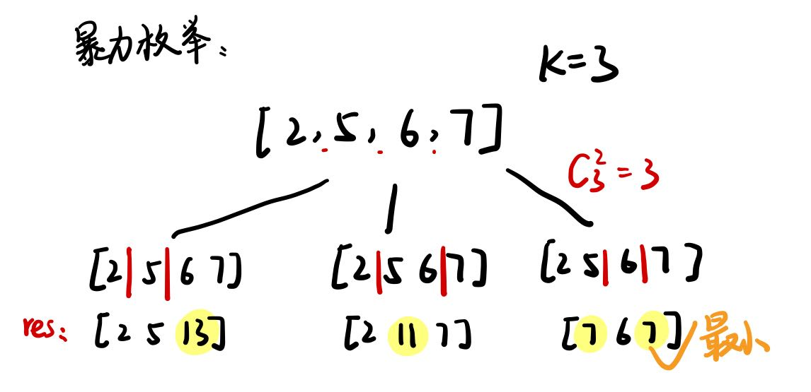
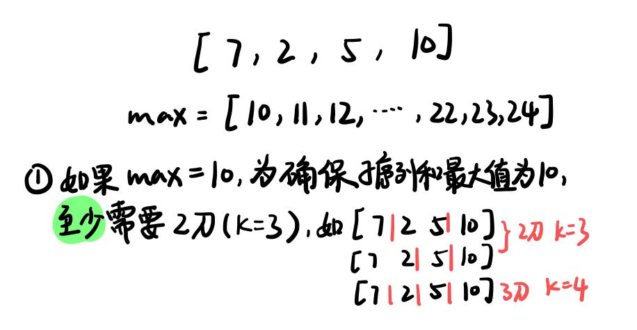
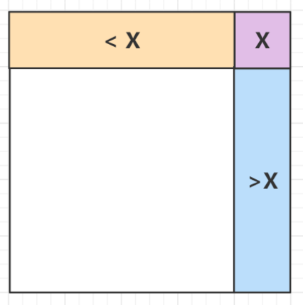
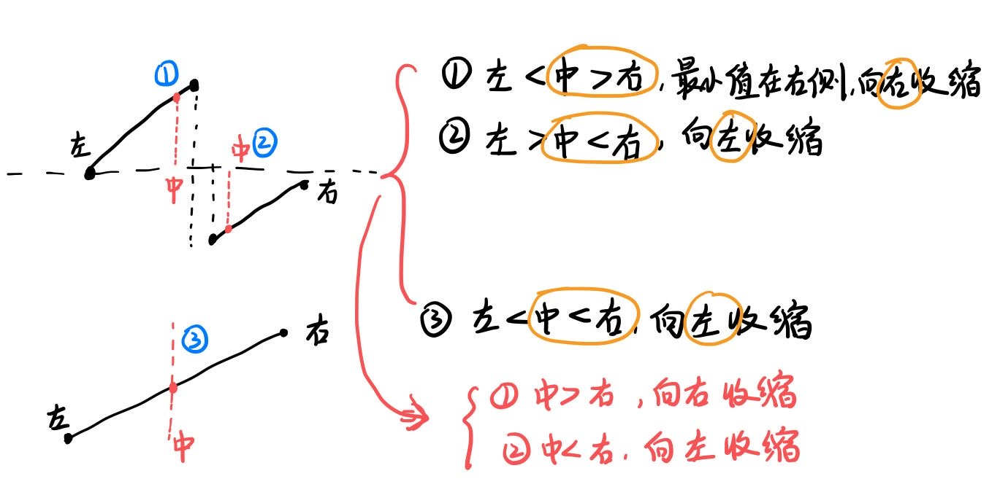
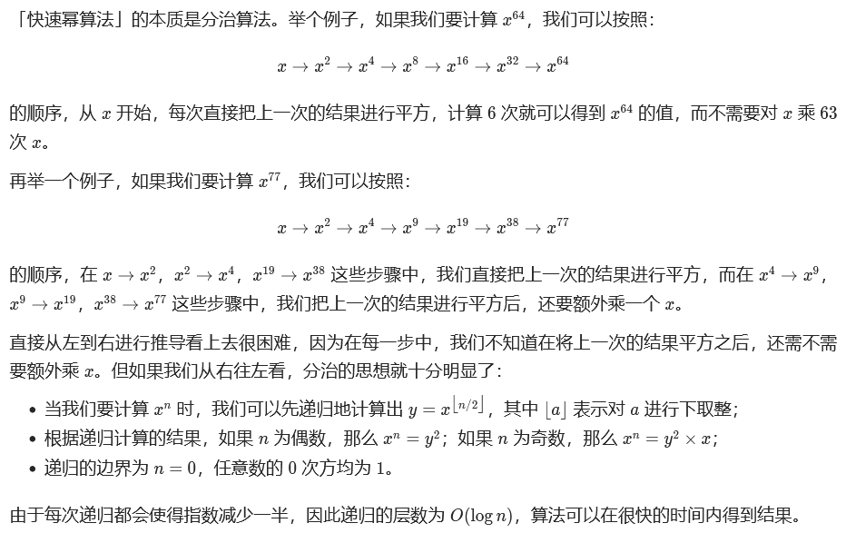
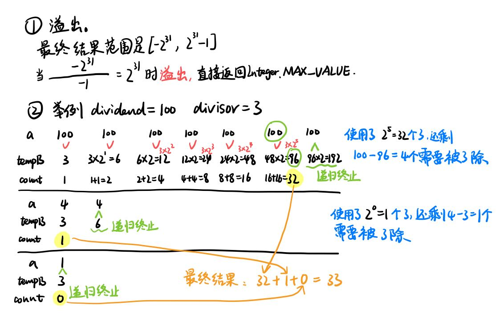

# 二分查找

# 模板:有序数组中搜索指定元素

## 1、寻找一个数（基本的二分查找）

即搜索一个数，如果存在，返回其索引，否则返回 -1。

```java
int binarySearch(int[] nums, int target) {
    int left = 0; 
    int right = nums.length - 1; // 注意

    while(left <= right) {
        int mid = left + (right - left) / 2;
        if(nums[mid] == target)
            return mid; 
        else if (nums[mid] < target)
            left = mid + 1; // 注意
        else if (nums[mid] > target)
            right = mid - 1; // 注意
    }
    return -1;
}
```

## 2、搜索左侧边界

```java
int left_bound(int[] nums, int target) {
    int left = 0;
    int right = nums.length; // 注意
  
    while (left < right) { // 注意
        int mid = left + (right - left) / 2;
        if (nums[mid] == target) {
            right = mid;
        } else if (nums[mid] < target) {
            left = mid + 1;
        } else if (nums[mid] > target) {
            right = mid; // 注意
        }
    }
    // 此时 target 比所有数都大，返回 -1
    if (left == nums.length) return -1;
    // 判断一下 nums[left] 是不是 target
    return nums[left] == target ? left : -1;
}
```

## 3、搜索右侧边界

```java
int right_bound(int[] nums, int target) {
    int left = 0, right = nums.length;
  
    while (left < right) {
        int mid = left + (right - left) / 2;
        if (nums[mid] == target) {
            left = mid + 1; // 注意
        } else if (nums[mid] < target) {
            left = mid + 1;
        } else if (nums[mid] > target) {
            right = mid;
        }
    }
    // 判断 target 是否存在于 nums 中
    // 此时 left - 1 索引越界
    if (left - 1 < 0) return -1;
    // 判断一下 nums[left] 是不是 target
    return nums[left - 1] == target ? (left - 1) : -1;
}
```

# [LC 74：Search a 2D Matrix](https://leetcode.com/problems/search-a-2d-matrix/)

思路：将二维矩阵转换成一维数组即可。

完整代码如下：

```java
class Solution {
    int m;
    int n;
    public boolean searchMatrix(int[][] matrix, int target) {
        m = matrix.length;
        n = matrix[0].length;
        int[] arr = new int[m*n];
  
        int idx = 0;
        for (int i = 0; i < m; i += 1) {
            for (int j = 0; j < n; j += 1) {
                arr[idx] = matrix[i][j];
                idx += 1;
            }
        }
        //二分查找:左闭右闭区间
        int left = 0, right = arr.length - 1;
        while (left <= right) {
            int mid = left + (right-left)/2;
            if (arr[mid] == target) {
                return true;
            } else if (arr[mid] > target) {
                right = mid - 1;
            } else if (arr[mid] < target) {
                left = mid + 1;
            }
        }
        return false;
    }
}
```

# [LC 81： Search in Rotated Sorted Array II](https://leetcode.com/problems/search-in-rotated-sorted-array-ii/)

可分为三种情况：

1、例如10111或者11101。此时nums[start] == nums[mid],无法区分mid点在前半段还是后半段。此时start++，相当于去掉一个重复的干扰项以缩小区间范围，此时即使nums[start] == target，也不影响最终结果，因为还有一个nums[mid] == target

2、34512。即nums[start] < nums[mid]，则说明mid点在前半段。如果nums[start]<= target < nums[mid]，说明target在前半段，所以令end = mid -1，否则target在后半段，另start = mid + 1

3、45123。即nums[start] > nums[mid]，则说明mid点在后半段。如果nums[mid]< target <= nums[end]，说明target在后半段，所以另start = mid +1，否则target在后半段，另end = mid -1。

完整代码如下：

```java
class Solution {
    public boolean search(int[] nums, int target) {
        int start = 0;
        int end = nums.length - 1;
        //左闭右闭区间
        while (start <= end) {
            int mid = start + (end-start)/2;
            if (nums[mid] == target) {
                return true;
            }
            if (nums[start] < nums[mid]) {//说明mid点在前半段
                //如果target在前半段
                if (nums[start] <= target && target < nums[mid]) {
                    end = mid - 1;
                } else {//反之target在后半段
                    start = mid + 1;
                }
            } else if (nums[start] > nums[mid]) {//如果mid点在后半段
                //如果target在后半段
                if (nums[mid] < target && target <= nums[end]) {
                    start = mid + 1;
                } else {
                    end = mid - 1;
                }
            } else if (nums[start] == nums[mid]) {//无法区分mid点的位置
                start += 1;
            }  
        }
        return false;
    }
}
```

# 同类型题目

## [LC 410: Split Array Largest Sum](https://leetcode.com/problems/split-array-largest-sum/)

### 思路：二分查找、最大值的最小化，搜索左侧边界

查找一个有范围的整数→二分法

暴力穷举：

思路：假设数组长度为n，那元素之间一共有n-1个空格，要在n-1个空格中选k个。



反向思考：

1、如果不考虑k值限制，要想使得各子序列和的最大值最小，那就是切n-1刀，即每个元素为一个子序列（注意：题目中说了，数组中的元素为**非负整数**）。此时序列和的最大值就是数组中的最大元素的值。

2、什么时候序列和最大值最大呢？就是一刀都不切，即k == 1，此时子序列和只有一个元素，就是sum(nums)。

3、由此可得子序列和的最大值max的范围是[数组中的最大元素的值start，数组中所有元素值的和end]。（说明：这里提到的max指的就是将数组分成多个子序列后，所有子序列和中的最大值）。

4、于是我们得到了一个新的**单调不减**数组max = [start, start+1, start+2, ..., end-1, end]，在这个数组中我们需要找到一个最小的max，使得将数组分成k个子序列后的最大子序列和刚好为max，如果有多个max都能满足，要搜索到最小的，所以这道题其实是搜索数组的左侧边界。

例如nums = [7,2,5,10]，可以看到，max的范围是[10,24]，若max = 10，要保证子序列和最大值为10，有三种情况[7 | 2  5 |  10], [7 2 | 5 |  10], [7 | 2 | 5 |  10]。可以看到，**至少**需要分成3个非空子序列。如果此时题目给定的k == 3，因为我们要找的是max的最小值，所以区间向左收缩。如果k > 3，说明最终target < 10，区间向左收缩；如果k < 3, 说明最终target > 10，区间向右收缩。



（这里有个**比例关系**：**k越大，max越小**，当k == len(nums) - 1时，max达到最小，即数组中的最大元素的值；反之，**k越小，max越大**，当 看== 1时，max达到最大，即数组中所有元素值的和）

完整代码如下：

```java
class Solution {
    public int splitArray(int[] nums, int k) {
        if (nums.length == 1 && k == 1) {
            return nums[0];
        }
        //先找到数组中的最大元素的值start，和数组元素之和end
        int start = -1;
        int end = 0;
        for (int i = 0; i < nums.length; i += 1) {
            start = Math.max(start, nums[i]);
            end += nums[i];
        }
  
        //开始二分查找
        //左闭右开区间
        end += 1;
        while (start < end) {
            int mid = start + (end-start)/2;
            int n = split(nums, mid);
            if (n == k) {//向左收缩区间
                end = mid;
            } else if (n > k) {//向右收缩区间
                start = mid + 1;
            } else if (n < k) {//向左收缩区间
                end = mid;
            }
        }
        return start;
    }
  
    //将一个数组分割成若干个子序列，并且保证所有子序列和的最大值为max
    //返回至少需要分割成几个子序列
    public int split(int[] nums, int max) {
        int count = 1;//至少可以分割成一个子序列
        int sum = 0;//记录每个子序列的元素和
        for (int i = 0; i < nums.length; i += 1) {
            if (sum + nums[i] > max) {
                count += 1;//快要超过max了，所以切一刀
                sum = nums[i];
            } else {
                sum += nums[i];
            }
        }
        return count;
    }
}
```

## [LC 875：Koko Eating Bananas](https://leetcode.com/problems/koko-eating-bananas/)

思路：

1、k越小，需要的h越大。

**k的范围是[1, piles中的最大元素]**。注意：每小时最多吃一串香蕉。

当k == 1时，需要的h达到最大为sum(piles)（piles中的元素均大于或等于1）；当k == piles中的最大元素时，需要的h最小为len(piles)。

所以h的范围就是[len(piles), sum(piles)]

所以题目就是在[1, len(piles)]范围内，找到满足h小时吃完的最小的k值。

完整代码如下：

```java
class Solution {
    public int minEatingSpeed(int[] piles, int h) {
        //先找到k的取值范围，即最大值start，最小值end
        int start = 1;
        int end = -1;
        for (int p: piles) {
            end = Math.max(end, p);
        }
        //开始二分查找
        //左闭右开
        end += 1;
        while (start < end) {
            int mid = start + (end-start)/2;
            int hour = calculateTime(piles, mid);
            if (hour == h) {
                end = mid;
            } else if (hour > h) {
                start = mid + 1;
            } else if (hour < h) {
                end = mid;
            }
        }
        return start; 
    }
  
    //假设koko吃香蕉的速度为k/每小时,计算出需要多少个小时才能吃完
    public int calculateTime(int[] piles, int k) {
        int count = 0;//至少需要这么多时间
        for (int i = 0; i < piles.length; i += 1) {
            if (piles[i] > k) {
                //不知道为什么用Math.ceil()有bug
                int r = piles[i]/k, m = piles[i]%k;
                int temp = m == 0 ? r : r+1;
                count += temp;
            } else {
                count += 1;
            }
        }
        return count;
    }
}
```

## [LC 1482: Minimum Number of Days to Make m Bouquets](https://leetcode.com/problems/minimum-number-of-days-to-make-m-bouquets/)

思路：

1、参数说明：要求制作m个花束，每个花束需要使用k朵连续的已经开了的花（连续表示在bloomDay数组中连续）。

2、先确定需要等待的天数范围：最小值就是bloomDay数组中的最小值，最大值就是bloomDay数组中的最大值。

3、关于function check()的说明：

假设check([7,7,7,7,12,7,7], mid = 10, m = 2, k = 3):

在第10天，[ T,T,T,T,F,T,T ] (T表示已经开花，F表示未开)，可以看到只有一个连续的3个T，所以只能制作一个花束。而要求做m=2个，所以返回false。

完整代码如下：

 时间复杂度：O（nlogm), n 为 bloomDay 的长度, m 为 bloomDay 的最大值，其中check函数的时间复杂度为O(n)。

空间复杂度：O(1)

```java
class Solution {
    public int minDays(int[] bloomDay, int m, int k) {//要做m个花束，每个花束需要k多连续的花
        if (bloomDay.length < m*k) {
            return -1;
        }
        //先得到需要等待的天数的范围
        int start = bloomDay[0];
        int end = -1;
        for (int day:bloomDay) {
            start = Math.min(start, day);
            end = Math.max(end, day); 
        }
        //开始二分查找
        //左闭右开区间
        end += 1;
        while (start < end) {
            int mid = start + (end-start)/2;
            if (check(bloomDay, mid, m, k)) {//mid天可以完成任务
                end = mid;//则朝左收缩，看天数更小点会不会仍然能完成任务
            } else {//不能完成任务
                start = mid+1;//向右收缩
            }
        }
        //需要check最终得到的结果能否满足要求
        return check(bloomDay, start, m, k) ? start : -1;  
    }
  
    //check等待mid天能否制作m个花束，每个花束k朵连续的已经开了的花
    //其实就是数在第mid天，bloomDay中多少个k个连续开了的花，数量大于等于m则返回true
    private boolean check(int[] bloomDay, int mid, int m, int k) {
        int bouquet = 0;//记录花束的数量
        int flower = 0;//记录连续的花朵的数量
        for (int day: bloomDay) {
            if (day <= mid) {//第i朵花在第mid天已经开了
                flower += 1;
                if (flower == k) {//k朵连续的花达成，做成一个花束
                    bouquet += 1;
                    flower = 0;//置为0
                }
            } else {//第i朵花在第mid天还没开.不连续了
                flower = 0;
            }
            if (bouquet >= m) {
                return true;
            }
        }
        return false;
    }
}
```

# [LC 240: Search a 2D Matrix II](https://leetcode.com/problems/search-a-2d-matrix-ii/)

## sol 1: 从右上角出发、二分查找

图解：

从点matrix[0][n-1]开始出发，如果大于target，则**左移**寻找更小值，如果小于target，则**下移**寻找更大值。



完整代码如下：

每个格子最多遍历一遍，时间复杂度为O(m+n)

空间复杂度O(1)

```java
class Solution {
    public boolean searchMatrix(int[][] matrix, int target) {
        int m = matrix.length;
        int n = matrix[0].length;
  
        int x = 0, y = n - 1;
        while (x < m && y >= 0) {
            if (matrix[x][y] == target) {
                return true;
            } else if (matrix[x][y] > target) {
                y -= 1;
            } else if (matrix[x][y] < target) {
                x += 1;
            }
        }
        return false;
    }
}
```

## sol 2: 逐行进行二分查找

完整代码如下：

时间复杂度：**O**(**m**∗**lo**g**n**)或 O(n∗log⁡m)（当逐列遍历时）

空间复杂度：**O**(**1**)

```java
class Solution {
    public boolean searchMatrix(int[][] matrix, int target) {
        int m = matrix.length;
        int n = matrix[0].length;
  
        //逐行遍历
        //每一行进行一次二分查找
        for (int i = 0; i < m; i += 1) {
            //左闭右闭区间
            int l = 0, r = n-1;
            while (l <= r) {
                int mid = l + (r-l)/2;
                if (matrix[i][mid] == target) {
                    return true;
                } else if (matrix[i][mid] > target) {
                    r = mid - 1;
                } else if (matrix[i][mid] < target) {
                    l = mid + 1;
                }
            }
        }
        return false;
    }
}
```

# [LC 287: Find the Duplicate Number](https://leetcode.com/problems/find-the-duplicate-number/)

## 思路：二分查找、pigeonhole principle

思路：

1、查找一个有范围的整数→二分查找

2、这道题有诸多限制，例如不能修改输入数组，不能使用额外的空间。

3、输入数组的元素范围是给定的，即[1,n]，所以这道题可以转化为在有序数组[1,n]中寻找一个target（这个target就是输入数组中重复的那个元素）。

4、开始使用二分查找：假设先猜mid，在输入数组中统计有count个元素是**小于等于**mid的。

利用pigeonhole principle（把count个物品放入mid个箱子里）可以知道，如果count > mid，说明重复的数字出现在区间[left, mid-1]，即区间向左收缩，反之在[mid+1,right]，区间向右收缩。

完整代码如下：

注意：这里是一个**左闭右开**区间。

假设n = 5，那么nums的长度就是n+1 = 6, 需要查找的数字是在数组[1,2,3,4,5]中，所以left = 0, right = 5是**左闭右开**区间。

```java
class Solution {
    public int findDuplicate(int[] nums) { 
        int left = 0;
        int right = nums.length - 1;
        //开始二分查找
        //左闭右开区间
        while (left < right) {
            int mid = left + (right-left)/2;
            int count = count(nums, mid);
            if (count > mid) {//向左收缩
                right = mid;
            } else {
                left = mid + 1;
            }
 
        }
        return left; 
    }
    //统计在数组nums中有多少个数字小于等于mid，
    //返回个数count
    public int count(int[] nums, int mid) {
        int count = 0;
        for (int num:nums) {
            if (num <= mid) {
                count += 1;
            }
        }
        return count;
    }
}
```

# [LC 153：Find Minimum in Rotated Sorted Array](https://leetcode.com/problems/find-minimum-in-rotated-sorted-array/)

## 思路：二分查找、LC81

思路：

1、注意：未rotated之前的数组是**单调递增**的；数组中的**每个元素是唯一**的。

2、这里有三种情况，如图解所示。

最后总结出来需要将nums[mid]和nums[right]进行比较，来判断当前区间应该向左还是向右收缩；这里是和LC 81不同的地方，LC81是nums[mid]和nums[left]进行比较。

3、代码中运用二分查找时，是左闭右闭区间，但可以看到具体写法和模板是有区别的，例如while循环的条件是(left < right)而不是(left <= right)，向左收缩时，是right = mid 而不是right = mid - 1。最大的区别在于，while循环中是没有return语句的，也就是说，只有当left ==right时，才会退出while循环。所以这里不能写成(left <= right)，否则无法退出while循环。

图解：



完整代码如下：

```java
class Solution {
    public int findMin(int[] nums) {
        //二分查找
        //左闭右闭区间
        int left = 0;
        int right = nums.length - 1;
        while (left < right) {//left == right时循环结束
            int mid = left + (right-left)/2;
            if (nums[mid] > nums[right]) {
                //注意：因为中值大于右值，所以中值肯定不是最小值，所以左边界收缩到mid+1
                left = mid + 1;
            } else if (nums[mid] < nums[right]){//中值小于右值，向左收缩
                right = mid;//中值也可能是最小值，所以右边界收缩到mid
            }//所有元素是唯一的，所以不存在相等的情况
        }
        return nums[left];
    }
}
```

# [LC 50：Pow(x, n)](https://leetcode.com/problems/powx-n/)

## 思路：快速幂、递归、迭代

## sol 1：快速幂+递归

快速幂算法：



完整代码如下：

时间复杂度：O(log⁡n)，即为递归的层数。

空间复杂度：O(log⁡n)，即为递归的层数。这是由于递归的函数调用会使用栈空间。

```java
class Solution {
    public double myPow(double x, int n) {
        //如果不将n转换成long类型，就无法通过测试用例301
        long N = n;
        return N > 0 ? helper(x, N) : 1.0/helper(x, -N);
  
    }
    public double helper(double x, long N) {
        if (N == 0) {
            return 1.0;
        }
        if (N%2 == 0) {
            return helper(x*x, N/2);
        } else {
            return helper(x*x,N/2)*x;
        }  
    }
}
```

## sol 2：迭代+二进制（略）

# [LC 162: Find Peak Element](https://leetcode.com/problems/find-peak-element/)

## 思路：二分查找、寻找一个数

思路：这道题相当于在数组[0,1,2,...,n-3,n-2,n-1]中寻找一个目标值。所以可以用二分查找。

完整代码如下：

注意：题目中说明了数组nums中的元素都是唯一的。

```java
class Solution {
    public int findPeakElement(int[] nums) {
        int n =nums.length;
        if (n == 1) {
            return 0;
        }
        //先考虑第一个元素和最后一个元素为peak的情况
        if (nums[0] > nums[1]) {
            return 0;
        }
        if (nums[n-1] > nums[n-2]) {
            return n-1;
        }
        //要在区间[1,n-2]中找到一个目标值
        //注意：区间变成了[1,n-2]，而不是[0，n-1]
        //因为要刨去第一个和最后一个元素的index。
        int start = 1;
        int end = n - 2;
        //左闭右闭区间
        while (start <= end) {
            int mid = start + (end - start)/2;
            if (nums[mid] > nums[mid-1] && nums[mid] > nums[mid+1]) {
                return mid;
            } else if (nums[mid] < nums[mid-1]) {//说明点mid-1有可能是peak
                end = mid - 1;//朝左收缩
            } else if (nums[mid] < nums[mid+1]) {//说明点mid+1有可能是peak
                start = mid + 1;//朝右收缩
            }   
        }
        //当数组中不存在这样一个peak时，返回-1。
        return -1;
    }
}
```

# [LC 378: Kth Smallest Element in a Sorted Matrix](https://leetcode.com/problems/kth-smallest-element-in-a-sorted-matrix/)

思路：

1、这道题就是在[ matrix[0][0], matrix[n-1][n-1] ]这个范围内寻找目标值。

2、确定目标值的方法就是数matrix中有count个数<=mid，

如果count < k， 那么目标值一定是在mid的右侧，所以向右收缩，即left = mid + 1

如果count == k, 情况就比较复杂了。目标值有可能就是mid，也可能小于mid（见下文举例）

如果count > k，目标值可能就是mid，也可能小于mid（见下文举例）

所以当count = k时，更新后的区间还**需要包括mid**，即right = mid （而不是mid-1）

错误代码：

1、当count == k时，并不能直接返回mid

例如：

```
matrix = [[1,5,9],[10,11,13],[12,13,15]], k = 8
```

当mid = 14时，count = 8，如果此时返回mid，错误

因为正确答案是当mid = 13时，count = 8

2、当count > k时，向左收缩的右边界应该是到mid而不是mid-1。

例如：[1,2,3,4,5,5,5,5,6,7]，k= 5

题目中说明了，每行每列是**单调不增**的，也就是有可能有重复元素。

当mid = 5时，count = 8。此时count > k,但是mid就是最后的正确答案，因为有多个重复元素5。也就是说排名第k的元素可能不止一个，这种情况下，count就会大于k。所以向左收缩时需要包括mid。

```java
//开始二分查找
        //左闭右闭区间
        while (left <= right) {
            int mid = left + (right-left)/2;
            int count = count(matrix, mid);
            if (count == k) {//错在这里！！！
                return mid;
            } else if (count > k) {//向左收缩
                right = mid - 1;//错在这里！！！
            } else if (count < k) {
                left = mid + 1;
            }
        }
        //表示没找到答案
        return -1;
```

正确代码如下：

注意：虽然是左闭右闭区间，但while循环中没有return语句，所以while循环条件是left < right,而不是left <= right。这样当left == right时，退出循环。

```java
class Solution {
    public int kthSmallest(int[][] matrix, int k) {
        int n = matrix.length;
        int left = matrix[0][0];
        int right = matrix[n-1][n-1];
        //开始二分查找
        //左闭右闭区间
        while (left < right) {
            int mid = left + (right-left)/2;
            int count = count(matrix, mid);
            if (count == k) {//向左收缩
                right = mid;//mid也有可能是正确答案，所以右边界收缩到mid而不是mid-1
            } else if (count > k) {//向左收缩
                right = mid;
            } else if (count < k) {//向右收缩
                left = mid + 1;
            }
        }
        return left; 
    }

    //数出matrix中小于等于mid的元素有多少个。
    public int count(int[][] matrix, int mid) {
        int n = matrix.length;
        int cnt = 0;
        //一列一列进行遍历，数出每一列有多少个元素<=mid
        int x = n - 1;
        int y = 0;
        while (x >= 0 && y < n) {
            if (matrix[x][y] <= mid) {
                cnt += x + 1;
                y += 1;
            } else {
                x -= 1;
            }
        }
        return cnt;
    }
}
```

# [LC 29: Divide Two Integers](https://leetcode.com/problems/divide-two-integers/description/)

思路：

图解：



完整代码如下：

```java
class Solution {
    public int divide(int dividend, int divisor) {
        if (divisor == -1 && dividend == Integer.MIN_VALUE) {//溢出
            return Integer.MAX_VALUE;
        }
        if (divisor == 1) {
            return dividend;
        }
        if (divisor == -1) {
            return -dividend;
        }

        // 把被除数与除数调整为正数,为防止被除数Integer.MIN_VALUE转换为正数会溢出，
        //使用long类型保存参数
        long a = dividend;
        long b = divisor;
        int sign = 1;
        if (a<0&&b>0 || a>0&&b<0) {
            sign = -1;
        }
        a = a > 0 ? a : -a;
        b = b > 0 ? b : -b;

        int res = div(a, b);
        return sign == -1 ? -res : res;   
    }
    //a表示dividend，b表示divisor，均为正数
    public int div(long a, long b) {
        if (a < b) {
            return 0;
        }
        int count = 1;//记录用了多少个b
        long tempB = b;//不断翻倍的被除数
        while (tempB+tempB < a) {
            tempB += tempB;
            count += count;
        }
        return count + div(a-tempB,b);
    }
}
```

# [LC 154：Find Minimum in Rotated Sorted Array II](https://leetcode.com/problems/find-minimum-in-rotated-sorted-array-ii/description/)

思路：

这里把LC81、LC 153和LC 154放在一起看：

lc81：rotated sorted array，有重复元素，求数组中是否有target值

lc153：rotated sorted array，所有元素唯一，求数组中的最小值

lc154：rotated sorted array，有重复元素，求数组中的最小值

而lc154的解法就是综合了lc81和lc153。首先基本思路和lc153一模一样，而在对重复元素的处理上借鉴了lc81的做法，即排除一个重复的干扰项。然后这道题就解决了！

完整代码如下：

```java
class Solution {
    public int findMin(int[] nums) {
        int left = 0;
        int right = nums.length - 1;
        //开始二分查找
        //左闭右开区间
        while (left < right) {
            int mid = left + (right-left)/2;
            if (nums[mid] > nums[right]) {
                left = mid + 1;
            } else if (nums[mid] < nums[right]) {
                right = mid;
            } else if (nums[mid] == nums[right]) {//无法区分mid的位置
                right -= 1;//排除一个重复的干扰项
            }
        }
        return nums[left];  
    }
}
```

ddd
