# [LC 146 ：LRU Cache](https://leetcode.com/problems/lru-cache/description/)

## 关于LinkedHashMap

LRU 缓存算法的核心数据结构就是哈希链表

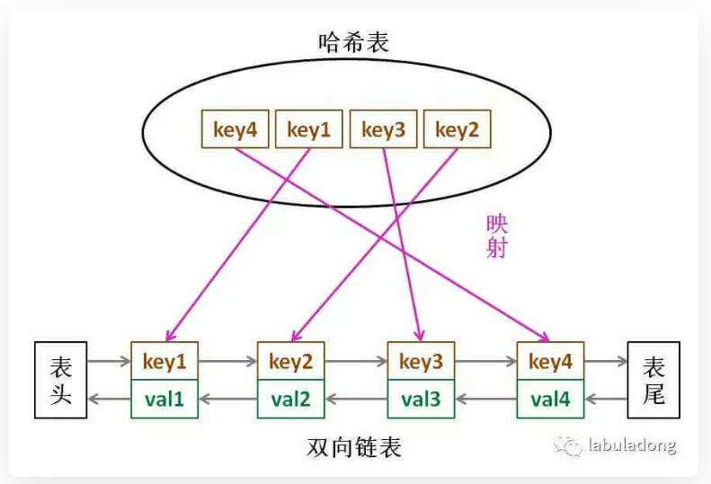

关于put()：

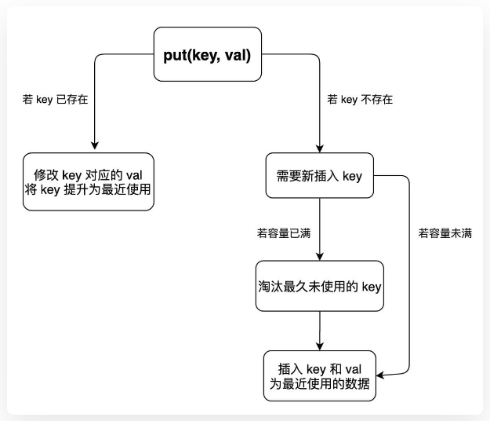

完整代码如下：

```java

class LRUCache {
    int cap;
    LinkedHashMap<Integer, Integer> cache;

    public LRUCache(int capacity) {
        this.cap = capacity;
        cache = new LinkedHashMap<>();   
    }
  
    public int get(int key) {
        if (!cache.containsKey(key)) {
            return -1;
        }
        makeRecently(key);
        return cache.get(key);  
    }
  
    public void put(int key, int value) {
        if (cache.containsKey(key)) {
            cache.remove(key);
            cache.put(key, value);
            return;
        }
        if (cache.size() == cap) {
            int oldestKey = cache.keySet().iterator().next();
            cache.remove(oldestKey);
        }
        cache.put(key, value);  
    }

    private void makeRecently(int key) {
        int val = cache.get(key);
        cache.remove(key);
        cache.put(key, val);
    }
}
```

# [LC 460：LFU Cache](https://leetcode.com/problems/lfu-cache/)

题目要求：

1、给定一个参数capacity，实现get和put方法：

get(key)：在缓存中查询key，若key存在，则返回对应的val，否则返回-1。

put(key, val)：如果key已经存在，修改对应的val；反之插入键值对(key, val)。当缓存容量达到capacity时，在插入新的键值对之前，需要删除使用频次freq最低的键值对，如果freq最低的键值对不止一个，则删除最旧的那个（即删除least recently used one)。

具体实现：

需要用到如下数据结构：

1、哈希表KV：HashMap<key, val>，存储key到val的映射，可以快速实现get(key);

2、哈希表KF：HashMap<key, frequency>，存储key到freq的映射，可以快速查询key对应的freq。

3、哈希表FK：HashMap<freq, LinkedHashSet `<keys>` >

存储freq到keys的映射，因为同样的freq可能对应多个keys（即一对多的关系），在删除freq最小的键值对时，需要删除同频次的keys中最旧的那个，所以需要保证freq对应的keys列表是**存在时序**的。

4、当用get或者put方法访问某一个key时，该key对应的freq需要加一。所以对应地需要写一个**increaseFreq(key)**的方法。

关于为什么removeMinFreqKey()中，更新FK时不需要更新minFreq，因为只有在put方法中才会调用removeMinFreqKey方法，而在put方法的最后，已经将minFreq更新为1了。

完整代码如下：

```java
class LFUCache {
    int cap;
    HashMap<Integer, Integer> keyToVal;
    HashMap<Integer, Integer> keyToFreq;
    HashMap<Integer, LinkedHashSet<Integer>> freqToKeys;
    int minFreq;
    // 初始化
    public LFUCache(int capacity) {
        this.cap = capacity;
        this.minFreq = 0;
        keyToVal = new HashMap<>();
        keyToFreq = new HashMap<>();
        freqToKeys = new HashMap<>();
    }

    // 在缓存中查询key
    public int get(int key) {
        if (!keyToVal.containsKey(key)) {
            return -1;
        }
        // 重点！key对应的freq需要加1
        increaseFreq(key);
        return keyToVal.get(key);
    }

    // 将key和val放入缓存
    public void put(int key, int value) {
        if (this.cap == 0) {
            return;
        }
        // 如果key已经存在，则修改对应的val即可
        // 这里，三个哈希表只需要更新哈希表KV。
        if (keyToVal.containsKey(key)) {
            keyToVal.put(key, value);
            // key对应的freq加一
            increaseFreq(key);
            return;
        }
        // 如果key不存在，则需要插入键值对(key,val)
        // 如果容量已满，需要删除一个freq最小(多个的话删最旧的)的键值对
        // 这里需要同时更新KV,KF,FK
        if (keyToVal.size() >= this.cap) {
            removeMinFreqKey();
        }
        // 插入key和val，对应的freq加1
        // 这里需要更新三个哈希表：KV,KF,FK
        keyToVal.put(key, value);
        keyToFreq.put(key, 1);
        freqToKeys.putIfAbsent(1, new LinkedHashSet<>());
        freqToKeys.get(1).add(key);
        // 插入新的键值对后，需要更新最小freq
        this.minFreq = 1;
    }

    // 需要更新哈希表KF，FK
    private void increaseFreq(int key) {
        int freq = keyToFreq.get(key);
        // 更新KF表
        keyToFreq.put(key, freq + 1);// 自动覆盖了key原来对应的val
        // 更新FK表
        // 先删除freq对应的key列表中的key
        freqToKeys.get(freq).remove(key);
        // 如果此时freq对应的key列表为空，则删除这个freq
        if (freqToKeys.get(freq).isEmpty()) {
            freqToKeys.remove(freq);
            // 如果删除的freq刚好是minFreq，则更新minFreq！！！
            if (freq == this.minFreq) {
                this.minFreq += 1;
            }  
        }
        // 再在freq+1对应的key列表中添加key
        freqToKeys.putIfAbsent(freq + 1, new LinkedHashSet<>());
        freqToKeys.get(freq + 1).add(key);
    }

    // 需要同时更新KV，
    private void removeMinFreqKey() {
        // 最小freq对应的key列表
        LinkedHashSet<Integer> keyList = freqToKeys.get(this.minFreq);
        // 先找到需要删除的key
        int keyRemoved = keyList.iterator().next();
        // 更新FK
        keyList.remove(keyRemoved);
        if (keyList.isEmpty()) {
            freqToKeys.remove(this.minFreq);// 不需要再更新minFreq
        }
        // 更新KV
        keyToVal.remove(keyRemoved);
        // 更新KF
        keyToFreq.remove(keyRemoved);
    }
}
```

# [Trie](https://mp.weixin.qq.com/s/hGrTUmM1zusPZZ0nA9aaNw)

关于Trie的内容均参考[labuladong的这篇文章](https://mp.weixin.qq.com/s/hGrTUmM1zusPZZ0nA9aaNw)。

# [LC 295：Find Median from Data Stream](https://leetcode.com/problems/find-median-from-data-stream/description/)

思路：用两个优先队列

poll()：从**堆顶**删除一个元素

大顶堆：代码中符号为large(与图片刚好相反)

小顶堆：代码中符号为small(与图片刚好相反)

维护两个堆需要满足的要求：

1、两个堆中元素个数之差不能超过1

最后结果：

如果large.size() > small.size(),则说明中位数在large的**堆顶**；反之在small的**堆顶**。

如果large.size() == small.size(), 则中位数是两个堆的堆顶元素的平均数。

重难点：如何实现addNum()？

不能直接朝两个堆添加元素，具体做法见代码。


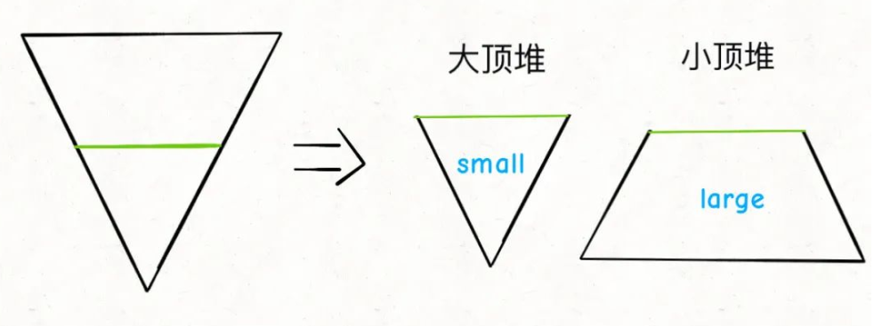

完整代码如下：

```java
class MedianFinder {
    //大顶堆
    private PriorityQueue<Integer> large;
    //小顶堆
    private PriorityQueue<Integer> small;

    public MedianFinder() {
        large = new PriorityQueue<>((a,b)-> {
            return b - a;
        });
        small = new PriorityQueue<>();  
    }
  
    public void addNum(int num) {
        if (large.size() >= small.size()) {
            large.offer(num);
            small.offer(large.poll());
        } else if (large.size() <= small.size()) {
            small.offer(num);
            large.offer(small.poll());
        }
  
    }
  
    public double findMedian() {
        if (large.size() > small.size()) {
            return large.peek();
        } else if (large.size() < small.size()) {
            return small.peek();
        }
        //这里必须是2.0，而不是2，否则报错
        return (large.peek()+small.peek())/2.0;   
    }
}
```

# 滑动窗口

# [LC 239: Sliding Window Maximum](https://leetcode.com/problems/sliding-window-maximum/description/)

## sol 1: 优先队列

思路：使用大根堆，维护一系列元素中的最大值。

向右移动窗口时，堆顶元素可能已经不在窗口中，则需要将其移除。注意，需要移除的元素一定是在滑动窗口左边界的左侧，即其**索引小于i-(k-1)**（见图示)

图解：

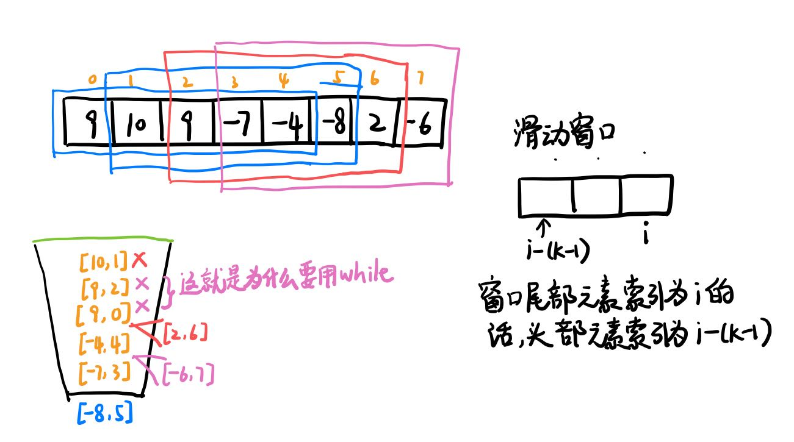

完整代码如下：

时间复杂度：O(nlog⁡n)，其中 n 是数组 nums的长度。在最坏情况下，数组 nums 中的元素单调递增，那么最终优先队列中包含了所有元素，没有元素被移除。由于**将一个元素放入优先队列的时间复杂度为 O(log⁡n)**，因此总时间复杂度为 O(nlog⁡n)。

空间复杂度：O(n)，即为优先队列需要使用的空间。这里所有的空间复杂度分析都不考虑返回的答案需要的 O(n) 空间，只计算额外的空间使用。

```java
class Solution {
    public int[] maxSlidingWindow(int[] nums, int k) {
        int n = nums.length;
        //大根堆
        //当两个元素相等时，按照其索引大小降序排列（即索引大的更靠近堆顶）
        //试了一下，这里索引大小的排序不影响最终结果，即不考虑索引的排序也能AC
        PriorityQueue<int[]> pq = new PriorityQueue<>(new Comparator<int[]>() {
            public int compare(int[] pair1, int[] pair2) {
                return pair1[0] != pair2[0] ? pair2[0] - pair1[0] : pair2[1] - pair1[1];
            }
        });
        //初始化：把窗口填满
        for (int i = 0; i < k; i += 1) {
            pq.offer(new int[]{nums[i], i});
        }
        //存放最终结果
        int[] res = new int[n-(k-1)];
        res[0] = pq.peek()[0];
        //窗口开始移动
        //for循环中的i可以看做是滑动窗中最后一个元素的索引
        for (int i = k; i < n; i += 1) {
            //先在窗口中加入新的元素nums[i]
            pq.offer(new int[]{nums[i], i});
            //这时堆顶元素有可能已经不在滑动窗口内
            //则需要出队列
            //i-(k-1)是此时滑动窗口中第一个元素的索引
            //关于这里为什么用while，详见图示
            while (pq.peek()[1] < i-(k-1)) {
                pq.poll();
            }
            res[i-(k-1)] = pq.peek()[0];
        }
        return res;  
    }
}
```

## sol 2: 单调队列

完整代码如下：

```java
class Solution {
    public int[] maxSlidingWindow(int[] nums, int k) {
        int n = nums.length;
        MonotonicQueue window = new MonotonicQueue();
        List<Integer> res = new ArrayList<>();
        for (int i = 0; i < n; i += 1) {
            if (i < k-1) {//先填充窗口前k-1个位置
                window.push(nums[i]);
            } else {
                window.push(nums[i]);//填充窗口中第k个元素
                //记录当前窗口的最大值
                res.add(window.max());
                //如果此时窗口最左边的元素是当前窗口的最大值，则移出
                if (window.max() == nums[i-(k-1)]) {
                    window.pop();
                }  
            }
        }
        //将最终结果转换成数组
        int[] arr = new int[n-(k-1)];
        for (int i = 0; i < res.size(); i += 1) {
            arr[i] = res.get(i);
        }  
        return arr; 
    }
  
    //单调队列是从队头到队尾单调不增
    class MonotonicQueue {
        //双链表，支持头尾增删元素
        LinkedList<Integer> maxq = new LinkedList<>();
        //在队列末尾添加一个元素
        public void push(int x) {
            //将小于x的元素全部移出队列
            while (!maxq.isEmpty() && maxq.getLast() < x) {
                maxq.pollLast();
            }
            maxq.addLast(x);
        }
        //返回队列中最大元素
        public int max() {
            return maxq.getFirst();
        }
        //删除队头元素
        public void pop() {
            maxq.pollFirst();
        }
    }
}
```

# [LC 622：Design Circular Queue](https://leetcode.com/problems/design-circular-queue/description/)

思路：用一个数组来实现；取模

完整代码如下：

```java
class MyCircularQueue {
    int head;
    int tail;
    int cap;
    int size;
    int[] nums;

    public MyCircularQueue(int k) {
        head = 0;
        tail = 0;
        cap = k;
        size = 0;
        nums = new int[k];   
    }
  
    public boolean enQueue(int value) {
        if (size == cap) {
            return false;
        }
        nums[tail%cap] = value;
        tail++;
        size++;
        return true;  
    }
  
    public boolean deQueue() {
        if (size == 0) {
            return false;
        }
        head++;
        size--;
        return true;   
    }
  
    public int Front() {
        if (size == 0) {
            return -1;
        }
        return nums[head%cap];  
    }
  
    public int Rear() {
        if (size == 0) {
            return -1;
        }
        return nums[(tail-1)%cap];  
    }
  
    public boolean isEmpty() {
        return size == 0;   
    }
  
    public boolean isFull() {
        return size == cap;  
    }
}
```

# [LC 1603：Design Parking System](https://leetcode.com/problems/design-parking-system/description/)

完整代码如下：

```java
class ParkingSystem {
    int bigCap, mediumCap, smallCap;
    int bigSize, mediumSize, smallSize;

    public ParkingSystem(int big, int medium, int small) {
        bigSize = 0;
        mediumSize = 0;
        smallSize = 0;
        bigCap = big;
        mediumCap = medium;
        smallCap = small;  
    }
  
    public boolean addCar(int carType) {
        if (carType == 1) {
            if (bigSize == bigCap) {
                return false;
            }
            bigSize++;
        } else if (carType == 2) {
            if (mediumSize == mediumCap) {
                return false;
            }
            mediumSize++;
        } else if (carType == 3) {
            if (smallSize == smallCap) {
                return false;
            }
            smallSize++;
        }
        return true;  
    }
}
```

# [LC 703：Kth Largest Element in a Stream](https://leetcode.com/problems/kth-largest-element-in-a-stream/description/)

完整代码如下：

初始化时间复杂度为：O(NlogK),N是nums的长度。优先队列的offer,poll操作的时间复杂度均为O(logK).

空间复杂度：O(k)。需要使用优先队列存储前k大元素。

```java
class KthLargest {
    //小根堆
    PriorityQueue<Integer> pq;
    int k;

    public KthLargest(int k, int[] nums) {
        pq = new PriorityQueue<>();
        this.k = k;
        for (int num:nums) {
            add(num);
        }   
    }
  
    public int add(int val) {
        pq.offer(val);
        if (pq.size() > k) {
            pq.poll();
        } 
        return pq.peek();   
    }
}
```

# [LC 705：Design HashSet](https://leetcode.com/problems/design-hashset/description/)

## sol 1：用boolean数组

思路：因为题目中给定了key都是int，且范围在 [0, 10^6]

我想到了数组，但又觉得数组好像不能快速查询某个值是否在数组中

完整代码如下：

时间和空间复杂度：O(1)

```java
class MyHashSet {
    boolean[] map; 

    public MyHashSet() {
        map = new boolean[1000009]; 
    }
  
    public void add(int key) {
        map[key] = true;  
    }
  
    public void remove(int key) {
        map[key] = false;   
    }
  
    public boolean contains(int key) {
        return map[key];  
    }
}
```

## sol 2: 用链表（略）

我想到了链表，但又觉得不知道如果用链表的话如何快速查找某个key

# [LC 706：Design HashMap](https://leetcode.com/problems/design-hashmap/description/)

## sol 1：用数组

思路跟lc705是一样的

完整代码如下：

```java
class MyHashMap {
    private int[] map;

    public MyHashMap() {
        map = new int[1000009]; 
        Arrays.fill(map, -1);  
    }
  
    public void put(int key, int value) {
        map[key] = value;
    }
  
    public int get(int key) {
        return map[key];
    }
  
    public void remove(int key) {
        map[key] = -1;
    }
}
```

## sol 2: 用链表（略，需要掌握）

# 二叉堆实现优先队列

完全二叉树(complete binary tree):设二叉树的深度为n，除第n层外，其他层(1-(n-1))的节点个数均达到**最大**个数(2^(level-1))，第n层所有的节点都连续集中在**最左侧**，则该二叉树为完全二叉树。

用数组实现二叉堆 -> 用二叉堆实现优先队列

## 一、二叉堆（Binary Heap）

二叉堆存储在数组中，本质是一种完全二叉树。

图解：

注意：

1、数组第一个索引0空着不用

2、二叉堆通过每个节点在数组中的索引来进行定位。

已知根节点索引为rootIndex, 则左孩子索引 = rootIndex *2, 右孩子索引 = rootInde*x*2 + 1

已知左孩子索引为leftIndex, 或已知右孩子索引为rightIndex，则根节点索引为leftIndex(或rightIndex) / 2

3、最大堆：每个节点的值 >= 左右子节点的值

对于最大堆来说，**堆顶元素**是所有元素中**最大**的。

最小堆：每个节点的值 <= 左右子节点的值

对于最小堆来说，**堆顶元素**是所有元素中**最小**的。

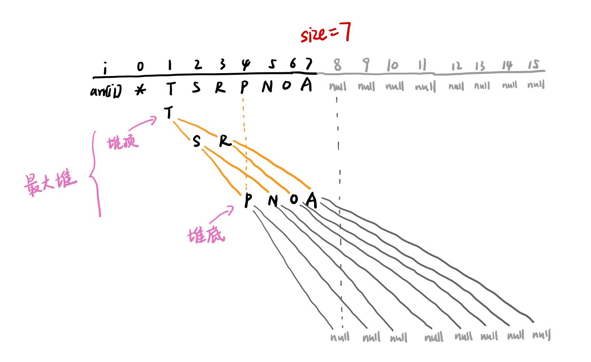

4、二叉堆最重要的API

（1）上浮

当子节点的值大于父节点时，该子节点需要上浮

图解：

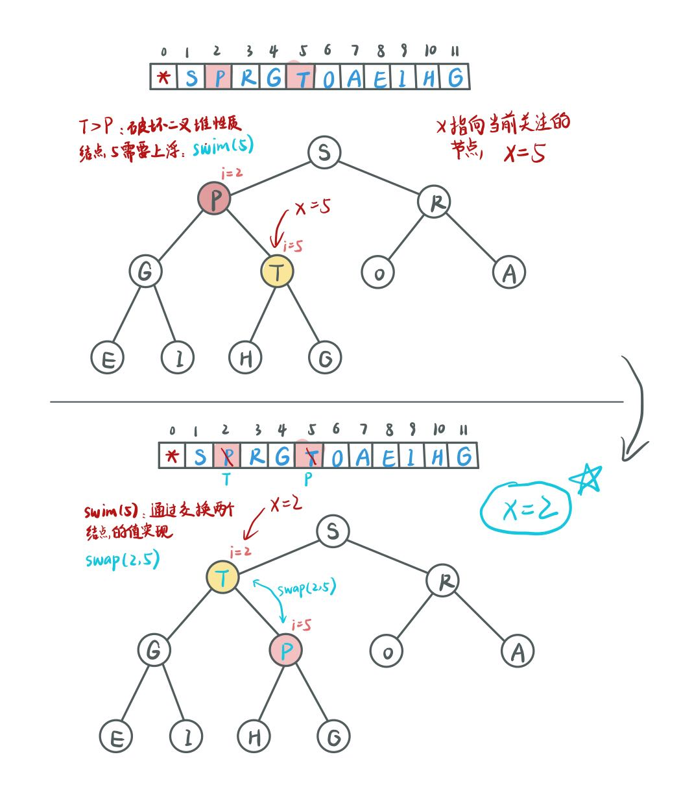

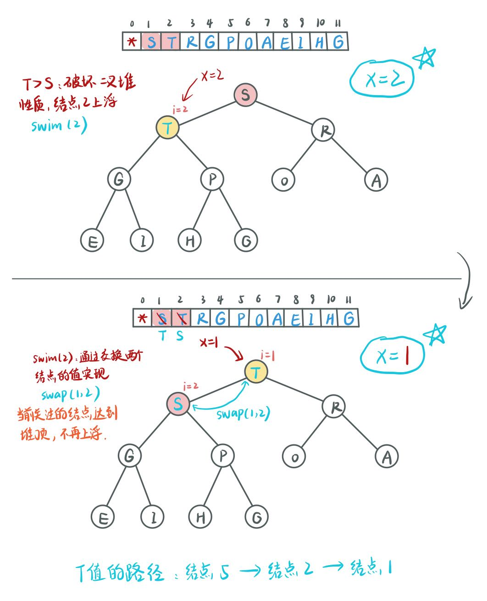

（2）下沉

当父节点小于左节点或右节点时，该父节点需要下沉，注意，下沉时父节点需要跟**左右节点中的较大者**互换。

图解：

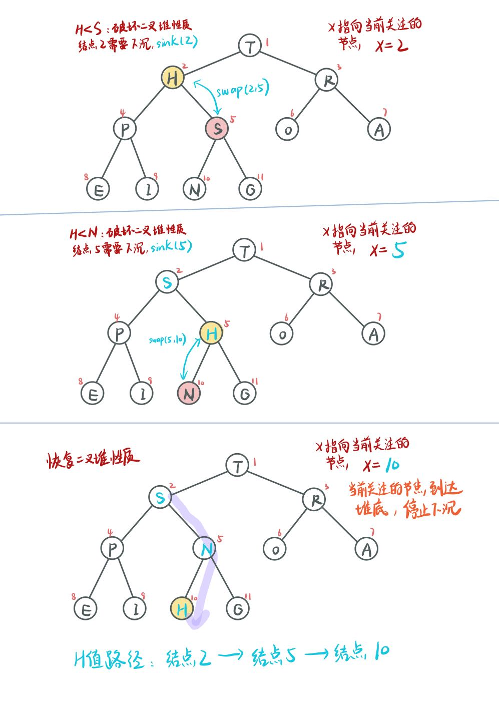

## 二、优先队列的实现

这里以实现大根堆为例：借助**最大堆**来实现**大根堆。**

大根堆最主要的两个API的实现：

(1) 插入：先把要插入的元素添加到堆底，然后再将其**上浮**到正确位置。

图解：

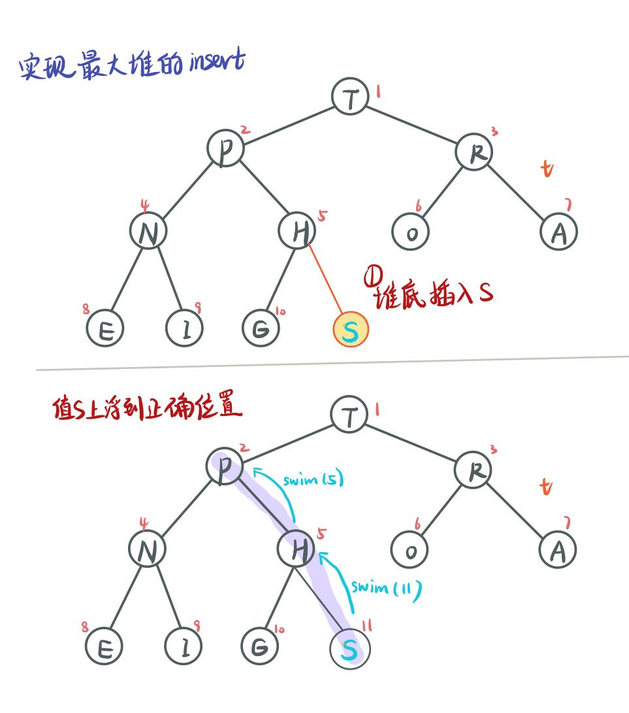

（2）删除最大值(即堆顶元素)：

先把堆顶元素A和堆底最后一个元素B交换，再删除A，最后让B**下沉**到正确位置。

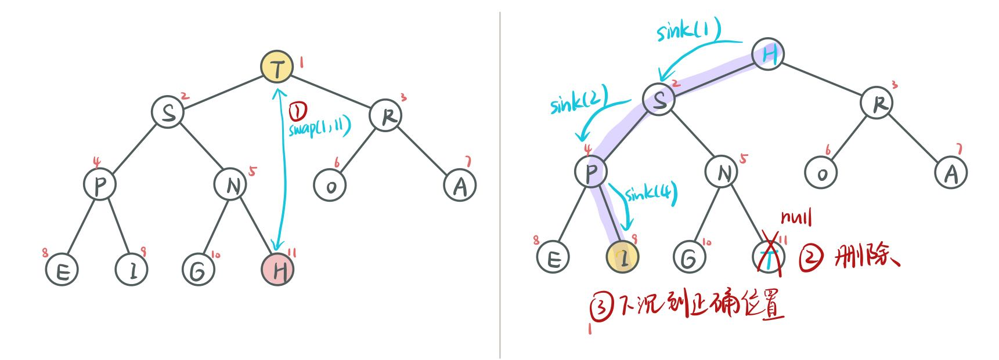

## 三、具体代码实现

详见文件夹MaxPQ: 	大根堆的实现（优先队列）

# [LC 355：Design Twitter](https://leetcode.com/problems/design-twitter/description/)

## 思路：合并k条链表的具体应用

图解：

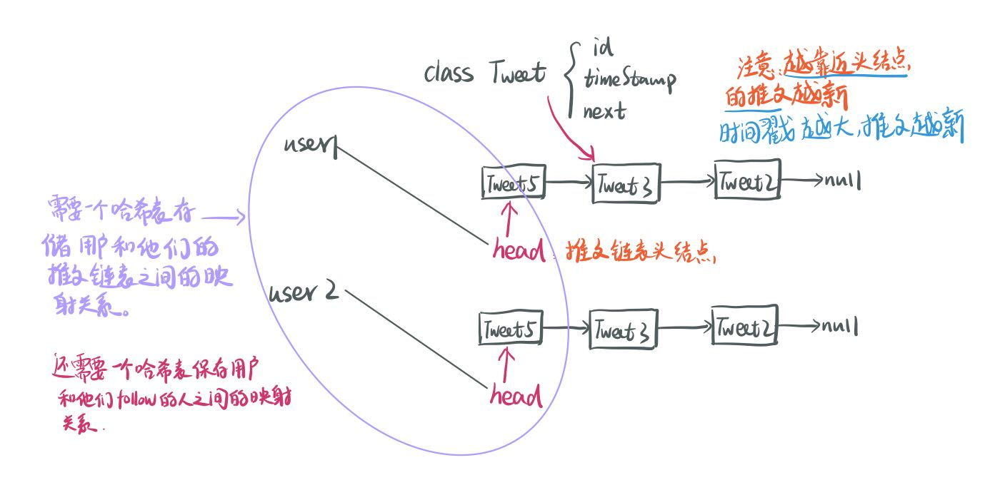

完整代码如下：

```java
class Twitter {
    class Tweet {
        int tweetId;
        int timeStamp;//发推文的时间戳
        Tweet next;//指向前一篇推文

        public Tweet(int id, int time) {
            this.tweetId = id;
            this.timeStamp = time;
            this.next = null;
        }
    }
    //key：用户id，val：该用户关注的人的列表
    private Map<Integer, HashSet<Integer>> followings;
    //key:用户id，val:该用户发布的推文（单链表）
    private Map<Integer, Tweet> tweets;
    //全局使用的时间戳字段，用户每发布一条推文之前+1。
    private int timeStamp = 0;

    public Twitter() {
        followings = new HashMap<>();
        tweets = new HashMap<>();  
    }
  
    public void postTweet(int userId, int tweetId) {
        timeStamp++;
        Tweet newTweet = new Tweet(tweetId, timeStamp);
        if (tweets.containsKey(userId)) {
            //找到用户的对应推文链表的头结点
            Tweet head = tweets.get(userId);
            //新推文在链表头部插入
            newTweet.next = head;
            head = newTweet;
            tweets.put(userId, head);//这一步不能漏！！！
        } else {
            tweets.put(userId, newTweet);
        }  
    }
    //合并k条链表：
    //先把用户及其关注列表里的用户的推文链表加入大根堆中
    //然后具体操作跟lc23一样
    public List<Integer> getNewsFeed(int userId) {
        //大根堆：用于合并k组推文
        PriorityQueue<Tweet> maxHeap = new PriorityQueue<>((tweet1, tweet2)-> {
            return tweet2.timeStamp - tweet1.timeStamp;
        });
        //先把用户自己的推文链表加入堆中
        if (tweets.containsKey(userId)) {
            maxHeap.offer(tweets.get(userId));
        }
        //获取用户的关注列表
        Set<Integer> followees = followings.get(userId);
        //把用户关注的人的推文链表加入堆中
        if (followees != null && followees.size() > 0) {//如果该用户的关注列表不为空
            for (int f: followees) {
                if (tweets.containsKey(f)) {//如果该用户关注的f发过推文
                    Tweet fTweet = tweets.get(f);
                    maxHeap.offer(fTweet);//把f的推文加入堆中   
                }
            }
        }
        //存储最终结果
        List<Integer> res = new ArrayList<>();
        int count = 0;//只取最近发布的10篇推文，count用来计数
        //这里就是跟lc23一样的操作
        while (!maxHeap.isEmpty() && count < 10) {
            Tweet newestTweet = maxHeap.poll();
            res.add(newestTweet.tweetId);
            count++;
            if (newestTweet.next != null) {
                maxHeap.offer(newestTweet.next);
            }  
        }
        return res;  
    }
  
    public void follow(int followerId, int followeeId) {
        if (followings.containsKey(followerId)) {
            HashSet<Integer> followeeList = followings.get(followerId);
            followeeList.add(followeeId);
        } else {
            HashSet<Integer> followeeList = new HashSet<>();
            followeeList.add(followeeId);
            followings.put(followerId, followeeList);
        }   
    }
  
    public void unfollow(int followerId, int followeeId) {
        if (followings.containsKey(followerId)) {
            HashSet<Integer> followeeList = followings.get(followerId);
            followeeList.remove(followeeId);
        }   
    }
}
```

# [LC 380：Insert Delete GetRandom O(1)](https://leetcode.com/problems/insert-delete-getrandom-o1/description/)

## sol 1: 用哈希表

思路：利用HashSet可以实现O(1)查询、插入和删除。

唯一有点麻烦的就是从set中随机选择一个元素：先把set转换成数组，然后再随机选择。

完整代码如下：

```java
class RandomizedSet {

    //存储元素的值
    private Set<Integer> set;

    public RandomizedSet() {
        set = new HashSet<>(); 
    }
  
    public boolean insert(int val) {
        boolean res = !set.contains(val);
        if (res) {//如果没有这个元素，则需要插入
            set.add(val);
        }
        return res;  
    }
  
    public boolean remove(int val) {
        boolean res = set.contains(val);
        if (res) {
            set.remove(val);
        } 
        return res;  
    }
  
    public int getRandom() {
        //先将set转化成array
        //注意：这里要用integer，不能用int（不知道为啥）
        Integer[] arr = set.toArray(new Integer[set.size()]);
        //如果没有下面这行代码会报错：non-static method nextInt(int) cannot be 
        //referenced from a static context [in RandomizedSet.java]
        //Random is a class, rand is an instance of class Random
        //就是需要先instantiate an instance(create an object)
        Random rand = new Random();
        int randomNum = rand.nextInt(set.size());
        return arr[randomNum];  
    }
}
```

## sol 1: 哈希表 + 数组

思路：

哈希表：存储元素的val到index的映射

数组：存储元素的index到val的映射

remove method 图解：

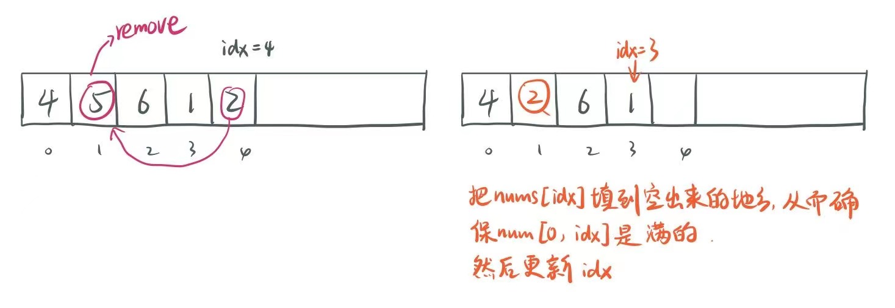

完整代码如下：

```java
class RandomizedSet {

    //存储idx到元素的值的映射
    int[] nums;
    //存储元素的值到idx的映射
    Map<Integer, Integer> map;
    //元素的索引idx
    int idx;
    Random random;

    public RandomizedSet() {
        nums = new int[200009];
        map = new HashMap<>();
        idx = -1;
        random = new Random();
    }
  
    public boolean insert(int val) {
        if (map.containsKey(val)) {
            return false;
        }
        //更新数组
        nums[++idx] = val;
        //更新哈希表
        map.put(val, idx);
        return true;   
    }
  
    public boolean remove(int val) {
        if (!map.containsKey(val)) {
            return false;
        }
        //更新哈希表
        int location = map.remove(val);
        if (location != idx) {//如果删除的不是数组中的最后一个元素
            nums[location] = nums[idx];
            map.put(nums[idx], location);
        }
        idx -= 1;  
        return true;   
    }
  
    public int getRandom() {
        return nums[random.nextInt(idx+1)];   
    }
}
```

ddd
