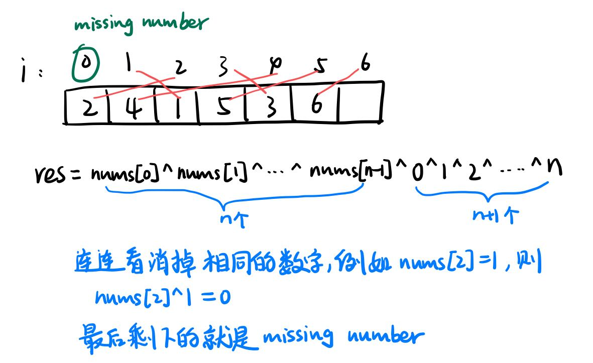

位运算：

基本运算规则见文件夹Bit

# 常见技巧：

## 1、n&(n-1)

## 2、a^a = 0

一个数和它本身做异或运算结果为0

a^0 = a : 一个数和0做异或运算结果是它本身。

## 3、a&1 : 判断a的奇偶性

如果 a&1 == 0，则a是偶数，反之为奇数

说明：偶数的二进制表示中最低位一定是0，奇数的二进制表示中最低位一定是1。

## 4、a&(-a)

获取a的二进制表示中最低位的非0位。

图解：


5、异或运算性质

如果a^b = c, 那么a^c = b 和 b^c = a均成立

# [LC 136：Single Number](https://leetcode.com/problems/single-number/description/)

## sol 1 : 异或运算

### 思路：a^a = 0的运用

思路：把所有数字进行异或运算，成对的数字异或变成0，single number和0异或结果是它本身。

1、异或运算满足交换律：a^b =b^a

2、a^a = 0000

3、0^任意数(0或1) = 任意数

以nums = [4,1,2,1,2]为例

res = nums[0]^nums[1]^nums[2]^nums[3]^nums[4]

    == nums[0]^nums[1]^nums[3]^nums[2]^nums[4]

    == nums[0]^(0000)^(0000)

    == nums[0]

完整代码如下：

```java
class Solution {
    public int singleNumber(int[] nums) {
        if (nums.length == 1) {
            return nums[0];
        }
        int res = nums[0];
        for (int i = 1; i < nums.length; i += 1) {
            res = res ^ nums[i];
        }
        return res;   
    }
}
```

# [LC 191 : Number of 1 Bits](https://leetcode.com/problems/number-of-1-bits/description/)

这道题的题意又叫Hamming Weight

notes:

1、在java中，所有整数类型都是signed

2、In Java, the compiler represents the signed integers using [2&#39;s complement notation](https://en.wikipedia.org/wiki/Two%27s_complement).

## sol 1：右移32次

思路：

1、使用 `n&1`来判断二进制末尾位是否为1；

2、然后再将n右移一位，继续第一步的判断，直到结束。

完整代码如下：

```java
public class Solution {
    // you need to treat n as an unsigned value
    public int hammingWeight(int n) {
        int res = 0;
        for (int i = 0; i < 32; i += 1) {
            res += n&1;
            n = n>>1;
        }
        return res;  
    }
}
```

## sol 2：逐个消除1

### 思路：n&(n-1)的运用：

1、使用n&(n-1)可以消除二进制从右往左第一个“1”。

核心逻辑就是，`n - 1` 一定可以消除最后一个 1，同时把其后的 0 都变成 1，这样再和 `n` 做一次 `&` 运算，就可以仅仅把最后一个 1 变成 0 了。

图解：


完整代码如下：

```java
public class Solution {
    // you need to treat n as an unsigned value
    public int hammingWeight(int n) {
        int res = 0;
        while (n != 0) {
            res += 1;
            n &= n-1;
        }
        return res;
    }
}
```

# [LC 169: Majority Element](https://leetcode.com/problems/majority-element/description/)

## sol 1: 哈希表

完整代码如下：

```java
class Solution {
    public int majorityElement(int[] nums) {
        //先用哈希表统计每个元素出现的次数
        Map<Integer, Integer> counts = new HashMap<>();
        for (int num: nums) {
            if (!counts.containsKey(num)) {
                counts.put(num, 1);
            } else {
                counts.put(num, counts.get(num)+1);
            }
        }
        Map.Entry<Integer, Integer> majorityEntry = null;
        for (Map.Entry<Integer, Integer> entry: counts.entrySet()) {
            if (majorityEntry == null || majorityEntry.getValue() < entry.getValue()) {
                majorityEntry = entry;
            }
        }
        return majorityEntry.getKey();  
    }
}
```

## sol 2: 摩尔投票法

思路：

1、把数组中的每个元素看成带电粒子，众数元素带正电，其他元素带负电，因为众数元素的个数超过数组长度的1/2，所以所有粒子混合以后，最终结果一定是正电。

（1）假设众数为nums[1]，电子数量 count = 1

（2）遍历数组元素：

如果count == 0，此时需要更新当前众数 = nums[i]

如果nums[i] == 当前众数，那么他俩的电性相同，则count += 1

如果nums[i] != 当前众数，则count -= 1

完整代码如下：

```java
class Solution {
    public int majorityElement(int[] nums) {
        int majorityEle = 0;
        int count = 0;
        for (int i = 0; i < nums.length; i += 1) {
            if (count == 0) {
                majorityEle = nums[i];
                count = 1;
            } else if (nums[i] == majorityEle) {//带电性相同
                count += 1;//电子数量加1
            //注意：要优先考虑count == 0, 再考虑nums[i] != majorityEle
            //这两个if条件句的顺序不能反，
            //因为如果先考虑nums[i] != majorityEle，有可能此时count已经
            //为0了，再减1就成负的了。所以要先考虑count == 0，然后更新
            //majorityEle
            } else if (nums[i] != majorityEle) {//带电性不同，则抵消一个电子
                count -= 1;
            } 
        }
        return majorityEle;   
    }
}
```

# [LC 190：Reverse Bits](https://leetcode.com/problems/reverse-bits/description/)

思路：

1、n&1 :得到n的二进制末尾数字

2、res<<1 | n&1 : res左移，然后把n的二进制末尾数字拼接到res的末尾。

3、n>>>1：n右移（如果是用for loop的话，这里算术右移和逻辑右移均可）

图解：


完整代码如下：

```java
public class Solution {
    // you need treat n as an unsigned value
    public int reverseBits(int n) {
        int res = 0;
        for (int i = 0; i < 32; i += 1) {
            res = n&1 | res<<1;
            n>>>=1;
        }
        return res;  
    }
}
```

# [LC 231：Power of Two](https://leetcode.com/problems/power-of-two/description/)

## 思路：n&(n-1)的运用

重点思路：一个数如果是2的指数，那么它的二进制表示一定只含有一个1。

完整代码如下：

```java
class Solution {
    public boolean isPowerOfTwo(int n) {
        if (n <= 0) {
            return false;
        }
        return (n&(n-1)) == 0;   
    }
}
```

# [LC 268：Missing Number](https://leetcode.com/problems/missing-number/description/)

## sol 1：数列求和法

思路：

0 + 1+2+...+(n-1) + n = n*(n+1)/2

丢失的数字 = n*(n+1)/2 - 数组nums的所有元素之和

完整代码如下：

```java
class Solution {
    public int missingNumber(int[] nums) {
        int n = nums.length;
        long expectedSum = n*(n+1)/2;
        //计算数组中的所有元素之和
        long numsSum = 0;
        for (int num: nums) {
            numsSum += num;
        }
        return (int)(expectedSum - numsSum);   
    }
}
```

## sol 2：异或运算

### 思路：a^a = 0的运用

图解：



完整代码如下：

```java
class Solution {
    public int missingNumber(int[] nums) {
        int n = nums.length;
        int res = n;
        for (int i = 0; i < n; i += 1) {
            res ^= nums[i]^i;
        }
        return res;
    }
}
```

# [LC 461 ：Hamming Distance](https://leetcode.com/problems/hamming-distance/description/)

## sol 1：n&(n-1)的运用

完整代码如下：

```java
class Solution {
    public int hammingDistance(int x, int y) {
        int n = x^y;
        int count = 0;
        while (n != 0) {
            count += 1;
            n &= n-1;
        }
        return count;   
    }
}
```

# [LC 389：Find the Difference](https://leetcode.com/problems/find-the-difference/description/)

## sol 1：位运算 - 异或运算

### 思路： a^a = 0的运用

完整代码如下：

```java
class Solution {
    public char findTheDifference(String s, String t) {
        char res = 0;
        for (char c: s.toCharArray()) {
            res ^= c;
        }
        for (char c: t.toCharArray()) {
            res ^= c;
        }
        return res;   
    }
}
```

## sol 2: 计数

完整代码如下：

```java
class Solution {
    public char findTheDifference(String s, String t) {
        int[] count = new int[26];
        //先遍历s中的字符，进行计数
        for (char c: s.toCharArray()) {
            count[c-'a'] += 1;
        }
        //再遍历t中的字符
        for (char c: t.toCharArray()) {
            if (count[c-'a'] == 0) {
                return c;
            } else {
                count[c-'a'] -= 1;
            }
        }
        return ' ';
    }
}
```

## sol 3: 求和

完整代码如下：

```java
class Solution {
    public char findTheDifference(String s, String t) {
        int sumS = 0, sumT = 0;
        for (char c: s.toCharArray()) {
            sumS += c;
        }
        for (char c: t.toCharArray()) {
            sumT += c;
        }
        return (char)(sumT-sumS);
    }
}
```

# [LC 338：Counting Bits](https://leetcode.com/problems/counting-bits/description/)

思路：

bits(n): 表示数字n的二进制表示中“1”的个数。

1、如果n是奇数，那么n-1就是偶数，且bits(n) = bits(n-1) + 1，多出来的一位就是最低位的“1”。

```
         举例： 
         0 = 0       1 = 1
         2 = 10      3 = 11
```

2、如果n是偶数，则其二进制表示中的最低位一定是“0”，那么当n右移一位时，其二进制表示中“1”的个数不变，而右移一位相当于除以2，所以bits(n) = bits(n>>1)

```
举例：
          2 = 10       4 = 100       8 = 1000
          3 = 11       6 = 110       12 = 1100
```

所以可以根据元素的奇偶性来进行遍历

完整代码如下：

```java
class Solution {
    public int[] countBits(int n) {
        int[] res = new int[n+1];
        for (int i = 0; i < n+1; i += 1) {
            if ((i&1) == 0) {//如果i是偶数
                res[i] = res[i>>1];
            } else {//如果i是奇数
                res[i] = res[i-1] + 1;
            }
        }
        return res;
    }
}
```

# [LC 89：Gray Code](https://leetcode.com/problems/gray-code/description/)

## sol 1：镜像反射法

思路：

1、已知n阶格雷码为G(n),则n+1阶由两部分组成：

(1)G(n)本身

(2)R(n): 先将G(n)序列翻转，然后再在翻转后的序列中每个元素的二进制前面添加“1”。

(3)将G(n)和R(n)拼接起来就是G(n+1)。

图解：


完整代码如下：

```java
class Solution {
    public List<Integer> grayCode(int n) {
        List<Integer> res = new ArrayList<>();
        res.add(0);
        int head = 1;
        //从G(0)到G(n)：需要求n次
        for (int i = 0; i < n; i += 1) {
            //倒序遍历res，得到图解中的R(n)
            for (int j = res.size()-1; j >=0; j -= 1) {
                //head就是最高位添加的"1"
                int R = head + res.get(j);
                //res = G(n) + R(n)
                //而G(n)就是res本身
                res.add(R);
            }
            head<<= 1;
        }
        return res;
    }
}
```

## sol 2:  套用公式

完整代码如下：

```java
class Solution {
    public List<Integer> grayCode(int n) {
        List<Integer> res = new ArrayList<>();
        for (int i = 0; i < (1<<n); i += 1) {
            res.add(gray(i));
        }
        return res;  
    }
    //计算第n个格雷码
    //格雷码计算公式：G(n) = n xor (n >> 1)
    private int gray(int n) {
        return n^(n>>1);
    }
}
```

# [LC 371：Sum of Two Integers](https://leetcode.com/problems/sum-of-two-integers/description/)

思路:

1、`a + b` 的问题拆分为 `(a 和 b 的无进位结果) + (a 和 b 的进位结果)`

2、无进位结果可以通过a和b的异或运算得到，即a^b

3、进位结果通过与运算和移位运算得到，即(a&b)<<1.

4、循环此过程，直到不再有进位

图解：


完整代码如下：

```java
class Solution {
    public int getSum(int a, int b) {
        while (b != 0) {
            int newA = a^b;
            int newB = (a&b)<<1;
            a = newA;
            b = newB;
        }
        return a;   
    }  
}
```

# [LC 405：Convert a Number to Hexadecimal](https://leetcode.com/problems/convert-a-number-to-hexadecimal/description/)

思路：就是将长度为 32的二进制转换为 16 进制数，将二进制进行分组，每四个一组，转换成十六进制。

具体地，我们将 num 与 15 = (1111)2 进行 `&` 运算，然后对 num 进行无符号右移 4 位来实现每 4 位处理。

完整代码如下：

```java
class Solution {
    public String toHex(int num) {
        if (num == 0) {
            return "0";
        }
        StringBuilder sb = new StringBuilder();
        while (num != 0) {
            //先得到num的二进制表示的最后4位
            int lastFour = num&15;
            char c;
            //将lastFour转换成十六进制
            //10-15用字符a,b,c,d,e,f表示
            if (lastFour >= 10) {
                c = (char)(lastFour-10 + 'a');
            } else {
                //将lastFour转换成字符
                c = (char)(lastFour + '0');
            }
            sb.append(c);
            //逻辑右移4位，即删除最后4位
            num >>>= 4;//注意是逻辑位移
        }
        return sb.reverse().toString();   
    }
}
```

# [LC 260：Single Number III](https://leetcode.com/problems/single-number-iii/description/)

思路：

1、先把所有元素进行异或操作 nums[0]^nums[i]^...^nums[j]^...nums[n-1] = nums[i]^nums[j]。最后只剩下两个不同元素的异或操作后的结果xor。

2、分治思想：mark获取xor最低位的非0位，假设这一位是第k位（从左往右数）。将所有元素进行分类：第k位为1的一组，第k位是0的一组。nums[i]和nums[j]肯定被分在不同组。

这就相当于在每一个数组中，只有一个元素只出现1次，其他都出现两次，要找到只出现一次的元素，则把数组中的全部元素进行异或操作，最后结果就是nums[i], nums[j]。

完整代码如下：

```java
class Solution {
    public int[] singleNumber(int[] nums) {
        int[] res = new int[2];
        int xor = 0;
        for (int num: nums) {
            xor ^= num;
        }
        int mark = xor&(-xor);
        for (int num: nums) {
            if ((num & mark) == 0) {
                res[0] ^= num;
            } else {
                res[1] ^= num;
            }
        } 
        return res;  
    }
}
```

ddd
