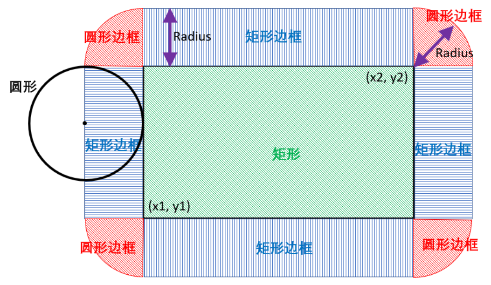

# [LC 133：Clone Graph](https://leetcode.com/problems/clone-graph/description/)

思路：dfs，哈希表

完整代码如下：

```java
class Solution {
    Map<Node, Node> originalToCopy = new HashMap<>();
    public Node cloneGraph(Node node) {
        if (node == null) {
            return null;
        }
        return dfsClone(node);  
    }
    //用递归的方法克隆一个node
    private Node dfsClone(Node node) {
        if (originalToCopy.containsKey(node)) {
            return originalToCopy.get(node);
        }
        Node copy = new Node(node.val);
        originalToCopy.put(node, copy);
        for (Node nei: node.neighbors) {
            copy.neighbors.add(dfsClone(nei));
        }
        return copy;
    }
}
```

# 素数

除了1和它本身以外，不能被其他数整除的数。

# [LC 204：Count Primes](https://leetcode.com/problems/count-primes/description/)

## sol 1：暴力解法（超时）

思路：从2到n遍历，依次判断每个数是不是素数。

完整代码如下：

时间复杂度：O(N^2)

```java
class Solution {
    public int countPrimes(int n) {
        if (n < 2) {
            return 0;
        }
        int count = 0;
        for (int i = 2; i < n; i += 1) {
            if (isPrime(i)) count += 1;
        }
        return count;  
    }

    boolean isPrime(int n) {
        for (int i = 2; i < n; i += 1) {
            if (n%i == 0) {
                return false;
            }
        }
        return true;
    }
}
```

### isPrime()方法的优化：

不需要遍历到n，遍历到**sqrt(n)**即可。

例如假设n = 12。

```
12 = 2 × 6
12 = 3 × 4
12 = sqrt(12) × sqrt(12)
12 = 4 × 3
12 = 6 × 2
```

可以看到，后两个乘积就是前面两个反过来的结果。

换句话说，如果在[2, sqrt(n)]区间没有找到可整除的因子，那么在[sqrt(n), ]区间内也一定没有可以整除的因子。

## sol 2：素数筛选法（挨拉托色尼筛法）

是一种用来求所有小于N的素数的方法。 把从2（素数是指大于1的自然数）开始的某一范围内的正整数从小到大按顺序排列，**逐步筛掉非素数留下素数** 。

思路：

从2开始，2是一个素数，那么2 × 2 = 4, 3 × 2 = 6, 4 × 2 = 8…所有2的倍数都不可能是素数。

同理，3是一个素数，那么2 × 3 = 6, 3 × 3 = 9, 4 × 3 = 12…所有3的倍数都不可能是素数。

。。。

依次类推，逐步筛掉所有非素数，最后留下的就是素数。

图解：


完整代码如下：

时间复杂度：O(nlog⁡log⁡n)。证明不需要掌握，知道结论即可。

空间复杂度：O(n)，用来标记是否为素数。

```java
class Solution {
    public int countPrimes(int n) {
        //用于标记i(数组的index)是否为素数
        boolean[] isPrime = new boolean[n];
        Arrays.fill(isPrime, true);

        //步骤1：筛掉非素数
        //这里枚举到sqrt(n)的原因跟前面解释过的一样
        //例如遍历到2时，2*6 =12，所以12已经被标记过了
        //就不用再考虑6*2 = 12了。
        for (int i = 2; i*i < n; i += 1) {
            if (isPrime[i]) {//如果i为素数
                //这里从i*i开始遍历时因为：
                //如果i>2，那么i*2已经被素数2过滤掉了
                //同理，如果i>3,那么i*3已经被素数2过滤掉了
                //如果i>4，那么i*4已经被素数2过滤掉了
                //所以从i*i开始遍历，防止重复遍历
                for (int j = i*i; j < n; j += i) {
                    isPrime[j] = false;//所有i的倍数都不是素数
                }
            }
        }
        //步骤2：计数
        int count = 0;
        //注意：这里要从2开始遍历，因为i=0和i=1不是素数
        //而之前已经都填充为true了。也就是说，只考虑数组[2,n]。
        for (int i = 2; i < n; i += 1) {
            if (isPrime[i]) count += 1;
        }
        return count;
    }
}
```

# [LC 628:Maximum Product of Three Numbers](https://leetcode.com/problems/maximum-product-of-three-numbers/description/)

思路：

数组可以分为三种情况，第一是都为正数，第二是都为负数，第三是有正有负（分为（1）只有一个负数（2）有两个及以上的负数）
都为正数：乘积最大值为排序数组最后三个数相乘
都为负数：乘积最大值为排序数组最后三个数相乘
有正有负：（1）乘积最大值为排序数组最后三个数相乘（2）乘积最大值为Math.max(前两个数和最后一个数相乘，最后三个数相乘)

归纳总结的结果就是：

乘积最大值 = Math.max(最后三个数相乘，前两个数和最后一个数相乘)

所以只需要知道第一大、第二大、第三大和第一小、第二小的数即可。

# sol 1: 排序法

代码如下：

时间复杂度：O(Nlog⁡N)，其中 NN 为数组长度。排序需要 O(Nlog⁡N) 的时间。

空间复杂度：O(log⁡N)，主要为排序的空间开销。

```java
class Solution {
    public int maximumProduct(int[] nums) {
        int n = nums.length;
        //先排序
        Arrays.sort(nums);
        return Math.max(nums[0]*nums[1]*nums[n-1], nums[n-3]*nums[n-2]*nums[n-1]);   
    }
}
```

# sol 2: 线性扫描

完整代码如下：

* 时间复杂度：**O**(**N**)，其中 **N** 为数组长度。我们仅需遍历数组一次。
* 空间复杂度：**O**(**1**)。

```java
class Solution {
    public int maximumProduct(int[] nums) {
        int max1 = Integer.MIN_VALUE;//第一大的数
        int max2 = Integer.MIN_VALUE;//第二大的数
        int max3 = Integer.MIN_VALUE;//第三大的数
        int min1 = Integer.MAX_VALUE;//第一小的数
        int min2 = Integer.MAX_VALUE;//第二小的数

        for (int num: nums) {
            if (num > max1) {
                max3 = max2;
                max2 = max1;
                max1 = num;
            } else if (num > max2) {
                max3 = max2;
                max2 = num;
            } else if (num > max3) {
                max3 = num;
            }

            if (num < min1) {
                min2 = min1;
                min1 = num;
            } else if (num < min2) {
                min2 = num;
            }
        }
        return Math.max(max1*max2*max3, min1*min2*max1);  
    }
}
```

# [LC 976：Largest Perimeter Triangle](https://leetcode.com/problems/largest-perimeter-triangle/description/)

先排序，取最长的三位数，如果较小的两个数之和大于第三个数，那么这三个数之和就是答案。

完整代码如下：

* 时间复杂度：O(Nlog⁡N)，其中 N 是数组 A 的长度。
* 空间复杂度：Ω(log⁡N)。

```java
class Solution {
    public int largestPerimeter(int[] nums) {
        int n = nums.length;
        Arrays.sort(nums);
        for (int i = n-1; i >= 2; i -= 1) {
            if (nums[i-2] + nums[i-1] > nums[i]) {
                return nums[i-2] + nums[i-1] + nums[i];
            }
        }
        return 0;   
    }
}
```

# [LC 166：Fraction to Recurring Decimal](https://leetcode.com/problems/fraction-to-recurring-decimal/description/)

思路：模拟竖式计算（出发）

注意：两数相除，要么是「有限位小数」，要么是「无限循环小数」，而不可能是「无限不循环小数」。

因为始终是对余数进行补零操作，再往下进行运算，而余数个数具有明确的上限（有限集）。所以根据抽屉原理，一直接着往下计算，最终结果要么是「出现相同余数」，要么是「余数为 00，运算结束」。

图解：


关于String.format():

```java
//String.format()
String str1 = "Here are some fruits";
String str2 = "apples, oranges and bananas";
//concatenate two strings
String str3 = String.format(str1, str2);//str3 = "Here are some fruits"
//str4 = "The first sentence is Here are some fruits, the second one is apples, oranges and bananas"
String str4 = String.format("The first sentence is %s, the second one is %s", str1, str2);
//Output is given upto 8 decimal places
  String str5 = String.format("My answer is %.8f", 47.65734);
  
//Custom input string to be formatted
String stra = "GFG";
String strb = "GeeksforGeeks";

//%1$ represents first argument
//%2$ second argument
//str6 = "My Company name is: GFG, GFG and GeeksforGeeks"
String str6 = String.format("My Company name is: %1$s, %1$s and %2$s", stra, strb);
```

完整代码如下：

```java
class Solution {
    public String fractionToDecimal(int numerator, int denominator) {
        //先转换成long，防止溢出
        long a = numerator, b = denominator;
        //如果可以整除，直接返回结果
        if (a%b == 0) return String.valueOf(a/b);

        StringBuilder sb = new StringBuilder();
        //如果两个数异号，先添加一个负号
        if (a*b < 0) sb.append('-');

        a = Math.abs(a);
        b = Math.abs(b);

        //先计算整数部分，并将余数赋值给a
        sb.append(String.valueOf(a/b) + ".");
        a %= b;

        //用哈希表记录某个余数最早出现的位置
        Map<Long, Integer> map = new HashMap<>();

        while (a != 0) {
            //记录当前余数所在答案的位置
            map.put(a, sb.length());
            a *= 10;
            sb.append(a/b);
            a %= b;
            //如果当前余数之前出现过，那么将【出现位置到当前位置】的部分抠出来
            //就是循环小数部分
            if (map.containsKey(a)) {
                int startIdx = map.get(a);
                return String.format("%s(%s)", sb.substring(0,startIdx), sb.substring(startIdx));
            }
        } 
        return sb.toString();   
    }
}
```

# [LC 149：Max Points on a Line](https://leetcode.com/problems/max-points-on-a-line/description/)

## sol 1: 枚举直线

思路：枚举两个点x和y，然后看第三个点p是否在直线xy上，判断条件就是看直线xy的斜率和直线xp（或者yp）的斜率是否相等。

图解：


完整代码如下：

* 时间复杂度：O(n^3)
* 空间复杂度：O(1)

```java
class Solution {
    public int maxPoints(int[][] points) {
        int n = points.length;
        int res = 1;//n的范围为[1,300]
        for (int i = 0; i < n; i += 1) {
            for (int j = i+1; j < n; j += 1) {
                int count = 2;
                int[] x = points[i];
                int[] y = points[j];
                for (int k = j+1; k < n; k += 1) {
                    int[] p = points[k];
                    int temp1 = (y[1] - x[1]) * (p[0] - x[0]);
                    int temp2 = (y[0] - x[0]) * (p[1] - x[1]);
                    if (temp1 == temp2) {
                        count += 1;
                    }
                }
                res = Math.max(res, count);
            }
        }
        return res;  
    }
}
```

## sol 2：优化

思路：我们可以先枚举所有可能出现的 直线斜率（根据两点确定一条直线，即枚举所有的「点对」），使用「哈希表」统计所有 斜率 对应的点的数量，在所有值中取个 maxmax 即是答案。

一些细节：在使用「哈希表」进行保存时，为了避免精度问题，我们直接使用字符串进行保存，同时需要将 斜率 约干净。

完整代码如下：

时间复杂度：枚举所有直线的复杂度为 O(n^2)；令坐标值的最大差值为 m，gcd 复杂度为 O(log⁡m)。整体复杂度为 O(n^2∗log⁡m)
空间复杂度：O(n)

```java
class Solution {
    public int maxPoints(int[][] points) {
        int n = points.length;
        int res = 1;//n的范围为[1,300]
  
        for (int i = 0; i < n; i += 1) {
            Map<String, Integer> map = new HashMap<>();
            //记录由点i出发的所有直线中，每条直线经过的点的数量的最大值
            int max = 0;
            for (int j = i+1; j < n; j += 1) {
                int x1 = points[i][0], y1 = points[i][1];
                int x2 = points[j][0], y2 = points[j][1];
                //斜率=(y2-y1)/(x2-x1)
                int a = y2-y1, b = x2-x1;
                int k = gcd(a, b);
                String key = (a/k) + "_" + (b/k);//将斜率以最简分数形式保存
                map.put(key, map.getOrDefault(key, 0)+1);
                max = Math.max(max, map.get(key));
            }
            res = Math.max(res, max+1);//还要加上i点本身
        } 
        return res; 
    }
    int gcd(int a, int b) {
        return b == 0 ? a : gcd(b, a%b);
    }
}
```

# [LC 464：Can I Win](https://leetcode.com/problems/can-i-win/)

## 思路：递归

思路：

1、当前局面包括的参数：可选的【整数公共池】，【已选数字】之和sum，desiredTotal

2、用int型整数state来标记【整数公共池】的使用情况：

若state = 0，二进制表示为0，表示公共池里的所有整数都没使用过

若state = 2，二进制表示为10，表示整数1已经使用过

若state = 6，二进制表示为110，表示整数1和2已经使用过

若state = 18，二进制表示为10010，表示整数1和4已经被使用过。

state的最大值为2^21，二进制表示为10000。。。0，即整数20已经使用过，其他都没使用过。

因为题目中说了 `1 <= maxChoosableInteger <= 20` ，所以最多有20个数字，不会超过int的32位。

3、记忆化递归

dfs()中有两个变化的参数，state和sum。记忆化递归就是当遇到相同的参数，且已经计算过时，可以直接用，不用再重新计算一遍。

只需要知道state，就能知道已经选了哪些数字，进而知道sum。所以用一个visited的整数数组来记录所有可能的state的结果。数组索引表示state的值。

完整代码如下：

复杂度：


```java
class Solution {
    int[] visited;
    public boolean canIWin(int maxChoosableInteger, int desiredTotal) {
        //visted[i] == 0,表示state = i 还没有计算过
        //visted[i] == 1,表示state = i 计算过且结果为true
        //visted[i] == 2,表示state = i 计算过且结果为false
        //用于缓存dfs的结果
        visited = new int[1<<21];

        //特判1
        if (maxChoosableInteger >= desiredTotal) return true;
        //特判2：如果可选公共池中所有数字之和都小于desiredTotal，直接返回false
        if ((maxChoosableInteger+1)*maxChoosableInteger/2 < desiredTotal) return false;
        //判断先手是否一定赢
        //初始时，state = 0
        return dfs(0,0,maxChoosableInteger,desiredTotal);   
    }

    //判断当前要做选择的玩家是否一定赢，是则返回true，反之返回false
    public boolean dfs(int state, int sum, int maxChoosableInteger, int desiredTotal) {
        if (visited[state] == 1) return true;
        if (visited[state] == 2) return false;
        //遍历可选择的公共整数:即枚举当前玩家选择1,2，...的所有情况
        for (int x = 1; x <= maxChoosableInteger; x += 1) {
            //如果当前x已经被使用过了，则不能选择
            if (((1<<x)&state) > 0) continue;
            //如果当前玩家选择了x以后，sum>=desiredTotal,则当前玩家赢
            if (sum + x >= desiredTotal) {
                visited[state] = 1;
                return true;
            }
            //如果当前玩家选择了x，需要进一步判断，如果对方玩家一定输，那么当前玩家一定赢
            // state = state|(1<<x);//因为x已经用过了，所以要在state中在第x位标记为1
            if (!dfs(((1<<x)|state), sum+x, maxChoosableInteger,desiredTotal)) {
                visited[state] = 1;
                return true;
            }
        }
        visited[state] = 2;
        return false;
    }
}
```

# [LC 877：Stone Game](https://leetcode.com/problems/stone-game/)

## sol 1: dp

1、dp[i][j]表示可供选择的piles区间为[i,j]时，先手玩家A比后手玩家B多拿的石子的最大数。这是一个差值，且是所有可能差值中的最大值。

2、状态转移公式

（1）如果先手玩家A拿piles[i], 在区间[i+1,j]，B变成了先手玩家，则dp[i+1][j]表示B比A多的最大石子个数，反过来 -dp[i+1][j]表示在这个区间A比B多的最大石子个数。所以先手玩家比后手玩家多的最大石子个数为：

dp[i][j] = piles[i] - dp[i+1][j]

（2）同理，如果先手玩家A拿piles[j], 先手玩家比后手玩家多的最大石子个数为：

dp[i][j] = piles[j] - dp[i][j-1]

所以， dp[i][j] = max(piles[i] - dp[i+1][j], piles[j] - dp[i][j-1])

3、遍历顺序


4、初始化

dp[i][i] = piles[i]，此时只有piles[i]，先手玩家必赢。

完整代码如下：

* 时间复杂度：O($n ^2$)
* 空间复杂度：O($n^2$)

```java
class Solution {
    public boolean stoneGame(int[] piles) {
        int n = piles.length;
        int[][] dp = new int[n][n];
  
        //初始化
        for (int i = 0; i < n; i += 1) {
            dp[i][i] = piles[i];
        }
        for (int i = n-1; i >= 0; i -= 1) {
            for (int j = i+1; j < n; j += 1) {
                dp[i][j] = Math.max(piles[i]-dp[i+1][j], piles[j]-dp[i][j-1]);
            }
        }
        return dp[0][n-1] > 0;   
    }
}
```

# [LC 375：Guess Number Higher or Lower II](https://leetcode.com/problems/guess-number-higher-or-lower-ii/description/)

## sol 1：dp

思路：

1、dp[i][j]表示在数字i,i+1,...,j-1,j中选对目标数字，必定赢得游戏所需要花费的最小值。

2、如果选i：

（1）选对：花费0

（2）选错：花费i + dp[i+1][j]

**dp1 = dp[i][j] = max(0, i + dp[i+1][j])**

如果选k（i<k<j)

（1）选对：花费0

（2）选错：花费max(k+dp[i][k-1], k+dp[k+1][j])

必定赢最少花费 dp2 = **dp[i][j] = max(0, max(k+dp[i][k-1], k+dp[k+1][j]))**

如果选j：

（1）选对：花费0

（2）选错：花费j + dp[i][j-1]

**dp3 = dp[i][j] = max(0, j + dp[i][j-1])**

综上所述：dp[i][j]应该是选min(dp1,dp2,dp3)

3、遍历顺序

 根据转移公式，每个格子的值都可以根据其下方或左方，或者下方&左方的值递推得到，所以遍历顺序为j值从小到大，i值从大到小。

4、初始化

dp[i][i] = 0

完整代码如下：

时间复杂度：O($n^3$)

空间复杂度：O($n^2$)

```java
class Solution {
    public int getMoneyAmount(int n) {
        if (n == 1) return 0;
        int[][] dp = new int[n+1][n+1];
        //无需初始化

        for (int j = 2; j <= n; j += 1) {
            for (int i = j-1; i >= 1; i -= 1) {
                int dp1 = Math.max(0, i+dp[i+1][j]);
                int dp3 = Math.max(0, j+dp[i][j-1]);
          
                int dp2 = Integer.MAX_VALUE;//初始化
                for (int k = i+1; k <= j-1; k += 1) {
                    dp2 = Math.min(dp2, k + Math.max(dp[i][k-1],dp[k+1][j]));
                }
                dp[i][j] = Math.min(Math.min(dp1,dp3), dp2);
            }
        }
        return dp[1][n];   
    }
}
```

# [LC 486：Predict the Winner](https://leetcode.com/problems/predict-the-winner/description/)

## sol 1：递归

思路：先手玩家从区间[i,j]做选择，有两种情况：

1）选nums[i],那么后手玩家从区间[i+1,j]做选择，dfs(nums, i+1,j)返回的是后手玩家赢过先手玩家的分数，则 -dfs(nums, i+1,j) 返回的是先手玩家赢过后手玩家的分数。

2）选择nums[j]的时候同理。

3）最后两者取较大值即可。

完整代码如下：

```java
class Solution {
    public boolean PredictTheWinner(int[] nums) {
        return dfs(nums, 0, nums.length-1) >= 0;
    
    }
    //当前需要做选择的玩家，从区间[i,j]做选择，最后赢过对手的分数
    public int dfs(int[] nums, int i, int j) {
        if (i == j) return nums[i];
        // if (i > j) {
        //     return;
        // }

        //如果选择nums[i]，则最终结果是nums[i] - dfs(nums, i+1,j)
        //如果选择nums[j]，则最终结果是nums[j] - dfs(nums, i,j-1)
        int res1 = nums[i] - dfs(nums, i+1,j);
        int res2 = nums[j] - dfs(nums, i,j-1);
        return Math.max(res1, res2);
    }
}
```

## sol 2: 记忆化递归

在sol 1的基础上进行优化，因为递归会有很多重复计算，例如nums = [1,2,3,4]，先手选nums[0]的话，后手要从[1,3]中选择，先手选nums[3]的话，后手也要从[1,3]中选择，这样的话基于区间[1,3]的选择结果计算了两次。

所以设置一个二维矩阵来记录dfs子问题递归结果，避免重复计算。

完整代码如下：

```java
class Solution {
    public boolean PredictTheWinner(int[] nums) {
        int n = nums.length;
        //用于存储dfs子问题的结果
        int[][] cache = new int[n][n];
        for (int i = 0; i < n; i += 1) {
            Arrays.fill(cache[i], Integer.MIN_VALUE);
        }
        return dfs(nums, 0, n-1, cache) >= 0;
    
    }
    //当前需要做选择的玩家，从区间[i,j]做选择，最后赢过对手的分数
    public int dfs(int[] nums, int i, int j, int[][] cache) {
        if (i == j) return nums[i];
        // if (i > j) return 0;
        if (cache[i][j] != Integer.MIN_VALUE) {
            return cache[i][j];
        }
        //如果选择nums[i]，则最终结果是nums[i] - dfs(nums, i+1,j)
        //如果选择nums[j]，则最终结果是nums[j] - dfs(nums, i,j-1)
        int res1 = nums[i] - dfs(nums, i+1,j, cache);
        int res2 = nums[j] - dfs(nums, i,j-1, cache);
        return Math.max(res1, res2);
    }
}
```

## sol 3：dp

跟lc877基本一样。

思路：

1、`dp[i][j]`：表示当前做选择玩家在区间[i,j]中做选择，最后赢过对方的分数。

2、`dp[i][j] = Math.max(nums[i]-dp[i+1][j], nums[j]-dp[i][j-1])`

3、遍历顺序

i<= j，所以只需要填半张二维矩阵表

遍历顺序：j从左到右正序遍历，i从下到上倒序遍历


4、初始化

当i == j时，dp[i][i] = nums[i]

完整代码如下：

```java
class Solution {
    public boolean PredictTheWinner(int[] nums) {
        int n = nums.length;
        int[][] dp = new int[n][n];
        //初始化
        for (int i = 0; i < n; i += 1) {
            dp[i][i] = nums[i];
        }

        for (int j = 1; j < n; j += 1) {
            for (int i = j-1; i >= 0; i -= 1) {
                dp[i][j] = Math.max(nums[i]-dp[i+1][j], nums[j]-dp[i][j-1]);
            }
        }
        return dp[0][n-1] >= 0;   
    }
}
```

# [LC 1401：Circle and Rectangle Overlapping](https://leetcode.com/problems/circle-and-rectangle-overlapping/description/)

图解：



完整代码如下：

```java
class Solution {
    public boolean checkOverlap(int radius, int xCenter, int yCenter, int x1, int y1, int x2, int y2) {
        //判断是否在绿色区域内
        if (isInRectangle(xCenter, yCenter, x1, y1, x2, y2)) return true;
        //判断是否在蓝色区域内
        if (isInRectangle(xCenter, yCenter, x1-radius, y1, x1, y2)) return true;
        if (isInRectangle(xCenter, yCenter, x1, y2, x2, y2+radius)) return true;
        if (isInRectangle(xCenter, yCenter, x2, y1, x2+radius, y2)) return true;
        if (isInRectangle(xCenter, yCenter, x1, y1-radius, x2, y1)) return true; 
        //判断圆心是否在红色区域内
        if (getDistance(xCenter,yCenter, x1,y1) <=  radius*radius) return true;
        if (getDistance(xCenter,yCenter, x1,y2) <=  radius*radius) return true;
        if (getDistance(xCenter,yCenter, x2,y1) <=  radius*radius) return true;
        if (getDistance(xCenter,yCenter, x2,y2) <=  radius*radius) return true;
        //不在任何红绿蓝区域，则不重叠
        return false;
    }

    //判断一个点(x,y)是否在由点(x1,y1)和点(x2,y2)确定的矩形内
    boolean isInRectangle(int x, int y, int x1, int y1, int x2, int y2) {
        return x >= x1 && x <= x2 && y >= y1 && y <= y2;
    }
    //返回点(x1,y1)和点(x2,y2)之间的距离
    int getDistance(int x1, int y1, int x2, int y2) {
        return (x1-x2)*(x1-x2) + (y1-y2)*(y1-y2);
    }
}
```

# [LC 1232：Check If It Is a Straight Line](https://leetcode.com/problems/check-if-it-is-a-straight-line/description/)

参考lc149

完整代码如下：

```java
class Solution {
    public boolean checkStraightLine(int[][] coordinates) {
        int n = coordinates.length;
        int x1 = coordinates[0][0], y1 = coordinates[0][1];
        int x2 = coordinates[1][0], y2 = coordinates[1][1];
        int a = y2-y1, b = x2-x1;
        int k = gcd(a,b);
        for (int i = 2; i < n; i += 1) {
            int p = coordinates[i][1] - y1;
            int q = coordinates[i][0] - x1;
            int t = gcd(p, q);
            if ((p/t) != a/k | (q/t) != b/k) {
                return false;
            }
        }
        return true;
    }
    int gcd(int a, int b) {
        return b == 0 ? a : gcd(b, a%b);
    }
}
```

ddd
