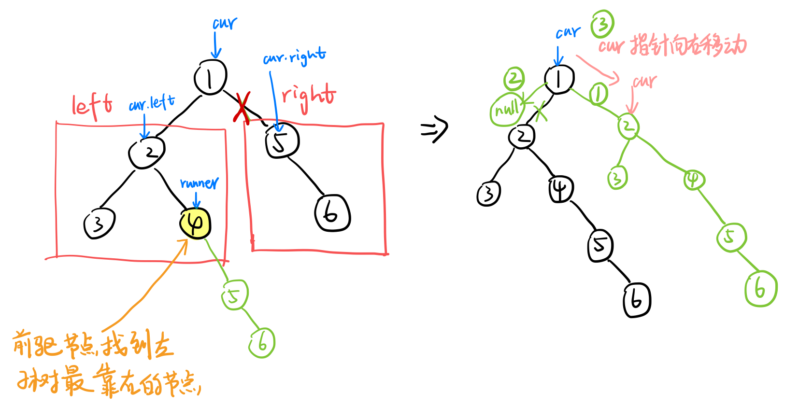
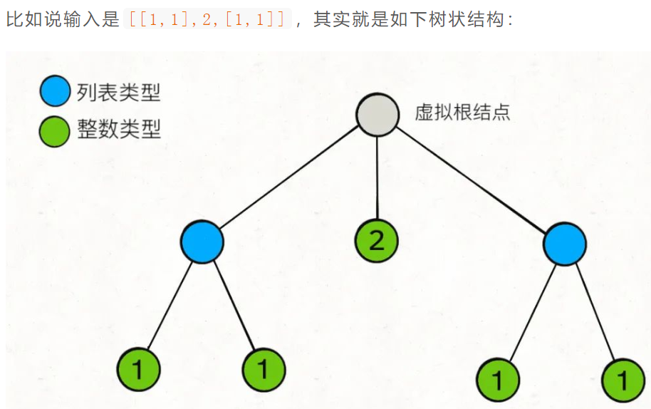
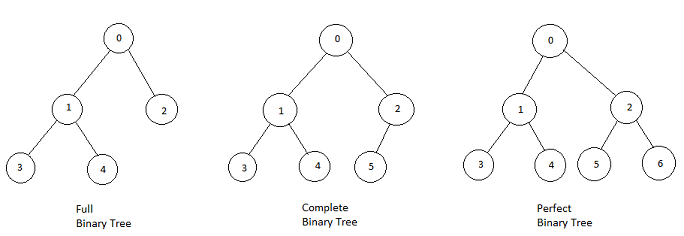
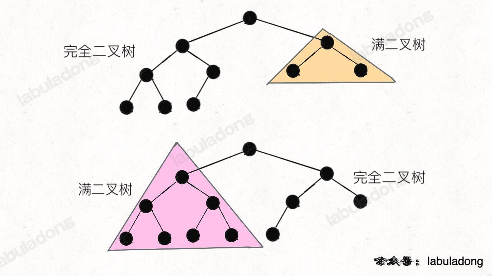

# 1. Binary Tree& N-arry Tree Traversal

## 1. Recursively

recursively前中后序遍历代码几乎一样，只是顺序不同。

### [LC 144: Binary Tree Preorder Traversal](https://leetcode.com/problems/binary-tree-preorder-traversal/)

#### 写法1：递归思路

时间复杂度：O(n)，其中 n是二叉树的节点数。每一个节点恰好被遍历一次。

空间复杂度：O(n)，为递归过程中栈的开销，平均情况下为 O(log⁡n)，最坏情况下树呈现链状，为 O(n)。n是二叉树的节点数，如果是满二叉树，则该二叉树的层数为O(log⁡n)。

```java
class Solution {
    public List<Integer> preorderTraversal(TreeNode root) {
        List<Integer> res = new ArrayList<>();
        dfs(root, res);
        return res;  
    }
    private void dfs(TreeNode root, List<Integer> list) {
        if (root == null) {
            return;
        }
        list.add(root.val);
        dfs(root.left, list);
        dfs(root.right, list);
    }
}
```

#### 写法2：子问题思路

这个方法的缺点在于提高了复杂度，addAll方法的复杂度为O(N).总体复杂度为O(N^2)

```java
class Solution {
    public List<Integer> preorderTraversal(TreeNode root) {
        List<Integer> res = new ArrayList<>();
        if (root == null) return res;
        res.add(root.val);
        res.addAll(preorderTraversal(root.left));
        res.addAll(preorderTraversal(root.right));
        return res;
    }
}
```

#### sol 2: Morris Traversal

最大特点是将空间复杂度降为O(1)。

根据前序遍历的特点，先左子树，后右子树，所以整个右子树中的节点都是在左子树后面，所以将整个右子树剪下来，然后接到左子树的最右节点的右边。

图解：



完整代码如下：

```java
class Solution {
    public List<Integer> preorderTraversal(TreeNode root) {
        List<Integer> res = new ArrayList<>();
        if (root == null) return res;

        TreeNode cur = root;
        while (cur != null) {
            res.add(cur.val);
            if (cur.left != null) {
                TreeNode runner = cur.left;//前驱节点
                while (runner.right != null) {
                    runner = runner.right;//找到左子树最靠右节点
                }
                runner.right = cur.right;//把右子树接到左子树的最靠右节点
                cur.right = cur.left;//左子树变成右子树
                cur.left = null;//然后左子树置为空
            }
            cur = cur.right;//移动cur指针
        }
        return res;  
    }
}
```

### [LC 589: N-ary Tree Preorder Traversal](https://leetcode.com/problems/n-ary-tree-preorder-traversal/)

```java
class Solution {
    public List<Integer> preorder(Node root) {
        List<Integer> res = new ArrayList<>();
        dfs(root, res);
        return res;
    }
    private void dfs(Node root, List<Integer> list) {
        if (root == null) {
            return;
        }
        list.add(root.val);
/**和二叉树的前序遍历不同之处。*/
        for (int i = 0; i < root.children.size(); i +=1) {
            dfs(root.children.get(i), list);
        }
  
    }
}
```

### [LC 94: Binary Tree Inorder Traversal](https://leetcode.com/problems/binary-tree-inorder-traversal/)

```java
class Solution {
    public List<Integer> inorderTraversal(TreeNode root) {
        List<Integer> res = new ArrayList<>();
        dfs(root, res);
        return res;  
    }
    private void dfs(TreeNode root, List<Integer> list) {
        if (root == null) {
            return;
        }
        dfs(root.left, list);
        list.add(root.val);
        dfs(root.right, list);
    }
}
```

Time complexity: **O(n)**

* The time complexity is **O(n)** because the recursive function is **T(n)=2⋅T(n/2)+1**.

Space complexity: **O(n)**

* The worst case space required is **O(n)**, and in the average case it's **O(log⁡n)** where **n** is number of nodes.

### [LC 145: Binary Tree Postorder Traversal](https://leetcode.com/problems/binary-tree-postorder-traversal/)

```java

 class Solution {
    public List<Integer> postorderTraversal(TreeNode root) {
        List<Integer> res = new ArrayList<>();
        dfs(root, res);
        return res;
    }
    private void dfs(TreeNode root, List<Integer> list) {
        if (root == null) {
            return;
        }
        dfs(root.left, list); 
        dfs(root.right, list);
        list.add(root.val);  
    }
}
```

### [LC 590：N-ary Tree Postorder Traversal](https://leetcode.com/problems/n-ary-tree-postorder-traversal/)

```java
class Solution {
    public List<Integer> postorder(Node root) {
        List<Integer> res = new ArrayList<>();
        dfs(root, res);
        return res;  
    }
    private void dfs(Node root, List<Integer> list) {
        if (root == null) {
            return;
        }
        for (Node children: root.children) {
            dfs(children, list);
        }
        list.add(root.val);
    }
}
```

时间复杂度：O(N)，其中 N 为 N 叉树的节点。每个节点恰好被遍历一次。

空间复杂度：O(N)，递归过程中需要调用栈的开销，平均情况下为 O(log⁡N)，最坏情况下树的深度为 N−1，需要的空间为 O(N−1)，因此空间复杂度为 O(N)。

## 2. Iteratively

### 1. preorder traversal

#### 1. Binary Tree Preorder Traversal

借助栈。思路与后序遍历(借助栈)基本相同，只有左右子树入栈顺序不同。

思路：

* step1：root入栈；
* step2：top元素出栈；
* step3：将top.val放入链表，同时，top的***右**子树先入栈，**左**子树后入栈*；
* step4：重复step2，当栈为空时停止循环。

  完整代码如下：

  时间复杂度：O(n)，其中 n 是二叉树的节点数。每一个节点恰好被遍历一次。

  空间复杂度：O(n)，为迭代过程中显式栈的开销，平均情况下为 O(log⁡n)，最坏情况下树呈现链状，为 O(n)。

  ```java
  class Solution {
      public List<Integer> preorderTraversal(TreeNode root) {
          List<Integer> res = new ArrayList<>();
          if (root == null) {
              return res;
          }
          Stack<TreeNode> stack = new Stack<>();
          stack.push(root);
          while (!stack.isEmpty()) {
              TreeNode curNode = stack.pop();
  /**curNode.val进行addlast的操作。*/
              res.add(curNode.val);
  /**入栈：先右子树，后做子树*/
              if (curNode.right != null) {   
                  stack.push(curNode.right);
              }
              if (curNode.left != null) {
                  stack.push(curNode.left);
              }
          }
          return res;  
      }
  }
  ```

#### 2. N-ary Tree Preorder Traversal

思路与二叉树前序遍历相同。只有在子树入栈时略有不同。

```java
class Solution {
    public List<Integer> preorder(Node root) {
        List<Integer> res = new ArrayList<>();
        if (root == null) {
            return res;
        }
        Stack<Node> stack = new Stack<>();
        stack.push(root);
        while (!stack.isEmpty()) {
            Node curNode = stack.pop();
            res.add(curNode.val);
/**和BT不同之处：子树的插入*/
            for (int i = curNode.children.size()-1; i > -1; i -= 1) {
                stack.push(curNode.children.get(i));
            }
        }
        return res;  
    }
}
```

* Time complexity : we visit each node exactly once, and for each visit, the complexity of the operation (*i.e.* appending the child nodes) is proportional to the number of child nodes `n` (n-ary tree). Therefore the overall time complexity is **O(N)**, where **N** is the number of nodes, *i.e.* the size of tree.
* Space complexity : depending on the tree structure, we could keep up to the entire tree, therefore, the space complexity is **O(N)**.
* 

### 2. inorder traversal

思路：pointer指向root，并且入栈，一路向左下，逐个入栈，直至到达null（即到达leaf），然后开始出栈

```java
class Solution {
    public List<Integer> inorderTraversal(TreeNode root) {
        List<Integer> res = new ArrayList<>();
        if (root == null) {
            return res;
        }
        Stack<TreeNode> stack = new Stack<>();
        TreeNode curNode = root;
//当stack和curNode均为空时，既无node需要入栈，也无node需要出栈， 则退出循环。
        while (!stack.isEmpty() || curNode != null) {
            while (curNode != null) {
                stack.push(curNode);
                curNode = curNode.left;
            }
            curNode = stack.pop();
            res.add(curNode.val);
            curNode = curNode.right;   
        }
        return res;  
    }
}
```

Time complexity: **O(n)**

Space complexity: **O(n)**

### 3. postorder traversal

#### 1. Binary Tree Postorder Traversal

    思路：


* step1：root入栈；
* step2：top元素出栈；
* step3：将top.val从链表**头部插入**，同时，top的***左**子树先入栈，**右**子树后入栈*；
* step4：重复step2，当栈为空时停止循环。

  ```java


  class Solution {
      public List<Integer> postorderTraversal(TreeNode root) {
          List<Integer> res = new LinkedList<>();
          if (root == null) {
              return res;
          }

          Deque<TreeNode> stack = new ArrayDeque<>();
          stack.push(root);
          while (!stack.isEmpty()) {
              TreeNode curNode = stack.pop();
              /**curNode.val进行addfirst的操作。
              注意：这里是在头部插入！！等同于翻转数组
              */
              res.add(0, curNode.val);
   /**入栈：先左子树，后右子树。*/
              if (curNode.left != null) {
                  stack.push(curNode.left);
              }
              if (curNode.right != null) {
                  stack.push(curNode.right);
              }
          }
          return res;  
      }
  }
  ```

时间复杂度：O(n)，其中 n 是二叉搜索树的节点数。每一个节点恰好被遍历一次。

空间复杂度：O(n)，为迭代过程中显式栈的开销，平均情况下为 O(log⁡n)，最坏情况下树呈现链状，为 O(n)。

#### 2.N-ary Tree Postorder Traversal

```java
class Solution {
    public List<Integer> postorder(Node root) {
        List<Integer> res = new ArrayList<>();
        if (root == null) {
            return res;
        }
        Deque<Node> stack = new ArrayDeque<>();
        stack.push(root);
        while (!stack.isEmpty()) {
            Node curNode = stack.pop();
            res.add(0, curNode.val);
/**和二叉树后序遍历的不同之处：*/
            for (int i = 0; i < curNode.children.size(); i +=1) {
                stack.push(curNode.children.get(i));
            }
        }
        return res;  
  
    }

}
```

# 2. Binary Tree Traversal - Level Order

## [LC 102: Binary Tree Level Order Traversal](https://leetcode.com/problems/binary-tree-level-order-traversal/)

* 思路：借助queue
* 重点：队列中的元素出队列时，其左右子树（若非空）需要入队列
  关于数据结构：链表可以实现队列

```java

class Solution {
    public List<List<Integer>> levelOrder(TreeNode root) {
        List<List<Integer>> res = new ArrayList<>();
        if (root == null) {
            return res;
        }
        Queue<TreeNode> queue = new LinkedList<>();
        queue.add(root);

        while (!queue.isEmpty()) {
            int qLen = queue.size();
            List<Integer> level = new ArrayList<>();
            for (int i = 0; i < qLen; i +=1) {
                TreeNode curNode = queue.poll();
                level.add(curNode.val);
                if (curNode.left != null) {
                    queue.add(curNode.left);
                }
                if (curNode.right != null) {
                    queue.add(curNode.right);
                }
            }
            res.add(level);
        }
        return res;

    }
}
```

* Time complexity : **O(N)** since each node is processed exactly once.
* Space complexity : **O(N)** to keep the output structure which contains `N` node values.

## [LC 103：Binary Tree Zigzag Level Order Traversal](https://leetcode.com/problems/binary-tree-zigzag-level-order-traversal/)

思路：跟LC102非常相似，就是在102的基础上加了一个参数count，当count为偶数时，从左往右；当count为奇数时，从右往左。

代码如下：

这里每一层存储节点的时候，用链表，插入操作时间复杂度为O(1)

```java
class Solution {
    public List<List<Integer>> zigzagLevelOrder(TreeNode root) {
        List<List<Integer>> res = new ArrayList<>();
        if (root == null) {
            return res;
        }
        Queue<TreeNode> queue = new LinkedList<>();
        queue.add(root);
        int count = 0;

        while (!queue.isEmpty()) {
            int qLen = queue.size();
            List<Integer> level = new LinkedList<>();
            for (int i = 0; i < qLen; i += 1) {
                TreeNode curNode = queue.poll();
/**当层数为偶数时，一直addlast；当层数为奇数时，一直addfirst。*/
                if (count%2 == 0) {
                    level.addLast(curNode.val);
                } else {
                    level.addFirst(curNode.val);
                }
                if (curNode.left != null) {
                    queue.add(curNode.left);
                }
                if (curNode.right != null) {
                    queue.add(curNode.right);
                }   
            }
            res.add(level);
            count += 1;
        }
        return res;  
    }
}
```

Time Complexity: **O(N)**, where **N** is the number of nodes in the tree. 

* We visit each node once and only once.

Space Complexity: **O(N)** where **N** is the number of nodes in the tree.

* As one can see, at any given moment, the `q` would hold the nodes that are *at most* across two levels. Therefore, at most, the size of the queue would be no more than **2⋅L**, assuming **L** is the maximum number of nodes that might reside on the same level. Since we have a binary tree, the level that contains the most nodes could occur to consist all the leave nodes in a full binary tree, which is roughly L = N/2. As a result, we have the space complexity of N in the worst case.


## [LC 107. Binary Tree Level Order Traversal II](https://leetcode.com/problems/binary-tree-level-order-traversal-ii/)

思路：在LC 102的基础上，只有一行代码有所改动。

```java
class Solution {
    public List<List<Integer>> levelOrderBottom(TreeNode root) {
        List<List<Integer>> res = new ArrayList<>();
        if (root == null) {
            return res;
        }
        Queue<TreeNode> queue = new LinkedList<>();
        queue.add(root);
        while (!queue.isEmpty()) {
            int qLen = queue.size();
            List<Integer> level = new ArrayList<>();
            for (int i = 0; i < qLen; i +=1) {
                TreeNode curNode = queue.poll();
                level.add(curNode.val);
                if (curNode.left != null) {
                    queue.add(curNode.left);
                }
                if (curNode.right != null) {
                    queue.add(curNode.right);
                }
            }
/**lc102是addlast，这道题这里改成addfirst即可。*/
            res.add(0, level);
        }
        return res;  
    }
}
```

## [LC 515:  Find Largest Value in Each Tree Row](https://leetcode.com/problems/find-largest-value-in-each-tree-row/)

很简单，就是一个层序遍历。

```java
class Solution {
    public List<Integer> largestValues(TreeNode root) {
        List<Integer> res = new ArrayList<>();
        if (root == null) {
            return res;
        }
        Queue<TreeNode> q = new LinkedList<>();
        q.add(root);
        while (!q.isEmpty()) {
            int qLen = q.size();
            int maxNum = Integer.MIN_VALUE;
            for (int i = 0; i < qLen; i +=1) {
                TreeNode curNode = q.poll();
                maxNum = Math.max(maxNum, curNode.val);
                if (curNode.left != null) {
                    q.add(curNode.left);  
                }
                if (curNode.right != null) {
                    q.add(curNode.right);
                }   
            }
            res.add(maxNum);
        }
        return res;  
    }
}
```

# 多叉树

## LC 341：Flatten Nested List Iterator

### 1、NestedInteger类的实现

本质就是一棵多叉树



代码：

```java
public NestedInteger class {
    private int val;
    private List<NestedInteger> list;

    //constructor
    public NestedInteger(int val) {
	this.val = val;
    }

    public NestedInteger(List<NestedInteger> list) {
	this.list = list;
    }

    // @return true if this NestedInteger holds a single integer, 
    //rather than a nested list.
    public boolean isInteger() {
    	return this.val != null;
    }
 
    // @return the single integer that this NestedInteger holds, 
    //if it holds a single integer
    // Return null if this NestedInteger holds a nested list
    public Integer getInteger() {
    	return this.val;
    }

    // @return the nested list that this NestedInteger holds, 
    //if it holds a nested list
    // Return empty list if this NestedInteger holds a single integer
    public List<NestedInteger> getList() {
    	return this.list;
    }  
}
```

### sol 1: DFS

思路：遍历多叉树，将所有叶子节点的值**提前保存**在数组中，然后遍历该数组，从而实现hasNext和next方法。

代码如下：

```java
public class NestedIterator implements Iterator<Integer> {
    private List<Integer> vals;
    private Iterator<Integer> it;

    public NestedIterator(List<NestedInteger> nestedList) {
        vals = new LinkedList<>();
        dfs(nestedList);
        it = vals.iterator();   
    }

    @Override
    public Integer next() {
        return it.next();  
    }

    @Override
    public boolean hasNext() {
        return it.hasNext();  
    }

    private void dfs(List<NestedInteger> nestedList) {
        for (NestedInteger node: nestedList) {
            if (node.isInteger()) {
                vals.add(node.getInteger());
            } else {
                dfs(node.getList());
            }
        }
    }
}
```

时间复杂度：初始化为 O(n)，next 和 hasNext 为 O(1)。其中 n 是嵌套的整型列表中的元素个数。

空间复杂度：O(n)。需要一个数组存储嵌套的整型列表中的所有元素。

### sol 2：栈

注意：栈中存储的是迭代器（或者说是当前遍历到的位置）

代码如下：

```java
public class NestedIterator implements Iterator<Integer> {
    //存储列表的当前遍历位置
    private Deque<Iterator<NestedInteger>> stack;
    private NestedInteger curNestedInteger;

    public NestedIterator(List<NestedInteger> nestedList) {
        stack = new LinkedList<>();
        stack.push(nestedList.iterator());   
    }

    @Override
    public Integer next() {
        return curNestedInteger.getInteger();  
    }

    @Override
    public boolean hasNext() {
        while (!stack.isEmpty()) {
            Iterator<NestedInteger> it = stack.peek();
            if (!it.hasNext()) {//遍历到当前列表末尾，则出栈
                stack.pop();
                continue;
            }
            NestedInteger nest = it.next();
            //若遍历到的元素为整数，则存放在curNestedInteger
            if (nest.isInteger()) {
                curNestedInteger = nest;
                return true;
            } 
            //若存放的是列表，则将其迭代器入栈
            stack.push(nest.getList().iterator());
        }
        return false;   
    }
}
```

时间复杂度：初始化和 nextnext 为 O(1)，hasNext 为均摊 O(1)。

空间复杂度：O(n)。最坏情况下嵌套的整型列表是一条链，我们需要一个 O(n) 大小的栈来存储链上的所有元素。

# LC 222 : Count Complete Tree Nodes

## 1、definitions

**Full Binary Tree**: a binary tree in which all nodes have either zero or two child nodes.

**Complete Binary Tree**: every level, except possibly the last, is completely filled in a complete binary tree, and all nodes in the last level are as far left as possible.

**Perfect BT**: each level of the tree is completely filled by the nodes.



## 2、分析

如果是一棵**普通**二叉树，求其节点个数，则

时间复杂度为O(N)

```java
public int countNodes(TreeNode root) {
    if (root == null) return 0;
    return 1 + countNodes(root.left) + countNodes(root.right);
}
```

如果是一棵满二叉树，其节点总个数N与高度(层数)H之间的关系为：N = 2^H - 1

则先求出树高H，即可计算出节点总个数。

时间复杂度为O(H)，H是二叉树的高度

```java
public int countNodes(TreeNode root) {
    int h = 0;
    // 计算树的高度
    while (root != null) {
        root = root.left;
        h++;
    }
    // 节点总数就是 2^h - 1
    return (int)Math.pow(2, h) - 1;
}
```

## 3、完全二叉树求节点总数

完全二叉树求节点总数，就是满二叉树和普通二叉树的结合。

```java
class Solution {
    public int countNodes(TreeNode root) {
        //沿最左侧和最右侧求出树的高度
        int leftDepth = leftDepth(root);
        int rightDepth = rightDepth(root);
        //左右侧高度相等，说明是一棵满二叉树
        if (leftDepth == rightDepth) {
            return (int)Math.pow(2, leftDepth) - 1;
        } else {//左右侧高度不等，则按照普通二叉树的逻辑计算
            return 1 + countNodes(root.left) + countNodes(root.right);
        }  
    }

    private int leftDepth(TreeNode root) {
        int h = 0;
        while (root != null) {
            root = root.left;
            h++;
        }
        return h;
    }

    private int rightDepth(TreeNode root) {
        int h = 0;
        while (root != null) {
            root = root.right;
            h++;
        }
        return h;
    }
}
```

## 4、复杂度分析

算法的时间复杂度 = 递归的次数 × 每次递归的时间复杂度。递归次数就是树的高度 O(logN)，每次递归所花费的时间就是 while 循环，需要 O(logN)，所以总体的时间复杂度是 O(logN*logN)。

说明：当不是满二叉树时，即调用

```java
return 1 + countNodes(root.left) + countNodes(root.right);
```

其时间复杂度为O(logN)，而不是O(N).

因为，一棵完全二叉树的两颗子树，至少有一棵是满二叉树，一定会触发 `depthLeft== depthRight`，只消耗 O(logN) 的复杂度而不会继续递归。



ddd
