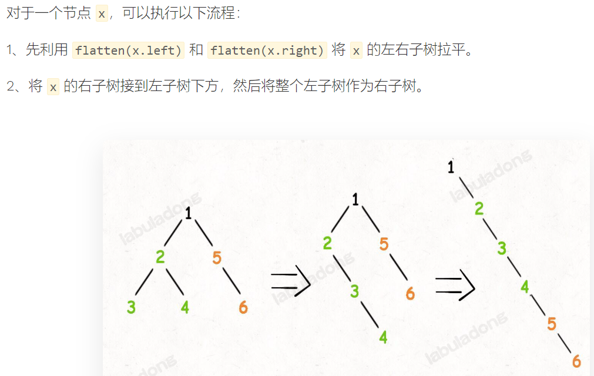

# Binary Tree Conversion

## [LC 108： Convert Sorted Array to Binary Search Tree](https://leetcode.com/problems/convert-sorted-array-to-binary-search-tree/)

思路：这道题跟LC 109（链表→BST）很相似。主要思路就是用recursion + 找中间点

* 数组→BST：找中间点直接（left+ right)/2
* 链表→BST：找中间点需要用“快慢指针法”

```java
class Solution {
    public TreeNode sortedArrayToBST(int[] nums) {
        return helper(nums, 0, (nums.length-1));
  
    }
    private TreeNode helper(int[] nums, int l, int r) {
        if (l > r) {
            return null;
        }
        int m = (l + r)/2;
        TreeNode res = new TreeNode(nums[m]);
        res.left = helper(nums, l, m-1);
        res.right = helper(nums, m+1, r);
        return res;
    }
}
```

## [LC 109: Convert Sorted List to Binary Search Tree](https://leetcode.com/problems/convert-sorted-list-to-binary-search-tree/)

快慢指针找链表的中点：


代码如下：


```java
class Solution {
    public TreeNode sortedListToBST(ListNode head) {
        return helper(head, null);  
    }

    /**这里的tail就当做是null，所以实际需要考虑的node包括head，不包括tail。*/
    //左闭右开
    private TreeNode helper(ListNode head, ListNode tail) {
        if (head == tail) {
            return null;
        }

        /**快慢指针法，把tail就当做null来看*/
        ListNode slow = head;
        ListNode fast = head;
        while (fast != tail && fast.next != tail) {
            slow = slow.next;
            fast = fast.next.next;
        }
        TreeNode answer = new TreeNode(slow.val);
        answer.left = helper(head, slow);
        answer.right = helper(slow.next, tail);
        return answer;   
    }
}
```

## * 遍历序列→二叉树

### 1. 前序+中序遍历序列→二叉树

#### [LC 105. Construct Binary Tree from Preorder and Inorder Traversal](https://leetcode.com/problems/construct-binary-tree-from-preorder-and-inorder-traversal/)

* 重点：找root在inorder中的index（用hashMap来存储: Map<**inorder**[i]，i>)
* 难点：在java中，array不能像在python中进行slicing（例如：array[start : end])，所以就只能将start、end信息放在helper function的参数中。
* 图解：

  

完整代码如下：

时间复杂度：O(n)，其中 n 是树中的节点个数。

空间复杂度：O(n)，除去返回的答案需要的 O(n) 空间之外，我们还需要使用 O(n) 的空间存储哈希映射，以及 O(h)（其中 hh 是树的高度）的空间表示递归时栈空间。这里 h<n，所以总空间复杂度为 O(n)。

```java
class Solution {
    Map<Integer, Integer> valToIndex;
    public TreeNode buildTree(int[] preorder, int[] inorder) {
        //将中序遍历数组中的val（key）和index（val）存入哈希表
        valToIndex = new HashMap<>();
        for (int i = 0; i < inorder.length; i += 1) {
            valToIndex.put(inorder[i], i);
        }
        return buildTree(preorder, 0, preorder.length-1, inorder, 0, inorder.length-1);  
    }
    //根据前序遍历数组preorder[preStart, preEnd]和中序遍历数组inorder[inStart, inEnd],返回对应的二叉树
    TreeNode buildTree(int[] preorder, int preStart, int preEnd, int[] inorder, int inStart, int inEnd) {
        if (preStart > preEnd) {
            return null;
        }
        //前序遍历的第一个元素即为根节点的值
        int rootVal = preorder[preStart];
        TreeNode res = new TreeNode(rootVal);
        //找到根节点在中序遍历数组中的index
        int index = valToIndex.get(rootVal);
        //左子树的长度
        int leftSize = index - inStart;
        //递归构造左子树
        res.left = buildTree(preorder, preStart+1, preStart+leftSize, inorder, inStart, index-1);
        //递归构造右子树
        res.right = buildTree(preorder,preStart+leftSize+1, preEnd, inorder, index+1, inEnd);
  
        return res;
    }
}
```

### 2. 中序+后序遍历序列→二叉树

#### [LC 106：Construct Binary Tree from Inorder and Postorder Traversal](https://leetcode.com/problems/construct-binary-tree-from-inorder-and-postorder-traversal/)

* 这题思路跟lc105是一模一样的

图解：


代码如下：

时间复杂度：O(n)，其中 n 是树中的节点个数。

空间复杂度：O(n)，除去返回的答案需要的 O(n) 空间之外，我们还需要使用 O(n) 的空间存储哈希映射，以及 O(h)（其中 hh 是树的高度）的空间表示递归时栈空间。这里 h<n，所以总空间复杂度为 O(n)。

```java
class Solution {
    public TreeNode buildTree(int[] inorder, int[] postorder) {
        Map<Integer, Integer> inMap = new HashMap<>();
        for (int i = 0; i < inorder.length; i +=1) {
            inMap.put(inorder[i], i);
        }
        TreeNode res = buildTree(inorder, 0, inorder.length-1, postorder, 0, postorder.length-1, inMap);
        return res;  
    }
    private TreeNode buildTree(int[] inorder, int inL, int inR, 
                               int[] postorder, int posL, int posR, 
                               Map<Integer, Integer> inMap) {
        if (inL > inR) {
            return null;
        }
        TreeNode res = new TreeNode(postorder[posR]);
        int inRootIndex = inMap.get(postorder[posR]);
        int numsL = inRootIndex - inL;
  
        res.left = buildTree(inorder, inL, inRootIndex-1, 
                             postorder, posL, posL+numsL-1, inMap);
        res.right = buildTree(inorder, inRootIndex+1, inR, 
                              postorder, posL+numsL, posR-1, inMap);
        return res;  
    }
}
```

### 3. 前序+后序遍历序列→二叉树

#### [LC 889. Construct Binary Tree from Preorder and Postorder Traversal](https://leetcode.com/problems/construct-binary-tree-from-preorder-and-postorder-traversal/)

**通过前序中序，或者后序中序遍历结果可以确定唯一一棵原始二叉树，但是通过前序后序遍历结果无法确定唯一的原始二叉树** 。

* 这道题与lc105和lc106略有不同
* 同样需要用到Map：Map<**postorder**[i], i> (与lc105和106不同之处)
* 还要考虑当preorder.length = postorder.length = 1时，直接返回一个TreeNode（root.val, null, null)，也就是说不用再继续递归考虑左右子树了，不然就会报错（主要是preL+1处：OutOfIndex）

复杂度应该跟lc105和lc106是一样的。

```java
class Solution {
    public TreeNode constructFromPrePost(int[] preorder, int[] postorder) {
        Map<Integer,Integer> posMap = new HashMap<>();
        for (int i = 0; i < postorder.length; i +=1) {
            posMap.put(postorder[i], i);
        }
        TreeNode res = helper(preorder, 0, preorder.length-1, postorder, 0, postorder.length-1, posMap);
        return res;  
    }
    private TreeNode helper(int[] preorder, int preL, int preR, 
                            int[] postorder, int posL, int posR, 
                            Map<Integer, Integer> posMap) {
        if (preL > preR) {
            return null;
        }
        TreeNode res = new TreeNode(preorder[preL]);
/**这里是重点*/
        if (preL == preR) {
            return res;
        }
  
        int rootIndex = posMap.get(preorder[preL+1]);
        int numsL = rootIndex - posL + 1;
        res.left = helper(preorder, preL+1, preL+ numsL, 
                          postorder, posL, rootIndex, posMap);
        res.right = helper(preorder, preL+numsL+1, preR, 
                           postorder, rootIndex+1, posR-1, posMap);
        return res;
    }
}
```

### 4. 前序遍历序列→BST

#### LC 1008: Construct Binary Search Tree from Preorder Traversal

##### sol 1: 递归+二分查找左右子树分界线

这道题的代码和lc889比较相似，思路如下：

* step1: create a node
* step2: itereate the arrays to find the index i of the element which is larger then node.val(key point!)
* step3: the subarray preorder[start+1: i-1] corresponds to the left subtree; preorder[i: end] the right.

错误点：step2搞错了，**错误代码**如下：

```java
int index = 0;
//index的边界错了
for (index = start+1; index < preorder.length; i +=1) {
//if条件句错了
    if (preorder[index] < preorder[index+1]) {
        break;
    }
}
```

**正确完整代码**如下：

二分查找目标元素时，为啥计算mid的时候还要加1???

```java
class Solution {
    public TreeNode bstFromPreorder(int[] preorder) {
        return bst(preorder, 0, preorder.length - 1);   
    }
    public TreeNode bst(int[] preorder, int start, int end) {
        if (start > end) return null;
//step1:creates a node.
        TreeNode res = new TreeNode(preorder[start]);
        if (start == end) return res;//这一步容易遗漏
//step2: finds the index of the target element.
        //在区间 [left..right] 里找最后一个小于 preorder[left] 的下标
        // 注意这里设置区间的左边界为 left ，不能是 left + 1
        // 这是因为考虑到区间只有 2 个元素 [left, right] 的情况，
        //第 1 个部分为空区间，第 2 部分只有一个元素 right
        int left = start;
        int right = end;
        while (left < right) {
            int mid = left + (right + 1- left)/2;
            if (preorder[mid] < preorder[start]) {
                left = mid;
            } else {
                right = mid-1;
            }
        }
        int i = left+1;
        res.left = bst(preorder, start+1, left);
        res.right = bst(preorder,left+1, end);
        return res;
    }
}
```

* 时间复杂度：O(Nlog⁡N)，在找左右子树分界线的时候时间复杂度为 O(log⁡N)；
* 空间复杂度：O(N)。

##### sol 2: 递归 + 根据每个节点位置的上下边界构造左右子树

思路：遍历前序遍历中的每一个元素，用index来控制，比如index = 0表示当前遍历到preorder[0]。遍历的同时，把这个元素对应的节点的左右边界传递下去

代码如下：

```java
class Solution {
    int index = 0;
    int[] preorder;
    int len;
    public TreeNode bstFromPreorder(int[] preorder) {
        this.preorder = preorder;
        len = preorder.length;
        return dfs(Integer.MIN_VALUE, Integer.MAX_VALUE);   
    }

    private TreeNode dfs(int lowerBound, int upperBound) {
        // if all elements from preorder are used
        // then the tree is constructed
        if (index == len) {
            return null;
        }
        int val = preorder[index];
        // if the current element 
        // couldn't be placed here to meet BST requirements
        if (val < lowerBound || val > upperBound) {
            return null;//return null
        }
        // place the current element
        // and recursively construct subtrees
        index++;
        TreeNode root = new TreeNode(val);
        root.left = dfs(lowerBound, val);
        root.right = dfs(val, upperBound);
        return root;
    }
}
```

time complexity: O(N) since we visit each node exactly once.

space complexity: O(N) .

## *二叉树→链表

### [LC 114：Flatten Binary Tree to Linked List](https://leetcode.com/problems/flatten-binary-tree-to-linked-list/)

#### 1. 我的解法

我觉得这题本质上就是二叉树的前序遍历，另外就是这题不是让return一个新的tree，而是改变原来的tree

```java
class Solution {
    public void flatten(TreeNode root) {
        if (root == null) {
            return;
        }
  
        Stack<TreeNode> stack = new Stack<>();
        if (root.right != null) {
            stack.push(root.right);
        }
        if (root.left != null) {
            stack.push(root.left);
        }
        TreeNode p = root;
        while (!stack.isEmpty()) {
            TreeNode curNode = stack.pop();
            p.left = null;
            p.right = new TreeNode(curNode.val);
            p = p.right;
            if (curNode.right != null) {
                stack.push(curNode.right);
            }
            if (curNode.left != null) {
                stack.push(curNode.left);
            }  
        }  
    }
}
```

#### 2: 和morris有点像

图解：



代码如下：

```java
class Solution {
    public void flatten(TreeNode root) {
        if (root == null) return;
        //先将左右子树拉平
        flatten(root.left);
        flatten(root.right);
        /**后序遍历位置 */
        //先将左子树作为右子树
        TreeNode right = root.right;
        root.right = root.left;
        root.left = null;
        //再将原先的右子树接到当前子树的末端
        TreeNode p = root;
        while (p.right != null) p = p.right;
        p.right = right;  
    }
}
```

#### 3. [其他解法-Morris Traversal (highly efficient)](https://leetcode.com/problems/flatten-binary-tree-to-linked-list/discuss/1207642/JS-Python-Java-C%2B%2B-or-Simple-O(1)-Space-and-Recursive-Solutions-w-Explanation)

解法详见这篇[题解](https://leetcode.com/problems/flatten-binary-tree-to-linked-list/discuss/1207642/JS-Python-Java-C%2B%2B-or-Simple-O(1)-Space-and-Recursive-Solutions-w-Explanation)。

* **space complexity** of **O(1)**
* **time complexity** of **O(N)**

```java
class Solution {
    public void flatten(TreeNode root) {
        TreeNode curr = root;
        while (curr != null) {
            if (curr.left != null) {
                TreeNode runner = curr.left;
                while (runner.right != null) runner = runner.right;
                runner.right = curr.right;
                curr.right = curr.left;
                curr.left = null;
            }
            curr = curr.right;
        }
    }
}
```

#### 4、递归：右左中序遍历

```
    1
   / \
  2   5
 / \   \
3   4   6

```

这棵二叉树的后序遍历的逆序即为：6 5 4 3 2 1

依次遍历 `6 5 4 3 2 1`，然后每遍历一个节点就将当前节点的右指针更新为上一个节点。

用pre来记录上一个节点

遍历到6时，把6的右指针指向指向pre(即null)，`null <- 6  5 4 3 2 1`，然后将pre更新为6

遍历到5时，把5的右指针指向指向pre(即6)，`null <- 6 <- 5 4 3 2 1`，然后将pre更新为5

遍历到4时，把5的右指针指向指向pre(即5)，`6 <- 5 <- 4 3 2 1`，然后将pre更新为4

以此类推。。。

代码如下：

```java
class Solution {
    TreeNode pre = null;
    public void flatten(TreeNode root) {
        if (root == null) return;
        flatten(root.right);
        flatten(root.left);
        /**后序遍历位置：即离开当前节点的位置 */
        root.right = pre;
        root.left = null;
        pre = root;  
    }
}
```

#### 5、先序遍历的迭代法

讨论：如果用先序遍历的递归法，在前序遍历位置将当前节点的的右指针指向左子树的话，就会丢失右子树，而先序遍历的迭代法不会，因为左右子树都已经入栈了。

利用先序遍历的代码，每遍历一个节点，就将上一个节点的右指针更新为当前节点。

先序遍历的顺序是 `1 2 3 4 5 6`。

用pre保存上一个节点，pre初始化为null

遍历到1，此时pre为null，前序遍历位置操作跳过，右子树入栈，左子树入栈，pre更新为1（当前节点）

遍历到 `2`，把 `1`（pre） 的右指针指向 `2`。`1 -> 2 3 4 5 6`。将pre更新为2（当前节点）

遍历到 `3`，把 `2` （pre）的右指针指向 `3`。`1 -> 2 -> 3 4 5 6`。将pre更新为3（当前节点）

以此类推

代码如下：

时间复杂度：O(n)，其中 n 是二叉树的节点数。前序遍历的时间复杂度是 O(n)，前序遍历的同时对每个节点更新左右子节点的信息，更新子节点信息的时间复杂度是 O(1)，因此总时间复杂度是 O(n)。

空间复杂度：O(n)，其中 nn 是二叉树的节点数。空间复杂度取决于栈的大小，栈内的元素个数不会超过 n。

```java
class Solution {
    public void flatten(TreeNode root) {
        if (root == null) return;
        Deque<TreeNode> stack = new ArrayDeque<>();
        stack.push(root);
        TreeNode pre = null;
        while (!stack.isEmpty()) {
            TreeNode curNode = stack.pop();
            /**前序遍历位置 */
            if (pre != null) {
                pre.right = curNode;
                pre.left = null;
            }
            if (curNode.right != null) {
                stack.push(curNode.right);
            }
            if (curNode.left != null) {
                stack.push(curNode.left);
            }
            /**更新pre */
            pre = curNode;
        }  
    }
}
```

#### 6、先序遍历将节点保存到数组中

二叉树先序遍历将节点保存到数组中，再遍历数组，依次改变各节点的指针，即左指针置为null，右指针指向下一个节点。

# [LC 654 : Maximum Binary Tree](https://leetcode.com/problems/maximum-binary-tree/description/)

## sol 1: 递归

代码中，找到数组中最大值的index的方法很巧妙，值得学习

完整代码如下：

时间复杂度：O(n^2)，其中 n 是数组 nums 的长度。在最坏的情况下，数组严格递增或递减，需要递归 n 层，第 i (0≤i<n) 层需要遍历 n−i 个元素以找出最大值，总时间复杂度为 O(n^2)。

空间复杂度：O(n)，即为最坏情况下需要使用的栈空间。

```java
class Solution {
    public TreeNode constructMaximumBinaryTree(int[] nums) {
        return build(nums, 0, nums.length-1);  
    }
    //根据数组nums[start, end]构造并返回一棵最大二叉树
    TreeNode build(int[] nums, int start, int end) {
        if (start > end) return null;
        int rootIndex = maxOfIndex(nums, start, end);
        TreeNode res = new TreeNode(nums[rootIndex]);
        res.left = build(nums, start, rootIndex-1);
        res.right = build(nums, rootIndex+1, end);
        return res;
    }

    //返回数组nums中最大值的index
    int maxOfIndex(int[] nums, int start, int end) {
        int index = start;
        for (int i = start+1; i <= end; i += 1) {
            index = nums[index] < nums[i] ? i : index;
        }
        return index;
    }
}
```

## sol 2：单调栈

### 采用ArrayDeque

思路：

构造一个从栈底到栈顶单调递增的元素。

1）如果栈顶元素大于当前待插入元素，则栈顶元素.right = 当前待插入元素

2）如果栈顶元素小于当前待插入元素，则待插入元素.left = 栈顶元素

图解：


完整代码如下：

时间复杂度：O(N)，每个元素分别进栈和出栈一次

空间复杂度：O(N)，最坏的情况是数组nums单调递减。

```java
class Solution {
    public TreeNode constructMaximumBinaryTree(int[] nums) {
        Deque<TreeNode> monoStack = new ArrayDeque<>();
        for (int num: nums) {
            TreeNode node = new TreeNode(num);
            while (!monoStack.isEmpty()) {
                TreeNode top = monoStack.peekLast();
                if (top.val > num) {//直接入栈
                    monoStack.addLast(node);
                    top.right = node;
                    break;
                } else {//栈顶元素出栈
                    monoStack.removeLast();
                    node.left = top;
                }
            }
            //如果栈为空，直接入栈
            if (monoStack.isEmpty()) {
                monoStack.addLast(node);
            }
        }
        //返回单调栈栈底元素
        return monoStack.peek();  
    }
}
```

### 采用数组

代码如下：

```java
class Solution {
    public TreeNode constructMaximumBinaryTree(int[] nums) {
        TreeNode[] monoStack = new TreeNode[1001];
        int tail = 0;
        for (int num: nums) {
            TreeNode node = new TreeNode(num);
            while (tail != 0) {
                TreeNode top = monoStack[tail-1];
                if (top.val > num) {//直接入栈
                    monoStack[tail++] = node;
                    top.right = node;
                    break;
                } else {//栈顶元素出栈
                    monoStack[--tail] = null;
                    node.left = top;
                }
            }
            //如果栈为空，直接入栈
            if (tail == 0) {
                monoStack[tail++] = node;
            }
        }
        //返回单调栈栈底元素
        return monoStack[0];  
    }
}
```

# 二叉树反序列化和序列化

## LC 297: Serialize and Deserialize Binary Tree

序列化，就是得到二叉树的前、中、后序遍历结果。

反序列化，就是根据二叉树的前中后续遍历结果，构造二叉树。通常来说，已知前中序遍历或中后序遍历，可以构造唯一的二叉树；已知前后序可以构造二叉树但不唯一。但是这里，如果前中后序遍历结果中包含了空指针的信息，那么只要已知一种遍历结果就可以构造出唯一的二叉树。

这里以前序遍历解法为例，具体说明：

序列化：就是二叉树的前序遍历，得到的字符串中，用"#"代表空指针null，用","当做分隔符。


反序列化：

重点说明：先把序列化字符串转化成链表存储，链表的头结点就是一棵二叉树的根节点，每次都删除一个头结点，剩下的链表就是剩余二叉树的部分，遇到null说明到达叶子节点，直接返回。


### sol 1: 前序遍历解法

完整代码如下：

时间复杂度：在序列化和反序列化函数中，我们只访问每个节点一次，因此时间复杂度为 O(n)，其中 n 是节点数，即树的大小。
空间复杂度：在序列化和反序列化函数中，我们递归会使用栈空间，故渐进空间复杂度为 O(n)。

```java
public class Codec {
    String SEP = ",";
    String NULL = "#";
    // Encodes a tree to a single string.
    public String serialize(TreeNode root) {
        StringBuilder res = new StringBuilder();
        serialize(root, res);
        return res.toString();  
    }
    void serialize(TreeNode root, StringBuilder sb) {
        if (root == null) {
            sb.append(NULL).append(SEP);
            return;
        }
        //前序遍历位置
        sb.append(root.val).append(SEP);
        serialize(root.left, sb);
        serialize(root.right, sb);
    }

    // Decodes your encoded data to tree.
    public TreeNode deserialize(String data) {
        //先把字符串转换成列表
        //这里用链表而不是数组，是为了方便后面删除头结点
        LinkedList<String> nodes = new LinkedList<>();
        for (String s: data.split(SEP)) {
            nodes.addLast(s);
        }
        return deserialize(nodes);  
    }
    TreeNode deserialize(LinkedList<String> nodes) {
        // if (nodes.isEmpty()) return null;
        String root = nodes.removeFirst();
        if (root.equals(NULL)) return null;
        TreeNode res = new TreeNode(Integer.parseInt(root));
        res.left = deserialize(nodes);
        res.right = deserialize(nodes);
        return res;
    } 
}
```

### sol 2: 后序遍历解法

代码如下：

```java
public class Codec {
    String SEP = ",";
    String NULL = "#";
    // Encodes a tree to a single string.
    public String serialize(TreeNode root) {
        StringBuilder res = new StringBuilder();
        serialize(root, res);
        return res.toString();  
    }
    void serialize(TreeNode root, StringBuilder sb) {
        if (root == null) {
            sb.append(NULL).append(SEP);
            return;
        }
        serialize(root.left, sb);
        serialize(root.right, sb);
        //前序遍历位置
        sb.append(root.val).append(SEP);
    }

    // Decodes your encoded data to tree.
    public TreeNode deserialize(String data) {
        //先把字符串转换成列表
        //这里用链表而不是数组，是为了方便后面删除头结点
        LinkedList<String> nodes = new LinkedList<>();
        for (String s: data.split(SEP)) {
            nodes.addLast(s);
        }
        return deserialize(nodes);  
    }
    TreeNode deserialize(LinkedList<String> nodes) {
        // if (nodes.isEmpty()) return null;
        //和前序遍历解法相比，根节点是链表的最后一个节点
        String root = nodes.removeLast();
        if (root.equals(NULL)) return null;
        TreeNode res = new TreeNode(Integer.parseInt(root));
        //和前序遍历解法相比，构造左右子树的顺序变了
        res.right = deserialize(nodes);
        res.left = deserialize(nodes);
        return res;
    } 
}
```

### sol 3: 层序遍历解法


完整代码如下：

时间复杂度：O(N),每个节点进出队列各一次。

空间复杂度：O(N)。

```java
public class Codec {
    String SEP = ",";
    String NULL = "#";
    // Encodes a tree to a single string.
    public String serialize(TreeNode root) {
        if (root == null) return "";
        StringBuilder res = new StringBuilder();
        Queue<TreeNode> q = new LinkedList<>();
        q.offer(root);
        while (!q.isEmpty()) {
            TreeNode curNode = q.poll();
            if (curNode == null) {
                res.append(NULL).append(SEP);
                continue;
            }
            res.append(curNode.val).append(SEP);
            q.offer(curNode.left);
            q.offer(curNode.right);
        }
        return res.toString();   
    }
  

    // Decodes your encoded data to tree.
    public TreeNode deserialize(String data) {
        if (data.isEmpty()) return null;
        String[] nodes = data.split(SEP);
        TreeNode root = new TreeNode(Integer.parseInt(nodes[0]));
        //将第一个节点即根节点加入队列
        Queue<TreeNode> q = new LinkedList<>();
        q.offer(root);
        //遍历数组nodes
        for (int i = 1; i < nodes.length;) {
            TreeNode curNode = q.poll();
            //左子树的根节点的值
            String left = nodes[i++];
            if (!left.equals(NULL)) {
                curNode.left = new TreeNode(Integer.parseInt(left));
                q.offer(curNode.left);//左子树加入队列
            } else {
                curNode.left = null;
            }
            //右子树的根节点的值
            String right = nodes[i++];
            if (!right.equals(NULL)) {
                curNode.right = new TreeNode(Integer.parseInt(right));
                q.offer(curNode.right);//右子树加入队列
            } else {
                curNode.right = null;
            }
        }
        return root;  
    }  
}
```

# 二叉树的序列化的应用

## [LC 652：Find Duplicate Subtrees](https://leetcode.com/problems/find-duplicate-subtrees/description/)

两棵树相同如何比较？将两者的序列化字符串进行比较，字符串相同则树相同。

注意点：set中要先存储二叉树的序列化字符串（而不是二叉树本身），因为序列化相同的两棵树不会被set识别为相同的树，从而也不会去重。

### 写法一：前序遍历写法

完整代码如下：

```java
class Solution {
    Map<String, TreeNode> map;
    public List<TreeNode> findDuplicateSubtrees(TreeNode root) {
        //建立哈希表，key：二叉树的序列化字符串；value:对应二叉树的根节点
        map = new HashMap<>();
        //保存根节点的序列化字符串
        Set<String> set = new HashSet<>();
        traverse(root, set);
        List<TreeNode> res = new ArrayList<>();
        //根据序列化字符串找到对应的二叉树的根节点
        for (String s: set) {
            res.add(map.get(s));
        } 
        return res; 
    }
    //遍历以root为根节点的二叉树的所有节点
    void traverse(TreeNode root, Set<String> res) {
        if (root == null) return;
        String s = serialize(root);
        if (map.containsKey(s)) {
            res.add(s);
        } else {
            map.put(s, root);
        }
        traverse(root.left, res);
        traverse(root.right, res);
    }
    //得到以root为根节点的二叉树的前序遍历的序列字符串
    String serialize(TreeNode root) {
        if (root == null) return "#";
        return "" + root.val + "," + serialize(root.left) + serialize(root.right);
    }
}
```

### 写法二：后序遍历解法

要知道一棵树跟其他树是否相同，首先要知道这棵树本身长啥样，也就是要知道这棵树左右子树长啥样，很容易联想到后序遍历。

完整代码如下：


```java
class Solution {
    Map<String, TreeNode> map;
    Set<TreeNode> set;
    public List<TreeNode> findDuplicateSubtrees(TreeNode root) {
        //建立哈希表，key：二叉树的序列化字符串；value:对应二叉树的根节点
        map = new HashMap<>();
        //保存最终答案
        set = new HashSet<>();
        traverse(root);
        return new ArrayList<TreeNode>(set); 
    }
    //遍历以root为根节点的二叉树的所有节点
    //得到二叉树的后序遍历的序列字符串，同时更新map和set
    String traverse(TreeNode root) {
        if (root == null) return "#";

        String left = traverse(root.left);
        String right = traverse(root.right);
        String s = left + "," + right + "," + root.val;
        //后序遍历位置,更新map和set
        if (map.containsKey(s)) {
            set.add(map.get(s));
        } else {
            map.put(s, root);
        }
        return s;
    }   
}
```

# 归并算法

## 归并算法模板：

```java
class Merge {

    // 用于辅助合并有序数组
    private static int[] temp;

    public static void sort(int[] nums) {
        // 先给辅助数组开辟内存空间
        temp = new int[nums.length];
        // 排序整个数组（原地修改）
        sort(nums, 0, nums.length - 1);
    }

    // 定义：将子数组 nums[lo..hi] 进行排序
    private static void sort(int[] nums, int lo, int hi) {
        if (lo == hi) {
            // 单个元素不用排序
            return;
        }
        // 这样写是为了防止溢出，效果等同于 (hi + lo) / 2
        int mid = lo + (hi - lo) / 2;
        // 先对左半部分数组 nums[lo..mid] 排序
        sort(nums, lo, mid);
        // 再对右半部分数组 nums[mid+1..hi] 排序
        sort(nums, mid + 1, hi);
        // 将两部分有序数组合并成一个有序数组
        merge(nums, lo, mid, hi);
    }

    // 将 nums[lo..mid] 和 nums[mid+1..hi] 这两个有序数组合并成一个有序数组
    private static void merge(int[] nums, int lo, int mid, int hi) {
        // 先把 nums[lo..hi] 复制到辅助数组中
        // 以便合并后的结果能够直接存入 nums
        for (int i = lo; i <= hi; i++) {
            temp[i] = nums[i];
        }

        // 数组双指针技巧，合并两个有序数组
        int i = lo, j = mid + 1;
        for (int p = lo; p <= hi; p++) {
            if (i == mid + 1) {
                // 左半边数组已全部被合并
                nums[p] = temp[j++];
            } else if (j == hi + 1) {
                // 右半边数组已全部被合并
                nums[p] = temp[i++];
            } else if (temp[i] > temp[j]) {
                nums[p] = temp[j++];
            } else {
                nums[p] = temp[i++];
            }
        }
    }
}

```

## 归并算法复杂度：

归并排序来说，时间复杂度显然集中在 `merge` 函数遍历 `nums[lo..hi]` 的过程。

**执行的次数是二叉树节点的个数，每次执行的复杂度就是每个节点代表的子数组的长度，所以总的时间复杂度就是整棵树中「数组元素」的个数** 。

所以从整体上看，这个二叉树的高度是 `logN`，其中每一层的元素个数就是原数组的长度 `N`，所以总的时间复杂度就是 `O(NlogN)`。


## LC 315：Count of Smaller Numbers After Self

完整代码如下：

时间复杂度：O(Nlog⁡N)，数组的元素个数是 N，递归执行分治法，时间复杂度是对数级别的，因此时间复杂度是 O(Nlog⁡N)；
空间复杂度：O(N)，需要 3 个数组，它们的长度都是 N，故空间复杂度是 O(N)。

注意：更新res数组时，是要把结果叠加。

```java
class Solution {
    //创建Pair类，将nums中元素的值和其索引绑在一起
    private class Pair {
        int val;//nums[i]
        int id;//i
        Pair (int val, int id) {
            this.val = val;
            this.id = id;
        }
    }

    //归并排序用到的辅助数组
    Pair[] helper;
    //记录最终输出结果的数组
    int[] res;
    //主函数
    public List<Integer> countSmaller(int[] nums) {
        int n = nums.length;
        helper = new Pair[n];
        res = new int[n];
        //先把nums数组中的元素转换成Pair类
        Pair[] numsPair = new Pair[n];
        for (int i = 0; i < n; i += 1) {
            numsPair[i] = new Pair(nums[i], i);
        }
        //执行归并排序操作
        sort(numsPair, 0, n-1);
        //将结果转化成list
        List<Integer> count = new LinkedList<>();
        for (int num: res) {
            count.add(num);
        }
        return count;  
    }
    //归并排序
    void sort(Pair[] numsPair, int start, int end) {
        if (start == end) return;
        int mid = start + (end-start)/2;
        //左边数组排序
        sort(numsPair, start, mid);
        //右边数组排序
        sort(numsPair,mid+1, end);
        //左右数组合并
        merge(numsPair, start, mid, end);
    }
    //合并数组numsPair[start,mid]和numsPair[mid+1, end]
    //同时更新数组res
    void merge(Pair[] numsPair, int start, int mid, int end) {
        //先将numsPair转存到helper数组中
        for (int i = start; i <= end; i += 1) {
            helper[i] = numsPair[i];
        }
        int i = start;//在左边数组上移动的指针
        int j = mid + 1;//在右边数组上移动的指针
        //p是在归并后的数组上移动的指针
        for (int p = start; p <= end; p += 1) {
            if (j == end + 1) {//右边数组的元素用完了
                //剩余归并后的数组全是左边数组的了
                numsPair[p] = helper[i++];
                //当左边数组的元素进入归并后的数组时，需要更新其索引了
                //j - (mid+1)其实就是右边数组的长度
                res[numsPair[p].id] += j - (mid+1);
            } else if (i == mid + 1) {//左边数组的元素用完了
                numsPair[p] = helper[j++];
            } else if (helper[i].val > helper[j].val) {
                numsPair[p] = helper[j++];
            } else {//左边数组的元素进入归并后的数组
                numsPair[p] = helper[i++];
                //有（j-(mid+1)）个右边数组的元素插到了numsPair[i]的前面
                res[numsPair[p].id] += j - (mid+1);
            }
        }
    }
}
```

## [LC 912: Sort an Array](https://leetcode.com/problems/sort-an-array/description/)

就是最基本的归并算法的运用。

完整代码如下：

```java
class Solution {
    int[] temp;
    public int[] sortArray(int[] nums) {
        int n = nums.length;
        temp = new int[n];
        sort(nums, 0, n-1);
        return nums;  
    }

    void sort(int[] nums, int start, int end) {
        if (start == end) {
            return;
        }
        int mid = start + (end-start)/2;
        sort(nums, start, mid);
        sort(nums, mid+1, end);
        merge(nums, start, mid, end);
    }

    void merge(int[] nums, int start, int mid, int end) {
        for (int i = start; i <= end; i += 1) {
            temp[i] = nums[i];
        }
        int i = start, j = mid + 1;
        for (int p = start; p <= end; p += 1) {
            if (i == mid + 1) {
                nums[p] = temp[j++];
            } else if (j == end + 1) {
                nums[p] = temp[i++];
            } else if (temp[i] > temp[j]) {
                nums[p] = temp[j++];
            } else {
                nums[p] = temp[i++];
            }
        }
    }
}
```

ddd
