# Depth/Width

## [LC 104: Maximum Depth of Binary Tree](https://leetcode.com/problems/maximum-depth-of-binary-tree/)

思路：recursion、DFS、BFS

### sol 1: DFS

这道题也可以通过分解问题（子问题）推导出原问题的答案。

* 二叉树最大深度 = max（leftMaxDepth，rightMaxDepth）+ 1
* DFS图解如下：

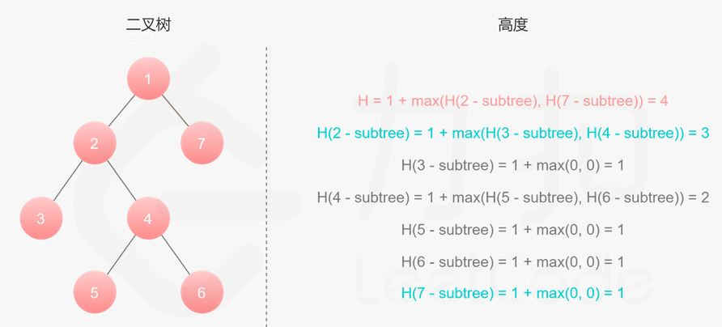

* 复杂度分析

时间复杂度：O(n)，其中 n为二叉树节点的个数。每个节点在递归中只被遍历一次。

空间复杂度：O(height)，其中 height 表示二叉树的高度。**递归函数需要栈空间**，而栈空间取决于递归的深度，因此空间复杂度等价于二叉树的高度。

* 代码如下：

```java
class Solution {
    public int maxDepth(TreeNode root) {
        if (root == null) {
            return 0;
        }
        int heightL = maxDepth(root.left);
        int heightR = maxDepth(root.right);
        return Math.max(heightL, heightR) + 1;  
    }
}
```

### sol 2: BFS

本质也是二叉树的遍历，遍历一遍得到答案。

* 思路：将队列里的所有节点都拿出来进行拓展，这样能保证每次拓展完的时候队列里存放的是当前层的所有节点，即我们是一层一层地进行拓展，最后我们用一个变量 res来维护拓展的次数。
* 时间复杂度：O(n)，其中 n 为二叉树的节点个数。与sol 1同样的分析，每个节点只会被访问一次。
* 空间复杂度：此方法空间的消耗取决于队列存储的元素数量，其在最坏情况下会达到 O(n)。

```java
class Solution {
    public int maxDepth(TreeNode root) {
        if (root == null) {
            return 0;
        }
        Queue<TreeNode> queue = new LinkedList<>();
        queue.offer(root);
        int res = 0;
        while (!queue.isEmpty()) {
/**size：每一层的node的个数。*/
            int size = queue.size();
/**每一层的node依次出队列进行拓展。*/
            for (int i = 0; i < size; i += 1) {  
                TreeNode curNode = queue.poll();
                if (curNode.left != null) {
                    queue.offer(curNode.left);
                }
                if (curNode.right != null) {
                    queue.offer(curNode.right);
                }   
            }
            res += 1;  
        }
        return res;
    }
}
```

### sol 3: 二叉树的遍历

这道题可以通过遍历一遍二叉树得到答案。

写法1：traverse函数**带参数**

代码如下：

```java
class Solution {
    //全局变量
    int maxDepth = 0;
    public int maxDepth(TreeNode root) {
        traverse(root, 1);
        return maxDepth;   
    }

    void traverse(TreeNode root, int depth) {
        if (root == null) {
            return;
        }
        //前序遍历位置，如果到达叶子节点，则更新maxDepth
        if (root.left == null && root.right == null) {
            maxDepth = Math.max(maxDepth, depth);
        }
        traverse(root.left, depth+1);
        traverse(root.right, depth+1);
    }
}
```

另一种写法，traverse函数**不带参数**:

只在遇到叶子节点时才更新maxDepth。

```java
class Solution {
    //全局变量
    int maxDepth = 0;
    //当前遍历到的节点的深度
    int depth = 0;
    public int maxDepth(TreeNode root) {
        traverse(root);
        return maxDepth;   
    }

    void traverse(TreeNode root) {
        if (root == null) {
            return;
        }
        //前序遍历位置:进入当前节点root时，深度加1
        depth++;
        //到达叶子节点时更新maxDepth
        if (root.left == null && root.right == null) {
            maxDepth = Math.max(maxDepth, depth);
        }
        traverse(root.left);
        traverse(root.right);
        //后续遍历位置：离开当前节点root时，深度减1
        depth--;
    }
}
```

## [LC 111：Minimum Depth of Binary Tree](https://leetcode.com/problems/minimum-depth-of-binary-tree/)

### sol 1: DFS

* 思路：如果只有一个子树，则二叉树最小深度就是该子树的最小深度+1；如果有两个子树，则为左右子树的最小深度中较小者+1
* 时间复杂度：O(N)，其中 NNN 是树的节点数。对每个节点访问一次。
* 空间复杂度：O(H)，其中 H是树的高度。空间复杂度主要取决于递归时栈空间的开销，最坏情况下，树呈现链状，空间复杂度为 O(N)。平均情况下树的高度与节点数的对数正相关，空间复杂度为 O(log⁡N)。

```java
class Solution {
    public int minDepth(TreeNode root) {
        if (root == null) {
            return 0;
        }
        int heightL = minDepth(root.left);
        int heightR = minDepth(root.right);
/**当二叉树只有一个子树时：*/
        if (root.left == null || root.right == null) {
            return heightL + heightR + 1;
/**当二叉树有左右两个子树时：*/
        } else {
            return Math.min(heightL, heightR) + 1;
        }  
    }
}
```

* Time complexity : we visit each node exactly once, thus the time complexity is **O(N)**, where **N** is the number of nodes.
* Space complexity : in the worst case, the tree is completely unbalanced, *e.g.* each node has only one child node, the recursion call would occur **N** times (the height of the tree), therefore the storage to keep the call stack would be **O(N)**. But in the best case (the tree is completely balanced), the height of the tree would be **log⁡(N)**. Therefore, the space complexity in this case would be **O(log⁡(N))**.

### sol 2: BFS

* 思路：当找到一个leaf时，直接返回该leaf的深度，因为最先搜索到的leaf的深度一定就是二叉树的最小深度。
* 代码和最大深度的BFS解法基本一样。
* 时间复杂度：O(N)，其中 N是树的节点数。对每个节点访问一次。
* 空间复杂度：O(N)，其中 N是树的节点数。空间复杂度主要取决于队列的开销，队列中的元素个数**不会超过**树的节点数。

```java

class Solution {
    public int minDepth(TreeNode root) {
        if (root == null) {
            return 0;
        }
        Queue<TreeNode> queue = new LinkedList<>();
        queue.offer(root);
        int res = 1;
        while (!queue.isEmpty()) {
            int size = queue.size();
            for (int i = 0; i < size; i +=1) {  
                TreeNode curNode = queue.poll();
/**key point: 当前节点左右子树均为null，所以当前节点为一个leaf，返回。*/
                if (curNode.left == null && curNode.right == null) {
                    return res;
                }
                if (curNode.left != null) {
                    queue.offer(curNode.left);
                }
                if (curNode.right != null) {
                    queue.offer(curNode.right);
                }   
            }
            res += 1;  
        }
        return res;
    }
}
```

# 二叉树的存储结构

1、顺序存储

即用顺序表（数组）存储二叉树。是指用一组地址连续的存储单元依次自上而下，自左至右存储完全[完全二叉树](https://so.csdn.net/so/search?q=%E5%AE%8C%E5%85%A8%E4%BA%8C%E5%8F%89%E6%A0%91&spm=1001.2101.3001.7020)上的结点元素。只有完全二叉树才可以使用顺序表存储。

对于一般的二叉树，为了让数组下标能反映二叉树中结点之间的逻辑关系，只能添加一些并不存在的空结点，让其每个结点与完全二叉树上的结点相对照。

2、链表存储

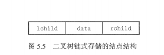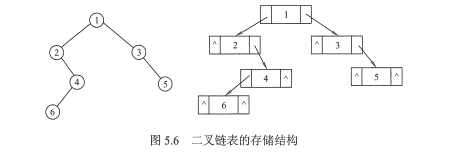

## [LC 662: Maximum Width of Binary Tree](https://leetcode.com/problems/maximum-width-of-binary-tree/)

想到了**BFS**，但是不知道怎么去得到每层的宽度，因为要求把null也算上，这道题其实是要计算leftmost to rightmost的node距离。

思路：给node按层序遍历的顺序编号，即position。如当前node的position为i，则其左子树的position = 2*i，右子树的position = 2*i + 1。

每层的宽度 = deque.getLast().getValue() - deque.getFirst().getValue() + 1.

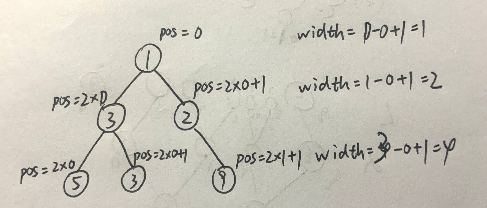

实现方法：

1. 用deque来存储Pair<>（node，position）
2. 写一个class，如下：

   ```java
   /**其实这个class里的depth（即层数）信息是用不上的*/
   class AnnotatedNode {
       TreeNode node;
       int depth, pos;
       AnnotatedNode(TreeNode n, int d, int p) {
           node = n;
           depth = d;
           pos = p;
       }
   }
   ```

这里用了方法一，代码如下：

* 时间复杂度： **O**(**N**)，其中 **N** 是输入树的节点数目，我们遍历每个节点一遍。
* 空间复杂度： **O**(**N**)，这是 `deque` 的大小。

```java

class Solution {
    public int widthOfBinaryTree(TreeNode root) {
        Deque<Pair<TreeNode, Integer>> q = new ArrayDeque<>();
        q.add(new Pair<>(root, 0));
        int res = 0;
  
        while (!q.isEmpty()) {
/**key point: 计算每一层的宽度 = 最右节点position - 最左节点position + 1。*/
            res = Math.max(res, (q.getLast().getValue()-q.getFirst().getValue()+1));
            int size = q.size();
            for (int i = 0; i < size; i +=1) {
                Pair<TreeNode, Integer> pair = q.poll();
                TreeNode node = pair.getKey();
                int pos = pair.getValue();
  
                if (node.left != null) {
                    q.add(new Pair<>(node.left, 2*pos));
                }
                if (node.right != null) {
                    q.add(new Pair<>(node.right, 2*pos+1));
                }   
            }
        }
        return res;
    }
}
```

# Path

## [LC 543: Diameter of Binary Tree](https://leetcode.com/problems/diameter-of-binary-tree/)

思路：这题最开始的想法是用recursion，分两种情况：经过root，不经过root，然后求最大值。这个思路用python解出来了，但不是太优。

思路：

1、二叉树的直径 = 二叉树中所有**路径**的最大值

2、二叉树中的任意一条路径可以看做，由某个节点为起点，其左子树和右子树向下遍历的路径拼接得到。左子树向下遍历最多经过的节点个数就是左子树的深度，同理右子树向下遍历最多经过的节点个数就是右子树的深度。

所以经过一个节点的路径的最大值 = max(leftDepth, rightDepth)

高票solution是：设置一个全局变量diameter，在DFS遍历每个节点的时候，计算每个节点的leftHeight+rightHeight，然后更新全局变量diameter。（计算高度的同时计算diameter）

代码如下：

时间复杂度：O(N)，其中 NN 为二叉树的节点数，即遍历一棵二叉树的时间复杂度，每个结点只被访问一次。

空间复杂度：O(Height)，其中 Height 为二叉树的高度。由于递归函数在递归过程中需要为每一层递归函数分配栈空间，所以这里需要额外的空间且该空间取决于递归的深度，而递归的深度显然为二叉树的高度，并且每次递归调用的函数里又只用了常数个变量，所以所需空间复杂度为 O(Height) 。

```java
class Solution {
    int diameter = 0;
    public int diameterOfBinaryTree(TreeNode root) {
        maxDepth(root);
        return diameter;
  
    }
    //以节点root为【起点】的所有路径的长度的最大值
    int maxDepth(TreeNode root) {
        if (root == null) return 0;
        int left = maxDepth(root.left);//左子树最大深度
        int right = maxDepth(root.right);//右子树最大深度
        //后序位置：
        //left+right为以root为根节点的二叉树的直径。
        //顺便更新最大直径
        diameter = Math.max(diameter, left+right);
        return Math.max(left, right) + 1;
    }
}
```


## LC 366：Find Leaves of Binary Tree

图解：

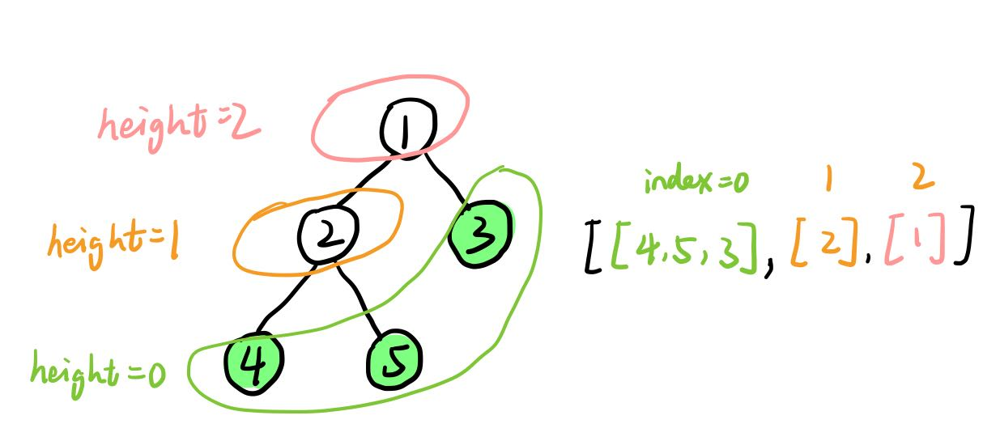

完整代码如下：

```java
class Solution {
    List<List<Integer>> res;
    public List<List<Integer>> findLeaves(TreeNode root) {
        res = new ArrayList<>();
        maxDepth(root);
        return res;
      
    }
    //返回以root为根节点的二叉树的高度（最大深度）
    private int maxDepth(TreeNode root) {
        if (root == null) return -1;//这样高度就定义为边的数量
        int left = maxDepth(root.left);//左子树高度
        int right = maxDepth(root.right);//右子树高度
        //计算当前节点root距离叶子节点的高度
        int height = Math.max(left, right) + 1;
      
        if (res.size() == height) {//这一步没太明白
            res.add(new ArrayList<>());
        }
        res.get(height).add(root.val);

        return height;
    }
}
```

时间复杂度：O(N)

空间复杂度：O(N)


## [LC 257: Binary Tree Paths](https://leetcode.com/problems/binary-tree-paths/)

这题我能看出来其实就是用DFS进行前序遍历，当当前节点为叶子时，在当前路径中加入该节点，得到一条路径；若当前节点不是叶子，则在当前路径中加入该节点后继续遍历该节点的左右子树。

### sol 1: DFS

**仿照recursive前序遍历的代码**，可得：

```java

class Solution {
    public List<String> binaryTreePaths(TreeNode root) {
        List<String> res = new ArrayList<>();
        dfs(root, "", res);
        return res;   
    }
  
    private void dfs(TreeNode root, String curPath, List<String> res) {
        if (root == null) {
            return;
        }
/**唯一不同的是这里，不是直接add(root.val),而是只有当当前节点为叶子时，说明找到
一条路径，加入到res。*/
        if (root.left == null && root.right == null) {
            res.add(curPath+root.val);
            return;
        }
        dfs(root.left, curPath+root.val+"->", res);
        dfs(root.right, curPath+root.val+"->", res);
    }
}
```

* Time complexity : we visit each node exactly once, thus the time complexity is **O(N)**, where **N** is the number of nodes.
* Space complexity : **O(N)**. Here we use the space for a stack call and for a `paths` list to store the answer. `paths` contains as many elements as leafs in the tree and hence couldn't be larger than **log⁡N** for the trees containing more than one element. Hence the space complexity is determined by a stack call. In the worst case, when the tree is completely unbalanced, *e.g.* each node has only one child node, the recursion call would occur **N** times (the height of the tree), therefore the storage to keep the call stack would be **O(N)**. But in the best case (the tree is balanced), the height of the tree would be **log⁡(N)**. Therefore, the space complexity in this case would be **O(log⁡(N))**.

### sol 2: DFS, Iteratively

* 这道题用迭代的BFS会因为超时而不能AC，但是这段代码还是很有借鉴意义的
* stack也可以用来存储pair，只是有几个细节要注意
* 这段代码基本是仿照iterative的前序遍历的代码

```java
class Solution {
    public List<String> binaryTreePaths(TreeNode root) {
        List<String> res = new ArrayList<>();
        if (root == null) {
            return res;
        }
/**用stack同时存储两种data type，所以是Stack<Object>*/
        Stack<Object> stack = new Stack<>();
        stack.push(root);
        stack.push(root.val + "");
        while (!stack.isEmpty()) {
/**curNode和curPath同时出栈。*/
/**需要cast*/
            String curPath = (String) stack.pop();
            TreeNode curNode = (TreeNode) stack.pop();
/**curNode为叶子时，对应的curPath加入res。*/
            if (curNode.left == null && curNode.right == null) {
                res.add(curPath);
            }
/**curNode的左右子树非空时，左右子树入栈，同时curPath新增一个元素后入栈。*/
            if (curNode.right != null) {
                stack.push(curNode.right);
                stack.push(curPath+"->"+curNode.right.val);
            }
            if (curNode.left != null) {
                stack.push(curNode.left);
                stack.push(curPath+"->"+curNode.left.val);  
            }
        }
        return res;  
    }
}
```

### sol 3: BFS

key point：当前节点和当前路径成对入队列，和sol2有点像

```java
class Solution {
    public List<String> binaryTreePaths(TreeNode root) {
        List<String> res = new ArrayList<>();
        if (root == null) {
            return res;
        }
        Queue<Object> q = new LinkedList<>();
        q.add(root);
        q.add(root.val + "");
        while (!q.isEmpty()) {
            TreeNode curNode = (TreeNode) q.poll();
            String curPath = (String) q.poll();
            if (curNode.left == null && curNode.right == null) {
                res.add(curPath);
            }
            if (curNode.left != null) {
                q.add(curNode.left);
                q.add(curPath+"->"+curNode.left.val);
            }

            if (curNode.right != null) {
                q.add(curNode.right);
                q.add(curPath+"->"+curNode.right.val);
            }   
        }
        return res;  
    }
}
```

### sol 4: Recursion

找到左子树的所有路径，找到右子树的所有路径，每条路径再链接上root即可

```java
class Solution {
    public List<String> binaryTreePaths(TreeNode root) {
        List<String> res = new ArrayList<>();
        if (root == null) {
            return res;
        }
        if (root.left == null && root.right == null) {
            res.add(root.val + "");
            return res;
        }
        for (String path: binaryTreePaths(root.left)) {
            res.add(root.val + "->" + path);
        }
        for (String path: binaryTreePaths(root.right)) {
            res.add(root.val + "->" + path);
        }
        return res;   
    }
}
```

## [LC112: Path Sum](https://leetcode.com/problems/path-sum/)

这题有点思路，但又写不对，主要是，当到达一个叶子但是不满足退出条件时，还可以继续遍历，直到遍历完。

思路：这道题本质上是二叉树前序遍历，跟LC257是一样的

### sol 1: DFS, recursively

错误点：

* if (root == null) {return false;},而我写成了return targetSum == 0；。如果已经到达了null，说明已经经过了一个叶子，但是没有退出，说明当前路径sum不等于targetSum
* recursion时，左右子树只要有一个符合退出条件即可（这点我也没想到）

正确代码如下：

```java
class Solution {
    public boolean hasPathSum(TreeNode root, int targetSum) {
        if (root == null) return false;
        if (root.left == null && root.right == null) {
            return root.val == targetSum;
        }
        return hasPathSum(root.left, targetSum-root.val) || hasPathSum(root.right, targetSum-root.val);  
    }
}
```

* Time complexity : we visit each node exactly once, thus the time complexity is **O(N)**, where **N** is the number of nodes.
* Space complexity : in the worst case, the tree is completely unbalanced, *e.g.* each node has only one child node, the recursion call would occur **N** times (the height of the tree), therefore the storage to keep the call stack would be **O(N)**. But in the best case (the tree is completely balanced), the height of the tree would be **log⁡(N)**. Therefore, the space complexity in this case would be **O(log⁡(N))**.

### sol 2: DFS, Iteratively

以下是用LC 257 sol 2同样的方法，代码也几乎一模一样

```java
class Solution {
    public boolean hasPathSum(TreeNode root, int targetSum) {
        if (root == null) {
            return false;  
        }
        Stack<Object> stack = new Stack<>();
        stack.push(root);
        stack.push(targetSum-root.val);
        while (!stack.isEmpty()) {
            int sum = (int) stack.pop();
            TreeNode curNode = (TreeNode) stack.pop();
            if (curNode.left == null && curNode.right == null && sum == 0) {
                return true;
            }
            if (curNode.right != null) {
                stack.push(curNode.right);
                stack.push(sum-curNode.right.val);
            }
            if (curNode.left != null) {
                stack.push(curNode.left);
                stack.push(sum-curNode.left.val);
            }
        }
        return false;  
    }
}
```

## [LC 113: Path Sum II](https://leetcode.com/problems/path-sum-ii/)

这题看着挺简单，也知道就是DFS，但就是写不对

12/09/22 update：这道题本质其实是回溯，我觉得。感觉有点明白dfs和回溯的区别了，helper function中的参数是否包括当前节点是主要区别点。

高票sol如下：

其中关于 `res.add(new ArrayList<>(path));`的解释：

path是object reference，如果add(path)的话，实际上是通过其reference（address in memory)来将object本身添加到list中，一旦object本身（即path)发生变化，list中的object也变了，所以需要通过new ArrayList<>(path)来添加一个new separate object到list中。

```java
/class Solution {
  
    public List<List<Integer>> pathSum(TreeNode root, int targetSum) {
        List<List<Integer>> res = new ArrayList<>();
        List<Integer> path = new ArrayList<>();
        dfs(root, path, targetSum, res);
        return res;  
    }
    private void dfs(TreeNode root, List<Integer> path, int targetSum, List<List<Integer>> res) {
        if (root == null) {
            return;
        }
/**key point：这行代码的位置也纠结了很久不知道放哪里。这一步和下面的remove()成对出现*/
        path.add(root.val);
        if (root.left == null && root.right == null && targetSum == root.val) {
/**关于这里为什么不是res.add(path),详见上文解释。*/
            res.add(new ArrayList<>(path));
        }
        dfs(root.left, path, targetSum-root.val, res);
        dfs(root.right, path, targetSum-root.val, res);
 /**key point: 这一步很关键，也是我没想到的，想一遍DFS的过程就能理解了。*/   
        path.remove(path.size()-1);  
    }
}
```

12/09/22 update：复杂度分析没咋看懂，为啥copy path 的时候时间复杂度是O(N)?我觉得应该是O(H)才对啊？

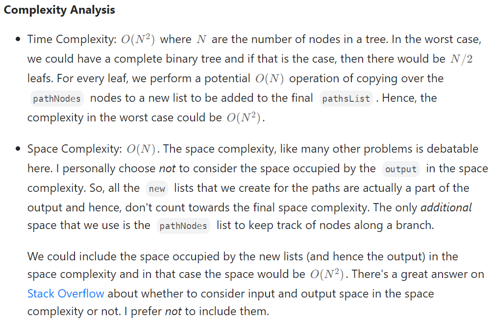

## [LC 437: Path Sum III](https://leetcode.com/problems/path-sum-iii/)

### sol 1： DFS

思路：

* rootSum(p,val) 表示**以节点 p 为起点**向下且满足路径总和为 val 的路径数目。我们对二叉树上**每个节点** p 求出 rootSum(p,targetSum)，然后对这些**路径数目求和**即为返回结果。
* 注意pathSum()和rootSum()的区别
* key point: 可以看到rootSum()中第二个参数的数据类型为long而不是int，如果是int的话会产生溢出，127用例无法通过（不知道为啥用long了就能通过）

代码如下：

* 时间复杂度：O(N^2)，其中 N 为该二叉树节点的个数。对于每一个节点，求以该节点为起点的路径数目时，则需要遍历以该节点为根节点的子树的所有节点，因此求该路径所花费的**最大时间**为 O(N)，我们会对每个节点都求一次以该节点为起点的路径数目，因此时间复杂度O(N^2)。
* 空间复杂度：O(N)，考虑到递归需要在栈上开辟空间。

```java
class Solution {
    public int pathSum(TreeNode root, int targetSum) {
        if (root == null) {
            return 0;
        }

        int ret = rootSum(root, targetSum);
        ret += pathSum(root.left, targetSum);
        ret += pathSum(root.right, targetSum);
        return ret;
    }
/**起点为root的所有符合要求的路径的数量*/
    public int rootSum(TreeNode root, long targetSum) {
        int ret = 0;

        if (root == null) {
            return 0;
        }
        long val = root.val;
        if (val == targetSum) {
            ret++;
        } 
        ret += rootSum(root.left, targetSum - val);
        ret += rootSum(root.right, targetSum - val);
        return ret;
    }
}
```

### sol 2:  前缀和

关于前缀和的详细解释可看[这篇帖子](https://leetcode.cn/problems/path-sum-iii/solution/dui-qian-zhui-he-jie-fa-de-yi-dian-jie-s-dey6/)。这篇帖子讲的非常清楚。

思路：同样是先序遍历二叉树，记录每个节点的前缀和，并查询该节点的祖先节点中符合条件（即前缀和= 当前节点前缀和-targetSum）的节点的个数，将这个数量加到最终结果上。

思考：这道题从分类讨论的角度来说，sol1相当于以路径**起点**必须为当前节点，来穷尽所有情况；sol2相当于以路径**终点**必须为当前节点来穷尽。

完整代码如下：

哈希表的key是前缀和，value是前缀和=key的节点的个数。

* 时间复杂度：**O**(**N**)，其中 **N** 为二叉树中节点的个数。利用前缀和只需遍历一次二叉树即可。
* 空间复杂度：**O**(**N**)。

```java
class Solution {
    Map<Long, Integer> prefix;//用Long同样是为了通过用例127.
    int target;
    public int pathSum(TreeNode root, int targetSum) {
        prefix = new HashMap<>();
        target = targetSum;
/**0L: 表示Long类型的0；这一步的作用是初始化：当前节点的前缀和刚好等于target，
则不需要从已保存的前缀和中找符合条件的*/
        prefix.put(0L, 1);//可能存在某个节点的值=targetSum
        return dfs(root, 0L);
    }
    //返回以root为根节点的二叉树中路径和=target的路径个数
    //该节点的前缀和 = curSum + 该节点的值
    public int dfs(TreeNode root, Long curSum) {
        if (root == null) {
            return 0;
        }
        int res = 0;
        curSum += root.val; //当前节点的前缀和

/**找到符合条件的前缀和的个数，加总到res中*/
        res += prefix.getOrDefault(curSum-target, 0);
//将当前节点的前缀和保存到map中，类似于LC113中list.add()那一步 
        prefix.put(curSum, prefix.getOrDefault(curSum, 0)+1);
  
        int left = dfs(root.left, curSum);//遍历左子树
        int right = dfs(root.right, curSum);//遍历右子树
//防止左子树前缀和影响右子树前缀和，类似于LC113中list.remove()那一步   
        prefix.put(curSum, prefix.get(curSum)-1);
//结果= 当前节点符合要求的前缀和个数+左子树符合要求的前缀和个数+右子树符合要求的前缀和个数
        return res + left + right;
    }
}
```

## [LC 129:  Sum Root to Leaf Numbers](https://leetcode.com/problems/sum-root-to-leaf-numbers/)

思路就是DFS遍历，到达叶子时，将当前路径对应的数字加入进去

最初思路是受LC257的启发，想要把路径记录在String里，到达叶子时再转换成数字加总，试了下没成功，不知道哪出了问题放弃了，然后就想到了 `curSum = curSum*10 + root.val`

### sol 1: DFS, 无返回值

写法一：

```java
class Solution {
    int res = 0;
    public int sumNumbers(TreeNode root) {
        dfs(root, 0); 
        return res;
    }
  
    public void dfs(TreeNode root, int curSum) {
        if (root == null) {
            return;
        }
        curSum = curSum*10 + root.val;
        if (root.left == null && root.right == null) {
            res += curSum;
        }
        dfs(root.left, curSum);
        dfs(root.right, curSum);
    }   
}
```

时间复杂度：O(N)

空间复杂度：O(N)


写法二：

```java
class Solution {
    int res;
    public int sumNumbers(TreeNode root) {
        dfs(root, "");
        return res;  
    }
    private void dfs(TreeNode root, String curPath) {
        if (root == null) return;
        if (root.left == root.right) {
            curPath += root.val;
            res += Integer.parseInt(curPath);
            return;
        }
        dfs(root.left, curPath + root.val);
        dfs(root.right, curPath + root.val);
    }
}
```


### sol 2: DFS, 有返回值

代码和LC437的sol 1很相似

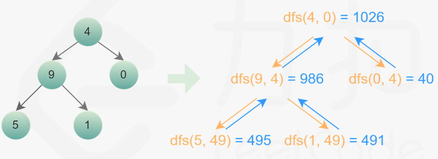

```java
class Solution {

    public int sumNumbers(TreeNode root) {
        return dfs(root, 0);  
    }
  
    public int dfs(TreeNode root, int preSum) {
        if (root == null) {
            return 0;
        }

        preSum = preSum*10 + root.val;
        if (root.left == null && root.right == null) {
            return preSum;
        }
        int left = dfs(root.left, preSum);
        int right = dfs(root.right, preSum);
        return left + right;  
    }  
}
```


时间复杂度：O(n)，其中 n 是二叉树的节点个数。对每个节点访问一次。

空间复杂度：O(n)，其中 n 是二叉树的节点个数。空间复杂度主要取决于递归调用的栈空间，递归栈的深度等于二叉树的高度，最坏情况下，二叉树的高度等于节点个数，空间复杂度为 O(n)。


## LC 124:  Binary Tree Maximum Path Sum

12/10/22  update: 

递归函数不能定义为：以root为根节点的二叉树中【所有】(root可能是路径的起点，也可能不是)路径中的最大值。而应当是求以根节点root为【起点】的路径中的最大值，然后再求的过程中不断更新全局变量。

* 看到这题立马想到LC543，思路可以说是一模一样了。遍历所有节点，求经过该节点的最大路径和，来不断更新全局变量 `maxSum`.
* `maxGain(root)`是计算一个节点的最大贡献值，即在以该节点为根节点的子树中寻找一条以该节点为起点的路径，使得其路径和最大。
* 空节点的最大贡献值 = 0
* 非空节点的最大贡献值 = root.val + max（左节点最大贡献值， 右节点最大贡献值）
* 表示无穷小数：`Integer.MIN_VALUE`

```java
class Solution {
    int res = Integer.MIN_VALUE;
    public int maxPathSum(TreeNode root) {
        maxGain(root);
        return res;
    }
    //返回以节点root为【起点】的所有路径的最大值
    private int maxGain(TreeNode root) {
        if (root == null) return 0;
        int left = Math.max(maxGain(root.left),0);
        int right = Math.max(maxGain(root.right),0);
        /**后序遍历位置 */
        //求以root为根节点的二叉树中所有路径的最大值(root不一定非要是路径起点)
        int rootMax = left + right + root.val;
        //更新最终结果
        res = Math.max(rootMax, res);
        return Math.max(left, right) + root.val;
    }
}
```


* Time complexity: **O(n)**
  Each node in the tree is visited only once. During a visit, we perform constant time operations, including two recursive calls and calculating the max path sum for the current node. So the time complexity is **O(n)**.
* Space complexity: **O(n)**
  We don't use any auxiliary data structure, but the recursive call stack can go as deep as the tree's height. In the worst case, the tree is a linked list, so the height is **n**. Therefore, the space complexity is **O(n)**.

## [LC 116：Populating Next Right Pointers in Each Node](https://leetcode.com/problems/populating-next-right-pointers-in-each-node/)

很显然就是一个层序遍历，难在怎么连接，虽然AC了，但是代码很不简洁。

### sol 1:  BFS, iteratively

时间复杂度和空间复杂度均为O(N)。

```java
class Solution {
    public Node connect(Node root) {
        if (root == null) return null;
        Queue<Node> q = new LinkedList<>();
        q.offer(root);
        while (!q.isEmpty()) {
            int size = q.size();
            //每一层从左向右移动的指针，把每一层的节点串起来
            Node p = null;
            for (int i = 0; i < size; i += 1) {
                Node nextNode = q.poll();
                if (p == null) {
                    p = nextNode;
                } else {
                    p.next = nextNode;
                    p = p.next;
                }
                if (nextNode.left != null) {
                    q.offer(nextNode.left);
                }
                if (nextNode.right != null) {
                    q.offer(nextNode.right);
                }
            }  
        }
        return root;  
    }
}
```

### sol 2: follow-up、iteratively

follow-up：You may only use constant extra space.

思路：串联分两种情况：如果两个节点有相同的父节点root，则 `root.left.next = root.right` ;

如果两个节点相邻且父节点不同，则 `root.right.next = root.next.left`。

完整代码如下：

时间复杂度：O（N）**空间复杂度：O（1）**

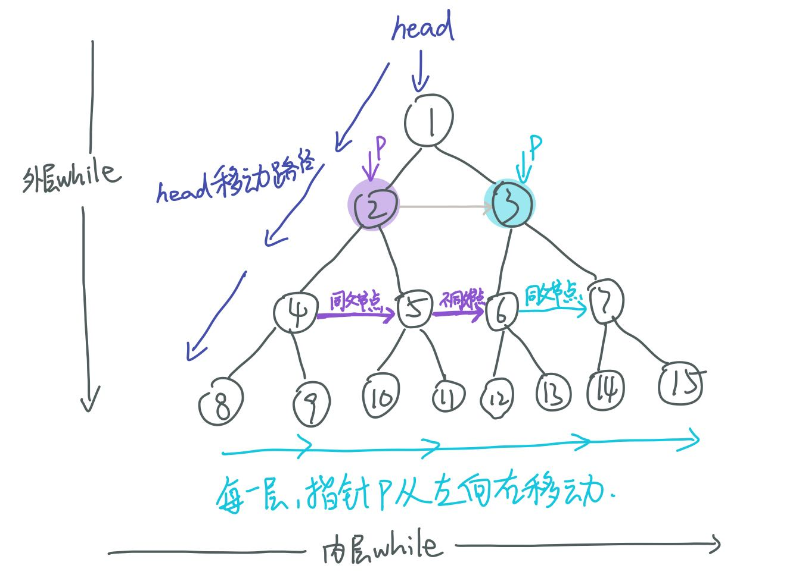

```java
class Solution {
    public Node connect(Node root) {
        if (root == null) {
            return root;
        }
        //head指向每一层的第一个节点。
        Node head = root;
        //外层循环控制层数，当head.left == null时，说明head指向的是最后一层了。 
        while (head.left != null) {
            //node p在每一层从左向右移动。
            Node p = head;
            //内层循环控制指针p在每一层上的移动，当p == null时退出循环。
            while (p != null) {
                //同父节点
                p.left.next = p.right;
                //不同父节点
                if (p.next != null) {
                    p.right.next = p.next.left;
                }
                p = p.next;  
            }
            head = head.left;
        }
        return root;  
    }
}
```

### sol 3 : 遍历思路，recursively

本质就是二叉树的遍历，在每个节点进行相同的操作。

时间复杂度：O(N)

空间复杂度：O(H),H表示二叉树的高度

思路：遍历每一个节点，以每一个节点为起点，完成纵深向下一层一层串联。

具体思路详见图解，图解中箭头标的数字代表串联发生的顺序：

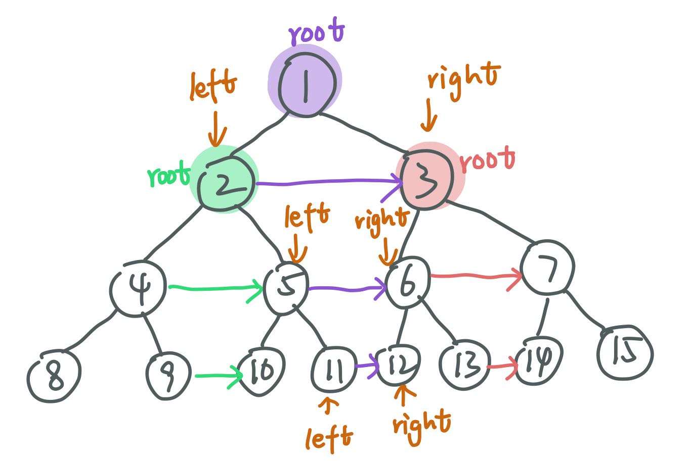

完整正确的代码如下，其中left和right代表左右指针

```java
class Solution {
    public Node connect(Node root) {
        dfs(root);
        return root;  
    }
    //递归函数完成以root为起点，纵深向下一层一层串联
    private void dfs(Node root) {
        if (root == null) {
            return;
        }
        Node left = root.left;
        Node right = root.right;
        //key point!这个循环就是完成纵深向下一层一层串联的过程
        while (left != null) {
            left.next = right;
            //本层串联完成后，左右指针向下一层移动
            left = left.right;
            right = right.left;
        }
        dfs(root.left);
        dfs(root.right);
    }
}
```

### [LC 199:  Binary Tree Right Side View](https://leetcode.com/problems/binary-tree-right-side-view/)

#### sol 1: BFS

思路：层序遍历，代码跟LC 116的sol 1很相似。

时间复杂度和空间复杂度均为O(N)。

```java


class Solution {
    public List<Integer> rightSideView(TreeNode root) {
        List<Integer> res = new ArrayList<>();
        if (root == null) {
            return res;
        }
        Queue<TreeNode> q = new LinkedList<>();
        q.add(root);
        while (!q.isEmpty()) {
            int qLen = q.size();
            for (int i = 0; i < qLen; i +=1) {
                TreeNode curNode = q.poll();
                //key point!
                if (i == qLen-1) {
                    res.add(curNode.val);
                }
                if (curNode.left != null) {
                    q.add(curNode.left);
                }
                if (curNode.right != null) {
                    q.add(curNode.right);
                }
            } 
        }
        return res;
    }
}
```

#### sol 2: DFS

思路：按照root→right→left的顺序访问，则每层最先访问最右边的节点。

具体说明：当访问到第三层时，depth == 2，若此时res.size() == 2,说明第三层的最右边的节点还没有进入list，则此时第三层访问的第一个节点进入list；若此时res.size() == 3，说明已经进入了list，也就说明该层最右节点已经访问过了，那后续访问到的本层节点就不是最右的。

```java
class Solution {
    List<Integer> res;
    public List<Integer> rightSideView(TreeNode root) {
        res = new ArrayList<>();
        dfs(root, 0);
        return res;  
    }
    private void dfs(TreeNode root, int depth) {
        if (root == null) {
            return;
        }
        if (res.size() == depth) {
            res.add(root.val);
        }
        depth += 1;
        dfs(root.right, depth);
        dfs(root.left, depth);
    }
}
```

# 翻转|对称|相同|合并

## [LC 101: Symmetric Tree](https://leetcode.com/problems/symmetric-tree/)

### sol 1: recursively

递归最主要的是要找到递归终止条件，如下：（这里的left和right表示左右子树）

1. `left == null && right == null`, return true;
2. `left == null || right == null`, return false;
3. left、right均非空，则必须左右子树根节点的值相等，并且left.left和right.right以及left.right和right.left对称。

```java
class Solution {
    public boolean isSymmetric(TreeNode root) {
        if (root == null) {
            return true;
        }
        return dfs(root.left, root.right);  
    }
    private boolean dfs(TreeNode left, TreeNode right) {
        //只有当left == null&&right == null时才满足left == right.
        if (left == right) {
            return true;
        }
        if (left == null || right == null) {
            return false;
        }
        return (left.val == right.val) && dfs(left.left, right.right) && dfs(left.right, right.left);
    }
}
```

* Time complexity : **O(n)**. Because we traverse the entire input tree once, the total run time is **O(n)**, where **n** is the total number of nodes in the tree.
* Space complexity : The number of recursive calls is bound by the height of the tree. In the worst case, the tree is linear and the height is in **O(n)**. Therefore, space complexity due to recursive calls on the stack is **O(n)** in the worst case.

### sol 2:  iteratively

思路：其实我本来也想到了用queue来进行迭代，但是写了半天没写对。最主要的问题是，我还是在套层序遍历的代码，没有想到两个节点成对比较。

有几个key point:

1. 入队列的顺序很巧妙：left.left, right.right, left.right, right.left。
2. 出队列时，一次性两个节点一起出队列，成对比较

```java
class Solution {
    public boolean isSymmetric(TreeNode root) {
        if (root == null) {
            return true;
        }
        Queue<TreeNode> q = new LinkedList<>();
        q.add(root.left);
        q.add(root.right);
        while (!q.isEmpty()) {
            TreeNode left = q.poll();
            TreeNode right = q.poll();
            //这里的循环终止条件跟sol 1的一样
            if (left == right) {
                continue;
            }
            if (left == null || right == null) {
                return false;
            }
            if (left.val != right.val) {
                return false;
            }
            //key point!!下一层节点入队列的顺序很重要，需要成对比较的节点相邻
            q.add(left.left);
            q.add(right.right);
            q.add(left.right);
            q.add(right.left);
        }
        return true;  
    }
}
```

* Time complexity : **O(n)**. Because we traverse the entire input tree once, the total run time is **O(n)**, where **n** is the total number of nodes in the tree.
* Space complexity : There is additional space required for the search queue. In the worst case, we have to insert **O(n)** nodes in the queue. Therefore, space complexity is **O(n)**.

## [LC 100:  Same Tree](https://leetcode.com/problems/same-tree/)

这道题的思路跟lc101一模一样，两道题几乎没区别。

### sol 1:  iteratively

这道题的迭代解法跟LC101几乎一模一样，唯一不同的就是节点入队列的顺序。

```java
class Solution {
    public boolean isSameTree(TreeNode p, TreeNode q) {
        Queue<TreeNode> queue = new LinkedList<>();
        queue.add(p);
        queue.add(q);
        while (!queue.isEmpty()) {
            TreeNode node1 = queue.poll();
            TreeNode node2 = queue.poll();
            if (node1 == node2) {
                continue;
            }
            if (node1 == null || node2 == null) {
                return false;
            }
            if (node1.val != node2.val) {
                return false;
            }
            //key point!!如lc101的不同之处。
            queue.add(node1.left);
            queue.add(node2.left);
            queue.add(node1.right);
            queue.add(node2.right);
        }
        return true;  
    }
}
```

### sol 2:  recursively

递归解法跟lc101的也几乎一样。

```java


class Solution {
    public boolean isSameTree(TreeNode p, TreeNode q) {
        return dfs(p, q);
  
    }
    private boolean dfs(TreeNode left, TreeNode right) {
        if (left == right) {
            return true;
        }
        if (left == null || right == null) {
            return false;
        }
        return (left.val == right.val) && dfs(left.left, right.left) && dfs(left.right, right.right);
    }
}
```

## [LC 617: Merge Two Binary Trees](https://leetcode.com/problems/merge-two-binary-trees/)

### sol 1: recursively

基本思路来源于lc100和lc101，最主要是递归终止条件：

1. root1和root2均为空，则返回空节点null；
2. root1为空，则返回root2（刚开始写的时候这个地方出错了）；
3. root2为空，则返回root1；
4. root1和root2均非空，则 `res.val = root1.val + root2.val;` `res.left = dfs(root1.left, root2.left);` `res.right = dfs(root1.right, root2.right);`

```java
class Solution {
    public TreeNode mergeTrees(TreeNode root1, TreeNode root2) {
        return dfs(root1, root2);   
    }
    private TreeNode dfs(TreeNode root1, TreeNode root2) {
        if (root1 == null) return root2;
        if (root2 == null) return root1;
        int rootVal = root1.val + root2.val;
        TreeNode res = new TreeNode(rootVal);
        res.left = dfs(root1.left, root2.left);
        res.right = dfs(root1.right, root2.right);
        return res;
    }
}
```

时间复杂度：O(min⁡(m,n))，其中 m 和 n 分别是两个二叉树的节点个数。对两个二叉树同时进行深度优先搜索，**只有当两个二叉树中的对应节点都不为空时才会对该节点进行显性合并操作**，因此被访问到的节点数不会超过较小的二叉树的节点数。

空间复杂度：O(min⁡(m,n))，其中 m 和 n 分别是两个二叉树的节点个数。空间复杂度取决于递归调用的层数，递归调用的层数不会超过较小的二叉树的最大高度，最坏情况下，二叉树的高度等于节点数。

## [LC 110:  Balanced Binary Tree](https://leetcode.com/problems/balanced-binary-tree/)

### sol 1：bottom-up recursion

思路：判断二叉树root是否平衡须满足两个条件，一是其左右子树均为平衡二叉树，二是左右子树的高相差不超过1。

方法：对二叉树root做后序遍历，from bottom to top，当其左子树或右子树不平衡时，则**直接向上返回**-1（也就是所谓的“剪枝”，一旦有子树不平衡，那么该二叉树一定不平衡），若左右子树均平衡，则向上返回左右子树中最大高度+1。

key point：用高度为负数来表示二叉树不平衡。

```java
class Solution {
    public boolean isBalanced(TreeNode root) {
        return helper(root) != -1;  
    }
    //后序遍历
    private int helper(TreeNode root) {
        //空节点本身是平衡二叉树，其高度为0
        if (root == null) {
            return 0;
        }
        //遍历左子树
        int left = helper(root.left);
        //若left == -1，表明左子树不平衡，直接向上返回
        if (left == -1) {
            return -1;
        }
        //遍历右子树
        int right = helper(root.right);
        //若left == -1，表明左子树不平衡，直接向上返回
        if (right == -1) {
            return -1;
        }
        //如果能执行到这一步，说明左右子树均平衡，然后再考虑左右子树的高度差
        return Math.abs(left-right) < 2 ? Math.max(left, right)+1: -1;
    }
}
```

时间复杂度：O(n)，其中 n 是二叉树中的节点个数。使用自底向上的递归，每个节点的计算高度和判断是否平衡都只需要处理一次，最坏情况下需要遍历二叉树中的所有节点，因此时间复杂度是 O(n)。

空间复杂度：O(n)，其中 n 是二叉树中的节点个数。空间复杂度主要取决于递归调用的层数，递归调用的层数不会超过 n。

### sol 2:  Top-down recursion

代码如下：

```java
class Solution {
    public boolean isBalanced(TreeNode root) {
        if (root == null) return true;
        return Math.abs(height(root.left)- height(root.right)) <= 1 && isBalanced(root.left) && isBalanced(root.right);  
    }
    private int height(TreeNode root) {
        if (root == null) return 0;
        return Math.max(height(root.left), height(root.right)) + 1;
    }
}
```

复杂度分析：

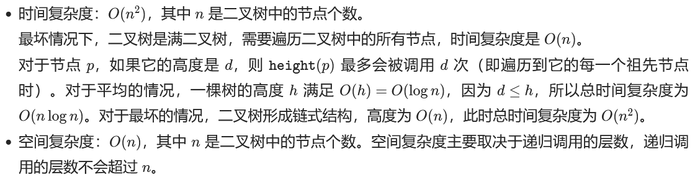

## [LC 226:  Invert Binary Tree](https://leetcode.com/problems/invert-binary-tree/)

### 遍历思路：前中后序遍历均可

### sol 1 : recursively

前序遍历，先左右子树翻转，然后再左右子树分别翻转。

其实在后序遍历位置交换左右子树也可。

```java
class Solution {
    public TreeNode invertTree(TreeNode root) {
        dfs(root);
        return root;   
    }
    private void dfs(TreeNode root) {
        if (root == null) {
            return;
        }
        /**前序遍历位置：交换左右子树*/
        TreeNode temp = root.left;
        root.left = root.right;
        root.right = temp;
  
        invert(root.left);
        invert(root.right);
    }
}
```

中序遍历：代码需要稍加修改

```java
class Solution {
    public TreeNode invertTree(TreeNode root) {
        traverse(root);
        return root;   
    }
    void traverse(TreeNode root) {
        if (root == null) return;
        traverse(root.left);
        /**中序遍历位置：交换左右子树 */
        TreeNode temp = root.left;
        root.left = root.right;
        root.right = temp;
        //此时的左子树才是原来尚未翻转的右子树
        traverse(root.left);
    }
}
```

### sol 2:  iteratively

左右子树的入栈顺序不重要，不影响最终结果。

```java
class Solution {
    public TreeNode invertTree(TreeNode root) {
        if (root == null) {
            return root;
        }
        Queue<TreeNode> q = new LinkedList<>();
        q.add(root);
        while (!q.isEmpty()) {
            TreeNode curNode = q.poll();
            TreeNode left = curNode.left;
            curNode.left = curNode.right;
            curNode.right = left;
            if (curNode.left != null) {
                q.add(curNode.left);
            }
            if (curNode.right != null) {
                q.add(curNode.right);
            }
        }
        return root;
    }
}
```

# LCA：最近公共祖先问题

## [LC 236:  Lowest Common Ancestor of a Binary Tree](https://leetcode.com/problems/lowest-common-ancestor-of-a-binary-tree/)

注意！这道题的题目中明确说了，节点p和q必定存在于二叉树中。

思路：

需要先进行分类讨论：

（1）当前节点root为最近公共祖先的情况：

① root == p 或者 root == q；

② p和q位于root的异侧，即分别在root的左（右）子树和右（左）子树

（2）p和q均在左子树，就去root.left找

（3）p和q均在右子树，就去root.right找

以下代码会报错： missing return statement

```java
class Solution {
    public TreeNode lowestCommonAncestor(TreeNode root, TreeNode p, TreeNode q) {
        if (root == null || p == root || q == root) {
            return root;
        }
        TreeNode left = lowestCommonAncestor(root.left, p, q);
        TreeNode right = lowestCommonAncestor(root.right, p, q);
        if (left != null && right != null) {
            return root;
        }
        if (left == null) {
            return right;
        }
        if (right == null) {
            return left;
        }
    }
}
```

可AC的代码如下：

```java
class Solution {
    public TreeNode lowestCommonAncestor(TreeNode root, TreeNode p, TreeNode q) {
        return find(root, p, q);  
    }
    //返回节点p和q在以root为根节点的二叉树中的LCA。
    private TreeNode find(TreeNode root, TreeNode p, TreeNode q) {
        if (root == null) return null;
        /**前序遍历位置*/
        //case 1：当前根节点root即为p或q，直接返回root本身
        if (root == p || root == q) {
            return root;
        }
        TreeNode left = find(root.left, p, q);
        TreeNode right = find(root.right, p, q);
        /**后序遍历位置*/
        if (left == null) return right;//case 2：p和q均在右子树
        if (right == null) return left;//case 3: p和q均在左子树
        return root;//case 4：p和q分别在左右子树，即left和right均非空
    }
}
```

时间复杂度：O(N)，其中 NN 是二叉树的节点数。二叉树的所有节点有且只会被访问一次，因此时间复杂度为 O(N)。

空间复杂度：O(N) ，其中 N 是二叉树的节点数。递归调用的栈深度取决于二叉树的高度，二叉树最坏情况下为一条链，此时高度为 N，因此空间复杂度为 O(N)。

## LC 1644 ： Lowest Common Ancestor of a Binary Tree II

重点！和236的区别就在于，本题不保证节点p和q一定存在于二叉树中。

对二叉树进行完全搜索，设置两个boolean类型的变量，用于记录p和q是否存在于二叉树中。

代码如下：

```java
class Solution {
    //用于记录节点p和q是否在二叉树中
    boolean hasP = false;
    boolean hasQ = false;
    public TreeNode lowestCommonAncestor(TreeNode root, TreeNode p, TreeNode q) {
        TreeNode res = find(root, p, q); 
        if (!hasP || !hasQ) return null;
        return res;
    }
    //返回p和q在以root为根节点的二叉树中的LCA，不考虑p和q的存在性
    private TreeNode find(TreeNode root, TreeNode p, TreeNode q) {
        if (root == null) return null;
        TreeNode left = find(root.left, p, q);
        TreeNode right = find(root.right, p, q);
        //这一步只能放在后序遍历位置，不能放在先序遍历位置
        //因为在后序遍历位置，左右子树都已经遍历过了，那么
        //hasP和hasQ的值在左右子树的遍历过程中更新过了
        if (root == p || root == q) {
            if (root == p) hasP = true;
            if (root == q) hasQ = true;
            return root;
        }
        if (left == null) return right;
        if (right == null) return left;
        return root;
    }
}
```

时间复杂度：O(N)

空间复杂度：O(N)

## LC 235 ： Lowest Common Ancestor of a Binary Search Tree

充分利用BST左小右大的特性

代码如下：

```java
class Solution {
    public TreeNode lowestCommonAncestor(TreeNode root, TreeNode p, TreeNode q) {
        if (p.val > q.val) {
            return find(root, q, p);
        }  
        return find(root, p, q);  
    }
    private TreeNode find(TreeNode root, TreeNode p, TreeNode q) {
        if (root == null) return null;
        //case1:去左子树寻找
        if (root.val > q.val) {
            return find(root.left, p, q);
        }
        //case2:去右子树寻找
        if (root.val < p.val) {
            return find(root.right, p, q);
        }
        //case3:
        return root;   
    }
}
```

* Time Complexity: **O(N)**, where **N** is the number of nodes in the BST. In the worst case we might be visiting all the nodes of the BST.
* Space Complexity: **O(N)**. This is because the maximum amount of space utilized by the recursion stack would be **N** since the height of a skewed BST could be **N**.

## LC 1650：Lowest Common Ancestor of a Binary Tree III

思路：这道题可以转化成寻找两条单链表的交点。parent指针可以看做链表的next指针。

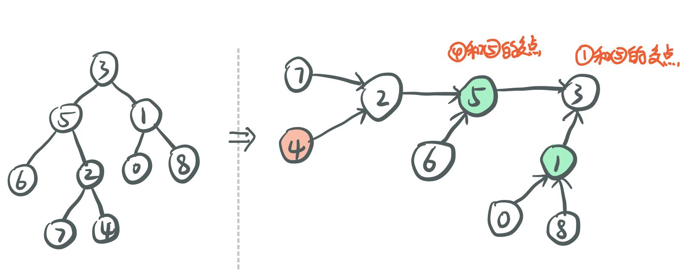

代码如下：

```java
class Solution {
    public Node lowestCommonAncestor(Node p, Node q) {
        Node pointer1 = p;
        Node pointer2 = q;
        while (pointer1 != pointer2) {
            if (pointer1 == null) {
                pointer1 = q;
            } else {
                pointer1 = pointer1.parent;
            }
            if (pointer2 == null) {
                pointer2 = p;
            } else {
                pointer2 = pointer2.parent;
            }
        }
        return pointer1;  
    }
}
```

ddd
