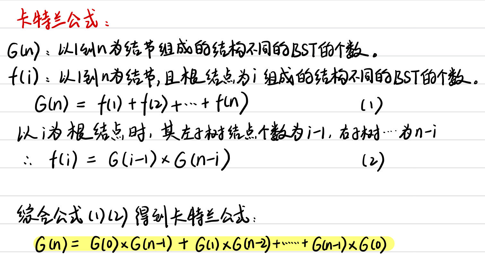
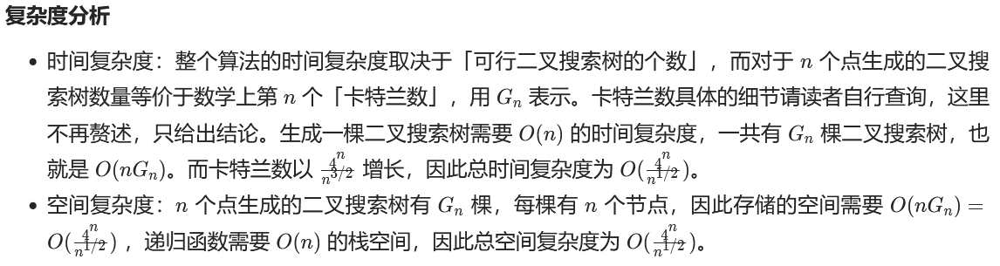
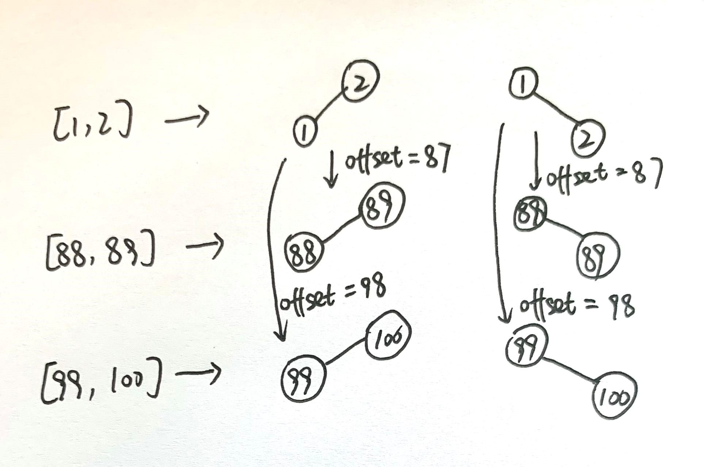
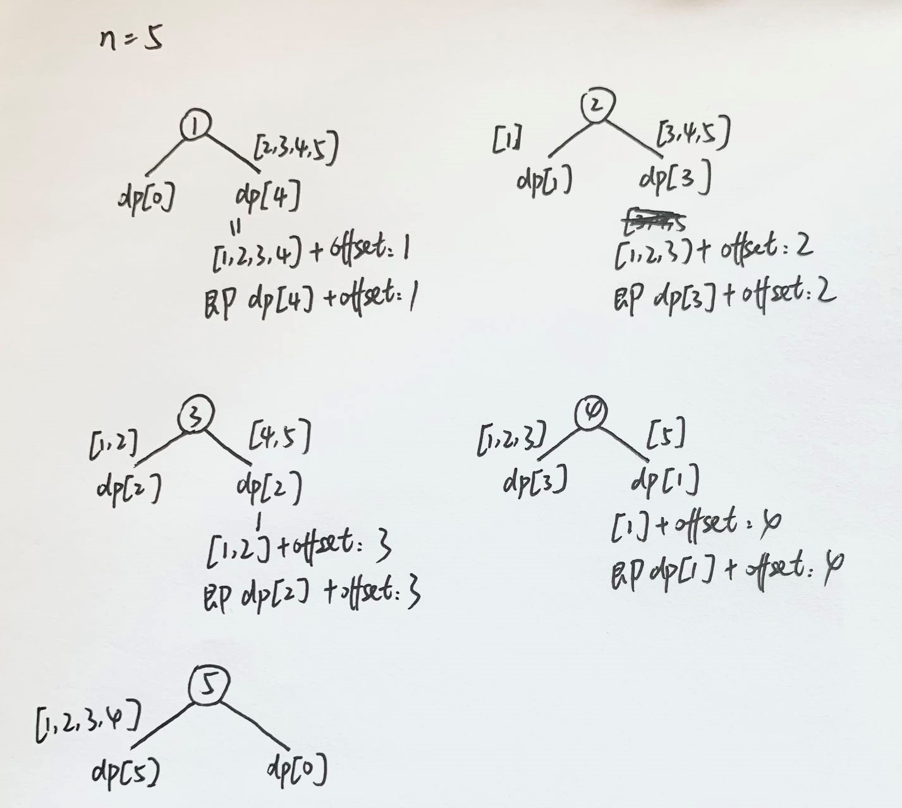
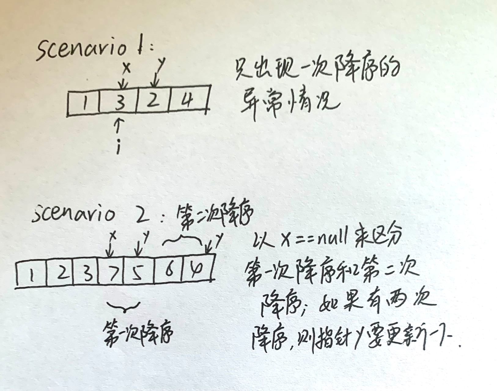
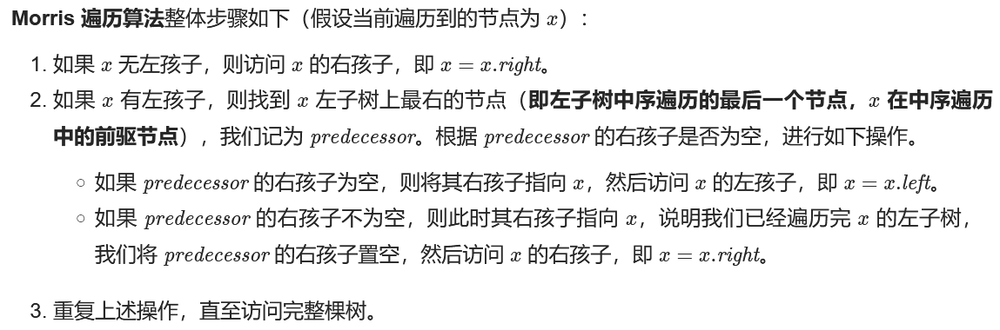

# [LC 98: Validate Binary Search Tree](https://leetcode.com/problems/validate-binary-search-tree/)

## sol 1: 递归

这道题思路来源于neetcode，难点是这个无穷大和无穷小用什么数据类型来表示，不用integer主要是无法通过全部用例测试，double也不行

### 1. 不同数据类型的无穷大和无穷小表示方法：

Integer：
无穷大：Integer.MAX_VALUE; (最大值：2147483647)

无穷小：Integer.MIN_VALUE;(最小值：-2147483648)

Long：
无穷大：Long.MAX_VALUE;（最大值：9223372036854775807）
无穷小：Long.MIN_VALUE;（最小值：-9223372036854775808）

Double：
无穷大：Double.MAX_VALUE;
无穷小：Double.MIN_VALUE;

Float：
无穷大：Float.MAX_VALUE;
无穷小：Float.MIN_VALUE;

复杂度分析：

时间复杂度：O(n)，其中 n 为二叉树的节点个数。在递归调用的时候二叉树的每个节点最多被访问一次，因此时间复杂度为 O(n)。

空间复杂度：O(n)，其中 n 为二叉树的节点个数。递归函数在递归过程中需要为每一层递归函数分配栈空间，所以这里需要额外的空间且该空间取决于递归的深度，即二叉树的高度。最坏情况下二叉树为一条链，树的高度为 n ，递归最深达到 n 层，故最坏情况下空间复杂度为 O(n) 。

### 写法1：左右限制为数值

为什么要用long？

当root = [-2147483648]时，root.val == Integer.MIN_VALUE,此时会返回false，显然错误。

注意：题目条件中给出了 -2 `<sup>`31 `</sup>` <= Node.val <= 2 `<sup>`31 `</sup>` - 1

```java
class Solution {
    public boolean isValidBST(TreeNode root) {
        return dfs(root, Long.MIN_VALUE, Long.MAX_VALUE);
    } 
    private boolean dfs(TreeNode root, long left, long right) {
        if (root == null) {
            return true;
        }
        if (root.val <= left || root.val >= right) {
            return false;
        }
        return dfs(root.left, left, root.val) && dfs(root.right, root.val, right);
    }
  
}
```

### 写法2：左右限制为节点

这种写法用node来表示左右限制，避免了数据溢出。

```java
class Solution {
    public boolean isValidBST(TreeNode root) {
        return isValidBST(root, null, null);  
    }
    //限定以root为根的子树节点必须满足：min.val < root.val < max.val
    boolean isValidBST(TreeNode root, TreeNode min, TreeNode max) {
        //base case
        if (root == null) return true;
        //若root.val不符合min和max的限制，说明不是合法BST
        if (min != null && min.val >= root.val) return false;
        if (max != null && max.val <= root.val) return false;
        //限定左子树的最大值是root.val，右子树的最小值是root.val
        return isValidBST(root.left, min, root) && isValidBST(root.right, root, max);
    }
}
```

## sol 2: 中序遍历

BST中序遍历得到的值构成的序列一定是升序的，所以在中序遍历的过程中检查当前节点的值是否大于前一个节点的值(即代码中的pre)即可。

### iteratively

```java
class Solution {
    long pre = Long.MIN_VALUE;
    public boolean isValidBST(TreeNode root) {
        if (root == null) {
            return true;
        }
        Stack<TreeNode> stack = new Stack<>();
        TreeNode p = root;
        while (!stack.isEmpty() || p != null) {
            while (p != null) {
                stack.push(p);
                p = p.left;
            }
            p = stack.pop();
            //如果当前节点的值小于或等于前一个节点的值，则直接返回false。
            if (p.val <= pre) {
                return false;
            }
            pre = p.val;
            p = p.right;
        }
        return true;
    }
}
```

### recursively

没啥可说的，就是二叉树中序遍历递归法，用long的原因跟sol 1中提到的一样

```java
class Solution {
    long pre = Long.MIN_VALUE;
    public boolean isValidBST(TreeNode root) {
        if (root == null) {
            return true;
        }
        //遍历左子树
        if (!isValidBST(root.left)) {
            return false;
        }
        //判断根节点的值是否符合要求
        if (root.val <= pre) {
            return false;
        }
        pre = root.val;
        //遍历右子树
        return isValidBST(root.right);  
    }
}
```

# [LC 96:  Unique Binary Search Trees](https://leetcode.com/problems/unique-binary-search-trees/)

## sol 1: 动态规划-卡特兰公式

思路：动态规划、卡特兰数公式

### 卡特兰数公式




完整代码如下：

关于G（0）= 1，我的理解是：
根据f(i)=G(i−1)∗G(n−i)，当n = 1，i = 1时，f（1）= G（0）*G（0），则G(0) = 1。可以理解为G（0）=1是人为规定的，只存在于公式中，不存在于实际问题中。

时间复杂度 : O(n^2)，其中 n 表示二叉搜索树的节点个数。G(n)函数一共有 n 个值需要求解，每次求解需要 O(n) 的时间复杂度，因此总时间复杂度为 O(n^2)。

空间复杂度 : O(n)。我们需要 O(n) 的空间存储 G 数组。

```java
class Solution {
    public int numTrees(int n) {
        //1、dp[i]:表示以1到i为节点组成的结构不同的BST的个数。
        //2、dp[i] = dp[0]*dp[i-1] + dp[1]*dp[i-2] +...+ dp[i-1]*dp[0]
        //3、dp[0] = 1, dp[1] = 1
        //4、从左向右遍历
  
        int[] dp = new int[n+1];
        dp[0] = 1;
        dp[1] = 1;
  
        for (int i = 2; i < n+1; i += 1) {
            for (int j = 0; j < i; j += 1) {
                dp[i] += dp[j]*dp[i-1-j];
            }
        }
        return dp[n];  
    }
}
```

## sol 2 : 记忆化递归

复杂度和dp法一样

```java
class Solution {
    int[] memo;
    public int numTrees(int n) {
        memo = new int[n+1];
        return count(n);   
    }
    //计算[1,n]组成的BST的个数
    int count(int n) {
        if (n == 0 || n == 1) {
            return 1;
        }
        if (memo[n] != 0) {
            return memo[n];
        }
        int res = 0;
        //枚举左子树结点个数分别为0,1,2,...,(n-1)
        //对应的右子树节点个数为(n-1-i)。
        for (int i = 0; i < n; i += 1) {
            res += count(i)*count(n-1-i);
        }
        //将结果存入备忘录
        memo[n] = res;
        return res;
    }
}
```

# [LC 95:  Unique Binary Search Trees II](https://leetcode.com/problems/unique-binary-search-trees-ii/)

## sol 1: recursively

思路：充分利用BST的性质，即根节点的值大于左子树所有节点的值，小于右子树所有节点的值

假如有n个节点，其中序遍历的序列为[1, 2, 3...n]。tree（i)表示以i为根节点所能得到的所有BST，则其左子树的序列为[1, 2,...i-1]， 其右子树的序列为[i+1,....n]。

分类讨论：n个节点组成的所有BST就应该是tree（1），tree（2），。。。tree（n)组成的集合。

定义函数generateTrees(start, end)返回所有中序遍历序列为[start, start+1,...end]的BST

递归终止条件：当start>end时，当前BST为空，返回null。

代码如下：

复杂度分析如下：



```java
class Solution {
    public List<TreeNode> generateTrees(int n) {
        return generateTrees(1, n);  
    } 
    public List<TreeNode> generateTrees(int start, int end) {
        List<TreeNode> res = new ArrayList<>();
        if (start > end) {
            res.add(null);
            return res;
        }
        //枚举可行的根节点
        for (int i = start; i <= end; i += 1) {
            //以i为根节点的BST的所有可行的左子树集合。
            List<TreeNode> leftTrees = generateTrees(start, i-1);
            ////以i为根节点的BST的所有可行的右子树集合。
            List<TreeNode> rightTrees = generateTrees(i+1, end);
            //从左子树集合中选一棵左子树，右子树集合中选一棵右子树，两两组合，得到所有以i为根节点的BST集合。
            for (TreeNode left: leftTrees) {
                for (TreeNode right: rightTrees) {
                    TreeNode newTree = new TreeNode(i, left, right);
                    res.add(newTree);
                }
            }
        }
        return res;
    }
}
```

## sol 2:  动态规划

基本思路：先看下图以n=5时的分解。

思路就是：求出序列长度分别为1，2，3，。。。n的左子树，如dp[5]对应的就是中序遍历序列为[1,2,3,4,5]的BST集合，如果求相同长度的右子树，无论是[7,8,9,10,11]或者是[3,4,5,6,7,8]，它们的BST结构与[1,2,3,4,5]都是相同的，只是对应节点的数值需要offset+6（+2）。





```java
class Solution {
    public List<TreeNode> generateTrees(int n) {
        ArrayList<TreeNode>[] dp = new ArrayList[n+1];
        dp[0] = new ArrayList<TreeNode>();
        //个人觉得这一步是多余的，题目中给出了n的范围：[1,8]
        if (n == 0) {
            return dp[0];
        }
        //dp[0] = [null]
        dp[0].add(null);
        //求出长度为len的左子树  
        for (int len = 1; len < n+1; len += 1) {
            //建一个array，用于存储所有长度为len的左子树
            dp[len] = new ArrayList<>();
            //和sol 1的思路一样，枚举所有可行的根节点
            for (int root = 1; root <= len; root += 1) {
                //当根节点的数值为root时，左子树的序列长度为root-1,右子树的序列长度为len-root。
                int leftLen = root - 1;
                int rightLen = len - root;
                //左右子树进行两两组合
                for (TreeNode leftTree: dp[leftLen]) {
                    for (TreeNode rightTree: dp[rightLen]) {
                        TreeNode newTree = new TreeNode(root);
                        //这里左子树用的是存储在dp中的，其实我觉得也可以clone一个，即clone(leftTree, 0)。
                        newTree.left = leftTree;
                        //这里右子树，根据相同序列长度对应的左子树，新建一个
                        newTree.right = clone(rightTree, root);
                        dp[len].add(newTree);
                    }
                }
            }
        }
        return dp[n];  
    }
    //返回一个新的BST 
    private TreeNode clone(TreeNode root, int offset) {
        if (root == null) {
            return null;
        }
        TreeNode res = new TreeNode(root.val+offset);
        res.left = clone(root.left, offset);
        res.right = clone(root.right, offset);
        return res;   
    }
}
```

# [LC 173:  Binary Search Tree Iterator](https://leetcode.com/problems/binary-search-tree-iterator/)

这题的两种写法，本质上就是中序遍历的递归和迭代解法。

## sol 1: recursively, 提前保存中序遍历序列

就是先用递归的方法把中序遍历序列保存在数组中，然后指针在数组上移动。

时间复杂度：初始化需要 O(n) 的时间，其中 n 为树中节点的数量。随后每次调用只需要 O(1) 的时间。

空间复杂度：O(n)，因为需要保存中序遍历的全部结果。

```java
class BSTIterator {
    List<Integer> arr;
    int index;

    public BSTIterator(TreeNode root) {
        arr = new ArrayList<>();
        inorder(root, arr);
        index = 0;
    }
  
    public int next() {
        return arr.get(index++); 
    }
  
    public boolean hasNext() {
        return index < arr.size();
    }

    private void inorder(TreeNode root, List<Integer> arr) {
        if (root == null) return;
        inorder(root.left, arr);
        arr.add(root.val);
        inorder(root.right, arr);
    }
}
```

## sol 2:  iteratively, 单调栈

复杂度分析

    时间复杂度：显然，初始化和调用 hasNext() 都只需要 O(1)的时间。每次调用 next()函数**最坏情况**下需要 O(n)的时间；但考虑到 n次调用 next()函数总共会遍历全部的 n个节点，因此总的时间复杂度为 O(n)，因此单次调用平均下来的均摊复杂度为 O(1)。

    空间复杂度：O(n)，其中 n是二叉树的节点数量。空间复杂度取决于栈深度，而栈深度在二叉树为一条链的情况下会达到 O(n)的级别。

```java
class BSTIterator {
    private TreeNode curNode;
    private Stack<TreeNode> stack;

    public BSTIterator(TreeNode root) {
        stack = new Stack<>();
        curNode = root;  
    }
  
    public int next() {
        while (curNode != null) {
            stack.push(curNode);
            curNode = curNode.left;
        }
        curNode = stack.pop();
        int res = curNode.val;
        curNode = curNode.right;
        return res;
    }
  
    public boolean hasNext() {
        return (!stack.isEmpty()) || (curNode != null);   
    }
}
```

# [LC 230:  Kth Smallest Element in a BST](https://leetcode.com/problems/kth-smallest-element-in-a-bst/)

## sol 1:  中序遍历

BST的中序遍历是有序的。

### 写法一：迭代

完整代码如下：

复杂度分析

    时间复杂度：O(H+k)，其中 H是树的高度。在开始遍历之前，我们需要 O(H)到达叶结点。当树是平衡树时，时间复杂度取得最小值 O(log⁡N+k)；当树是线性树（树中每个结点都只有一个子结点或没有子结点）时，时间复杂度取得最大值 O(N+k)。然后找到第**k** 小的元素，复杂度为 **O**(**k**)。所以整体时间复杂度为O(H+k)。

    空间复杂度：O(H)，栈中最多需要存储 H个元素。当树是平衡树时，空间复杂度取得最小值 O(log⁡N)；当树是线性树时，空间复杂度取得最大值 O(N)。

```java
class Solution {
    public int kthSmallest(TreeNode root, int k) {
        Deque<TreeNode> stack = new ArrayDeque<>();
        TreeNode curNode = root;
        while (!stack.isEmpty() || curNode != null) {
            while (curNode != null) {
                stack.push(curNode);
                curNode = curNode.left;
            }
            curNode = stack.pop();
            if (--k == 0) return curNode.val;//这个写法就很简洁明了
            curNode = curNode.right;
        }
        //这一步永远不会到达，但是这一步不能少，不然报错
        return -1;  
    }
}
```

### 写法二：递归

代码如下：

复杂度同上

```java
class Solution {
    int rank = 0;
    int res;
    public int kthSmallest(TreeNode root, int k) {
        dfs(root, k);
        return res;  
    }
    void dfs(TreeNode root, int k) {
        if (root == null || rank >= k) return;
        dfs(root.left, k);
        if (++rank == k) {
            res = root.val;
        }
        dfs(root.right, k);
    }
}
```

## sol 2: 树的遍历+优先队列（堆）

设置一个容量为k的大根堆

* 大根堆中的元素个数不足k，则将当前遍历到的节点的值直接加入；
* 如果元素个数为k个，且堆顶元素大于当前遍历到的节点的值，则先poll堆顶元素，然后将当前遍历到的节点的值直接加入；

树的遍历可以用dfs或者bfs都行，前中后序也无所谓。

完整代码如下：

这里用的是迭代法。

时间复杂度：树的遍历时间复杂度为 O(n)；使用优先队列（堆）复杂度为 O(nlog⁡k)。整体复杂度为 O(nlog⁡k)。
空间复杂度：空间多少取决于 stack 和 q 使用的容量，q 最多不超过 k 个元素，复杂度为 O(k)，stack 最多不超过二叉树的一层，复杂度为 O(n)。整体复杂度为 O(n+k)。

```java
class Solution {
    public int kthSmallest(TreeNode root, int k) {
        PriorityQueue<Integer> q = new PriorityQueue<>((a,b)-> b-a);
        ArrayDeque<TreeNode> stack = new ArrayDeque<>();
        stack.push(root);
        while (!stack.isEmpty()) {
            TreeNode cur = stack.pop();
            if (q.size() < k) {
                q.add(cur.val);
            } else if (q.peek() > cur.val) {
                q.poll();
                q.add(cur.val);
            }
            if (cur.left != null) stack.add(cur.left);
            if (cur.right != null) stack.add(cur.right);
        }
        return q.peek();   
    }
}
```

## sol 3：优化，记录子树的节点个数

**Follow up:** If the BST is modified often (i.e., we can do insert and delete operations) and you need to find the kth smallest frequently, how would you optimize?

思路：

记录根节点为node的BST的结点个数n，即Map<Node, n>.

设置一个指针node，一开始指向要求的root结点，然后开始判断指针接下来应该朝哪里移动。

如果左子树结点个数 < k-1,说明第k小的元素在右子树，于是指针node指向右子树根结点，并继续搜索。同时更新k，要求root中第k小的元素，需要offset一下（offset = left + 1），在root的右子树中是第（k-（left+1））小的元素，即k = k - (left + 1)；

如果左子树结点个数 = k-1，则第k小的元素即为node.val；

若左子树结点个数>k-1，则第k小的元素在左子树，于是指针node指向左子树根结点，并继续搜索。


复杂度分析：

时间复杂度：预处理的时间复杂度为 O(N)，其中 NNN 是树中结点的总数；我们需要遍历树中所有结点来统计以每个结点为根结点的子树的结点数。搜索的时间复杂度为 O(H)，其中 H 是树的高度；当树是平衡树时，时间复杂度取得最小值 O(log⁡N)；当树是线性树时，时间复杂度取得最大值 O(N)。

空间复杂度：O(N)，用于存储以每个结点为根结点的子树的结点数。

```java
class Solution {
    public int kthSmallest(TreeNode root, int k) {
        MyBst bst = new MyBst(root);
        return bst.kthSmallest(k);  
    }
}

class MyBst {
    TreeNode root;
    Map<TreeNode, Integer> map;
  
    public MyBst(TreeNode root) {
        this.root = root;
        map = new HashMap<>();
        countNodeNum(root);
    }
    //返回二叉搜索树中第k小的元素  
    public int kthSmallest(int k) {
        TreeNode node = root;
        while (node != null) {
            //left为左子树包含的结点个数
            int left = getNodeNum(node.left);
            //情况1：则k元素在右子树
            if (left < k-1) {
                node = node.right;
                k = k - (left + 1);
            //情况2：找到了，退出当前循环
            } else if (left == k-1) {
                break;
            //情况3：k元素在左子树
            } else {
                node = node.left;
            }
        }
        return node.val;  
    }
    //返回以node为根结点的二叉搜索数中结点的个数
    private int getNodeNum(TreeNode node) {
        return map.getOrDefault(node, 0);
    }
    //用递归的方法统计以node为根结点的二叉搜索数中结点的个数，同时记录在哈希表中  
    private int countNodeNum(TreeNode node) {
        if (node == null) {
            return 0;
        }
        //以node为根结点的二叉搜索数中结点的个数 = 左子树中结点个数 + 右子树中结点个数 + 1
        int res = 1 + countNodeNum(node.left) + countNodeNum(node.right);
        //结果记录在哈希表中
        map.put(node, res);
        return res;
    }
}
```

# [LC 99：Recover Binary Search Tree](https://leetcode.com/problems/recover-binary-search-tree/)

## sol 1:  recursively, 中序遍历 - 先中序遍历保存序列，再找异常，然后交换

思路：

1. 先递归方法得到二叉树中序遍历的结果，将对应的**结点**存储在数组中
2. 寻找异常值，具体看图解

   
3. 时间复杂度：O(N)，其中 N 为二叉搜索树的节点数。中序遍历需要 O(N) 的时间，判断两个交换节点在最好的情况下是 O(1)，在最坏的情况下是 O(N)，因此总时间复杂度为 O(N)。
   空间复杂度：O(N)。我们需要用 nums数组存储树的中序遍历列表。

```java
class Solution {
    public void recoverTree(TreeNode root) {
        List<TreeNode> list = new ArrayList<>();
        //得到二叉树中序遍历的结果
        inorder(root, list);
        //初始化两个指针，用来指向需要交换的两个结点
        TreeNode x = null;
        TreeNode y = null;
        for (int i = 0; i < list.size()-1; i += 1) {
            //出现降序时说明有异常
            if (list.get(i).val > list.get(i+1).val) {
                y = list.get(i+1);
                //第一次出现异常时，x还是空结点
                if (x == null) {
                    x = list.get(i);
                //如果存在第二次出现异常，则y指针需要更新
                } else {
                    break;
                }
            }
        }
        //交换x和y的值
        swap(x, y);  
    }
    //如果x和y均非空，说明存在需要交换的两个结点，则交换他们的值即可
    private void swap(TreeNode x, TreeNode y) {
        if (x == null || y == null) return;
        int temp = x.val;
        x.val = y.val;
        y.val = temp;
    }
    //用递归方法得到二叉树的中序遍历，注意list按序存储的是二叉树的根节点，而非根节点的值
    private void inorder(TreeNode root, List<TreeNode> list) {
        if (root == null) return;
        inorder(root.left, list);
        list.add(root);
        inorder(root.right, list);
    }
}
```

## sol 2:  iteratively, 中序遍历

方法二本质就是迭代的方法进行中序遍历，并在遍历的过程中找到需要交换的两个结点x，y。

具体做法就是加一个pre指针来存储前一个node。可以看到代码基本就是套迭代方法的中序遍历，判断异常并找到x和y的思路跟sol 1也是一样的。

时间复杂度：最坏情况下（即待交换节点为二叉搜索树最右侧的叶子节点）我们需要遍历整棵树，时间复杂度为 O(N)，其中 N为二叉搜索树的节点个数。
空间复杂度：O(H)，其中 H为二叉搜索树的高度。中序遍历的时候栈的深度取决于二叉搜索树的高度。

```java
class Solution {
    public void recoverTree(TreeNode root) {
        Deque<TreeNode> stack = new ArrayDeque<>();
        TreeNode curNode = root;
        TreeNode x = null, y = null, pre = null;

        while (!stack.isEmpty() || curNode != null) {
            while (curNode != null) {
                stack.push(curNode);
                curNode = curNode.left;
            }
            curNode = stack.pop();
            /**中序遍历位置 */
            if (pre != null && pre.val > curNode.val) {
                y = curNode;
                if (x == null) {
                    x = pre;
                } else {
                    break;
                }
            }
            pre = curNode;//更新前一个节点
            /**中序遍历位置 */
            curNode = curNode.right;
        }
        swap(x, y);
    }

    private void swap(TreeNode x, TreeNode y) {
        if (x == null || y == null) return;
        int temp = x.val;
        x.val = y.val;
        y.val = temp;
    }
}
```

## sol 3: 优化，Morris 遍历

**Follow up:** A solution using `O(n)` space is pretty straight-forward. Could you devise a constant `O(1)` space solution?

### Morris遍历算法：

参考这两篇题解：[第一篇](https://leetcode.cn/problems/recover-binary-search-tree/solution/hui-fu-er-cha-sou-suo-shu-by-leetcode-solution/)，[第二篇](https://leetcode.cn/problems/recover-binary-search-tree/solution/san-chong-jie-fa-xiang-xi-tu-jie-99-hui-fu-er-cha-/)

这种算法可将非递归的中序遍历算法空间复杂度降为O(1)。

**Morris 遍历算法**整体步骤如下（假设当前遍历到的节点为 xxx）：



用morris traversal解的完整代码如下：

时间复杂度：O(N)，其中 N 为二叉搜索树的高度。Morris 遍历中每个节点会被访问两次，因此总时间复杂度为 O(2N)=O(N)。
空间复杂度：O(1)。

```java
class Solution {
    public void recoverTree(TreeNode root) {
        TreeNode x = null, y = null, pre = null, predecessor = null;
        while (root != null) {
            //情况1：若当前结点root有左子树，
            if (root.left != null) {
                //则先找到其左子树上最右结点（即中序遍历中最靠近根结点的那个），记为predecessor。
                predecessor = root.left;
                while (predecessor.right != null && predecessor.right != root) {
                    predecessor = predecessor.right;
                }
                //可能结果1：predecessor的右子树为空，则将其右子树指向root完成莫里斯连接
                //（因为中序遍历中，访问完predecessor后，下一个就是root了。
                if (predecessor.right == null) {
                    predecessor.right = root;
                    //然后继续遍历左子树。
                    root = root.left;
                //可能结果2：predecessor的右子树指向当前结点root（即predecessor.right == root），
                //说明已经遍历完当前结点root的左子树，则先考虑当前结点，然后断开莫里斯连接，再继续遍历
                //当前结点的右子树。
                } else {
                    //先判断当前结点root是否异常
                    if (pre != null && root.val < pre.val) {
                        y = root;
                        if (x == null) {
                            x = pre;
                        }
                    }
                    pre = root;
                    //断开莫里斯连接  
                    predecessor.right = null;
                    //然后继续访问其右子树。
                    root = root.right;
                }
            //情况2：若当前结点root无左子树，则先考虑当前结点，然后继续访问其右子树。
            } else {
                /**中序遍历位置*/
                //首先考虑当前结点root是否存在异常（即降序），具体判断与sol 1相同。
                if (pre != null && root.val < pre.val) {
                    y = root;
                    if (x == null) {
                        x = pre;
                    }
                }
                //然后开始访问右子树。
                pre = root; 
                root = root.right;   
            }
        }
        swap(x, y);   
    }
  
    public void swap(TreeNode x, TreeNode y) {
        int temp = x.val;
        x.val = y.val;
        y.val = temp;
    }   
}
```

# [LC 538 : Convert BST to Greater Tree](https://leetcode.com/problems/convert-bst-to-greater-tree/description/)

## sol 1：我的思路-bst中序遍历两次

```java
class Solution {
    int total;//用来累加所有节点的值的和
    Map<TreeNode, Integer> map;key为节点，value为小于该节点的值的累加和
    public TreeNode convertBST(TreeNode root) {
        map = new HashMap<>();
        count(root);
        convert(root);
        return root;  
    }

    public void count(TreeNode root) {
        if (root == null) return;
        count(root.left);
        map.put(root, total);
        total += root.val;
        count(root.right);
    }
  
    public void convert(TreeNode root) {
        if (root == null) return;
        root.val = total - map.getOrDefault(root, 0);
        convert(root.left);
        convert(root.right);
    }
}
```

## sol 2 : BST中序遍历的逆序

时间复杂度：O(N)

空间复杂度：O(1)

```java
class Solution {
    int sum = 0;
    public TreeNode convertBST(TreeNode root) {
        traverse(root);
        return root;  
    }
    void traverse(TreeNode root) {
        if (root == null) return;
        traverse(root.right);
        sum += root.val;
        root.val = sum;
        traverse(root.left);
    }
}
```

# [LC 700 ：Search in a Binary Search Tree](https://leetcode.com/problems/search-in-a-binary-search-tree/description/)

代码如下：

时间复杂度：O(N)，其中 N 是二叉搜索树的节点数。最坏情况下二叉搜索树是一条链，且要找的元素比链末尾的元素值还要小（大），这种情况下我们需要递归 N 次。

空间复杂度：O(N)。最坏情况下递归需要 O(N) 的栈空间。

```java
class Solution {
    public TreeNode searchBST(TreeNode root, int val) {
        if (root == null) return null;
        if (root.val == val) {
            return root;
        }
        return searchBST(val < root.val ? root.left : root.right, val);  
    }
}
```

# BST的基本操作：增删查

## 1、在BST中插入一个数

## LC 701：Insert into a Binary Search Tree

### sol 1: 递归

完整代码如下：

```java
class Solution {
    public TreeNode insertIntoBST(TreeNode root, int val) {
        if (root == null) return new TreeNode(val);
        if (root.val < val) {
            root.right = insertIntoBST(root.right, val);
        } else {
            root.left = insertIntoBST(root.left, val);
        }
        return root;   
    }
}
```

### sol 2: 模拟

这个思路是很直接，很清晰的

完整代码如下：

时间复杂度：O(N)，其中 N为树中节点的数目。最坏情况下，我们需要将值插入到树的最深的叶子结点上，而叶子节点最深为 O(N)。

空间复杂度：O(1)。我们只使用了常数大小的空间。

```java
class Solution {
    public TreeNode insertIntoBST(TreeNode root, int val) {
        if (root == null) return new TreeNode(val);
        TreeNode p = root;
        while (p != null) {
            if (val < p.val) {
                if (p.left == null) {
                    p.left = new TreeNode(val);
                    break;
                } else {
                    p = p.left;
                }
            } else {
                if (p.right == null) {
                    p.right = new TreeNode(val);
                    break;
                } else {
                    p = p.right;
                }
            }
        }
        return root;  
    }
}
```

## 2、在BST中删除一个数

## [LC 450：Delete Node in a BST](https://leetcode.com/problems/delete-node-in-a-bst/description/)

思路详见代码中的注释

关于case 3，具体图解如下：


代码如下：

时间复杂度：O（H），H是树的高度，寻找目标节点最坏情况需要O（H），删除操作最坏情况也需要O（H）；
空间复杂度：O（H），递归栈的深度最坏情况为树的高度；

```java
class Solution {
    public TreeNode deleteNode(TreeNode root, int key) {
        if (root == null) return root;
        if (root.val < key) {//去右子树删除目标节点
            root.right = deleteNode(root.right, key);
        } else if (root.val > key) {//去左子树删除目标节点
            root.left = deleteNode(root.left, key);
        } else if (root.val == key) {//当前根节点就是要删除的目标节点
            if (root.left == null) return root.right;//case1：目标节点无左子树
            if (root.right == null) return root.left;//case2：目标节点无右子树
            //case3：目标节点左右子树均非空
            TreeNode p = root.right;
            //找到目标节点右子树的最左节点
            while (p.left != null) {
                p = p.left;
            }
            p.left = root.left;
            root = root.right;
        }
        return root;
    }
}
```

## 3、在BST中查找一个数

参见LC 700

## 4、验证BST

参见LC 98

fff
