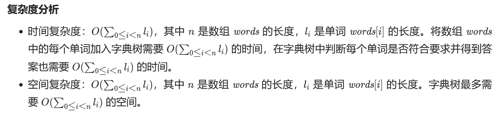

# [LC 208: Implement Trie (Prefix Tree)](https://leetcode.com/problems/implement-trie-prefix-tree/)

字典树的运用场景：**一次建树，多次查询**

字典树详解看[这篇题解](https://leetcode.cn/problems/implement-trie-prefix-tree/solution/trie-tree-de-shi-xian-gua-he-chu-xue-zhe-by-huwt/)。


```java
class Trie {

    class TrieNode {
        Boolean isEnd;
        TrieNode[] children;
        public TrieNode() {
            isEnd = false;
            children = new TrieNode[26];
        }
    }

    private TrieNode root;

    public Trie() {
        root = new TrieNode();
  
    }
  
    public void insert(String word) {
        TrieNode p = root;
        for (char c: word.toCharArray()) {
            int index = c - 'a';
            if (p.children[index] == null) {
                p.children[index] = new TrieNode();
            }
            p = p.children[index];
        }
        p.isEnd = true;   
    }
  
    public boolean search(String word) {
        TrieNode x = getNode(word);
        return x != null && x.isEnd == true;   
    }
  
    public boolean startsWith(String prefix) {
        TrieNode x = getNode(prefix);
        return x != null;  
    }
    //搜索trie树中【前缀】prefix对应的节点
    private TrieNode getNode(String prefix) {
        TrieNode p = root;
        for (int i = 0; i < prefix.length(); i += 1) {
            if (p == null) {
                return null;
            }
            char c = prefix.charAt(i);
            p = p.children[c - 'a'];
        }
        return p;
    }
}
```

# [LC 720： Longest Word in Dictionary](https://leetcode.com/problems/longest-word-in-dictionary/)

## sol 1: 哈希表

思路：

1. 将words中的字符串存储进set中；
2. 迭代words中的每个字符串，检查是否为“符合要求的单词”，即前缀均在set中能找到
3. 若遍历的word为“符合要求的单词”，再看其长度是否大于当前res中存储的字符串的长度，若是，则更新答案res为当前遍历到的word。
4. 若遍历的word为“符合要求的单词”，且长度==当前res中存储的字符串的长度，这时需要进一步比较谁的字典序更小（用compareTo（）来进行比较）

```java
class Solution {
    public String longestWord(String[] words) {
        Set<String> set = new HashSet<>();
        //将词典中的字符串都存储进set中。
        for (String word: words) {
            set.add(word);
        }
        //初始化最终答案。
        String res = "";
  
        out: 
        //遍历set中的字符串：
        for (String word: set) {
            //先检查是否为“符合要求的单词”，
            for (int i = 1; i < word.length(); i += 1) {
                if (!set.contains(word.substring(0, i))) {
                    continue out;
                }
            }
            //再与之前所存储的“答案”进行比较，看是否需要更新“答案”
            if (word.length() > res.length() || (word.length() == res.length()&&word.compareTo(res) < 0)) {
                res = word;
            }  
        }
        return res;   
    }
}
```

复杂度分析：


## sol 2 : Trie字典树

思路：

* 先将数组words中的单词全部存储到字典树中
* 遍历数组words，使用Trie.search(word)检查word是否是“符合要求的单词”
* 再判断是否更新答案（这一步跟sol 1 是一样的）

**key point！**经典的字典树的search method只是查找是否存在单词word，而本题的Trie类中的search method是用于检查单词word是否是“符合要求的单词”，例如：对于单词”world“，是否存在"w", "wo"，"wor", "worl", "world".

```java
class Solution {
    public String longestWord(String[] words) {
        //创建字典树，遍历数组words并将每个单词都插入字典树中
        Trie trie = new Trie();
        for (String word: words) {
            trie.insert(word);
        }
        //初始化最终答案
        String res = "";
        //再次遍历数组words，
        for (String word: words) {
            //先检查是否为“符合要求的单词”；
            if (trie.search(word)) {
                //再更新答案res。
                if (word.length() > res.length() || word.length() == res.length() && word.compareTo(res) < 0) {
                    res = word;
                }
            }
        }
        return res;  
    }
}

class Trie {
    Trie[] next;
    Boolean isEnd;
  
    public Trie() {
        next = new Trie[26];
        isEnd = false;
    }
  
    public void insert(String word) {
        Trie node = this;
        for (char ch: word.toCharArray()) {
            int index = ch - 'a';
            if (node.next[index] == null) {
                node.next[index] = new Trie();
            }
            node = node.next[index];
        }
        node.isEnd = true;
    }
    //key point！这里的search与典型的Trie不同，这里不仅查询单词word是否在与字典树中（事实上一定存在），
    //而是查询单词word的所有前缀是否都在字典树中能找到，即是否是'符合要求的单词'。   
    public boolean search(String word) {
        Trie node = this;
        for (char ch: word.toCharArray()) {
            int index = ch - 'a';
            node = node.next[index];
            //即要求word中的每个字符对应的TrieNode.isEnd == true。
            if (!node.isEnd) {
                return false;
            }
        }
        return true;
    }
}
```




# [LC 692:  Top K Frequent Words](https://leetcode.com/problems/top-k-frequent-words/)

## sol 1: 哈希表 + 排序

思路：

1. 先用哈希表记录每个单词出现的频率；
2. 将哈希表中的字符串放到list中，然后进行排序，按照频率降序排列，当两个字符串频率相同时，再看它们的字典序，字典序小的在前面（即升序排列）。

### 知识点：如何对哈希表进行排序及如何实现降序排列

在java中使用sort实现降序有两种方法：

注意：使用这两种方法时，数组必须是包装类型，否则会编译不通过。

1）利用Collections.reverseOrder() 方法，如下：

```java
public static void main(String[] args) {
    Integer[] a = { 9, 8, 7, 2, 3, 4, 1, 0, 6, 5 };    // 数组类型为Integer
    Arrays.sort(a, Collections.reverseOrder());
    for (int arr : a) {
        System.out.print(arr + " ");
    }
}
```

2）实现Comparator接口的复写compare()方法，代码如下：

```java
public class Test {
    public static void main(String[] args) {
        /*
         * 注意，要想改变默认的排列顺序，不能使用基本类型（int,double,char）而要使用它们对应的类
         */
        Integer[] a = { 9, 8, 7, 2, 3, 4, 1, 0, 6, 5 };
        // 定义一个自定义类MyComparator的对象
        Comparator cmp = new MyComparator();
        Arrays.sort(a, cmp);
        for (int arr : a) {
            System.out.print(arr + " ");
        }
    }
}
// 实现Comparator接口
class MyComparator implements Comparator<Integer> {
    @Override
    public int compare(Integer o1, Integer o2) {
        /*
         * 如果o1小于o2，我们就返回正值，如果o1大于o2我们就返回负值， 这样颠倒一下，就可以实现降序排序了,反之即可自定义升序排序了
         */
        return o2 - o1;
    }
}
```

关于如何在哈希表中对key值根据value值排序，可以参考本题：

本题完整代码如下：

时间复杂度：O(l×n+l×mlog⁡m)，其中 n 表示给定字符串序列的长度，lll 表示字符串的平均长度，m 表示实际字符串种类数。我们需要 l×n 的时间将字符串插入到哈希表中，以及 l×mlog⁡m 的时间完成字符串比较（最坏情况下所有字符串出现频率都相同，我们需要将它们两两比较）。

空间复杂度：O(l×m)，其中 l 表示字符串的平均长度，m 表示实际字符串种类数。哈希表和生成的排序数组空间占用均为 O(l×m)。

```java
class Solution {
    public List<String> topKFrequent(String[] words, int k) {
        Map<String, Integer> map = new HashMap<>();
        for (String word: words) {
            map.put(word, map.getOrDefault(word, 0)+1);
        }
  
        List<String> list = new ArrayList<>();
        for (Map.Entry<String, Integer> entry: map.entrySet()) {
            list.add(entry.getKey());
        }
  
        Collections.sort(list, new Comparator<String>() {
            @Override
            public int compare(String word1, String word2) {
                //当两者频率相同时，根据字典序升序排列，即word1字典序小于word2时返回负值；
                //当两者频率不同时，按照频率大小降序排列，即word2频率大于word1时返回正值。
                return map.get(word1).equals(map.get(word2)) ? word1.compareTo(word2) : map.get(word2) - map.get(word1);
            }   
        });
        return list.subList(0, k);  
    }
}
```


## sol 2： 优先队列

思路:

1. 和sol 1相同，先用哈希表统计单词出现的频率；
2. 用**小根**优先队列（即队列顶端元素是最小元素的优先队列），设置排序规则为：按词频升序+（词频相同时）按字典序降序（这里升序降序与sol 1相反，注意！）；
3. 遍历所有单词并入堆。堆中元素不足K个，则直接入堆；词频大于堆顶元素，则堆顶元素弹出，当前元素入堆；词频等于堆顶元素且字典序小于堆顶元素，则堆顶元素弹出，当前元素入堆；词频小于堆顶元素，则直接丢弃；
4. 输出堆内元素，并翻转。

完整代码如下：

时间复杂度：O(l×n+m×llog⁡k)，其中 nnn 表示给定字符串序列的长度，m 表示实际字符串种类数，l 表示字符串的平均长度。我们需要 l×n 的时间将字符串插入到哈希表中，以及每次插入元素到优先队列中都需要 l×log⁡k 的时间，共需要插入 m 次。

空间复杂度：O(l×(m+k))，其中 l 表示字符串的平均长度，m 表示实际字符串种类数。哈希表空间占用为 O(l×m)，优先队列空间占用为 O(l×k)。

```java
class Solution {
    public List<String> topKFrequent(String[] words, int k) {
        //步骤1：哈希表统计词频
        Map<String, Integer> map = new HashMap<>();
        for (String word: words) {
            map.put(word, map.getOrDefault(word, 0) + 1);
        }
        //步骤2：初始化优先队列，并设置好排序规则
        PriorityQueue<Map.Entry<String, Integer>> pq = new PriorityQueue<>(
            new Comparator<Map.Entry<String, Integer>>() {
                public int compare(Map.Entry<String, Integer> entry1, Map.Entry<String, Integer> entry2) {
                    return entry1.getValue().equals(entry2.getValue()) ? entry2.getKey().compareTo(entry1.getKey()) : entry1.getValue() - entry2.getValue();
                }  
            });
        //步骤3：遍历所有单词并入堆
        for (Map.Entry<String, Integer> entry: map.entrySet()) {
            pq.offer(entry);
            if (pq.size() > k) {
                pq.poll();
            }
        }
        //步骤4：输出堆内元素并翻转
        List<String> list = new ArrayList<>();
        while (!pq.isEmpty()) {
            list.add(pq.poll().getKey());
        }
        Collections.reverse(list);
        return list;  
    }
}
```

# [LC 1804: Implement Trie II (Prefix Tree)](https://leetcode.com/problems/implement-trie-ii-prefix-tree/description/)

完整代码如下：

```java
class Trie {
    //val和end的区别就在于，end标记了一个word，而val只是标记了一个prefix
    class TrieNode {
        //统计有多少个word经过该节点
        int val;
        //统计map中某个word的个数
        int end;
        TrieNode[] children;
        public TrieNode() {
            val = 0;
            end = 0;
            children = new TrieNode[26];
        }
    }

    private TrieNode root;

    public Trie() {
        root = new TrieNode();  
    }
  
    public void insert(String word) {
        TrieNode p = root;
        for (char c: word.toCharArray()) {
            int index = c - 'a';
            if (p.children[index] == null) {
                p.children[index] = new TrieNode();
            }
            p = p.children[index];
            p.val += 1;
        }
        p.end += 1;  
    }
  
    public int countWordsEqualTo(String word) {
        TrieNode x = getNode(root, word);
        return x == null ? 0 : x.end;   
    }
  
    public int countWordsStartingWith(String prefix) {
        TrieNode x = getNode(root, prefix);
        return x == null ? 0 : x.val;
    }

    public void erase(String word) {
        TrieNode p = root;
        for (char c: word.toCharArray()) {
            int index = c - 'a';
            p = p.children[index];
            p.val -= 1;
        }
        p.end -= 1;   
    }

    private TrieNode getNode(TrieNode node, String prefix) {
        TrieNode p = node;
        for (int i = 0; i < prefix.length(); i += 1) {
            if (p == null) {
                return null;
            }
            char c = prefix.charAt(i);
            p = p.children[c-'a'];
        }
        return p;
    }
}
```

# [LC 648: Replace Words](https://leetcode.com/problems/replace-words/description/)

完整代码如下：

```java
class Solution {
    public String replaceWords(List<String> dictionary, String sentence) {
        Trie trie = new Trie();
        //先将dictionary中的root存入trie树中
        for (String word: dictionary) {
            trie.put(word);
        }
        //用于存储最终结果
        StringBuilder sb = new StringBuilder();
        String[] words = sentence.split(" ");
        //遍历sentence中的每个单词
        for (String word: words) {
            //在trie树中搜索单词的最短词根（最短前缀）
            String prefix = trie.shortestPrefixOf(word);
            if (prefix == null) {//没找到
                sb.append(word);
            } else {//找到了
                sb.append(prefix);
            }
            sb.append(" ");
        }
        //还要删除尾部多余的一个空格
        return sb.toString().trim();  
    }

    class Trie {
        class TrieNode {
            boolean isEnd;
            TrieNode[] children;
            public TrieNode() {
                isEnd = false;
                children = new TrieNode[26];
            }
        }

        private TrieNode root;

        public Trie() {
            root = new TrieNode();
        }

        public void put(String s) {
            TrieNode p = root;
            for (int i = 0; i < s.length(); i += 1) {
                int index = s.charAt(i) - 'a';
                if (p.children[index] == null) {
                    p.children[index] = new TrieNode();
                }
                p = p.children[index];
            }
            p.isEnd = true;
        }
        //在trie树中找与s匹配的最短前缀,如果没有则返回null
        public String shortestPrefixOf(String s) {
            TrieNode p = root;
            for (int i = 0; i < s.length(); i += 1) {
                int index = s.charAt(i) - 'a';
                if (p.children[index] == null) {
                    break;
                }
                //找到一个trie树中的键与s前缀匹配，则返回
                if (p.children[index].isEnd) {
                    return s.substring(0,i+1);
                }
                p = p.children[index];
            }
            return null;
        }
    }
}
```

# [LC 211：Design Add and Search Words Data Structure](https://leetcode.com/problems/design-add-and-search-words-data-structure/description/)

参考的labuladong的思路

完整代码如下：

```java
class WordDictionary {
    class Node {
        boolean isEnd;
        Node[] children;
        public Node() {
            isEnd = false;
            children = new Node[26];
        }
    }
    private Node root;

    public WordDictionary() {
        root = new Node();   
    }
  
    public void addWord(String word) {
        Node p = root;
        for (int i = 0; i < word.length(); i += 1) {
            int index = word.charAt(i) - 'a';
            if (p.children[index] == null) {
                p.children[index] = new Node();
            }
            p = p.children[index];
        }
        p.isEnd = true;  
    }
  
    public boolean search(String word) {
        return hasWordWithPattern(root, word, 0);
  
    }
    //从节点node开始匹配pattern[i]，一旦匹配成功就返回
    private boolean hasWordWithPattern(Node node, String pattern, int i) {
        if (node == null) {
            //树枝不存在，则匹配失败
            return false;
        }
        if (i == pattern.length()) {
            return node.isEnd;
        }
        char c = pattern.charAt(i);
        int index = c - 'a';
        //如果没有遇到通配符
        if (c != '.') {
            return hasWordWithPattern(node.children[index], pattern, i+1);
        } 
        //遇到通配符
        for (Node child: node.children) {
            if (child != null && hasWordWithPattern(child, pattern, i+1)) {
                return true;  
            }
        }
        return false;
}
```

# [LC 677: Map Sum Pairs](https://leetcode.com/problems/map-sum-pairs/description/)

ddd
