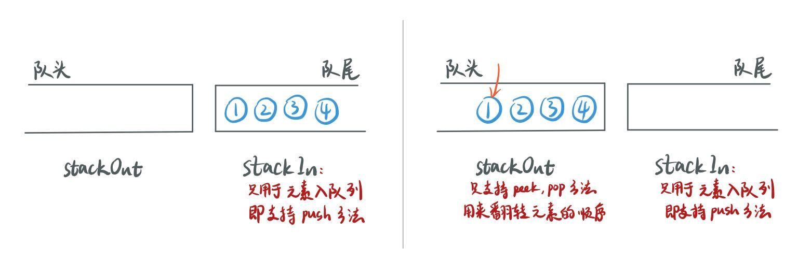
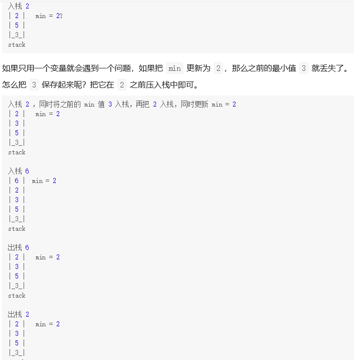
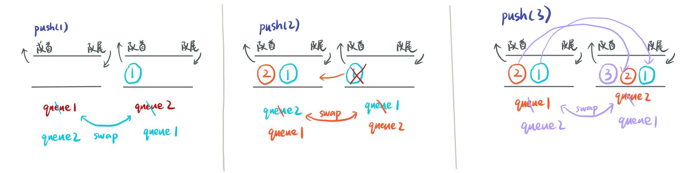
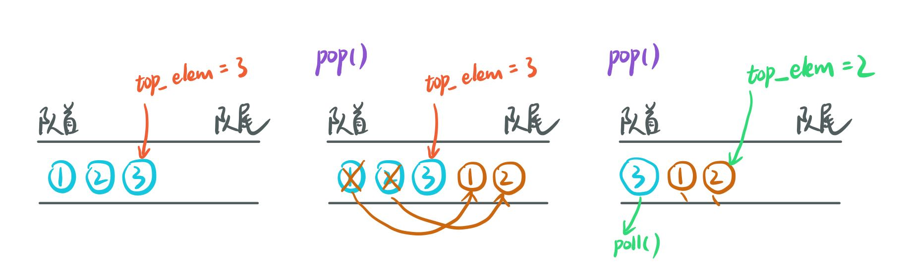
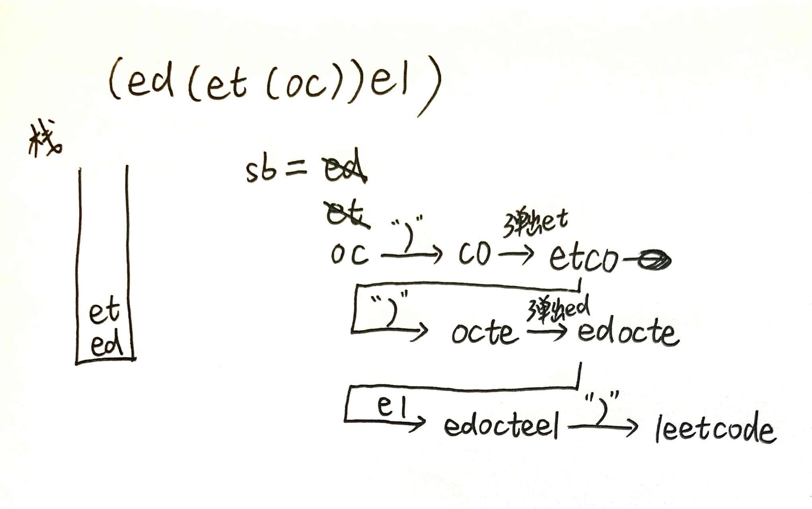
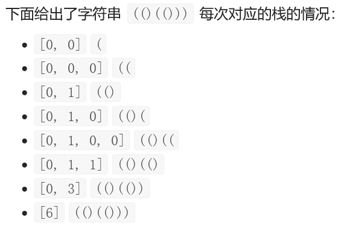

# [LC 1047:  Remove All Adjacent Duplicates In String](https://leetcode.com/problems/remove-all-adjacent-duplicates-in-string/)

这道题一开始直接定义了一个stack，改了很久，主要就是convert string to array，put characters to stack, convert stack to string，就贼麻烦，写了半天的代码如下，但还是不对，不懂到底错在哪里：

```java
class Solution {
    public String removeDuplicates(String s) {
        Stack<Character> stack = new Stack<>();
        for ( char ch: s.toCharArray()) {
            if (!stack.isEmpty() && ch == stack.peek()) {
                stack.pop();
                continue;
            }
            stack.push(ch);   
        }
        String res = "";
        if (!stack.isEmpty()) {
            char ch = stack.pop();
            res = Character.toString(ch) + res;
        }
        return res;
    }
}
```

看了题解以后发现，其实是定义一个string来模拟stack，这里需要设置一个指针top，指向栈顶元素，即当string的size为1时，top为0。

完整正确代码如下：

```java
class Solution {
    public String removeDuplicates(String s) {
        StringBuffer stack = new StringBuffer();
        int top = -1;
        for ( char ch: s.toCharArray()) {
            if (top >= 0 && stack.charAt(top) == ch) {
                stack.deleteCharAt(top);
                top -= 1;
            } else {
                stack.append(ch);
                top += 1;
            }
        }
        return stack.toString();
    }
}
```

## 知识点：StringBuffer和StringBuilder

Java中有String类来创建和操作字符串，但是String的值是不可变的，所以每次对String进行操作都会产生新的String对象，会大量浪费内存空间。

所以当需要对字符串进行修改时，需要使用StringBuffer和StringBuilder。和 String 类不同的是，StringBuffer 和 StringBuilder 类的对象能够被多次的修改，并且不产生新的未使用对象。

两者的最大不同在于，StringBuilder是线程不安全，执行速度快；而StringBuffer线程安全，执行速度慢。

# LC 20:  Valid Parentheses

刚开始的思路有点不对，就想按着lc1047的套路，将所以字符遍历，放入栈中，并同时判断，但是当出现'])}'这样的，因为右括号在map中查找不到，就会报错。所以正确思路是，先判断是左括号还是右括号，左括号一律入栈，遇到右括号时，如果此时栈为空或者与栈顶元素不匹配，则直接返回false。

## sol 1：哈希表 + 栈

```java
class Solution {
    public boolean isValid(String s) {
        Map<Character, Character> map = new HashMap<>();
        map.put('(',')');
        map.put('[',']');
        map.put('{','}');
  
        Stack<Character> stack = new Stack<>();
        for (int i = 0; i < s.length(); i += 1) {
            char ch = s.charAt(i);
            if (map.containsKey(ch)) {
                stack.push(ch);
            } else if (stack.isEmpty() || map.get(stack.pop()) != ch) {
                return false;
            }
        }
        return stack.isEmpty();
    }
}
```

## sol 2： 栈

```java
class Solution {
    public boolean isValid(String s) {  
        Stack<Character> stack = new Stack<>();
        for (char ch: s.toCharArray()) {
            if (ch == '(') {
                stack.push(')');
            } else if (ch == '{') {
                stack.push('}');
            } else if (ch == '[') {
                stack.push(']');
            } else if (stack.isEmpty() || ch != stack.pop()) {
                return false;
            }
        }
        return stack.isEmpty();
    }
}
```

# [LC 232：Implement Queue using Stacks](https://leetcode.com/problems/implement-queue-using-stacks/)

一个输入栈，一个输出栈。这样思路比较清晰

图解：




完整代码如下：

时间复杂度：O(1)，平均每个元素进入stackIn一次，进入stackOut一次。

```java
class MyQueue {
    Deque<Integer> stackIn;
    Deque<Integer> stackOut;

    public MyQueue() {
        stackIn = new ArrayDeque<>();
        stackOut = new ArrayDeque<>();
    }
  
    public void push(int x) {
        stackIn.push(x);  
    }
  
    public int pop() {
        // if (stackOut.isEmpty()) {
        //     while (!stackIn.isEmpty()) {
        //         stackOut.push(stackIn.pop());
        //     }
        // }
        peek();
        return stackOut.pop(); 
    }
  
    public int peek() {
        if (stackOut.isEmpty()) {
            while (!stackIn.isEmpty()) {
                stackOut.push(stackIn.pop());
            }
        }
        return stackOut.peek();
    }
  
    public boolean empty() {
        return stackIn.isEmpty() && stackOut.isEmpty();  
    }
}
```

# [LC 155: Min Stack](https://leetcode.com/problems/min-stack/)

## sol 1: 两个栈

我的思路本来是设置一个integer minNum，用来记录最小值，但是发现有个问题就是，一旦更新了最小值，那之前的最小值就丢失了。

题解的思路就是用一个栈来实现栈的功能，另一个栈用来记录最小值，关键在于，这个栈的栈顶元素记录最小值，而不是只存放一个最小值，这样当最小值（即其栈顶元素）出栈后，依旧知道剩余元素中的最小值是哪个（还是栈顶元素）。

```java
class MinStack {
    Stack<Integer> stack;
    Stack<Integer> minStack;

    public MinStack() {
        stack = new Stack<>();
        minStack = new Stack<>();  
    }
  
    public void push(int val) {
        stack.push(val);
        //当新加入元素小于或等于minStack的栈顶元素时，该元素同时也要进入minStack。
        if (minStack.isEmpty() || val <= minStack.peek()) {
            minStack.push(val);
        }   
    }
  
    public void pop() {
        int pop = stack.pop();
        int top = minStack.peek();
        //当弹出的元素为最小元素时，minStack中的栈顶元素也要出栈
        if (pop == top) {
            minStack.pop();
        }  
    }
  
    public int top() {
        return stack.peek();  
    }
  
    public int getMin() {
        return minStack.peek();  
    }
}
```

## sol 2：一个栈

该方法其实就是我之前想的用一个变量来保存最小值，思路就是，当新的最小值入栈时，先把之前的最小值入栈，再把新的最小值入栈。



完整代码如下：

```java
class MinStack {
    Stack<Integer> stack;
    int min; 
    public MinStack() {
        stack = new Stack<>();
        min = Integer.MAX_VALUE;
    }
  
    public void push(int val) {
        if (val <= min) {
            stack.push(min);
            min = val;   
        }
        stack.push(val);   
    }
  
    public void pop() {
       if (stack.pop() == min) {
           min = stack.pop();   
       }   
    }
  
    public int top() {
        return stack.peek();
  
    }
  
    public int getMin() {
        return min;
  
    }
}
```

# [LC 225:  Implement Stack using Queues](https://leetcode.com/problems/implement-stack-using-queues/)

## sol 1: 双队列实现（符合题目要求）

思路：我刚开始的思路是，push时正常push，要pop时，先将queue1中的元素转移到queue2，只留下最后一个元素（即最后进入的），然后queue1再pop，结果超时。

题解思路：queue2专门用来只存放一个新元素，即新元素先入queue2，再将queue1中的元素转移到queue2，最后将queue1和queue2对调一下即可。这样就实现了队头元素是最后进的，队尾元素是最先进的。

最后确保queue1中保存的元素顺序刚好反过来（即符合栈的顺序）

图解：




```java
class MyStack {
    Queue<Integer> queue1;
    Queue<Integer> queue2;

    public MyStack() {
        queue1 = new LinkedList<>();
        queue2 = new LinkedList<>();
    }
  
    public void push(int x) {
        queue2.offer(x); 
        while (!queue1.isEmpty()) {
            queue2.offer(queue1.poll());
        }
        Queue<Integer> temp = queue1;
        queue1 = queue2;
        queue2 = temp;   
    }
  
    public int pop() {
        return queue1.poll();
    }
  
    public int top() {
        return queue1.peek();
    }
  
    public boolean empty() {
        return queue1.isEmpty();
    }
}
```


## sol 2：单队列实现

思路：用一个变量top_elem来记录队尾元素（即栈顶元素）

图解：




完整代码如下：

```java
class MyStack {
    Queue<Integer> q;
    int top_elem;

    public MyStack() {
        q = new LinkedList<>();
        top_elem = 0;  
    }
  
    public void push(int x) {
        q.offer(x);
        top_elem = x;  
    }
  
    public int pop() {
        int size = q.size();
        //留下队尾最后两个元素
        while (size > 2) {
            q.offer(q.poll());
            size--;
        }
        //原来队尾倒数第二个元素成了新的top_elem
        top_elem = q.peek();
        q.offer(q.poll());
        //此时原来队尾最后一个元素到了队首，删除
        return q.poll();   
    }
  
    public int top() {
        return top_elem;  
    }
  
    public boolean empty() {
        return q.isEmpty();  
    }
}
```


# [LC 1021: Remove Outermost Parentheses](https://leetcode.com/problems/remove-outermost-parentheses/)

## sol 1: 栈

思路：遍历字符串，遇到“（”则入栈，遇到“）”则将栈顶元素出栈。栈从空到再次为空的过程，就遍历完了一个primitive decomposition。要舍去首个“（”和最后一个“）”，当第一个“（”入栈以后（则栈开始处于非空状态），开始把字符串添加到最后的答案中，直到遍历到最后尾端的“）”时，第一个“（”出栈，栈恢复到空栈状态。

完整代码如下：

时间复杂度：O(n)，其中 n是输入 s的长度。仅需遍历 s 一次。

空间复杂度：O(n)，其中 n 是输入 s 的长度。需要使用栈，长度最大为 O(n)。

```java
class Solution {
    public String removeOuterParentheses(String s) {
        StringBuilder res = new StringBuilder();
        Deque<Character> stack = new ArrayDeque<>();
        //这里三个if条件句的前后顺序不能乱，不然就不对。
        for (char ch: s.toCharArray()) {
            if (ch == ')') {
                stack.pop();
            }
            //栈开始非空，表明遍历到的字符串需要加入到最后答案中，直到再次为空。
            if (!stack.isEmpty()) {
                res.append(ch);
            } 
            if (ch == '(') {
                stack.push(ch);
            }  
        }
        return res.toString(); 
    }
}
```

sol 2:  计数

思路：设置一个变量level，初始化为0，遇到“（”则level 加 1，遇到“）”则level减1。若level大于零，则意味着需要去掉的外层括号的左括号已经遍历过，而外层括号的右括号尚未遍历。

可以和sol 1中的栈对比来理解，栈和变量level就好像一个开关，看它们的状态来确定要不要将遍历到的当前字符加入最后的答案。

完整代码如下：

时间复杂度：O(n)，其中 n 是输入 s 的长度。仅需遍历 s 一次。

空间复杂度：O(n)，其中 n 是输入 s 的长度。需要用数组暂时保存结果，并转换为字符串。部分语言支持字符串的修改，可以做到 O(1) 空间复杂度。

```java
class Solution {
    public String removeOuterParentheses(String s) {
        StringBuilder res = new StringBuilder();
        int level = 0;

  
        for (char ch: s.toCharArray()) {
            if (ch == ')') {
                level -= 1;
            }
            if (level > 0) {
                res.append(ch);
            } 
            if (ch == '(') {
                level += 1;
            }  
        }
        return res.toString(); 
    }
}
```

# [LC 682:  Baseball Game](https://leetcode.com/problems/baseball-game/)

没啥可说的，就是用一个栈

```java
class Solution {
    public int calPoints(String[] ops) {
        Stack<Integer> stack = new Stack<>();
        int sum = 0;
        for (String s: ops) {
            if (s.equals("D")) {
                int newNum = 2*(stack.peek());
                sum += newNum;
                stack.push(newNum);
            } else if (s.equals("C")) {
                int top = stack.pop();
                sum -= top;
            } else if (s.equals("+")) {
                int num1 = stack.pop();
                int num2 = stack.pop();
                int tmp = num1 + num2;
                sum += tmp;
                stack.push(num2);
                stack.push(num1);
                stack.push(tmp);
            } else {
                int temp = Integer.valueOf(s);
                stack.push(temp);
                sum += temp;
            }  
        } 
        return sum;
    }
}
```

# [LC 844:  Backspace String Compare](https://leetcode.com/problems/backspace-string-compare/)

## sol 1: 用栈

思路跟lc1047基本一样，就是把string当栈用。把两个字符串都遍历一遍，操作一遍，比较最后的结果是否相同。

完整代码如下：

时间复杂度：O(N+M)，其中 N 和 M 分别为字符串 S 和 T 的长度。我们需要遍历两字符串各一次。

空间复杂度：O(N+M)，其中 N 和 M 分别为字符串 S 和 T 的长度。主要为还原出的字符串的开销。

```java
class Solution {
    public boolean backspaceCompare(String s, String t) {
        return helper(s).equals(helper(t));   
    }
    private String helper(String s) {
        StringBuilder res = new StringBuilder();

        for (char ch: s.toCharArray()) {
            if (ch != '#') {
                res.append(ch);
            } else if (res.length() > 0 && ch == '#') {
                res.deleteCharAt(res.length()-1);
            }
        }
        return res.toString();
    }
}
```

## sol 2: 双指针法

思路：从后往前遍历两个字符串。

1. 两个指针i，j分别指向s和t的末尾字符，再设置两个变量skipS和skipT来作为是否跳过当前字符的开关：如果当前字符为“#”，则skipS加1，如果不是“#”且skipS大于0（说明前一个字符为“#”),那么需要跳过当前字符，继续向前遍历，如果不是“#”且skipS等于0，说明前一个字符不是“#”，那么当前字符需要进行比较。
2. 两个字符串都找到“需要进行比较”的当前字符，然后就开始比较。
3. 比较时有以下几种情况：
   (1)i >= 0 && j >= 0:
   s.charAt(i) == t.charAt(j),则继续，即 i++，j++；
   s.charAt(i) ！= t.charAt(j), 则return false;
   (2)i >= 0 || j >= 0:
   说明一个字符串已经遍历完了，而另一个还没有，则return false；
   (3)i < 0 && j < 0:
   两个都遍历完了，不做任何操作

完整代码如下：

这里可以看[动态图解](https://leetcode.cn/problems/backspace-string-compare/solution/shuang-zhi-zhen-bi-jiao-han-tui-ge-de-zi-8fn8/)。

时间复杂度：O(N+M)，其中 N 和 M 分别为字符串 S 和 T 的长度。我们需要遍历两字符串各一次。

空间复杂度：O(1)。对于每个字符串，我们只需要定义一个指针和一个计数器即可。

```java
class Solution {
    public boolean backspaceCompare(String s, String t) {
        int i = s.length()-1, j = t.length()-1;
        int skipS = 0, skipT = 0;
  
        while (i >= 0 || j >= 0) {
            //找到s中需要比较的字符。
            while (i >= 0) {
                if (s.charAt(i) == '#') {
                    skipS += 1;
                    i -= 1;
                } else if (skipS > 0) {
                    skipS--;
                    i--;
                } else {
                    break;
                }
            }
            //找到t中需要比较的字符。
            while (j >= 0) {
                if (t.charAt(j) == '#') {
                    skipT++;
                    j--;
                } else if (skipT > 0) {
                    skipT--;
                    j--;
                } else {
                    break;
                }
            }
            //开始比较两个字符。
            if (i >= 0 && j >= 0) {
                if (s.charAt(i) != t.charAt(j)) {
                    return false;
                } 
            } else if (i >= 0 || j >= 0){
                    return false;
            }
            i--;
            j--;
        }
        return true;   
    }
}
```

# [LC 1190:  Reverse Substrings Between Each Pair of Parentheses](https://leetcode.com/problems/reverse-substrings-between-each-pair-of-parentheses/)

## sol 1： 用栈

思路：从左往右遍历字符串s，用sb来存储遍历过的字符。遇到“（”时，表明即将进入下一层括号中，所以把上一层括号中左半边的字符串押栈，当第一次遇到“）”时，表明当前sb中存储的是最内层括号中的字符串，所以将其翻转，再在其头部插入次内层括号中的左半边字符串；当再次遇到“）”时再次翻转，再在其头部插入次内层括号中的左半边字符串。



完整代码如下：

时间复杂度：O(n2)，其中 nnn 为字符串的长度。栈的最大深度为 O(n)，每一层处理的时间复杂度主要为反转的时间复杂度，为 O(n)，因此总时间复杂度为 O(n2)。

空间复杂度：O(n)，其中 n 为字符串的长度。对于任意时刻，字符串中的任意一个字符至多只被栈中的一个位置包含一次。

```java
class Solution {
    public String reverseParentheses(String s) {
        Deque<String> stack = new LinkedList<>();
        StringBuffer sb = new StringBuffer();
        for (char ch: s.toCharArray()) {
            //表示即将进入下一层括号，所以将当前已经遍历的字符押栈
            //（即存放每层括号的左半边字符串）
            if (ch == '(') {
                stack.push(sb.toString());
                //然后将sb置为空。
                sb.setLength(0);
            } else if (ch == ')') {
                //将当前字符串sb翻转。
                sb.reverse();
                //在其头部插入外面一层括号的左半边的字符串
                sb.insert(0, stack.pop());
            } else {
                //sb中存储遍历过的字符。
                sb.append(ch);
            }
        }
        return sb.toString();   
    }
}
```

## sol 2：预先处理括号

思路：

1. 首先创建一个数组pair，用来记录成对的左右括号的index，即pair[左括号的index] = 对应右括号的index，反之亦然。
2. 开始从左向右遍历字符串，每次遇到“（”或者“）”时，指针先跳跃到对应的右括号或者左括号，同时改变遍历方向；如果遇到的是字符，则直接加入最后答案sb。

完整代码如下：

时间复杂度：O(n)，其中 n 为字符串的长度。预处理出括号的对应关系的序列的时间复杂度为 O(n)，遍历字符串的时间复杂度同样为 O(n)。

空间复杂度：O(n)，其中 n 为字符串的长度。栈的大小不会超过 n，以及我们需要 O(n) 的空间记录括号的对应关系。

```java
class Solution {
    public String reverseParentheses(String s) {
        int n = s.length();
        Deque<Integer> stack = new LinkedList<>();
        int[] pair = new int[n];
        for (int i = 0; i < n; i += 1) {
            if (s.charAt(i) == '(') {
                stack.push(i);
            } else if (s.charAt(i) == ')') {
                int j = stack.pop();
                pair[i] = j;
                pair[j] = i;
            }
        }
  
        StringBuffer sb = new StringBuffer();
        int pointer = 0, step = 1;
        while (pointer < n) {
            if (s.charAt(pointer) == '(' || s.charAt(pointer) == ')') {
                pointer = pair[pointer];
                step = -step;
            } else {
                sb.append(s.charAt(pointer));
            }
            pointer += step;
        }
        return sb.toString();
    }
}
```

# [LC 394： Decode String](https://leetcode.com/problems/decode-string/)

## sol 1:  用栈

思路：本题的思路可以想见这篇帖子里的[图解](https://leetcode.cn/problems/decode-string/solution/decode-string-fu-zhu-zhan-fa-di-gui-fa-by-jyd/)。

创建一个辅助栈 `stack`，把字母、数字和括号看成是独立的 TOKEN，并用栈来维护这些 TOKEN。设置一个变量 `multi`用来记录数字（需要将字符转换成数字），设置一个 `res`来拼接字符串。

遍历字符串：

1. 如果字符 `ch`为数字字符，则更新变量 `multi`；
2. 如果字符 `ch`为字母，则直接添加在res尾部；
3. 当字符 `ch`为[时，将当前 `multi`和 `res`存储的信息入栈，然后将二者均置空置（这步很重要，因为如果不新建一个空置的 `res`，后续再对res进行操作就会是在原来的 `res`的基础上，`multi`同理）
4. 当字符 `ch`为]时，第一次出栈元素记为 `last_res`（即之前已经形成的字符串），第二次出栈元素记为k，即倍数，然后更新res = last_res + k*(当前res)
5. 说明：将字符转换成数字时，`multi = multi * 10 + (ch - '0');` 这是因为ch可能是多位数，即大于9的数字，比如用例24是"100[leetcode]"，遍历时是逐个元素遍历的，所以要想把100转化成数字，就必须如上面写的那样一位数一位数的转化。

完整代码如下：

* 时间复杂度 **O**(**N**)，一次遍历 `s`；
* 空间复杂度 **O**(**N**)，辅助栈在极端情况下需要线性空间，例如 `2[2[2[a]]]`。

使用栈时，java官方推荐 `Deque`。

### 字符转换数字：

比如字符 `'9'`，转换正数字则是 `'9' - '0'`。

完整代码如下：

修改了一下代码，变成用两个辅助栈。

* 时间复杂度 **O**(**N**)，一次遍历 `s`；
* 空间复杂度 **O**(**N**)，辅助栈在极端情况下需要线性空间，例如 `2[2[2[a]]]`。

```java
class Solution {
    public String decodeString(String s) {
        StringBuilder res = new StringBuilder();
        int multi = 0;
        Deque<Integer> stack_multi = new ArrayDeque<>();
        Deque<String> stack_res = new ArrayDeque<>();
    
        for (char ch: s.toCharArray()) {
            if (ch == '[') {
                stack_multi.push(multi);
                stack_res.push(res.toString());
                //重置
                multi = 0;
                res = new StringBuilder();
            } else if (ch == ']') {
                StringBuilder temp = new StringBuilder();
                int cur_multi = stack_multi.pop();
                for (int i = 0; i < cur_multi; i += 1) {
                    temp.append(res);
                }
                res = new StringBuilder(stack_res.pop()+temp);
            } else if (ch >= '0' && ch <= '9') {//当遇到数字时
                multi = multi*10 + Integer.parseInt(ch + "");
            } else {//遇到字母时
                res.append(ch);
            }
        }
        return res.toString();
    }
}
```

## sol 2: 递归法

完整代码如下：

（代码是抄的，因为觉得这道题好难！还是没搞明白！）

```java
class Solution {
    public String decodeString(String s) {
        Queue<Character> q = new LinkedList<>();
        for (char ch: s.toCharArray()) {
            q.offer(ch);
        }
        return decodeString(q);
    }
  
    public String decodeString(Queue<Character> q) {
        StringBuilder res = new StringBuilder();
        int num = 0;
        while (!q.isEmpty()) {
            char ch = q.poll();
            if (ch >= '0' && ch <= '9') {
                num = num*10 + (ch - '0');
            } else if (ch == '[') {
                String temp = decodeString(q);
                while (num > 0) {
                    res.append(temp);
                    num -= 1;
                }
            } else if (ch == ']') {
                return res.toString();
            } else {
                res.append(ch);
            }
        }
        return res.toString();  
    }
}
```

# [LC 456: 132 Pattern](https://leetcode.com/problems/132-pattern/)

## sol 1: 枚举1（即枚举i）单调栈

思路：

首先，下标为i，j，k的三个元素并不需要是紧邻的。

创建一个单调递减的栈（即from bottom to top 元素的值递减），则新元素压栈的条件就是：入栈元素小于栈顶元素。

栈顶元素维护j（即132中的最大值，位置在中间），另设置一个变量k维护k（即132中的第二大值，其位置在最右边，即在j的右边），枚举的是i。

变量k来源于栈：当枚举到的i大于栈顶元素时，不符合单调递减，所以此时需要出栈，直到栈为空，使得k等于栈底的元素（由于是单调递减的栈，所以k = 所有出栈元素中的最大值）。根据栈的特性，即后进先出，如此操作确保了栈顶元素的下标小于k的下标，即找到了（j，k）（同时满足nums[j]>nums[k]且j < k).

当枚举到的i<k（即j右边所有小于j的元素中最大的一个）时，则找到了符合条件的132中的1，于是返回true。

完整代码如下：

* 时间复杂度：**O**(**n**)
* 空间复杂度：**O**(**n**)

```java
class Solution {
    public boolean find132pattern(int[] nums) {
        int n = nums.length;
        Deque<Integer> stack = new LinkedList<>();
        //k代表132结构中的2，即位置最靠右，值第二大的元素。记录栈顶元素的右边所有元素中的最大值。
        int k = Integer.MIN_VALUE;
  
        for (int i = n-1; i >= 0; i -= 1) {
            //即找到符合条件的i，则返回。
            if (nums[i] < k) {
                return true;
            }
            // 实现栈单调递减，且k记录栈顶元素的右边所有元素中的最大值。
            while (!stack.isEmpty() && nums[i] > stack.peek()) {
                k = stack.pop();
            }
            //只有当nums[i] <= 栈顶元素才能入栈
            stack.push(nums[i]);
        }
        return false;  
    }
}
```

# [LC 150:  Evaluate Reverse Polish Notation](https://leetcode.com/problems/evaluate-reverse-polish-notation/)

## sol 1: 用栈

重点就是每次计算的结果要入栈

完整代码如下：

```java
class Solution {
    public int evalRPN(String[] tokens) {
        Deque<Integer> stack = new LinkedList<>();
        Integer op1, op2;
  
        for (String s: tokens) {
            switch (s) {
                case "+":
                    op2 = stack.pop();
                    op1 = stack.pop();
                    stack.push(op1 + op2);
                    break;
                case "-":
                    op2 = stack.pop();
                    op1 = stack.pop();
                    stack.push(op1 - op2);
                    break;
                case "*":
                    op2 = stack.pop();
                    op1 = stack.pop();
                    stack.push(op1 * op2);
                    break;
                case "/":
                    op2 = stack.pop();
                    op1 = stack.pop();
                    stack.push(op1 / op2);
                    break;
                default:
                    stack.push(Integer.valueOf(s));
                    break;  
            }
        }
        return stack.pop();  
    }
}
```

## sol 2: 纯数组模拟栈的实现

思路就是用数组来模拟栈。

说明：

相关优化操作：

1. 数组最大长度为tokens.length / 2 + 1：没太懂
2. switch代替if-else，效率优化
   注意：`break`是必须的，否则statements in `switch` blocks  *fall through* : All statements after the matching `case` label are executed in sequence, regardless of the expression of subsequent `case` labels, until a `break` statement is encountered.
3. Integer.parseInt代替Integer.valueOf,减少自动拆箱装箱操作

完整代码如下：

```java
class Solution {
    public int evalRPN(String[] tokens) {
        int[] stack = new int[tokens.length/2 + 1];
        int index = 0;
        for (String s: tokens) {
            switch (s) {
                case "+":
                    stack[index-2] += stack[--index];
                    break;
                case "-":
                    stack[index-2] -= stack[--index];
                    break;
                case "*":
                    stack[index-2] *= stack[--index];
                    break;
                case "/":
                    stack[index-2] /= stack[--index];
                    break;
                default:
                    stack[index] = Integer.parseInt(s);
                    index += 1;
                    break;
            }
        }
        return stack[0];  
    }
}
```

# [LC 227:  Basic Calculator II](https://leetcode.com/problems/basic-calculator-ii/)

## sol 1: 用栈

思路：

首先看清题目，字符串中包括：数字、运算符和**空格**。

基本思路就是先计算乘除，后算加减。

设置一个变量preSign来记录数字前面的运算符，如果是乘除，则栈顶元素出栈与当前的num进行乘除计算，然后再入栈。当遍历到最后一个元素时，也需要看preSign来进行判断。

例如： + 3 + 2 × 2

当遍历到“×”时，preSign为“+”，num = 2，则2入栈；当遍历到2（i = n - 1)时，preSign = “×”，num = 2，要进行乘法运算。

```java
class Solution {
    public int calculate(String s) {
        Deque<Integer> stack = new ArrayDeque<>();
        char preSign = '+';
        int num = 0;
        int n = s.length();
  
        for (int i = 0; i < n; i += 1) {
            char ch = s.charAt(i);
            if (Character.isDigit(ch)) {
                num = num*10 + ch - '0';
            }
            //即遍历到一个运算符时，开始进行判断，即考虑其前面的两个字符是什么；当遍历到最后一个数字时也是，因为后面没有字符了，需要停下来进行判断。
            if (!Character.isDigit(ch) && ch != ' ' || i == n - 1) {
                switch (preSign) {
                    case '+':
                        stack.push(num);
                        break;
                    case '-':
                        stack.push(-num);
                        break;
                    case '*':
                        stack.push(stack.pop()*num);
                        break;
                    default:
                        stack.push(stack.pop()/num);
                }
                num = 0;
                preSign = ch;
            }
        }
        int res = 0;
        while (!stack.isEmpty()) {
            res += stack.pop();
        }
        return res;  
    }
}
```

## sol 2： 双栈（unfinished）

看这篇[帖子](https://leetcode.cn/problems/basic-calculator-ii/solution/shi-yong-shuang-zhan-jie-jue-jiu-ji-biao-c65k/)。

# [LC 71: Simplify Path](https://leetcode.com/problems/simplify-path/)

思路：

1. 用一个deque来维护路径中的每一个目录名。
2. 将给定的字符串path根据"/"进行分割，得到一个由若干个字符串组成的列表，记为names。names中包含的字符串有以下几种情况：

* 空字符串。当出现连续多个"/"（如"//")时，就会分割出空字符串，跳过无须操作；
* 一个点"."，表示当前目录本身，无须切换目录，跳过无须操作；
* 两个点"..", 则需要将目录切换到上一级目录，具体操作：若deque非空，则弹出队列末尾的目录；
* 其他（包含英文字母、数字或者其他符号的目录名（三个点"..."及以上的都视为目录名））：直接入队列。

3. 遍历完names中的字符串以后，将deque中的目录名从deque中从头到尾的顺序依次弹出，并且用"/"进行连接即可。

完整代码如下：

时间复杂度：O(n)，其中 n是字符串 path 的长度。

空间复杂度：O(n)。我们需要 O(n) 的空间存储 names 中的所有字符串。

```java
class Solution {
    public String simplifyPath(String path) {
        String[] names = path.split("/");
        Deque<String> q = new ArrayDeque<>();
        for (String name: names) {
            if (name.equals("..")) {
                if (!q.isEmpty()) {
                    q.pollLast();
                }
            } else if (name.length() > 0 && !name.equals(".")) {
                q.offerLast(name);
            } 
        }
        StringBuffer res = new StringBuffer();
        if (q.isEmpty()) {
            res.append('/');
        } else {
            while (!q.isEmpty()) {
                res.append('/');
                res.append(q.pollFirst());
            }
        }
        return res.toString();
    }
}
```

# [LC 856:  Score of Parentheses](https://leetcode.com/problems/score-of-parentheses/)

## sol 1: 用栈

思路：

* 字符串s中每个字符都有一个“深度”，即该位置外层嵌套的左括号"("的个数（同样也对应了该位置的得分需要乘以2的几次方）。例如，字符串 `(()(.()))` 中的 `.` 的深度为 `2`，因为它外侧嵌套了 `2` 层括号：`(__(.__))`。
* 用一个栈来维护当前遍历到的字符的深度，以及其外层深度的得分。
* 当遇见一个"("时，该位置代表的深度得分初始化为0，栈的深度（即栈的size）加一，所以代码就是 `stack.push(0)`；
* 当遇到一个")"时，将当前深度v（即栈顶元素代表的位置深度）乘以二，并加到外面一层的深度w上去，特殊情况是遇到"()"，即外层没括号，那就不用乘以二，加一即可，所以代码就是 `stack.push(w + Math.max(2*v, 1));`



完整代码如下：

* 时间复杂度：**O**(**N**)，其中 **N** 是字符串 `S` 的长度。
* 空间复杂度：**O**(**N**)，为栈的大小。

```java
class Solution {
    public int scoreOfParentheses(String s) {
        Deque<Integer> stack = new ArrayDeque<>();
        stack.push(0);//第一个位置的外层得分初始化为0
  
        for (char ch: s.toCharArray()) {
            if (ch == '(') {
                stack.push(0);
            } else {
                int v = stack.pop();
                int w = stack.pop();
                stack.push(w + Math.max(2*v, 1));
            }
        }
        return stack.pop();
    }
}
```

## sol 2: 统计核心的数目

思路：这个解法的核心思路就是，只有"()"会实质性地贡献分数，其他括号只是用来将"()"贡献的分数乘以二或者累加。所以每个"()"的分数 = 2 × 该"()"对应的深度；最后将每个"()"的分数累加即可。

具体做法：设置一个变量depth来维护当前到达的深度。所以当遍历到一个"（"时，深度+1；当遍历到一个")"时，如果这个")"是"()"里的右括号，那么其实际贡献的分数就是2的depth（这里的深度不包括"()"中的左括号贡献的深度，所以代码中要 `depth -= 1`）次方；如果这个")"是外层括号，即用来加倍的，那就直接跳过。

完整代码如下：

* 时间复杂度：**O**(**N**)，其中 **N** 是字符串 `S` 的长度。
* 空间复杂度：**O**(**1**)。

```java
class Solution {
    public int scoreOfParentheses(String s) {
        int res = 0;
        int depth = 0;
        for (int i = 0; i < s.length(); i += 1) {
            if (s.charAt(i) == '(') {
                depth += 1;
            } else {
                depth -= 1;
                if (s.charAt(i - 1) == '(') {
                    res += 1*Math.pow(2, depth);
                }
            }
        }
        return res;  
    }
}
```

## 知识点：java中的移位运算符

[详见这篇文章讲解](https://zhuanlan.zhihu.com/p/30108890)。

ddd
