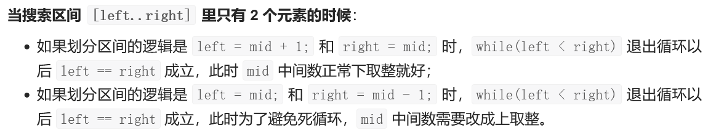
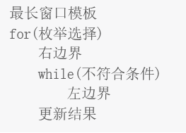
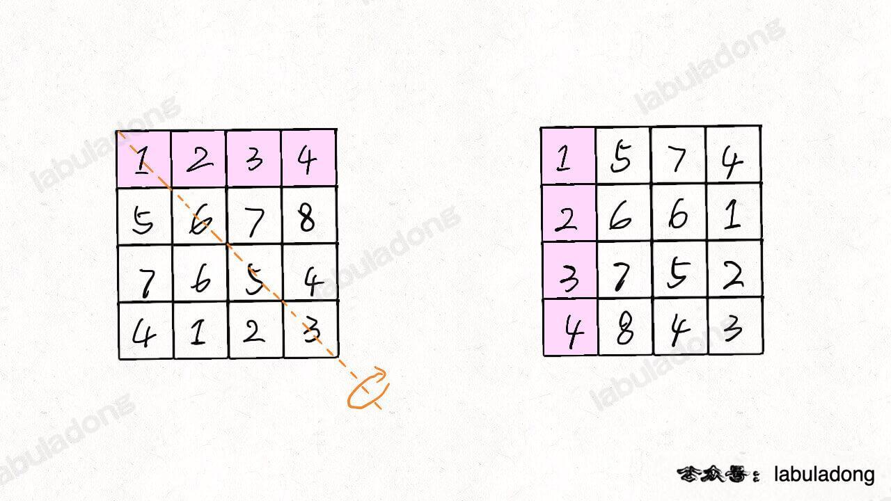
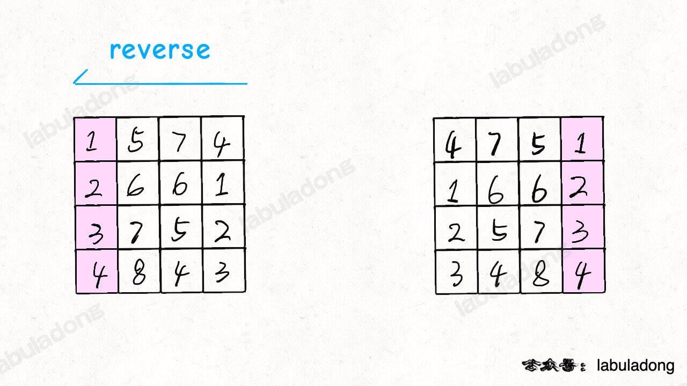
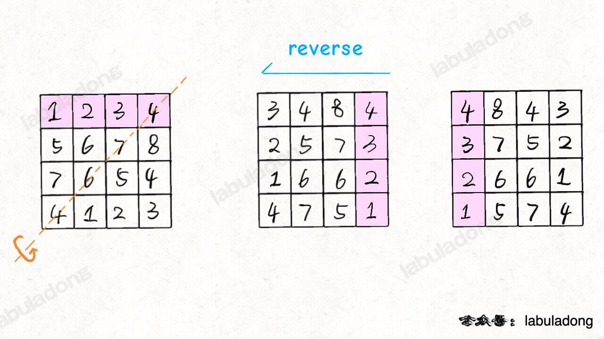
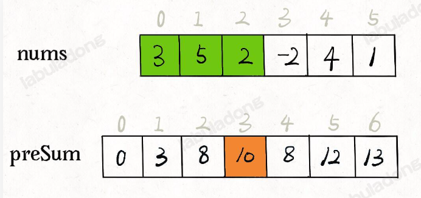
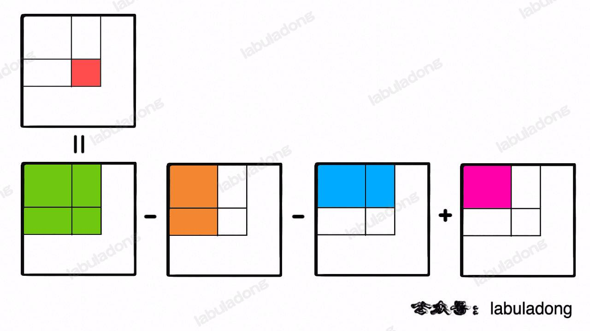
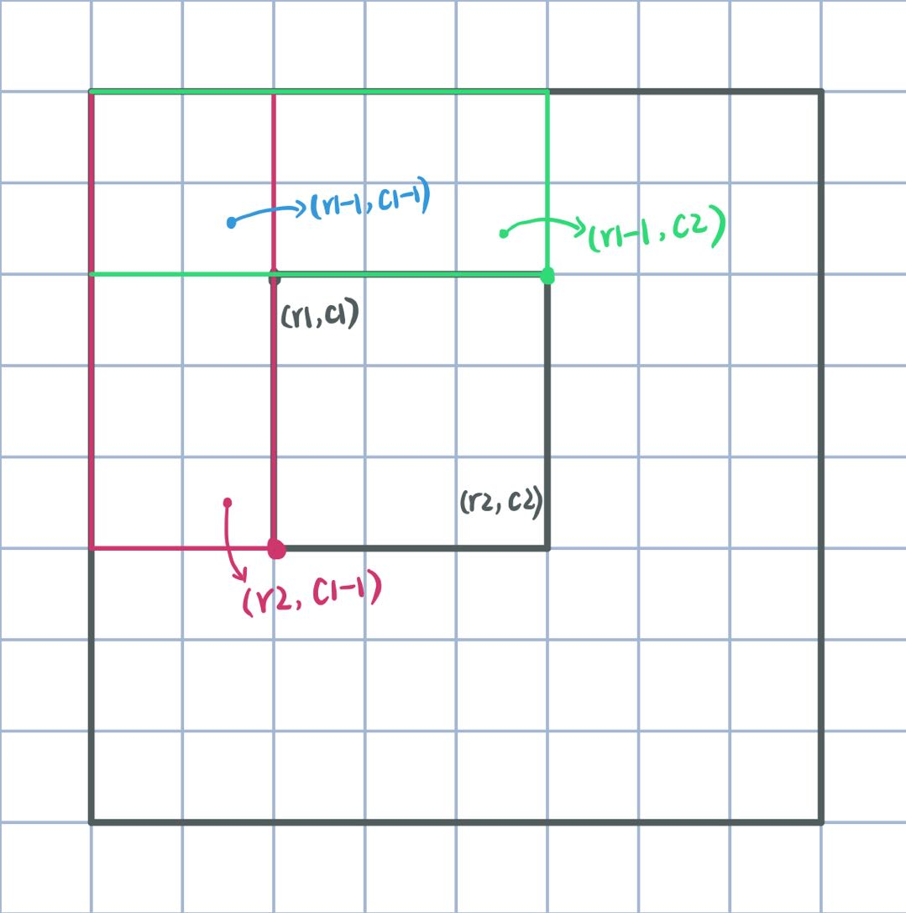
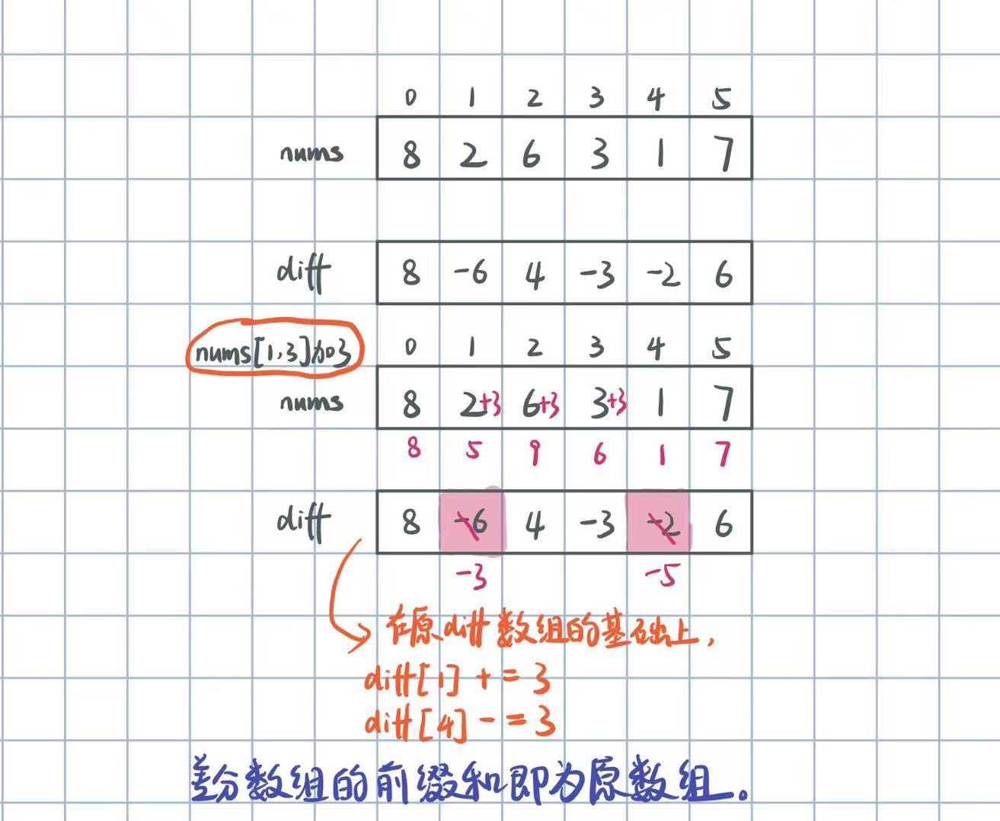

# 数组理论基础

**数组是存放在连续内存空间上的相同类型数据的集合。**

数组中的元素只能覆盖，不能删除。

# 二分查找

## [LC 704： Binary Search](https://leetcode.com/problems/binary-search/)

注意方法一和方法二的细微差别

二分法使用前提：数组为有序数组，且无重复值

### sol 1: 区间设置：左闭右闭（即包括左端点和右端点）

```java
class Solution {
    public int search(int[] nums, int target) {
        int left = 0, right = nums.length - 1;
        while (left <= right) {
            int middle = (left + right)/2;
            if (nums[middle] > target) {
                right = middle - 1;
            } else if (nums[middle] < target) {
                left = middle + 1;
            } else {
                return middle;
            }
        }
        return -1; 
    }
}
```

### sol 2：区间设置：左闭右开（即包括左端点，不包括右端点）

```java
class Solution {
    public int search(int[] nums, int target) {
        int left = 0, right = nums.length;
        while (left < right) {
            int middle = (left + right)/2;
            if (nums[middle] > target) {
                right = middle;
            } else if (nums[middle] < target) {
                left = middle + 1;
            } else {
                return middle;
            }
        }
        return -1; 
    }
}
```

## [LC 35：Search Insert Position](https://leetcode.com/problems/search-insert-position/)

我刚开始的思路就是，找到目标值左边最大的数，或者说找到数组中小于target的所有数中最大的数的下标i，则答案即为i+1。但是写不出来

思路：

有三种情况：

目标值在所有元素之前

目标是在所有元素之后

目标值等于数组中的某一元素

目标值插入数组中的某一位置

### sol 1: 暴力解法

所以这道题可以理解为，从左往右，找到第一个大于等于target的元素的下标

完整代码如下：

* 时间复杂度：O(n)
* 空间复杂度：O(1)

```java
class Solution {
    public int searchInsert(int[] nums, int target) {
        for (int i = 0; i < nums.length; i += 1) {
            if (nums[i] >= target) {
                return i;
            }
        }
        return nums.length;  
    }
}
```

### sol 2: 二分法-左闭右闭

例如：数组为[1,3,5,6]，

若target = 7，答案为4。当left > right时退出循环。

while循环结束时，left = 4，right = 3；则答案为right + 1；

若target = 0，答案为0

while循环结束时，left = 0，right = -1；则答案为right + 1；

若target = 2，答案为1

while循环结束时，left = 1， right = 0；则答案为right + 1；

若target = 3，略

综上所述，当target不在数组中时，则返回right + 1。

* 时间复杂度：O(log n)
* 空间复杂度：O(1)

```java
class Solution {
    public int searchInsert(int[] nums, int target) {
        int left = 0, right = nums.length - 1;
        while (left <= right) {
            int middle = (left + right)/2;
            if (nums[middle] > target) {
                right = middle - 1;
            } else if (nums[middle] < target) {
                left = middle + 1;
            } else {
                return middle;
            }
        }
        return right + 1; 
    }
}
```

### sol 3: 二分法-左闭右开

复杂度与sol 2 一样的。分析与sol 2类似，当left == right时，循环结束。

```java
class Solution {
    public int searchInsert(int[] nums, int target) {
        int left = 0, right = nums.length;
        while (left < right) {
            int middle = (left + right)/2;
            if (nums[middle] > target) {
                right = middle;
            } else if (nums[middle] < target) {
                left = middle + 1;
            } else {
                return middle;
            }
        }
        return left; //这一步的返回结果，简单举个例子就可以得出
    }
}
```

## [LC 34：Find First and Last Position of Element in Sorted Array](https://leetcode.com/problems/find-first-and-last-position-of-element-in-sorted-array/)

### sol 1: 直接寻找左右边界

12/17/22 update：

1、从左往右，寻找第一个目标值的index

2、从右往左，寻找到第一个目标值的index

这两中找法的主要区别：

1）从左往右时，中间值mid向左取，例如数组[1,2]的中间值取的是1；从右往左时，中间值mid+1，例如数组[1,2]的中间值取的是2。具体原因，画图就知道了。



2）最后返回值：从左往右时，最后返回left或者right均可（因为是right = left时退出循环），从右往左时，最后返回right（因为left可能越界了）。这也是画图看出来的。

举个最简单的例子：数组[2,2]， target = 3。

思路：

完整代码如下：

```java
class Solution {
    public int[] searchRange(int[] nums, int target) {
        if (nums.length == 0) return new int[]{-1, -1};
  
        int start = getLeftBorder(nums, target);
        int end = getRightBorder(nums, target);
        if (start == -1) return new int[]{-1, -1};
        return new int[]{start, end};
    }

    private int getLeftBorder(int[] nums, int target) {
        int left = 0;
        int right = nums.length - 1;
        //二分查找
        //从【左】往【右】，找到第一个目标值的index
        while (left < right) {
            int mid = left + (right-left)/2;
            if (nums[mid] == target) {
                right = mid;
            } else if (nums[mid] > target) {
                right = mid - 1;
            } else if (nums[mid] < target) {
                left = mid + 1;
            }
        }
        return nums[left] == target ? left : -1;
    }

    private int getRightBorder(int[] nums, int target) {
        int left = 0;
        int right = nums.length - 1;
        //二分查找
        //从【右】往【左】，找到第一个目标值的index
        while (left < right) {
            //这里和寻找左边界不同，mid+1才能向右取中间数
            //mid是向左取中间数
            int mid = left + (right-left)/2 +1;
            if (nums[mid] == target) {
                left = mid;
            } else if (nums[mid] > target) {
                right = mid - 1;
            } else if (nums[mid] < target) {
                left = mid + 1;
            }
        }
        //注意这里，和寻找左边界是不同的，要返回right
        return nums[right] == target ? right : -1;
    }
}
```

### sol 2：先找到一个target的下标，再找区间

思路：

先在数组中寻找target，返回其下标（即index），如果返回的是-1，说明数组中没有target，直接返回【-1，-1】；如果找到一个target的下标，则设置指针左右滑动，找到正确的区间。

```java
class Solution {
    public int[] searchRange(int[] nums, int target) {
        int index = binarySearch(nums, target);
        if (index == -1) {
            return new int[]{-1, -1};
        }
        int left = index, right = index;
        //向左滑动，找左边界
        while (left - 1 >= 0 && nums[left - 1] == target) {
            left -= 1;
        }
        //向右滑动，找右边界 
        while (right + 1 <= nums.length - 1 && nums[right + 1] == target) {
            right += 1;
        }
        return new int[]{left, right};
    }
    //二分查找：找到数组中是否存在target，并返回其下标
    private int binarySearch(int[] nums, int target) {
        int left = 0, right = nums.length - 1;
        while (left <= right) {
            int middle = left + (right-left)/2;
            if (nums[middle] > target) {
                right = middle - 1;
  
            } else if (nums[middle] < target) {
                left = middle + 1;
            } else {
                return middle;
            }
        }
        return -1;
    }
}
```

12/17/22 update：

另外一种写法：先从左往右找到第一个目标值的index，然后再向右寻找边界

```java
class Solution {
    public int[] searchRange(int[] nums, int target) {
        if (nums.length == 0) return new int[]{-1, -1};
        int left = 0;
        int right = nums.length - 1;
        //二分查找
        //从左往右，找到第一个目标值的index
        while (left < right) {
            int mid = left + (right-left)/2;
            if (nums[mid] == target) {
                right = mid;
            } else if (nums[mid] > target) {
                right = mid - 1;
            } else if (nums[mid] < target) {
                left = mid + 1;
            }
        }
        //如果数组中不存在目标值，直接返回[-1,-1]
        if (nums[left] != target) {
            return new int[]{-1, -1};
        }
        //找到最后一个重复target的下标（end）
        int start = left;
        int end = start;
        while (end < nums.length && nums[end] == target) {
            end++;
        }
        return new int[]{start, end-1};
    }
}
```

## [LC 69: Sqrt(x)](https://leetcode.com/problems/sqrtx/)

### sol 1

这题我想到其实就是写二分查找了，但有很多细节，如下：

1。右指针初始化时赋值多少？整数的平方根不会超过该整数的一半，0和1除外，所以right = x/2，将0和1的情况单独写出来。

2。最后返回left还是right？如果整数x本身有整数平方根，那么最终left和right是相等的，如果没有，需要返回其平方根的整数部分，例如x = 8，平方根介于2和3之间，最后返回2；如x = 12，平方根介于3和4之间，最后返回3，所以相当于要从数组【1，2，3，。。。x/2】中找到大于x的平方根的数中的最小的数a，结果即为a-1，换句话说，相当于寻找左边界，参考lc34可以知道，应当返回right。

完整代码如下：

```java
class Solution {
    public int mySqrt(int x) {
        if (x == 0) {
            return 0;
        }
        if (x == 1) {
            return 1;
        }
        int left = 1, right = x/2;
        while (left <= right) {
            int middle = (left + right)/2;
            //这里是为了避免乘法溢出，改用除法
            if (middle > x/middle) {
                right = middle - 1;
            } else {
                left = middle + 1;
            }
        }
        return right;
    }
}
```

### sol 2

首先，要搞清楚二分查找的target是什么，这里，二分查找的是**大于**x的平方根的数中的最小的数a。所以二分查找要找的是左边界（参考lc34 sol 1 中找左边界的写法）。

最后结果取值，举例就能知道

然后就是关注base case

代码如下：

```java
class Solution {
    public int mySqrt(int x) {
        if (x == 0 || x == 1) return x;
        int left  = 1;
        int right = x/2;
        //base case:
        if (left == right) return left;
        //二分查找
        //寻找的是在[left,right]区间里的target，
        //这个target满足：target*target > x 且最靠左
        //所以要寻找的是左边界
        while (left < right) {
            int mid = left + (right-left)/2;
            if (mid < x/mid) {
                left = mid + 1;
            } else if (mid == x/mid) {
                left = mid + 1;
            } else if (mid > x/mid) {
                right = mid;
            }
        }
        //因为存在两种情况：x正好有整数平方根，或者没有
        //举两个例子：
        //x = 4, 数组为[1,2], 最后left == right == 2
        //x = 8, 数组为[1,2,3,4], left == right == 3
        return left > x/left ? left - 1 : left;   
    }
}
```

### sol 3:

二分查找寻找target， 使得target*target == x

```java
class Solution {
    public int mySqrt(int x) {
        if (x == 0 || x == 1) return x;
        int left  = 1;
        int right = x/2;

        //二分查找
        //在区间[left, right]中查找目标元素
        while (left < right) {
            int mid = left + (right-left+1)/2;//这里需要向【上】取中值
            if (mid > x/mid) {
                right = mid - 1;//下一轮搜索区间为[left, mid-1]
            } else {
                left = mid;//下一轮搜索区间为[mid, right]
            }
        }
        return left;
    }
}
```

## [LC 367: Valid Perfect Square](https://leetcode.com/problems/valid-perfect-square/)

刚开始我想直接二分查找target，能找到就返回true，否则就是false，想成lc704了，但是问题是，num/middle是向下取整的，反正就是不能通过。看了题解发现，应该按lc69来做，最后根据 `right*right == num`来进行判断。

```java
class Solution {
    public boolean isPerfectSquare(int num) {
        if (num == 1) {
            return true;
        }
        int left = 1, right = num/2;
        while (left <= right) {
            int middle = (left + right)/2;
            if (middle > num/middle) {
                right = middle - 1;
            } else {
                left = middle + 1;
            }
        }
        return right*right == num;
    }
}
```

## LC 167: Two Sum II - Input Array Is Sorted

### sol 1: 二分查找

代码如下：

时间复杂度：O(NlogN)，N为数组的长度。需要遍历数组一次，确定第一个数，时间复杂度为O(N)，使用二分查找寻找第二个数，时间复杂度为O(logN)。

空间复杂度：O(1)

```java
class Solution {
    public int[] twoSum(int[] numbers, int target) {
        int[] res = new int[2];
        for (int i = 0; i < numbers.length - 1; i += 1) {
            int index = indexOf(numbers, i+1, target - numbers[i]);
            if (index != -1) {
                res[0] = i+1;
                res[1] = index+1;
            }
        }
        return res;
    }

    //在数组nums[start:]中找到target并返回其索引
    private int indexOf(int[] nums, int start, int target) {
        int left = start;
        int right = nums.length;
        while (left < right) {
            int mid = left + (right-left)/2;
            if (nums[mid] > target) {
                right = mid;
            } else if (nums[mid] == target) {
                return mid;
            } else {
                left = mid + 1;
            }
        }
        return -1;
    }
}
```

### sol 2：双指针法

代码如下：

* 时间复杂度：**O**(**n**)，其中 n**n** 是数组的长度。两个指针移动的总次数最多为 **n** 次。
* 空间复杂度：**O**(**1**)。

```java
class Solution {
    public int[] twoSum(int[] numbers, int target) {
        int left = 0;
        int right = numbers.length-1;
        while (left < right) {
            int sum = numbers[left] + numbers[right];
            if (sum > target) {
                right--;
            } else if (sum == target) {
                return new int[]{left+1, right+1};
            } else {
                left++;
            }
        }
        return new int[]{-1,-1};
    } 
}
```

### sol 3: 二分查找 + 双指针法

代码如下：

这个复杂度不知道咋分析。。。

```java
class Solution {
    public int[] twoSum(int[] numbers, int target) {
        int left = 0;
        int right = numbers.length-1;
        while (left < right) {
            int mid = left + (right-left)/2;
            if (numbers[left]+numbers[mid] > target) {
                right = mid - 1;
            } else if (numbers[mid] + numbers[right] < target) {
                left = mid + 1;
            } else if (numbers[left] + numbers[right] > target) {
                right--;
            } else if (numbers[left] + numbers[right] < target) {
                left++;
            } else {
                return new int[]{left+1, right+1};
            }
        }
        return new int[]{-1,-1};
    } 
}
```

# 移除元素

## [LC 27: Remove Element](https://leetcode.com/problems/remove-element/)

### 复习时间：10/15/22

### sol 1: 暴力解法

思路：两层for循环，第一个for循环遍历数组元素，第二个for循环更新数组。

注意：在数组中，不能单独删除某个元素，只能覆盖，所以当第一个for遍历到val时，第二个for开始向后遍历，将后边的元素一个个朝前移动，覆盖掉val。

完整代码如下：

* 时间复杂度：O(n^2)
* 空间复杂度：O(1)

```java
class Solution {
    public int removeElement(int[] nums, int val) {
        int size = nums.length;
        for (int i = 0; i < size; i += 1) {
            if (nums[i] == val) {
                for (int j = i + 1; j < size; j += 1) {
                    nums[j-1] = nums[j];
                }
                i -= 1;
                size -= 1;
            }
        }
        return size;
    }
}
```

### sol 2: 双指针法

数组的元素在内存地址中是连续的，所以不能单独删除某个元素，只能覆盖。

通过一个快指针和慢指针在一个for循环下完成两个for循环的工作。

快指针：用来遍历数组,用来找到不等于val的值

慢指针：用来更新前k个元素（即最后的答案），即只要找到一个不等于val的值，就把它按顺序放到前k个位置

完整代码如下：

* 时间复杂度：O(n)
* 空间复杂度：O(1)

```java
class Solution {
    public int removeElement(int[] nums, int val) {
        int slow = 0;
        for (int fast = 0; fast < nums.length; fast += 1) {
            if (nums[fast] != val) {
                nums[slow] = nums[fast];
                slow += 1;
            }  
        }
        return slow;
    }
}
```

## [LC 26: Remove Duplicates from Sorted Array](https://leetcode.com/problems/remove-duplicates-from-sorted-array/)

这题的思路跟lc27基本一样

代码如下：

* 时间复杂度：**O**(**n**)，其中 **n** 是数组的长度。快指针和慢指针最多各移动 n**n** 次。
* 空间复杂度：**O**(**1**)。只需要使用常数的额外空间。

```java
class Solution {
    public int removeDuplicates(int[] nums) {
        int tail = 0;
        for (int i = 1; i < nums.length; i += 1) {
            if (nums[tail] != nums[i]) {
                nums[++tail] = nums[i];
            }
        }
        return tail+1;
    }
}
```

## LC 83 : Remove Duplicates from Sorted List

和lc26一样，只不过换成了链表

代码如下：

时间复杂度：O(N)

空间复杂度：O(1)

```java
class Solution {
    public ListNode deleteDuplicates(ListNode head) {
        if (head == null) return head;
        ListNode tail = head;
        ListNode p = head.next;
        while (p != null) {
            if (tail.val != p.val) {
                tail.next = p;
                tail = tail.next;
            }
            p = p.next;   
        }
        //这一步花了点时间
        tail.next = p;
        return head;
    }
}
```

## [LC 283: Move Zeroes](https://leetcode.com/problems/move-zeroes/)

### sol 1：补零法

思路就是，把所有非零数移到前面，后面的位置再补零，虽然能AC，但其实方法不太优。

```java
class Solution {
    public void moveZeroes(int[] nums) {
        int slow = 0;
        for (int fast = 0; fast < nums.length; fast += 1) {
            if (nums[fast] != 0) {
                nums[slow] = nums[fast];
                slow += 1;
            }
        }
        while (slow < nums.length) {
            nums[slow] = 0;
            slow += 1;
        }  
    }
}
```

### sol 2：双指针法

在lc27的基础上，有所改动，就是交换快慢指针的指向的值。

快指针遍历数组，遇到非零数，就与慢指针指向的元素交换。

慢指针指向已经处理好的序列的尾部，快指针指向待处理序列的头部。

完整代码如下：

时间复杂度：O(n)，其中 n 为序列长度。每个位置至多被遍历两次。

空间复杂度：O(1)。只需要常数的空间存放若干变量。

```java
class Solution {
    public void moveZeroes(int[] nums) {
        if (nums.length == 1) return;
        int tail = 0;
        for (int i = 0; i < nums.length; i += 1) {
            if (nums[i] != 0) {
                int temp = nums[tail];
                nums[tail] = nums[i];
                nums[i] = temp;
                tail++;
            }
        }
    }
}
```

## [LC 977: Squares of a Sorted Array](https://leetcode.com/problems/squares-of-a-sorted-array/)

12/18/2022 update：这写的比我自己的简洁多了！我的属于常规思路，没有去发现规律！

### sol 1：

思路：有序数组有三种情况：

（1）全部为整数：[1,2,3,4,5]

（2）全部为负数：[-5,-4,-3,-2,-1]

（3）有正有负：[-2,-1,0,1,2,3]

观察后可以发现，**元素平方后的最大值一定在数组的最左端或最右端**。所以设置左右两个指针，分别指向数组的最左端和最右端，将左右指针指向的元素平方进行比较，谁大就将谁放到新的数组的最右端。

完整代码如下：

时间复杂度：O(N)

```java
class Solution {
    public int[] sortedSquares(int[] nums) {
        int n = nums.length;
        //左指针指向最左端，右指针指向最右端，write指针在新数组上从右往左移动。
        int left = 0, right = n - 1, write = n - 1;
        int[] res = new int[n];
        while (left <= right) {
            if (Math.abs(nums[left]) > Math.abs(nums[right])) {
                res[write] = nums[left]*nums[left];
                left += 1;
                write -= 1;   
            } else {
                res[write] = nums[right]*nums[right];
                right -= 1;
                write -= 1;
            }
        }
        return res;  
    }
}
```

### sol 2：自己写的（2022/12/18 update）

我的方法就是，新数组是从左往右写入，而sol 1是从右往左写入，就简洁很多。

```java
class Solution {
    public int[] sortedSquares(int[] nums) {
        int n = nums.length;
        int[] res = new int[n];
    
        //找到左右指针的位置
        int right = 0;
        while (right < n && nums[right] < 0) {
            right++;
        }
        int left = right-1;
        int index = 0;
        while (left >= 0 || right < n) {
            if (left < 0) {//数组元素全部非负
                res[index++] = nums[right]*nums[right];
                right++;
            } else if (right >= n) {//数组元素全部非正
                res[index++] = nums[left]*nums[left];
                left--;
            } else {//数组元素有正有负
                int leftVal = nums[left]*nums[left];
                int rightVal = nums[right]*nums[right];
                if (leftVal < rightVal) {
                    res[index++] = leftVal;
                    left--;
                } else if (leftVal > rightVal) {
                    res[index++] = rightVal;
                    right++;
                } else {
                    res[index++] = rightVal;
                    res[index++] = rightVal;
                    left--;
                    right++;
                }
            }   
        }
        return res;  
    }
}
```

## [LC 209: Minimum Size Subarray Sum](https://leetcode.com/problems/minimum-size-subarray-sum/)

### sol 1: 暴力解法（超时）

完整代码如下：

时间复杂度：O(n^2)

空间复杂度：O(1)

```java
class Solution {
    public int minSubArrayLen(int target, int[] nums) {
        int res = Integer.MAX_VALUE;
        int sum = 0; //子序列的数值之和
        int subLength = 0; //子序列的长度
        for (int i = 0; i < nums.length; i += 1) {//设置子序列起点为i
            sum = 0;
            for (int j = i; j < nums.length; j += 1) { //设置子序列终点为j
                sum += nums[j];
                if (sum >= target) {//一旦子序列数值和超过target，则更新res
                    subLength = j - i + 1; //子序列的长度
                    res = Math.min(res, subLength); 
                    break;   
                }
            }
        }
        return res == Integer.MAX_VALUE ? 0 : res;  
    }
}
```

### sol 2：滑动窗口

思路：滑动窗口，就是通过不断调整子序列的起点和终点位置，来得到最终结果。这里left表示子序列的起点元素下标，right表示子序列的终点元素下标。

终点的移动：通过for循环遍历nums来移动子序列的终点；

起点的移动：当当前子序列（滑动窗口）的值之和大于等于target时，起点（left）右移，即滑动窗口向右移动。

完整代码如下：

* 时间复杂度：O(n)。说明：每一个元素都会进入滑动窗口一次，出去滑动窗口一次，即每个元素都会被操作两次，所以时间复杂度为2×N，即O(N).
* 空间复杂度：O(1）

```java
class Solution {
    public int minSubArrayLen(int target, int[] nums) {
        int left = 0;//left为滑动窗口起点
        int sum = 0;//sum为滑动窗口中元素值之和
        int res = Integer.MAX_VALUE;
        //滑动窗口终点遍历nums。
        for (int right = 0; right < nums.length; right += 1) {
            sum += nums[right];
            //这里使用while：当滑动窗口元素值大于等于target时，开始向右移动起点
            //并不断比较子序列是否符合条件。
            while (sum >= target) {
                res = Math.min(res, right - left + 1); //更新结果
                sum -= nums[left]; //key point！更新滑动窗口的起点位置
                left += 1;
            }
        }
        //如果res没有被赋值，则返回0，说明没有符合条件的子序列。
        return res == Integer.MAX_VALUE ? 0 : res;   
    }
}
```

## [LC 904: Fruit Into Baskets](https://leetcode.com/problems/fruit-into-baskets/)

### sol : 滑动窗口

思路：这道题等价于寻找最长子序列，且满足只包含两种type。

用HashMap来记录窗口中水果种类及频次，即map<水果种类，出现频次>。

套滑动窗口的模板:



完整代码如下：

可以看到代码跟lc209非常相似

12/18/22 update:

刚开始觉得用set来做窗口就行，后来发现不行，比如数组[3,3,3,1,2,1]。还是得用HashMap.

另外，当哈希表中某个映射中的val为0时，需要手动删除对应的key。

```java
class Solution {
    public int totalFruit(int[] fruits) {
        int n = fruits.length;
        int res = 0;
    
        Map<Integer, Integer> window = new HashMap<>();
        int left = 0, right = 0;
        while (left < n && right < n) {
            window.put(fruits[right], window.getOrDefault(fruits[right],0)+1);
            right++;
            //收缩窗口
            while (window.size() > 2) {
                window.put(fruits[left], window.get(fruits[left])-1);
                if (window.get(fruits[left]) == 0) {
                    window.remove(fruits[left]);
                }
                left++;
            }
            //更新结果
            res = Math.max(res, right-left);
        }
        return res;   
    }
}
```

# 螺旋矩阵II

## [LC 59: Spiral Matrix II](https://leetcode.com/problems/spiral-matrix-ii/)

这题之前用python的时候做过，就是双指针法

```java
class Solution {
    public int[][] generateMatrix(int n) {
        int[][] matrix = new int[n][n];
        int left = 0, right = n;
        int top = 0, bottom = n;
        int val = 1;
  
        while (left <= right && top <= bottom) {
            for (int i = left; i < right; i += 1) {
                matrix[top][i] = val;
                val += 1;
            }
  
            top += 1;
            for (int i = top; i < bottom; i += 1) {
                matrix[i][right-1] = val;
                val += 1;
            }
  
            right -= 1;
            for (int i = right - 1; i > left-1; i -= 1) {
                matrix[bottom-1][i] = val;
                val += 1;  
            }
  
            bottom -= 1;
            for (int i = bottom - 1; i > top-1; i -= 1) {
                matrix[i][left] = val;
                val += 1;
            }
            left += 1;
        }
        return matrix;  
    }
}
```

## [LC 54：Spiral Matrix](https://leetcode.com/problems/spiral-matrix/)

思路跟lc59一样，就是一圈一圈的转，这里加了个numEle可以很好的控制for循环

这道题的难点在于如何控制for循环的结束。

时间复杂度：O(mn)，其中 m 和 n 分别是输入矩阵的行数和列数。矩阵中的每个元素都要被访问一次。

空间复杂度：O(1)。除了输出数组以外，空间复杂度是常数。

```java
class Solution {
    public List<Integer> spiralOrder(int[][] matrix) {
        List<Integer> res = new ArrayList<>();
        if (matrix == null || matrix.length == 0 || matrix[0].length == 0) {
            return res;
        }
        int left = 0;
        int right = matrix[0].length - 1;
        int top = 0;
        int bottom = matrix.length - 1;
        int numEle = matrix.length*matrix[0].length;
  
        while (numEle >= 1) {
            for (int i = left; i <=right&&numEle >= 1; i += 1) {
                res.add(matrix[top][i]);
                numEle -= 1;
            }
            top += 1;
            for (int i = top; i <=bottom&&numEle >= 1; i += 1) {
                res.add(matrix[i][right]);
                numEle -= 1;
            }
            right -= 1;
            for (int i = right; i >= left&&numEle >= 1; i -= 1) {
                res.add(matrix[bottom][i]);
                numEle -= 1;
            }
            bottom -= 1;
            for (int i = bottom; i >= top&&numEle >= 1; i -= 1) {
                res.add(matrix[i][left]);
                numEle -= 1;
            }
            left += 1; //这一行也不能漏，不然不对
        }
        return res;  
    }
}
```

另外一种写法：

```java
class Solution {
    public List<Integer> spiralOrder(int[][] matrix) {
        List<Integer> res = new ArrayList<>();
        int m = matrix.length, n = matrix[0].length;
        int left = 0, right = n;
        int top = 0, bottom = m;
        while (left < right && top < bottom) {
            for (int i = left; i < right; i += 1) {
                res.add(matrix[top][i]);
            }
            top += 1;
            for (int i = top; i < bottom; i += 1) {
                res.add(matrix[i][right-1]);
            }
            right -= 1;
            //如果m < n,当top == bottom时退出循环
            //如果m > n,当left == right时退出循环
            if (left == right || top == bottom) break;
            for (int i = right-1; i >= left; i -= 1) {
                res.add(matrix[bottom-1][i]);
            }
            bottom -= 1;
            for (int i = bottom-1; i >= top; i -= 1) {
                res.add(matrix[i][left]);
            }
            left += 1;
        }
        return res; 
    }
}
```

## LC 48：Rotate Image

图解：

就是先沿着左上-右下的对角线镜像翻转，然后再沿着中间的y轴左右翻转。





代码如下：

时间复杂度：O(N^2)，其中 N 是 matrix 的边长。对于每一次翻转操作，我们都需要枚举矩阵中一半的元素。

空间复杂度：O(1)。为原地翻转得到的原地旋转。

```java
class Solution {
    public void rotate(int[][] matrix) {
        int n = matrix.length;
        //先按照左上-右下对角线镜像翻转
        //对称的两点坐标规律：与点(x,y)对称的点是(y,x)
        //要注意双层for循环的起始点
        for (int row = 0; row < n; row += 1) {
            for (int col = row; col < n; col += 1) {
                int temp = matrix[row][col];
                matrix[row][col] = matrix[col][row];
                matrix[col][row] = temp;
            }
        }
        //再逐行翻转
        for (int[] row: matrix) {
            reverse(row);
        }  
    }

    private void reverse(int[] nums) {
        int start = 0;
        int end = nums.length - 1;
        while (start < end) {
            int temp = nums[start];
            nums[start] = nums[end];
            nums[end] = temp;
            start++;
            end--;
        }
    }
}
```

如果是逆时针旋转：



# 前缀和数组

## LC 303：Range Sum Query - Immutable



注意：preSum的对应索引需要offset+1，避免越界

代码如下：

* Time complexity: **O(1)** time per query, **O(N)** time pre-computation. The pre-computation in the constructor takes **O(N)** time. Each *sumRegion* query takes **O(1)** time.
* Space complexity: **O(N)**. The algorithm uses **O(N)** space to store the cumulative region sum.

```java
class NumArray {
    int[] preSum;

    public NumArray(int[] nums) {
        preSum = new int[nums.length+1];
        int curSum = 0;
        for (int i = 1; i < preSum.length; i += 1) {
            preSum[i] = preSum[i-1] + nums[i-1];
        } 
    }
  
    public int sumRange(int left, int right) {
        return preSum[right+1] - preSum[left];
    }
}
```

## LC 304： Range Sum Query 2D - Immutable

图解：





代码如下：

* Time complexity: **O(1)** time per query, **O(mn)** time pre-computation. The pre-computation in the constructor takes **O(mn)** time. Each *sumRegion* query takes **O(1)** time.
* Space complexity: **O(mn)**. The algorithm uses **O(mn)** space to store the cumulative region sum.

```java
class NumMatrix {
    private int[][] dp;

    public NumMatrix(int[][] matrix) {
        int m = matrix.length, n = matrix[0].length;
        if (m == 0 || n == 0) return;
        dp = new int[m+1][n+1];
        for (int row = 0; row < m; row += 1) {
            for (int col = 0; col < n; col += 1) {
                dp[row+1][col+1] = dp[row][col+1] + dp[row+1][col] - dp[row][col] + matrix[row][col];
            }
        }   
    }
  
    public int sumRegion(int row1, int col1, int row2, int col2) {
        return dp[row2+1][col2+1] - dp[row2+1][col1] - dp[row1][col2+1] + dp[row1][col1];
    }
}
```

# 差分数组

差分图解：



## LC 1094：Car Pooling

### sol 1: bucket sort

代码如下：

* Time complexity: O(max(N,1001)) since we need to iterate over `trips` and then iterate over our 1001 buckets.
* Space complexity : O(1001)=O(1) since we have 1001 buckets.

```java
class Solution {
    int[] diff;
    public boolean carPooling(int[][] trips, int capacity) {
        //建立差分数组
        diff = new int[1001];
        for (int[] trip: trips) {
            int start = trip[1];
            int end = trip[2];
            int incre = trip[0];
            diff[start] += incre;
            if (end < diff.length) {
                //注意：这里end不需要offse+1，因为在trip[2]站就下车了。
                diff[end] -= incre;
            }
        }
        //差分数组的前缀和就是原数组
        if (diff[0] > capacity) return false;
        for (int i = 1; i < diff.length; i += 1) {
            diff[i] += diff[i-1];
            if (diff[i] > capacity) return false;
        }
        return true;
    } 
}
```

### sol 2: Time Stamp

方法一的局限性在于，依赖已知条件，即差分数组的长度不超过1001，如果题目没有给这个条件呢？那就意味着差分数组的长度未知。

所以方法二基本就是，用一个TreeMap代替了数组。

代码如下：

Assume **N** is the length of `trips`.

* Time complexity: **O(Nlog⁡(N))** since we need to iterate over `trips` and sort our `timestamp`. Iterating costs **O(N)**, and sorting costs **O(Nlog⁡(N)), and adding together we have O(N)+O(Nlog⁡(N))=O(Nlog⁡(N)) .

```java
class Solution {
    public boolean carPooling(int[][] trips, int capacity) {
        //映射表的key为地点（即fromi和toi）,值为累计的乘客人数变动
        //对应到差分数组中就是，key是查分数组的索引，val就是查分数组的值
        //TreeMap是有序的，默认按key升序排列
        Map<Integer, Integer> timestamp = new TreeMap<>();
        for (int[] trip: trips) {
            int startPassenger = timestamp.getOrDefault(trip[1],0) + trip[0];
            timestamp.put(trip[1], startPassenger);

            int endPassenger = timestamp.getOrDefault(trip[2],0) - trip[0];
            timestamp.put(trip[2], endPassenger);
        }

        int usedCapacity = 0;
        for (int passengeChange: timestamp.values()) {
            usedCapacity += passengeChange;
            if (usedCapacity > capacity) return false;
        }
        return true;
    }
}
```

## LC 1109: Corporate Flight Bookings

和1094基本一样。需要注意的是，啥时候索引号需要加1，啥时候要减1。

代码如下：

时间复杂度：O(n+m)，其中 n 为要求的数组长度，m 为数组bookings的长度。我们需要对于每一条预定记录处理一次差分数组，并最后对差分数组求前缀和。

空间复杂度：O(1)。我们只需要常数的空间保存若干变量，注意返回值不计入空间复杂度。

```java
class Solution {
    public int[] corpFlightBookings(int[][] bookings, int n) {
        int[] diff = new int[n];
        for (int[] booking: bookings) {
            diff[booking[0]-1] += booking[2];
            if (booking[1] < diff.length) {
                diff[booking[1]] -= booking[2];
            }
        }
        int[] res = new int[n];
        res[0] = diff[0];
        for (int i = 1; i < diff.length; i += 1) {
            res[i] = res[i-1] + diff[i];
        }
        return res;
    }
}
```


# LC 528：Random Pick with Weight

## sol 1：前缀和 + 二分查找

代码如下：

复杂度分析：

时间复杂度：总体时间复杂度为O(N)，pickIndex复杂度为O(logN)

空间复杂度：O(1)

```java
class Solution {
    private int[] preSum;
    private Random rand = new Random();
    int n;

    public Solution(int[] w) {
        n = w.length;
        //根据w得到前缀和数组
        preSum = new int[n];
        preSum[0] = w[0];
        for (int i = 1; i < n; i += 1) {
            preSum[i] = preSum[i-1] + w[i];
        }  
    }
  
    public int pickIndex() {
        //易错点：target的取值范围是[1,preSum[n-1]],即最小取值为1，而不是0
        int target = rand.nextInt(preSum[n-1])+1;
        return getLeftBound(target);   
    }
    //在[left, right]范围内找到所有>=target的数的左边界的index
    private int getLeftBound(int target) {
        int left = 0;
        int right = n - 1;
        while (left < right) {
            int mid = left + (right-left)/2;
            if (preSum[mid] > target) {
                right = mid;
            } else if (preSum[mid] == target) {
                right = mid;
            } else {
                left = mid + 1;
            }
        }
        return left;
    }
}
```


ddd
