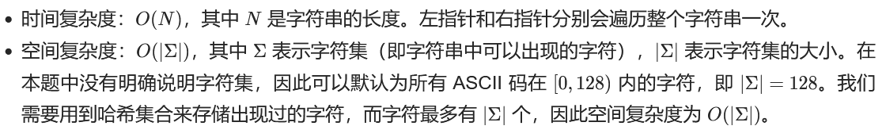

# 哈希表理论基础知识

常见的三种哈希结构

1、数组

2、set

3、map

哈希表最常用于判断一个元素是否在集合里出现过

# [LC 242: Valid Anagram](https://leetcode.com/problems/valid-anagram/)

思路：先统计s中每个单词的个数，再统计t中的每个单词个数，用数组。

完整代码如下：

**复杂度分析**

* 时间复杂度：**O**(**n**)，其中 **n** 为 **s** 的长度。
* 空间复杂度：**O**(**S**)，其中 **S** 为字符集大小，此处 S=26。

```java
class Solution {
    public boolean isAnagram(String s, String t) {
        int[] record = new int[26];
        for (char ch: s.toCharArray()) {
            record[ch - 'a'] += 1;
        }
        for (char ch: t.toCharArray()) {
            record[ch - 'a'] -= 1;
        }
        for (int i: record) {
            if (i != 0) {
                return false;
            }
        }
        return true;  
    }
}
```

# 滑动窗口模板

## [LC 76：Minimum Window Substring](https://leetcode.com/problems/minimum-window-substring/)

### 原答案

思路：

1、建立两个哈希表window和need，分别记录当前窗口中字符频数和t字符串中字符频数；

2、滑动窗口为左闭右开区间，即[left, right)。

3、右指针向右移动，直到当前窗口中的元素是符合要求的，即找到了一个可行解，即*every character in *`t`* ( **including duplicates** ) is included in the window*。（这一步是根据 `match == need.size()`来进行判断）

match表示，当前有多少个t中不重复字符已经在窗口中满足了，例如t = abccc，当前窗口 = acacc, 则match = 2，因为t中的三个字符已有两个（a和c）已经满足了。

4、找到一个可行解后，再移动左指针来优化可行解（即要找到长度最小的），直到左指针到达一个位置后，当前窗口不再满足要求时，开始重复步骤3，即右指针向右移动。

注意：可以发现元素进入和出滑动窗口的代码几乎是对称的。

```java
class Solution {
    public String minWindow(String s, String t) {
        //滑动窗口左右指针初始化
        int left = 0, right = 0;
        //最小子串的开始位置和长度初始化
        int start = 0, minLen = Integer.MAX_VALUE;
        //统计字符频数的两个哈希表初始化
        Map<Character, Integer> window = new HashMap<>();
        Map<Character, Integer> need = new HashMap<>();
        for (char ch: t.toCharArray()) {
            need.put(ch, need.getOrDefault(ch, 0)+1);
        }
        //统计当前窗口中已匹配上的字符数量
        int match = 0;
        while (right < s.length()) {
            //c表示进入滑动窗口的字符
            char c = s.charAt(right);
            //c进入窗口后，要更新相关数据，即更新window和match；
            if (need.containsKey(c)) {
                window.put(c, window.getOrDefault(c, 0)+1);
                if (window.get(c).equals(need.get(c))) {
                    match += 1;
                }
            }
            //右移窗口，注意是左闭右开，这样窗口位置在[left, right)
            right += 1;
            //当前窗口为可行解时，
            while (match == need.size()) {
                //首先，更新最小子串，即更新答案
                if (right - left < minLen) {
                    start = left;
                    minLen = right - left;
                }
                //然后开始收缩窗口，即左指针开始右移
                //d为移出滑动窗口的元素
                char d = s.charAt(left);
                //d移出滑动窗口后，要更新相关数据，即window和match
                if (need.containsKey(d)) {
                    window.put(d, window.getOrDefault(d, 0)-1);
                    if (window.get(d) < (need.get(d))) {
                        match -= 1;
                    }
                }
                //左指针右移
                left += 1;
            }  
        }
        return minLen == Integer.MAX_VALUE ? "" : s.substring(start, start+minLen);   
    }
}
```

### 12/18/2022 update：

用一个映射表就够了

时间复杂度：O(N+M).预处理映射表target需要的时间复杂度为O(N),字符串s中的所有元素最多进出滑动窗口各一次，所以时间复杂度为O(M)。

```java
class Solution {
    public String minWindow(String s, String t) {
        //初始化最终结果子串的长度为minLen,第一个字符的index为start
        int start = 0, minLen = Integer.MAX_VALUE; 
        //滑动窗口的左右边界
        int left = 0, right = 0;
        Map<Character, Integer> target = new HashMap<>();
        for (char c: t.toCharArray()) {
            target.put(c, target.getOrDefault(c,0)+1);
        }
        //matchCount统计有多少个t中的不重复字符完全匹配上了
        int matchCount = target.size();

        while (right < s.length()) {
            //窗口扩张
            char cur = s.charAt(right);
            if (target.containsKey(cur)) {
                target.put(cur, target.getOrDefault(cur,0)-1);
                if (target.get(cur) == 0) {
                    matchCount -= 1;
                }
            }
            right++;
            //窗口收缩
            while (matchCount == 0) {
                //更新结果
                if (minLen > right-left) {
                    start = left;
                    minLen = right - left;
                }
                char out = s.charAt(left);
                if (target.containsKey(out)) {
                    target.put(out, target.getOrDefault(out,0)+1);
                    if (target.get(out) > 0) {
                        matchCount += 1;
                    }
                }
                left++; 
            }
        }
        return minLen == Integer.MAX_VALUE ? "" : s.substring(start, start+minLen);   
    }
}
```

## [LC 438: Find All Anagrams in a String](https://leetcode.com/problems/find-all-anagrams-in-a-string/)

12/18/22 update：

和76几乎一样，更新结果的位置一样

刚开始老想着每次更新窗口的时候，必须要一个元素进，一个元素出，其实没必要。只有当matchCount == 0时，再看窗口的长度是否符合要求，不符合要求再收缩窗口。

```java
class Solution {
    public List<Integer> findAnagrams(String s, String p) {
        List<Integer> res = new ArrayList<>();
        //base case
        if (s.length() < p.length()) return res;

        Map<Character, Integer> target = new HashMap<>();
        for (char c: p.toCharArray()) {
            target.put(c, target.getOrDefault(c, 0)+1);
        }
        int left = 0, right = 0;
        int matchCount = target.size();
  
        while (right < s.length()) {
            //窗口扩张
            char c = s.charAt(right);
            if (target.containsKey(c)) {
                target.put(c, target.getOrDefault(c,0)-1);
                if (target.get(c) == 0) {
                    matchCount -= 1;
                }
            }
            right++;
        
            //窗口收缩:注意窗口收缩的条件
            while (matchCount == 0) {
                if (right-left == p.length()) {
                    res.add(left);
                }
                char d = s.charAt(left);
                if (target.containsKey(d)) {
                    target.put(d, target.getOrDefault(d,0)+1);
                    if (target.get(d) > 0) {
                    matchCount += 1;
                    }
                }
                left++;
            }   
        }
        return res;   
    }
}
```

## [LC 567: Permutation in String](https://leetcode.com/problems/permutation-in-string/)

跟lc438除了最后返回值不一样，其他一模一样

```java
class Solution {
    public boolean checkInclusion(String s1, String s2) {
        //base case
        if (s1.length() > s2.length()) return false;

        Map<Character, Integer> target = new HashMap<>();
        for (char c: s1.toCharArray()) {
            target.put(c, target.getOrDefault(c, 0)+1);
        }
        int left = 0, right = 0;
        int matchCount = target.size();
        while (right < s2.length()) {
            char c = s2.charAt(right);
            if (target.containsKey(c)) {
                target.put(c, target.getOrDefault(c,0)-1);
                if (target.get(c)==0) {
                    matchCount -=1;
                }
            }
            right++;
            while (matchCount == 0) {
                if (right-left == s1.length()) {
                    return true;
                }
                char d = s2.charAt(left);
                if (target.containsKey(d)) {
                    target.put(d, target.getOrDefault(d,0)+1);
                    if (target.get(d) > 0) {
                        matchCount += 1;
                    }
                }
                left++;
            }
        }
        return false;   
    }
}
```

## [LC 3：Longest Substring Without Repeating Characters](https://leetcode.com/problems/longest-substring-without-repeating-characters/)

### sol 1：滑动窗口

套用滑动窗口模板，但这题稍有不同：

首先是不需要变量need和match，每次有元素进出窗口时只需要更新window即可。

其次是何时更新结果res？当窗口中不包含重复字符时，所以需要在窗口收缩完成之后更新答案，因为窗口收缩的while循环条件是窗口中含有重复字符，一旦退出while循环，则表明窗口中不含重复字符，这时就更新答案。

完整代码如下：



```java
class Solution {
    public int lengthOfLongestSubstring(String s) {
        Map<Character, Integer> window = new HashMap<>();
        int left = 0, right = 0;
        int res = 0;
        while (right < s.length()) {
            char c = s.charAt(right);
            window.put(c, window.getOrDefault(c, 0)+1);
            right += 1;
  
            while (window.get(c) > 1) {
                char d = s.charAt(left);
                window.put(d, window.getOrDefault(d, 0)-1);
                left += 1;
            }
            res = Math.max(res, right - left);  
        }
        return res;  
    }
}
```

### sol 2：简单版（python3）

可以说是非常简洁了，想用StringBuilder改成java版失败

```python
class Solution:
    def lengthOfLongestSubstring(self, s: str) -> int:
        maxLength = 0
        cur = ''

        for i in s:
            # 如果没有重复
            if not i in cur:
                cur = cur + i
                maxLength = max(maxLength, len(cur))
            else:
                #如果重复了
                cur = cur[cur.index(i)+1:]  #这步比较复杂，就是把cur中i之前（包括i）的都剔除
                cur = cur + i               #这一步容易漏掉
        return maxLength
```

# [LC 383: Ransom Note](https://leetcode.com/problems/ransom-note/)

easy

```java
class Solution {
    public boolean canConstruct(String ransomNote, String magazine) {
        Map<Character, Integer> maga = new HashMap<>();
        for (char c: magazine.toCharArray()) {
            maga.put(c, maga.getOrDefault(c, 0)+1);
        }
        for (char d: ransomNote.toCharArray()) {
            maga.put(d, maga.getOrDefault(d, 0)-1);
            if (maga.get(d) < 0) {
                return false;
            }
        }
        return true; 
    }
}
```

# [LC 49：Group Anagrams](https://leetcode.com/problems/group-anagrams/)

```java
class Solution {
    public List<List<String>> groupAnagrams(String[] strs) {
        Map<String, List<String>> res = new HashMap<>();
        for (String s: strs) {
            int[] countKey = new int[26];
            for (char c: s.toCharArray()) {
                countKey[c-'a'] += 1;
            }
            //这一步是重点，将统计字符频率的数组转化成字符串
            //来作为哈希表的key(python直接用tuple)
            StringBuffer sb = new StringBuffer();
            for (int i = 0; i < 26; i += 1) {
                if (countKey[i] != 0) {
                    sb.append((char) ('a'+i));
                    sb.append(countKey[i]);
                }
            }
            String key = sb.toString();

            List<String> list = res.getOrDefault(key, new ArrayList<String>());
            list.add(s);
            res.put(key, list);
        }
        return new ArrayList<List<String>>(res.values());  
    }
}
```

# [LC 349：Intersection of Two Arrays](https://leetcode.com/problems/intersection-of-two-arrays/)

## sol 1：用set

思路很简单，重点是用什么来盛装重复数值，以及最后怎么转化成int[]

难点：把set转化成array

```java
class Solution {
    public int[] intersection(int[] nums1, int[] nums2) {
        Set<Integer> set = new HashSet<>();
        Set<Integer> resSet = new HashSet<>();
  
        for (int num: nums1) {
            set.add(num);
        }
  
        for (int num: nums2) {
            if (set.contains(num)) {
                resSet.add(num);
            }
        }
        //将set转化成array：其实不太明白
        return resSet.stream().mapToInt(x -> x).toArray(); 
    }
}
```

# [LC 350: Intersection of Two Arrays II](https://leetcode.com/problems/intersection-of-two-arrays-ii/)

## sol 1：哈希表

思路：先用一个哈希表map统计长度较短的一个数组的字符频数，然后遍历另一个数组，如遍历到元素num时，若map中对应num的值大于0，则在最终结果即数组intersection中，添加一个num，map中num对应的值减1。

统计较短数组的字符频数可以降低空间复杂度。

完整代码如下：

时间复杂度：O(m+n)，其中 m 和 n 分别是两个数组的长度。需要遍历两个数组并对哈希表进行操作，哈希表操作的时间复杂度是 O(1)，因此总时间复杂度与两个数组的长度和呈线性关系。

空间复杂度：O(min(m,n))，其中 m 和 n 分别是两个数组的长度。对较短的数组进行哈希表的操作，哈希表的大小不会超过较短的数组的长度。为返回值创建一个数组 intersection，其长度为较短的数组的长度。

```java
class Solution {
    public int[] intersect(int[] nums1, int[] nums2) {
        if (nums1.length > nums2.length) {
            return intersect(nums2, nums1);
        }
  
        Map<Integer, Integer> map = new HashMap<>();
        for (int num: nums1) {
            map.put(num, map.getOrDefault(num, 0)+1);
        }
  
        int[] intersection = new int[nums1.length];
        int index = 0;
        for (int num: nums2) {
            int count = map.getOrDefault(num, 0);
            if (count > 0) {
                intersection[index] = num;
                index += 1;
                count -= 1;
                if (count > 0) {
                    map.put(num, count);
                } else {
                    map.remove(num);
                }
            }
        }
        return Arrays.copyOfRange(intersection, 0, index);  
    }
}
```

## sol 2：排序+双指针

思路：先把两个数组排序，设置两个指针从两个数组的头部还是依次向右移动，如果两个指针指向的数字相等，就在最后的结果数组res中添加该数字，并将两个指针都向右移动，如果一个数字小于另一个数字，指向较小数字的指针向右移动。

完整代码如下：

时间复杂度：O(mlogm+nlogn)，其中 m 和 n 分别是两个数组的长度。对两个数组进行排序的时间复杂度是 O(mlogm+nlogn)，遍历两个数组的时间复杂度是 O(m+n)，因此总时间复杂度是 O(mlogm+nlogn)。

空间复杂度：O(min(m,n))，其中 m 和 n 分别是两个数组的长度。为返回值创建一个数组 intersection，其长度为较短的数组的长度。不过在 C++ 中，我们可以直接创建一个 vector，不需要把答案临时存放在一个额外的数组中，所以这种实现的空间复杂度为 O(1)。

```java
class Solution {
    public int[] intersect(int[] nums1, int[] nums2) {
        Arrays.sort(nums1);
        Arrays.sort(nums2);
        int[] res = new int[Math.min(nums1.length, nums2.length)];
        int pointer1 = 0, pointer2 = 0;
        int index = 0;
        while (pointer1 < nums1.length && pointer2 < nums2.length) {
            if (nums1[pointer1] > nums2[pointer2]) {
                pointer2++;
            } else if (nums1[pointer1] < nums2[pointer2]) {
                pointer1++;
            } else {
                res[index++] = nums1[pointer1];
                pointer1++;
                pointer2++;  
            }  
        }
        return Arrays.copyOfRange(res, 0, index);
    }
}
```

# [LC 202: Happy Number](https://leetcode.com/problems/happy-number/)

思路重点！题目中说到会“无限循环”，所以计算出的sum可能出现重复！

而哈希表就是用来快速判断某个元素是否在集合中重复出现的。

当sum=1时，返回true，当sum重复出现时，返回false，而当sum即不等于1也没有重复出现，则继续计算digits的平方和。

关于如何计算数值中各个位上的单数的平方然后加总，参考代码中的 `getNextNumber(int n)` 。

```java
class Solution {
    public boolean isHappy(int n) {
        Set<Integer> record = new HashSet<>();
        while (n != 1 && !record.contains(n)) {
            record.add(n);
            n = getNextNumber(n);
        }
        return n == 1;   
    }
  
    private int getNextNumber(int n) {
        int res = 0;
        while (n > 0) {
            int temp = n%10;
            res += temp*temp;
            n = n/10;
        }
        return res;  
    }
}
```

# [LC 1: Two Sum](https://leetcode.com/problems/two-sum/)

## sol 1：哈希表

为什么要用哈希表？遍历到某个数num的时候，想要找到与其对应的remaining = target - num是否出现过，所以要用哈希表。

为什么用map？需要使用key value的结构，key存元素，value存元素对应的下标，所以map最合适。

使用数组和set做哈希法的局限性：

* 数组的大小是受限制的，而且如果元素很少，而哈希值太大会造成内存空间的浪费。
* set是一个集合，里面放的元素只能是一个key，而两数之和这道题目，不仅要判断y是否存在而且还要记录y的下标位置，因为要返回x 和 y的下标。所以set 也不能用。

```java
class Solution {
    public int[] twoSum(int[] nums, int target) {
        int[] res = new int[2];
        Map<Integer, Integer> map = new HashMap<>();
  
        for (int i = 0; i < nums.length; i += 1) {
            int remaining = target - nums[i];
            if (map.containsKey(remaining)) {
                res[0] = map.get(remaining);
                res[1] = i;
                break;
            } else {
                map.put(nums[i], i);
            }
        }
        return res;
  
    }
}
```

# [LC 454: 4Sum II](https://leetcode.com/problems/4sum-ii/)

思路其实跟LC 1非常像，只不过是先遍历nums1和num2，用map统计对应元素a和b之和出现的次数，key存a+b，value存出现的频数。然后再遍历nums3和nums4，计算target = 0- c - d，c和d分别对应nums3和nums4中的元素，如果map中存在target，则说明找到了一个a+b+c+d = 0的情况。

```java
class Solution {
    public int fourSumCount(int[] nums1, int[] nums2, int[] nums3, int[] nums4) {
        Map<Integer, Integer> map = new HashMap<>();
        int res = 0;
        for (int a: nums1) {
            for (int b: nums2) {
                int total = a + b;
                map.put(total, map.getOrDefault(total, 0)+1);
            }
        }
  
        for (int c: nums3) {
            for (int d: nums4) {
                int target = 0 - c - d;
                if (map.containsKey(target)) {
                    res += map.get(target);  
                }
            }
        }
        return res;   
    }
}
```

# [LC 15：3Sum](https://leetcode.com/problems/3sum/)

## sol 1: 双指针法

关键词：排序、去重、Arrays.asList()

思路就是，总共其实有三个指针，指针i是遍历数组，i固定，左指针下标位于i+1，右指针位于数组尾部，然后左右指针移动，寻找到 `nums[i] + nums[left] + nums[right] = 0`

用到一个不太熟的method：Arrays.asList(1,2,3...)

### 知识点：Arrays.asList()

可以把一个arrays转换成list

这道题最终返回的是数组中的元素值，而不是元素的下标，所以可以将数组进行排序处理，而排序处理是使用双指针法的前提。

这题不适合用哈希法是因为，三个元素不能重复，即下标不能相等，用哈希法涉及到去重。

难点：去重。可以看到代码中有许多去重操作

完整代码如下：

时间复杂度：O(n^2)，数组排序O(NlogN)，遍历数组O(n)，双指针遍历O(n)，总体O(NlogN)+O(n)∗O(n).

空间复杂度：O(1)

```java
class Solution {
    public List<List<Integer>> threeSum(int[] nums) {
        List<List<Integer>> res = new ArrayList<>();
        //先对数组进行排序
        Arrays.sort(nums);
  
        for (int i = 0; i < nums.length; i += 1) {
            //特判：数组已经排序，单调不减，如果第一个数就大于0，那么说明没有三个数之和为0
            if (nums[i] > 0) {
                return res;
            }
            //对第一个元素nums[i]进行去重
            if (i > 0 && nums[i-1] == nums[i]) {
                continue;
            }
            int l = i+1;
            int r = nums.length - 1;
            while (l < r) {
                int tempSum = nums[i] + nums[l] + nums[r];
                //当前sum大于零则右指针左移
                //这里不必考虑去重
                if (tempSum > 0) {
                    r -= 1;
                //同上
                } else if (tempSum < 0) {
                    l += 1;
                //当前sum == 0时找到一个合适的解，则收集答案
                } else {
                    res.add(Arrays.asList(nums[i], nums[l], nums[r]));
                    //这里需要进行去重操作，以避免重复收集相同的答案
                    while (l < r && nums[l] == nums[l+1]) {
                        l += 1;
                    }
                    while (l < r && nums[r] == nums[r-1]) {
                        r -= 1;
                    }
                    //这两步容易漏掉，需要注意！！
                    l += 1;
                    r -= 1;
                }
            }
        }
        return res;
    }
}
```

# [LC 18：4Sum](https://leetcode.com/problems/4sum/)

## sol 1：双指针法

思路跟lc15，不同的是这道题是要固定i，j两个指针，然后左右指针开始移动，即有两层for循环。

完整代码如下：

时间复杂度：O(n^3)，其中 n是数组的长度。排序的时间复杂度是O(nlogn)，枚举四元组的时间复杂度是 O(n^3)，因此总时间复杂度为 O(n^3+n\log n)=O(n^3)O(n=O(n^3)。

空间复杂度：O(logn)，其中 n 是数组的长度。空间复杂度主要取决于排序额外使用的空间。此外排序修改了输入数组nums，实际情况中不一定允许，因此也可以看成使用了一个额外的数组存储了数组 nums 的副本并排序，空间复杂度为 O(n)。

```java
class Solution {
    public List<List<Integer>> fourSum(int[] nums, int target) {
        List<List<Integer>> res = new ArrayList<>();
        Arrays.sort(nums);
  
        for (int i = 0; i < nums.length - 3; i += 1) {
            //剪枝操作
            if (nums[i] > 0 && nums[i] > target) {
                return res;
            }
            //去重操作
            if (i > 0 && nums[i-1] == nums[i]) {
                continue;
            }
  
            for (int j = i+1; j < nums.length - 2; j += 1) {
                //去重操作
                if (j > i+1 && nums[j-1] == nums[j]) {
                    continue;
                }
                //发现在这个循环中不能有剪枝操作，没明白为啥，也可能是我剪枝操作没写对？
  
                int left = j + 1;
                int right = nums.length - 1;
                while (left < right) {
                    int sum = nums[i] + nums[j] + nums[left] + nums[right];
                    if (sum > target) {
                        right -= 1;
                    } else if (sum < target) {
                        left += 1;
                    } else {
                        res.add(Arrays.asList(nums[i], nums[j], nums[left], nums[right]));
                        while (left < right && nums[right-1] == nums[right]) {
                            right -= 1;
                        }
                        while (left < right && nums[left] == nums[left+1]) {
                            left += 1;
                        }
                        left += 1;
                        right -= 1;
                    }
                }
            }
        }
        return res; 
    }
}
```

ddd
