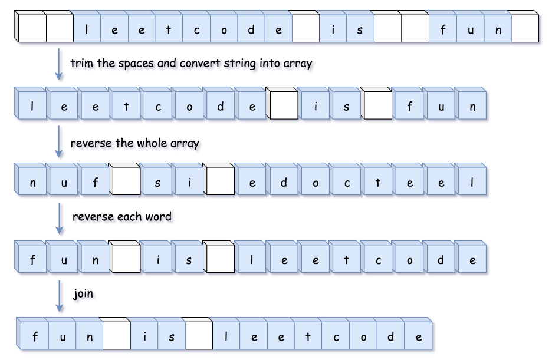

# [LC 344 : Reverse String](https://leetcode.com/problems/reverse-string/)

## 双指针法

思路略

时间复杂度：O(N)，其中 NN 为字符数组的长度。一共执行了 N/2N/2 次的交换。
空间复杂度：O(1)。只使用了常数空间来存放若干变量。

```java
class Solution {
    public void reverseString(char[] s) {
        int l = 0;
        int r = s.length - 1;
        while (l < r) {
            char temp = s[l];
            s[l] = s[r];
            s[r] = temp;
            l += 1;
            r -= 1;
        }   
    }   
}
```

# [LC 541：Reverse String II](https://leetcode.com/problems/reverse-string-ii/)

这题中写的 `reverseHelper()`跟lc344基本一样。

本题需要注意的点：

1、for循环时，不再是i += 1, 而是i += 2*k,这样i遍历的就是需要翻转的数组的第一个元素；

2、需要翻转的数组为[i，i+k-1]：如果i + k <= ch.length,说明剩余需要翻转的数组长度够

k个，则需要翻转的数组起始下标为i和i+k-1；如果不是，说明最后剩余需要翻转的数组长度不够k个了，那么需要翻转的数组起始下标为i和ch.length - 1。

3、注意最后将char[] ch转换成String的方法：`new String(ch)`。


代码如下：

时间复杂度：O(N)。其中 **n** 是字符串 **s** 的长度。

空间复杂度：**O**(**n**)。需要把字符串转换为可以修改的数据结构（数组）。

```java
class Solution {
    public String reverseStr(String s, int k) {
        char[] ch = s.toCharArray(); 
  
        for (int i = 0; i < ch.length; i += 2*k) {
            if (i+k <= ch.length) {
                reverseHelper(ch, i, i+k-1);
            } else {
                reverseHelper(ch, i, ch.length-1);
            }
        }
        return new String(ch);  
    }
  
    private void reverseHelper(char[] ch, int left, int right) {
        while (left < right) {
            char temp = ch[left];
            ch[left] = ch[right];
            ch[right] = temp;
            left += 1;
            right -= 1;
        }
    }
}
```

# [剑指offer 05：替换空格](https://www.programmercarl.com/%E5%89%91%E6%8C%87Offer05.%E6%9B%BF%E6%8D%A2%E7%A9%BA%E6%A0%BC.html#%E5%85%B6%E4%BB%96%E8%AF%AD%E8%A8%80%E7%89%88%E6%9C%AC)

## sol 1 ：简单法

notes：StringBuffer.append()可以是append character，也可以是string

```java
class Solution {
    public String replaceSpace(String s) {
        StringBuffer res = new StringBuffer();
        //迭代时，需要先把字符串s转换成数组
        for (char ch: s.toCharArray()) {
            if (ch != ' ') {
                res.append(ch);
            } else {
                res.append("%20");
            }
        }
        return res.toString();
    }
}
```

# [LC 151：Reverse Words in a String](https://leetcode.com/problems/reverse-words-in-a-string/)

## sol 1:自行编写对应的函数

注意：题目说了input的字符串中，单词之间可能有两个及以上的空格，而最终结果要求单词之间只能有一个空格，所以除了首尾的多余空格，还要去除单词之间的多余空格。

思路：

1、先去除首尾及单词之间多余的空格；

2、翻转整个字符串；

3、再翻转字符串中的每个单词。



完整代码如下：

时间复杂度和空间复杂度均为O(N).

注意点：在写reverse()时，参数中包括起始和终止的index，这样的好处是后面写reverseEachWord()时， 也可以用reverse()

```java

class Solution {
    public String reverseWords(String s) {
        //去掉多余的空格，包括首尾处以及单词之间的多余空格
        StringBuilder res = trimSpaces(s);
        //翻转字符串
        reverse(res, 0, res.length()-1);
        //翻转每个单词
        reverseEachWord(res);
        return res.toString();
    }
  
    public StringBuilder trimSpaces(String s) {
        int left = 0;
        int right = s.length() - 1;
        //去掉字符串开头空白字符
        while (left <= right && s.charAt(left) == ' ') {
            left += 1;  
        }
        //去掉字符串末尾空白字符
        while (right >= left && s.charAt(right) == ' ') {
            right -= 1;
        }
  
        //确定了left和right以后，开始去掉单词之间多余的空格
        StringBuilder sb = new StringBuilder();
        for (int i = left; i <= right; i += 1) {
            char ch = s.charAt(i);
            if (ch != ' ') {
                sb.append(ch);
            //这里的意思是：当遍历到一个空格时，如果sb末尾已经有一个空格
            //说明当前遍历到的空格是单词之间多出来的空格，则不操作
            //反之，则需要将当前空格添加到sb中，因为题目要求单词之间要有且仅有
            //一个空格。
            } else if (sb.charAt(sb.length() - 1) != ' ') {
                sb.append(ch);
            }
        }
        return sb;  
    }
    //翻转字符串，代码简单，不再赘述
    public void reverse(StringBuilder sb, int start, int end) {
        while (start < end) {
            char temp = sb.charAt(start);
            sb.setCharAt(start++, sb.charAt(end));
            sb.setCharAt(end--, temp);
        }  
    }
    //翻转每一个单词
    public void reverseEachWord(StringBuilder sb) {
        int start = 0;
        int end = 0;
        int n = sb.length();
        //这里两个while循环语句终止条件需要注意一下：不能写成start < n && end < n
        //这样的话最后一个word就没有进行翻转
        while (start < n) {
            //找到单词之间的空格处
            while (end < n && sb.charAt(end) != ' ') {
                end += 1;
            }
            //左闭右开区间，所以是[start, end-1]
            reverse(sb, start, end-1);
            start = end + 1;
            end += 1;   
        }   
    }
}
```

## sol 2: 双端队列

1、先去掉字符串首尾的空白字符

2、设置一个StringBuilder和一个Deque，先把每一个char存放在sb中，遇到空白字符时，将sb中存放的word从队列头部插入，最后用join将word进行连接。

* 时间复杂度：O(n)，其中 n**n** 为输入字符串的长度。
* 空间复杂度：O(n)，双端队列存储单词需要 O(n) 的空间。

```java
class Solution {
    public String reverseWords(String s) {
        int n = s.length();
  
        //去掉字符串首尾两端的空白字符
        int start = 0;
        int end = n - 1;
        while (start <= end && s.charAt(start) == ' ') {
            start += 1;
        }
        while (start <= end && s.charAt(end) == ' ') {
            end -= 1;
        }
  
        StringBuilder sb = new StringBuilder();
        Deque<String> d = new ArrayDeque<>();
  
        while (start <= end) {
            char c = s.charAt(start);
            if ((c == ' ') && sb.length() != 0 ) {
                d.offerFirst(sb.toString());
                //将sb重置为空
                sb.setLength(0);
            } else if (c != ' ') {
                sb.append(c);
            }
            //这一步不能漏掉！！！
            start += 1;
        }
        //这一步也不能漏掉
        d.offerFirst(sb.toString());
        return String.join(" ", d);  
    }
}
```

# [LC 28：Find the Index of the First Occurrence in a String](https://leetcode.com/problems/find-the-index-of-the-first-occurrence-in-a-string/)

## sol 1: 枚举

思路：遍历原串 `haystack`中的每个字符作为「发起点」，每次从原串的「发起点」和匹配串 `needle`的第一个字符开始尝试一直向后匹配：

* 匹配成功：返回本次匹配的原串「发起点」。
* 匹配失败：遍历到原串的下一个字符作为「发起点」，重新尝试匹配。

完整代码如下：

时间复杂度：n 为原串的长度，m 为匹配串的长度。其中枚举的复杂度为 O(n−m)，构造和比较字符串的复杂度为 O(m)。整体复杂度为 O((n−m)∗m)。

空间复杂度：O(1)。

```java
class Solution {
    public int strStr(String haystack, String needle) {
        int n = haystack.length();
        int m = needle.length();
        char[] hay = haystack.toCharArray();
        char[] nee = needle.toCharArray();
  
        for (int i = 0; i <= n - m; i += 1) {
            int a = i, b = 0;
            while (b < m && hay[a] == nee[b]) {
                a += 1;
                b += 1;
            }
            //如果原串中以hay[i]为起点，长度为m的字符串能够与needle匹配
            //则返回i
            if (b == m) {
                return i;
            }
        }
        return -1; 
    }
}
```


# [LC 459：Repeated Substring Pattern](https://leetcode.com/problems/repeated-substring-pattern/)

## sol 1: 枚举

一个长度为n的字符串s，如果它可以由一个长度为n1的子串s1重复多次构成，那么

1、n一定是n1的倍数

2、s1一定是s的前缀

3、对于任意的i （i的范围是[n1,n)），存在s[i] == s[i-n1] （即相隔距离为n1的两个字符相同）

优化：子串至少重复一次，所以n1 <= n，所以只需要在[1, n/2]范围内枚举n1即可


代码如下：

时间复杂度：O(n^2)，其中 nn 是字符串 s 的长度。枚举 i 的时间复杂度为 O(n)，遍历 s 的时间复杂度为 O(n)，相乘即为总时间复杂度。

空间复杂度：O(1)。

```java
class Solution {
    public boolean repeatedSubstringPattern(String s) {
        if (s.length() == 0) return false;

        int n = s.length();
        //枚举s的子串的长度i
        for (int i = 1; i <= n/2; i += 1) {
            if (n%i == 0) {
                boolean match = true;
                for (int j = i; j < n; j += 1) {
                    if (s.charAt(j) != s.charAt(j-i)) {
                        match = false;
                        //长度为i子串不能重复构成s，跳出内层for循环
                        break;
                    }
                }
                if (match) return true;
            }
        }
        return false;
    }
}
```


# LC 5：Longest Palindromic Substring

中心扩散法：

代码如下：

时间复杂度：O(n^2)，其中 nn 是字符串的长度。长度为 1 和 2 的回文中心分别有 n 和 n−1个，每个回文中心最多会向外扩展 O(n) 次。

空间复杂度：O(1)。

```java
class Solution {
    public String longestPalindrome(String s) {
        String res = "";
        for (int i = 0; i < s.length(); i += 1) {
            String s1 = palindrome(s, i, i);
            String s2 = palindrome(s, i, i+1);
            res = s1.length() > res.length() ? s1 : res;
            res = s2.length() > res.length() ? s2 : res;
        }
        return res;   
    }
    //返回以s[left,right]为中心的最长回文字符串
    private String palindrome(String s, int left, int right) {
        while (left >= 0 && right < s.length() && s.charAt(left) == s.charAt(right)) {
            left--;
            right++;
        }
        return s.substring(left+1, right);
    }
}
```
